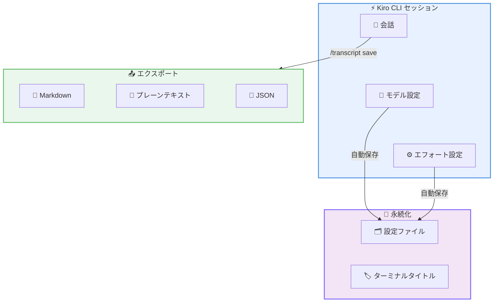

# Kiro - Transcript Export, Terminal Titles, and Persistent Model Preferences

**リリース日**: 2026年6月5日
**サービス**: Kiro (AI-powered IDE by AWS)
**機能**: トランスクリプトエクスポート、ターミナルタイトル、モデル設定の永続化

📊 [このアップデートのインフォグラフィックを見る](https://takech9203.github.io/aws-news-summary/20260605-kiro-changelog-2026-06-05.html)

## 概要

Kiro CLI v2.6.0 がリリースされ、会話のポータビリティと作業復帰の効率化に焦点を当てた複数の新機能が追加された。会話のエクスポート機能、ターミナルウィンドウのラベリング、起動時のリーズニングレベル指定、およびモデルとエフォート設定の自動永続化が含まれている。

このリリースは、日々の開発ワークフローにおける「セッション管理の煩雑さ」を解消することを目的としている。複数のターミナルセッションを使い分ける開発者や、チームメンバーとの情報共有を頻繁に行うユーザーにとって、作業効率を大幅に改善するアップデートである。

**アップデート前の課題**

- 会話内容を外部に共有する標準的な方法がなく、コピーアンドペーストに頼る必要があった
- 複数のターミナルウィンドウで Kiro セッションを開いた際、どのウィンドウがどのセッションか判別しにくかった
- モデルやエフォートの設定変更後、`/model set-current-as-default` を毎回手動で実行してデフォルトに保存する必要があった
- セッション開始時にリーズニングレベルを指定できず、最初のプロンプトから最適な推論レベルで始めることができなかった

**アップデート後の改善**

- `/transcript save` コマンドで会話を Markdown、プレーンテキスト、JSON 形式でエクスポート可能になった
- `/title` コマンドでターミナルウィンドウに識別用ラベルを設定できるようになった
- `/model` および `/effort` の選択がセッション間で自動的に永続化されるようになった
- `--effort` フラグにより起動時からリーズニングレベルを指定できるようになった

## アーキテクチャ図



Kiro CLI セッションから会話をエクスポートする流れと、モデル/エフォート設定が自動的に永続化される仕組みを示している。

## サービスアップデートの詳細

### 主要機能

1. **トランスクリプトエクスポート**
   - `/transcript save` コマンドで会話全体をファイルにエクスポート
   - 対応フォーマット: Markdown、プレーンテキスト (`--plain`)、JSON (`--json`)
   - チームメイトへの共有、チケットへの添付、他ツールへの連携に活用可能
   - フォーマットフラグを使用すると、ページャー内でレンダリング形式も切り替え可能

2. **ターミナルウィンドウタイトル**
   - `/title` コマンドでターミナルウィンドウタイトルを設定または解除
   - 複数セッションを並行して使用する際にセッションを識別しやすくなる
   - `/settings display` の「Terminal title」から有効化可能

3. **起動時エフォート指定**
   - `kiro-cli chat --effort <level>` でセッション開始時のリーズニングレベルを設定
   - 利用可能レベル: low, medium, high, xhigh, max
   - 簡単な調査は低レベルで高速に、複雑な作業は最初から深い推論で開始可能

4. **モデルとエフォートの永続化**
   - `/model` と `/effort` で選択した内容が自動的に次回セッション以降に引き継がれる
   - 従来必要だった `/model set-current-as-default` の手動実行が不要に
   - 設定変更のワークフローがシンプルに改善

## 技術仕様

### コマンドリファレンス

| コマンド | 説明 |
|---------|------|
| `/transcript save` | 会話をファイルにエクスポート |
| `/transcript save --plain` | プレーンテキスト形式でエクスポート |
| `/transcript save --json` | JSON 形式でエクスポート |
| `/title <name>` | ターミナルウィンドウタイトルを設定 |
| `/title` | ターミナルウィンドウタイトルをクリア |
| `kiro-cli chat --effort <level>` | 指定エフォートレベルでセッション開始 |

### エフォートレベル

| レベル | 用途 |
|--------|------|
| low | 簡単な質問、クイックルックアップ |
| medium | 一般的なコーディングタスク |
| high | 複雑な実装、設計判断 |
| xhigh | 高度な分析、アーキテクチャ設計 |
| max | 最大限の推論が必要な複雑な問題 |

## 設定方法

### 前提条件

1. Kiro がインストールされていること
2. Kiro CLI v2.6.0 以降にアップデート済みであること
3. 有効な Kiro アカウントでログイン済みであること

### 手順

#### ステップ 1: トランスクリプトエクスポートの使用

```bash
# 会話を Markdown 形式で保存
/transcript save

# プレーンテキスト形式で保存
/transcript save --plain

# JSON 形式で保存
/transcript save --json
```

会話の全内容を指定したフォーマットでファイルに保存する。チームメンバーへの共有やドキュメント化に活用できる。

#### ステップ 2: ターミナルタイトルの設定

```bash
# ターミナルウィンドウにタイトルを設定
/title backend-refactoring

# タイトルをクリア
/title
```

複数のターミナルウィンドウで作業する際に、各ウィンドウを識別するためのラベルを設定する。

#### ステップ 3: エフォートレベルを指定してセッション開始

```bash
# 高い推論レベルでセッションを開始
kiro-cli chat --effort high

# 低い推論レベルで高速な応答を得る
kiro-cli chat --effort low
```

セッション開始時にリーズニングレベルを指定することで、最初のプロンプトから適切な推論深度で応答を得ることができる。

## メリット

### ビジネス面

- **チームコラボレーションの向上**: 会話エクスポートにより、AI との議論内容をチケットやドキュメントに添付し、チーム全体で知識を共有できる
- **作業コンテキストの保存**: エクスポートした会話を参照資料として保存し、類似タスクでの意思決定を加速できる
- **オンボーディングの効率化**: 新メンバーに過去の AI 会話を共有することで、プロジェクトの経緯や設計判断を効率的に伝達できる

### 技術面

- **ワークフローの効率化**: 設定の自動永続化により、セッション開始のたびに手動で設定を行う必要がなくなった
- **マルチセッション管理**: ターミナルタイトルにより、並行して実行する複数セッションの管理が容易になった
- **適応的リーズニング**: タスクの複雑さに応じて起動時から最適なリーズニングレベルを選択でき、コスト効率と応答品質のバランスを取れる

## デメリット・制約事項

### 制限事項

- エクスポート形式は Markdown、プレーンテキスト、JSON の 3 種類に限定される
- ターミナルタイトル機能はターミナルエミュレータのタイトル表示対応に依存する
- エフォートレベルの選択はクレジット消費量に影響するため、プランの上限を考慮する必要がある

### 考慮すべき点

- エクスポートした会話にはコードやプロジェクト情報が含まれる可能性があるため、共有先に注意が必要
- 永続化された設定は明示的に変更するまで維持されるため、異なるプロジェクトでの作業時にはエフォートレベルの見直しを推奨

## ユースケース

### ユースケース 1: コードレビューの共有

**シナリオ**: 開発者が Kiro と複雑なリファクタリングについて議論した後、その内容をプルリクエストの説明として活用したい。

**実装例**:
```bash
# リファクタリングの議論後にエクスポート
/transcript save --plain
# 出力されたファイルを PR の説明にコピー
```

**効果**: AI との議論で得られた設計判断の根拠をチームメンバーに共有でき、レビューの質とスピードが向上する。

### ユースケース 2: 複数プロジェクトの並行開発

**シナリオ**: フロントエンドとバックエンドを別々のターミナルで開発しており、どちらのセッションがどのプロジェクトか識別したい。

**実装例**:
```bash
# ターミナル 1
/title frontend-react

# ターミナル 2
/title backend-api
```

**効果**: ウィンドウスイッチャーやタスクバーでセッションを即座に識別でき、コンテキストスイッチのオーバーヘッドが削減される。

### ユースケース 3: タスクに応じたリーズニングレベルの使い分け

**シナリオ**: 朝のスタンドアップ準備では簡単な確認だけ行い、午後のアーキテクチャ設計では深い分析が必要。

**実装例**:
```bash
# 朝: 簡単な確認用に低エフォートで起動
kiro-cli chat --effort low

# 午後: 複雑な設計タスクに高エフォートで起動
kiro-cli chat --effort max
```

**効果**: タスクの複雑さに応じてクレジット消費を最適化しつつ、必要な場面では最大限の推論能力を活用できる。

## 料金

Kiro の料金プランは以下の通り。

| プラン | 月額料金 | クレジット |
|--------|----------|-----------|
| Free | $0 | 50 クレジット/月 |
| Pro | $20 | 1,000 クレジット/月 |
| Pro+ | $40 | 2,000 クレジット/月 |
| Power | $200 | 10,000 クレジット/月 |

エフォートレベルによりクレジット消費量が異なるため、高いレベル (xhigh, max) を頻繁に使用する場合は上位プランの検討を推奨する。最新の料金情報は [kiro.dev/pricing](https://kiro.dev/pricing/) を参照のこと。

## 利用可能リージョン

グローバル (Kiro はデスクトップ IDE であり、macOS、Windows、Linux で利用可能)

## 関連サービス・機能

- **Kiro Specs**: 仕様駆動開発を支援する機能。エクスポートした会話と組み合わせて設計ドキュメントを充実させることが可能
- **Kiro Steering**: プロジェクトレベルの AI 動作カスタマイズ機能。エフォート設定と合わせて最適な AI レスポンスを実現
- **Kiro Hooks**: 自動化フックによりファイル保存時やコミット時にアクションを実行する機能

## 参考リンク

- 📊 [インフォグラフィック](https://takech9203.github.io/aws-news-summary/20260605-kiro-changelog-2026-06-05.html)
- [Kiro Changelog](https://kiro.dev/changelog/)
- [Kiro 公式サイト](https://kiro.dev/)
- [Kiro 料金ページ](https://kiro.dev/pricing/)
- [Kiro ドキュメント](https://kiro.dev/docs/)

## まとめ

今回の Kiro CLI v2.6.0 リリースは、開発者の日常的なワークフローにおける摩擦を軽減する実用的なアップデートである。特にトランスクリプトエクスポートはチーム内のナレッジ共有を大幅に改善し、設定の自動永続化はセッション管理の負担を排除する。Kiro を活用しているチームは、これらの機能を積極的に導入して開発フローの効率化を図ることを推奨する。
