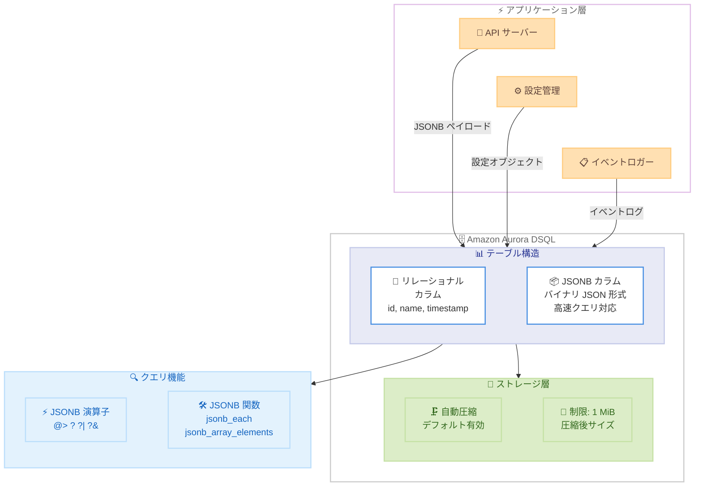

# Amazon Aurora DSQL - JSONB データ型サポート (圧縮対応)

**リリース日**: 2026 年 6 月 8 日
**サービス**: Amazon Aurora DSQL
**機能**: PostgreSQL JSONB データ型サポート (圧縮機能付き)

📊 [このアップデートのインフォグラフィックを見る](https://takech9203.github.io/aws-news-summary/20260608-amazon-aurora-dsql-supports-jsonb.html)

## 概要

Amazon Aurora DSQL が PostgreSQL の JSONB データ型をサポートし、オプションの圧縮機能を提供するようになりました。JSONB はバイナリ形式で JSON データを格納するデータ型であり、従来の JSON 型 (2026 年 5 月に追加済み) と比較して高速なクエリ処理とインデックス作成が可能です。PostgreSQL の JSONB 型に依存する既存のコードやツールを Aurora DSQL で変更なしに使用でき、リレーショナルデータと半構造化データの統合管理がさらに強化されました。

JSONB データ型は、テーブルの作成時や変更時にカラム定義で使用でき、システム設定メタデータ、API パラメータ、イベントログなどの半構造化データの格納に最適です。PostgreSQL 圧縮がデフォルトで有効になっているため、大きな JSONB ペイロードがより効率的に保存され、ストレージコストの削減に貢献します。1 MiB の圧縮後サイズ制限が適用されるため、圧縮前のサイズが 1 MiB を大幅に超えるデータでも格納可能です。

**アップデート前の課題**

- Aurora DSQL では JSON (テキスト形式) のみサポートされており、バイナリ形式の JSONB が利用できなかった
- JSONB 型に依存する PostgreSQL ライブラリや ORM (Django、SQLAlchemy、ActiveRecord など) を Aurora DSQL に移行する際に修正が必要だった
- JSON 型ではクエリ実行時に毎回パースが必要で、頻繁な検索・フィルタリング操作でパフォーマンスが課題だった
- GIN インデックスを活用した効率的な JSON 内検索ができなかった

**アップデート後の改善**

- JSONB 型のネイティブサポートにより、バイナリ形式での高速なデータアクセスが可能に
- PostgreSQL JSONB 依存のコード・ツールをそのまま Aurora DSQL で使用可能
- デフォルトの圧縮機能により、1 MiB を超える大きな JSONB ペイロードも圧縮後サイズが制限内であれば格納可能
- すべての PostgreSQL JSON/JSONB 関数・演算子がサポートされ、柔軟なクエリが実現

## アーキテクチャ図



Aurora DSQL 内でリレーショナルカラムと JSONB カラムが共存し、自動圧縮によるストレージ最適化と JSONB 専用の演算子・関数による高速クエリの両方が利用可能な構成を示しています。

## サービスアップデートの詳細

### 主要機能

1. **PostgreSQL JSONB データ型のネイティブサポート**
   - PostgreSQL 標準の JSONB 型をカラム定義で使用可能
   - バイナリ分解形式でデータを格納し、クエリ時のパースが不要
   - 重複キーの自動除去、キーのソート済み格納による効率的なアクセス

2. **デフォルト圧縮によるストレージ最適化**
   - INSERT および UPDATE 操作時に自動的に圧縮を適用
   - 1 MiB の制限は圧縮後サイズに適用されるため、圧縮前はそれ以上のサイズを格納可能
   - `STORAGE` キーワードで圧縮を無効化するオプションも提供

3. **完全な JSON 関数・演算子サポート**
   - PostgreSQL セクション 9.16 のすべての JSON 関数・演算子に対応
   - `jsonb_populate_record`、`jsonb_populate_recordset` などのレコード操作関数もサポート
   - ただし `CREATE TYPE` によるカスタム複合型は未サポートのため、テーブル・ビューの行型でのみ使用可能

## 技術仕様

### JSONB データ型の仕様

| 項目 | 詳細 |
|------|------|
| サポートデータ型 | JSONB (バイナリ JSON) |
| サイズ制限 | 圧縮後 1 MiB |
| 圧縮 | デフォルト有効 (STORAGE キーワードで無効化可能) |
| テーブル操作 | CREATE TABLE / ALTER TABLE で JSONB カラム定義可能 |
| インデックスサポート | なし (ドキュメントの表記による) |
| 互換性 | PostgreSQL JSONB 型準拠 |
| 格納形式 | バイナリ分解形式 |

### JSON 型と JSONB 型の比較 (Aurora DSQL)

| 項目 | JSON | JSONB |
|------|------|-------|
| 格納形式 | テキスト (入力時のまま) | バイナリ分解形式 |
| サイズ制限 | 圧縮後 1 MiB | 圧縮後 1 MiB |
| 圧縮対応 | あり (デフォルト有効) | あり (デフォルト有効) |
| キー順序 | 保持 | ソート済み |
| 重複キー | すべて保持 | 最後の値のみ保持 |
| クエリ性能 | パース必要 (低速) | バイナリアクセス (高速) |
| 演算子 | `->`, `->>` | `->`, `->>`, `@>`, `?`, `?|`, `?&` |
| インデックスサポート | なし | なし (Aurora DSQL の現時点の制限) |

### API 変更履歴

現時点で AWS API Changes における関連する API 変更は確認されていません。本機能は PostgreSQL 互換レイヤーでのデータ型サポート拡張であり、AWS 管理 API の変更を伴わないアップデートです。

## 設定方法

### 前提条件

1. Aurora DSQL クラスターが作成済みであること
2. クラスターへの接続権限を持つ IAM ロールまたはユーザーが設定済みであること
3. PostgreSQL 互換クライアント (psql、各言語の PostgreSQL ドライバーなど) がインストール済みであること

### 手順

#### ステップ 1: JSONB カラムを含むテーブルの作成

```sql
CREATE TABLE api_events (
    id UUID PRIMARY KEY DEFAULT gen_random_uuid(),
    event_type VARCHAR(100) NOT NULL,
    payload JSONB NOT NULL,
    created_at TIMESTAMP DEFAULT NOW()
);
```

JSONB 型のカラム `payload` を定義してテーブルを作成します。圧縮はデフォルトで有効になるため、追加の設定は不要です。

#### ステップ 2: JSONB データの挿入

```sql
INSERT INTO api_events (event_type, payload)
VALUES (
    'user.signup',
    '{"user_id": "u-12345", "email": "user@example.com", "plan": "enterprise", "metadata": {"source": "web", "campaign": "q2-launch"}}'::jsonb
);
```

JSON 文字列を `::jsonb` でキャストして挿入します。JSONB は入力時にバイナリ形式に変換し、重複キーの除去とキーのソートを行います。

#### ステップ 3: JSONB 演算子を使用したクエリ

```sql
-- JSONB フィールドの抽出
SELECT
    event_type,
    payload->>'user_id' AS user_id,
    payload->>'email' AS email,
    payload->'metadata'->>'source' AS source
FROM api_events
WHERE event_type = 'user.signup';

-- 包含演算子 (@>) によるフィルタリング
SELECT *
FROM api_events
WHERE payload @> '{"plan": "enterprise"}'::jsonb;

-- キー存在チェック (?) 演算子
SELECT *
FROM api_events
WHERE payload ? 'metadata';
```

JSONB 固有の演算子 (`@>`, `?`, `?|`, `?&`) を使用して効率的なフィルタリングが可能です。

#### ステップ 4: 圧縮の無効化 (オプション)

```sql
CREATE TABLE raw_events (
    id UUID PRIMARY KEY DEFAULT gen_random_uuid(),
    event_data JSONB STORAGE PLAIN NOT NULL
);
```

圧縮が不要な場合は `STORAGE` キーワードを使用して無効化できます。小さな JSONB ペイロードでは圧縮オーバーヘッドを回避する選択肢として有用です。

#### ステップ 5: 既存テーブルへの JSONB カラム追加

```sql
ALTER TABLE existing_table
ADD COLUMN metadata JSONB;
```

既存テーブルに対して ALTER TABLE で JSONB カラムを追加できます。

## メリット

### ビジネス面

- **移行コストの大幅削減**: PostgreSQL JSONB 型に依存する Django、Rails、Spring Boot 等のアプリケーションを修正なしで Aurora DSQL に移行可能
- **ストレージコストの最適化**: デフォルトの圧縮機能により、大容量の JSONB データを効率的に保存。1 MiB を超えるペイロードも圧縮後に制限内であれば格納可能
- **開発生産性の向上**: リレーショナルデータと半構造化データを同一データベースで管理でき、NoSQL データベースの追加運用が不要に

### 技術面

- **高速クエリ処理**: バイナリ形式での格納により、JSON 型と比較してクエリ時のパース処理が不要で高速
- **豊富な演算子**: `@>` (包含)、`?` (キー存在)、`?|` (いずれかのキー存在)、`?&` (すべてのキー存在) による柔軟なフィルタリング
- **完全な関数サポート**: PostgreSQL の JSON/JSONB 関数がすべて利用可能で、複雑なデータ操作にも対応
- **PostgreSQL エコシステムとの互換性**: JSONB に依存する ORM、マイグレーションツール、クエリビルダーがそのまま動作

## デメリット・制約事項

### 制限事項

- GIN インデックスは現時点でサポートされていないため、大規模データセットでの JSONB 内検索性能は制限される可能性がある
- `CREATE TYPE` によるカスタム複合型は未サポートのため、`jsonb_populate_record` 系関数はテーブル・ビュー行型でのみ使用可能
- 圧縮後サイズが 1 MiB を超えるデータは格納不可

### 考慮すべき点

- GIN インデックスが使用できないため、JSONB 内の特定キーによる高頻度フィルタリングが必要な場合はリレーショナルカラムへの正規化を検討すべき
- Aurora DSQL の分散トランザクション特性上、大量の JSONB データを含むトランザクションではレイテンシーに影響する場合がある
- JSON 型と JSONB 型の選択基準: 入力時の形式保持が必要なら JSON、クエリ性能を重視するなら JSONB を選択

## ユースケース

### ユースケース 1: マイクロサービスの API ペイロード監査

**シナリオ**: マイクロサービスアーキテクチャで、各サービスが受信する API リクエスト/レスポンスのペイロードを監査目的で保存し、高速な検索を行いたい。

**実装例**:
```sql
CREATE TABLE api_audit_log (
    id UUID PRIMARY KEY DEFAULT gen_random_uuid(),
    service_name VARCHAR(50) NOT NULL,
    endpoint VARCHAR(255) NOT NULL,
    method VARCHAR(10) NOT NULL,
    request_payload JSONB,
    response_payload JSONB,
    status_code INT,
    latency_ms INT,
    created_at TIMESTAMP DEFAULT NOW()
);

-- 特定のエラーコードを含むレスポンスを高速検索
SELECT
    service_name,
    endpoint,
    response_payload->>'error_code' AS error_code,
    created_at
FROM api_audit_log
WHERE response_payload @> '{"error_code": "RATE_LIMIT_EXCEEDED"}'::jsonb
  AND created_at > NOW() - INTERVAL '1 hour';
```

**効果**: JSONB の包含演算子 (`@>`) により、構造化されたエラー情報を高速にフィルタリング。圧縮により大量の API ペイロードのストレージコストを抑制。

### ユースケース 2: マルチテナント設定管理

**シナリオ**: SaaS アプリケーションで、テナントごとに異なる設定を JSONB で柔軟に管理し、特定の機能フラグを持つテナントを素早く特定したい。

**実装例**:
```sql
CREATE TABLE tenant_config (
    tenant_id UUID PRIMARY KEY,
    tenant_name VARCHAR(100) NOT NULL,
    plan VARCHAR(20) NOT NULL,
    config JSONB NOT NULL,
    updated_at TIMESTAMP DEFAULT NOW()
);

-- SSO が有効なエンタープライズテナントを検索
SELECT tenant_name, config->'limits' AS limits
FROM tenant_config
WHERE config @> '{"features": {"sso": true}}'::jsonb
  AND plan = 'enterprise';

-- 特定のキーが存在するテナントを検索
SELECT tenant_name
FROM tenant_config
WHERE config->'integrations' ? 'slack';
```

**効果**: JSONB 演算子により、ネストされた設定構造内の特定のフラグやキーを効率的に検索。スキーマ変更なしに新しい設定項目を追加可能。

### ユースケース 3: イベント駆動アーキテクチャのイベントストア

**シナリオ**: イベントソーシングパターンで、構造が異なる多様なドメインイベントを単一テーブルに格納し、特定の条件でイベントを検索したい。

**実装例**:
```sql
CREATE TABLE domain_events (
    event_id UUID PRIMARY KEY DEFAULT gen_random_uuid(),
    aggregate_type VARCHAR(50) NOT NULL,
    aggregate_id UUID NOT NULL,
    event_type VARCHAR(100) NOT NULL,
    event_data JSONB NOT NULL,
    metadata JSONB,
    occurred_at TIMESTAMP DEFAULT NOW()
);

-- 特定の注文に関するイベントを時系列で取得
SELECT event_type, event_data, occurred_at
FROM domain_events
WHERE aggregate_type = 'Order'
  AND aggregate_id = 'a1b2c3d4-e5f6-7890-abcd-ef1234567890'
ORDER BY occurred_at;

-- 特定の条件を含むイベントを横断検索
SELECT aggregate_id, event_type, event_data
FROM domain_events
WHERE event_data @> '{"status": "cancelled", "reason": "payment_failed"}'::jsonb
  AND occurred_at > NOW() - INTERVAL '7 days';
```

**効果**: イベントの構造が異なっていても JSONB で柔軟に格納でき、包含演算子で条件に合致するイベントを効率的に検索可能。圧縮により大量のイベントデータのストレージを最適化。

## 料金

Aurora DSQL の料金は従来と変わらず、以下のコンポーネントで構成されます。JSONB データ型の使用に追加料金はかかりません。

| コンポーネント | 料金体系 |
|----------------|----------|
| 読み取り処理 | 処理ユニットあたりの従量課金 |
| 書き込み処理 | 処理ユニットあたりの従量課金 |
| ストレージ | GB あたりの月額課金 |
| データ転送 | リージョン間転送に課金 |

圧縮機能によりストレージ使用量が削減されるため、大容量の JSONB データを扱うワークロードでは実質的なコスト削減が期待できます。AWS Free Tier で Aurora DSQL を無料で試用可能です。

## 利用可能リージョン

Aurora DSQL が利用可能なすべてのリージョンで JSONB データ型がサポートされています。最新のリージョン情報は [AWS リージョン表](https://aws.amazon.com/about-aws/global-infrastructure/regional-product-services/) を参照してください。

## 関連サービス・機能

- **Amazon Aurora DSQL - JSON 型サポート**: 2026 年 5 月に追加されたテキスト形式の JSON 型。入力時の形式保持が必要な場合に使用
- **Amazon Aurora PostgreSQL**: フルマネージドの PostgreSQL 互換データベース。GIN インデックスを含む完全な JSONB 機能をサポート
- **Amazon DynamoDB**: NoSQL データベースサービス。JSON ドキュメントのネイティブ格納に対応するが、SQL クエリは不可
- **Amazon DocumentDB**: MongoDB 互換のドキュメントデータベース。大規模な JSON ドキュメント操作に特化

## 参考リンク

- 📊 [インフォグラフィック](https://takech9203.github.io/aws-news-summary/20260608-amazon-aurora-dsql-supports-jsonb.html)
- [公式発表 (What's New)](https://aws.amazon.com/about-aws/whats-new/2026/06/amazon-aurora-dsql-supports-jsonb/)
- [Aurora DSQL ドキュメント - サポート済みデータ型](https://docs.aws.amazon.com/aurora-dsql/latest/userguide/working-with-postgresql-compatibility-supported-data-types.html)
- [Aurora DSQL 概要](https://aws.amazon.com/rds/aurora/dsql/)
- [Aurora DSQL 料金](https://aws.amazon.com/rds/aurora/dsql/pricing/)

## まとめ

Amazon Aurora DSQL における JSONB データ型サポートは、2026 年 5 月の JSON 型追加に続く重要な PostgreSQL 互換性強化です。バイナリ形式での格納による高速クエリ、豊富な JSONB 演算子 (`@>`, `?`, `?|`, `?&`)、デフォルトの圧縮機能を組み合わせることで、半構造化データを効率的に管理できます。JSONB に依存する既存の PostgreSQL アプリケーションを変更なしで Aurora DSQL に移行できるため、分散 SQL データベースへの移行障壁がさらに低下しました。AWS Free Tier で無料で試用できるため、既存ワークロードとの互換性を検証することを推奨します。
