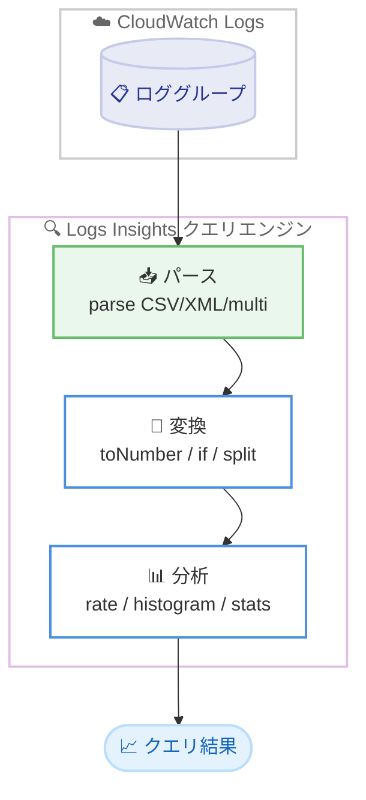

# Amazon CloudWatch Logs Insights - 23 個の新しいクエリコマンドと関数

**リリース日**: 2026 年 6 月 8 日
**サービス**: Amazon CloudWatch Logs
**機能**: CloudWatch Logs Insights クエリ言語の新コマンド・関数

📊 [このアップデートのインフォグラフィックを見る](https://takech9203.github.io/aws-news-summary/20260608-amazon-cloudwatch-logs-insights-new.html)
<!-- INFOGRAPHIC_BASE_URL は環境変数から取得 -->

## 概要

Amazon CloudWatch Logs Insights のクエリ言語に、ログのクエリ、パース、変換、分析を行うための 23 個の新しいコマンドと関数が追加されました。これにより、ログ分析時に必要となる条件処理、文字列変換、IP アドレス処理、さまざまなファイル形式のパース、複雑な集計処理を、より柔軟に実行できるようになります。

今回追加されたのは、ハッシュ関数 (md5、sha256)、文字列関数 (大文字小文字を区別しない検索に対応した strcontains、split)、条件ロジック (if ステートメント)、変換関数 (toNumber、toInt、toLong、toDouble)、IP 関数 (ipv4ToNumber、isPrivateIP、isPublicIP、isReservedIP)、分析関数 (rate、count_over_time、sum_over_time、offset、histogram)、パース関数 (parse CSV、parse XML、parse multi、values、addtotals) です。

さらに、クエリで最初の N 件の結果を取得する `limit any N` がサポートされ、1 つのクエリ内で最大 10 個の stats コマンドを使用できるようになりました。これらの機能はすべての商用 AWS リージョンで本日から利用可能です。

**アップデート前の課題**

CloudWatch Logs Insights でログを分析する際、以下のような制限がありました。

- 条件分岐や型変換を行う関数が限られており、複雑な前処理を SQL ライクな構文で完結させることが難しかった
- IP アドレスの判定 (プライベート / パブリックなど) や CSV、XML などの構造化ログのパースを標準機能だけで行うことが困難だった
- 1 つのクエリで使用できる stats コマンドの数や、時系列分析向けの集計関数が不足していた

**アップデート後の改善**

今回のアップデートにより、以下が可能になりました。

- if、toNumber、md5 などの関数により、クエリ内で条件処理や型変換、ハッシュ化を直接実行できるようになった
- IP アドレスの種別判定や CSV / XML / 複数パターンのパースを標準関数で実行できるようになった
- rate や count_over_time などの時系列分析関数が追加され、最大 10 個の stats コマンドと `limit any N` により高度な集計クエリを記述できるようになった

## アーキテクチャ図



ロググループから取得したログを、新しいパース関数で構造化し、変換関数で整形した後、分析関数で集計するという一連の流れをクエリ内で完結できます。

## サービスアップデートの詳細

### 主要機能

1. **ハッシュ関数**
   - `md5`、`sha256` を追加
   - フィールド値をハッシュ化し、機密情報のマスキングや一意性チェックに活用できる

2. **文字列関数**
   - `strcontains`: 文字列の包含判定。大文字小文字を区別しない検索に対応
   - `split`: 区切り文字で文字列を分割し、配列として扱える

3. **条件ロジック**
   - `if` ステートメントを追加
   - クエリ内で条件分岐を行い、値の振り分けやカテゴリ分類が可能になる

4. **変換関数**
   - `toNumber`、`toInt`、`toLong`、`toDouble` を追加
   - 文字列として取り込まれた値を数値型に変換し、計算や比較に利用できる

5. **IP 関数**
   - `ipv4ToNumber`: IPv4 アドレスを数値に変換
   - `isPrivateIP`、`isPublicIP`、`isReservedIP`: IP アドレスの種別を判定

6. **分析関数**
   - `rate`、`count_over_time`、`sum_over_time`: 時系列での増減や集計を計算
   - `offset`: 値のオフセットを取得
   - `histogram`: 値の分布をヒストグラムとして集計

7. **パース関数**
   - `parse CSV`、`parse XML`: 構造化ログを解析
   - `parse multi`: 複数のパターンを使ったパース
   - `values`: 値の集合を取得
   - `addtotals`: 集計結果に合計行を追加

8. **クエリ構文の拡張**
   - `limit any N`: 最初の N 件の結果を取得
   - 1 つのクエリで最大 10 個の stats コマンドを使用可能

## 技術仕様

### 新規追加されたコマンド・関数の分類

| カテゴリ | 関数・コマンド |
|----------|----------------|
| ハッシュ関数 | md5, sha256 |
| 文字列関数 | strcontains (大文字小文字非区別対応), split |
| 条件ロジック | if |
| 変換関数 | toNumber, toInt, toLong, toDouble |
| IP 関数 | ipv4ToNumber, isPrivateIP, isPublicIP, isReservedIP |
| 分析関数 | rate, count_over_time, sum_over_time, offset, histogram |
| パース関数 | parse CSV, parse XML, parse multi, values, addtotals |
| クエリ構文 | limit any N, 最大 10 個の stats コマンド |

### クエリ例

```
fields @timestamp, @message
| parse @message "client_ip=*, status=*, bytes=*" as ip, status, bytes
| filter isPublicIP(ip)
| stats sum(toNumber(bytes)) as total_bytes by if(status >= 500, "error", "ok") as result
| sort total_bytes desc
| limit any 20
```

このクエリは、ログメッセージから IP アドレス、ステータス、バイト数を抽出し、パブリック IP のみを対象に、ステータスコードに応じて「error」「ok」に分類して転送バイト数を集計します。

## メリット

### ビジネス面

- **分析の内製化**: 外部の ETL や追加ツールを使わずに、CloudWatch 内でログの前処理から分析までを完結でき、運用コストを抑えられる
- **意思決定の迅速化**: 時系列分析関数により、エラー率やトラフィックの傾向を素早く把握できる
- **追加費用なしの機能拡張**: 既存のクエリ機能の延長として利用でき、新たな製品導入を伴わない

### 技術面

- **クエリ表現力の向上**: 条件分岐、型変換、ハッシュ化をクエリ内で完結でき、複雑な分析ロジックを 1 つのクエリで記述できる
- **構造化ログ対応**: CSV や XML 形式のログを標準関数でパースでき、前処理の手間を削減できる
- **セキュリティ分析の強化**: IP 種別判定関数により、不正アクセスやプライベート / パブリックトラフィックの分析が容易になる

## デメリット・制約事項

### 制限事項

- stats コマンドは 1 つのクエリで最大 10 個まで
- これらの関数・コマンドは CloudWatch Logs Insights のクエリ言語で利用可能であり、他のクエリ言語 (OpenSearch PPL / SQL) との構文差異に注意が必要
- AWS GovCloud (US) や中国リージョンでの提供有無は別途確認が必要 (発表時点では商用 AWS リージョン対象)

### 考慮すべき点

- 複雑なクエリはスキャン対象データ量が増えるため、クエリ料金やパフォーマンスに影響する可能性がある
- 既存のクエリ言語バージョンや構文との互換性を確認したうえで利用する

## ユースケース

### ユースケース1: アクセスログのセキュリティ分析

**シナリオ**: Web アプリケーションのアクセスログから、パブリック IP からのエラーアクセスを特定したい。

**実装例**:
```
fields @timestamp, @message
| parse @message "ip=*, status=*" as ip, status
| filter isPublicIP(ip) and toInt(status) >= 400
| stats count(*) as error_count by ip
| sort error_count desc
| limit any 10
```

**効果**: パブリック IP からのエラーアクセスを集計し、攻撃の兆候や問題のあるクライアントを素早く特定できる。

### ユースケース2: 構造化ログの集計

**シナリオ**: CSV 形式で出力されたバッチ処理ログを解析し、項目別に集計したい。

**実装例**:
```
fields @message
| parse @message as csv_record
| stats sum(toDouble(amount)) as total by category
| addtotals
```

**効果**: CSV ログを標準関数でパースし、カテゴリ別の合計と全体合計を 1 つのクエリで取得できる。

### ユースケース3: エラー率の時系列モニタリング

**シナリオ**: 一定時間ごとのリクエスト数とエラー発生率の推移を可視化したい。

**実装例**:
```
fields @timestamp, status
| stats count_over_time(*) as requests, rate(toInt(status) >= 500) as error_rate by bin(5m)
```

**効果**: 時間帯ごとのリクエスト数とエラー率を集計し、障害の発生傾向やピーク時間帯を把握できる。

## 料金

これらのコマンドと関数の利用に追加料金は発生しません。CloudWatch Logs Insights のクエリは、従来どおりスキャンされたログデータ量に基づいて課金されます。詳細は CloudWatch の料金ページを参照してください。

## 利用可能リージョン

すべての商用 AWS リージョンで本日 (2026 年 6 月 8 日) から利用可能です。

## 関連サービス・機能

- **Amazon CloudWatch Logs**: 今回の機能が追加されるログ管理サービス本体
- **Amazon CloudWatch Metrics**: Logs Insights のクエリ結果をメトリクスフィルターやダッシュボードと組み合わせて活用できる
- **Amazon OpenSearch Service**: より高度な検索・分析が必要な場合の選択肢。クエリ言語の構文差異に注意が必要

## 参考リンク

- 📊 [インフォグラフィック](https://takech9203.github.io/aws-news-summary/20260608-amazon-cloudwatch-logs-insights-new.html)
- [公式発表 (What's New)](https://aws.amazon.com/about-aws/whats-new/2026/06/amazon-cloudwatch-logs-insights-new/)
- [ドキュメント (CloudWatch Logs Insights クエリ構文)](https://docs.aws.amazon.com/AmazonCloudWatch/latest/logs/CWL_QuerySyntax.html)
- [料金ページ (Amazon CloudWatch 料金)](https://aws.amazon.com/cloudwatch/pricing/)

## まとめ

今回のアップデートにより、CloudWatch Logs Insights はログの前処理から高度な分析までを 1 つのクエリで完結できる強力なツールへと進化しました。条件処理、型変換、IP 判定、構造化ログのパース、時系列分析が標準機能として利用できるため、セキュリティ分析や運用モニタリングを行う担当者は、既存のクエリを見直して新しい関数の活用を検討することをお勧めします。
