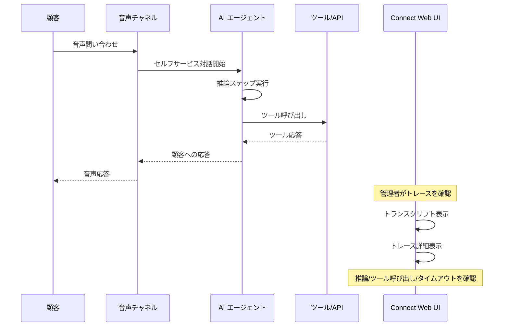

# Amazon Connect - AI エージェントトレース詳細 (セルフサービス音声対話向け)

**リリース日**: 2026年6月8日
**サービス**: Amazon Connect
**機能**: AI Agent Trace Details for Self-Service Voice Interactions

[このアップデートのインフォグラフィックを見る](https://takech9203.github.io/aws-news-summary/20260608-amazon-connect-ai-agent-traces.html)

## 概要

Amazon Connect Customer に、セルフサービス音声対話における AI エージェントのトレース詳細機能が追加された。この機能により、AI エージェントが顧客との会話中にどのように推論し、行動し、応答したかをステップバイステップで可視化できるようになる。

従来、AI エージェントが顧客のリクエストを解決できなかった場合、問題の根本原因を特定するのが困難だった。今回のアップデートにより、Connect Web UI 上で完全なトランスクリプトと並べて AI エージェントのトレースを直接確認でき、推論ミス、不正なパラメータでのツール呼び出し、応答待ちタイムアウトなどの問題を迅速に特定できるようになった。

**アップデート前の課題**

- AI エージェントが顧客リクエストを解決できなかった際に、内部の推論プロセスを確認する手段がなかった
- 問題発生時に、推論エラーなのかツール呼び出しエラーなのかタイムアウトなのかの切り分けが困難だった
- AI エージェントの動作を検証する仕組みがなく、本番環境へのデプロイに不安が伴っていた

**アップデート後の改善**

- AI エージェントのステップバイステップのトレースを Connect Web UI から直接確認可能になった
- 推論プロセス、ツール呼び出し、応答生成の各段階を個別に検証できるようになった
- エージェント動作の検証が容易になり、エージェンティックな体験を自信を持ってデプロイできるようになった

## アーキテクチャ図



AI エージェントが顧客と音声で対話する際の処理フローと、管理者が Connect Web UI でトレース詳細を確認する流れを示している。

## サービスアップデートの詳細

### 主要機能

1. **ステップバイステップのトレース表示**
   - AI エージェントの推論プロセスを段階的に可視化
   - 各ステップでの意思決定内容を確認可能
   - トランスクリプトと並列表示で文脈を把握しやすい

2. **問題診断の効率化**
   - 推論エラーの特定: AI エージェントが誤った判断をした箇所を特定
   - ツール呼び出しエラー: 不正なパラメータでのツール呼び出しを検出
   - タイムアウト検出: 応答待ちで時間切れになった箇所を特定

3. **動作検証とデプロイ支援**
   - 本番デプロイ前に AI エージェントの動作を検証
   - 期待通りに動作した対話パターンの確認
   - エージェンティックな体験の品質保証に活用

## 技術仕様

### トレース情報の構成要素

| 項目 | 詳細 |
|------|------|
| 推論ステップ | AI エージェントの各意思決定プロセス |
| ツール呼び出し | 呼び出したツール名、パラメータ、結果 |
| 応答生成 | 顧客への最終的な応答内容 |
| タイムアウト情報 | 応答待ち時間超過の発生箇所 |
| トランスクリプト | 完全な会話記録との並列表示 |

### API 変更履歴

| 日付 | サービス | 変更内容 |
|------|----------|----------|
| 2026/06/03 | [connect](https://awsapichanges.com/archive/changes/d1b776-connect.html) | 1 updated api method - SearchContacts API に AI エージェントによるフィルタリング機能を追加 |

### SearchContacts API の変更内容

`SearchContacts` API に `AiAgents` 検索条件が追加され、AI エージェントが処理したコンタクトをフィルタリングできるようになった。

```json
{
  "SearchCriteria": {
    "AiAgents": {
      "Criteria": [
        {
          "Id": "string",
          "VersionNumber": 123,
          "AiAgentEscalated": true,
          "AiUseCase": "AgentAssistance | SelfService"
        }
      ]
    }
  }
}
```

レスポンスにも `AiAgentInfo` フィールドが追加され、各コンタクトに関与した AI エージェントの情報を取得可能になった。

```json
{
  "Contacts": [
    {
      "AiAgentInfo": [
        {
          "AiAgentVersionId": "string",
          "AiAgentEscalated": true,
          "AiUseCase": "AgentAssistance | SelfService"
        }
      ]
    }
  ]
}
```

## 設定方法

### 前提条件

1. Amazon Connect インスタンスが作成済みであること
2. AI エージェントがセルフサービス音声対話用に設定済みであること
3. Amazon Connect Customer AI Agents が利用可能なリージョンであること

### 手順

#### ステップ 1: AI エージェントトレースへのアクセス

Connect Web UI にログインし、コンタクト検索機能から対象の音声対話を検索する。AI エージェントが処理したコンタクトは、新しい `AiAgents` フィルタを使用してフィルタリング可能。

#### ステップ 2: トレース詳細の確認

対象のコンタクトを選択すると、トランスクリプトと並んで AI エージェントのトレース詳細が表示される。各ステップの推論内容、ツール呼び出し、応答生成の過程を確認できる。

#### ステップ 3: 問題の診断

トレース内で問題が発生したステップを特定し、以下を確認する。

- 推論が正しかったか
- ツール呼び出しのパラメータが適切だったか
- タイムアウトが発生していないか

## メリット

### ビジネス面

- **顧客体験の向上**: AI エージェントの問題を迅速に特定・修正し、セルフサービスの解決率を向上
- **デプロイの信頼性向上**: 本番環境へのデプロイ前に動作を検証でき、リスクを低減
- **運用コスト削減**: 問題の根本原因特定が迅速化し、トラブルシューティング時間を短縮

### 技術面

- **デバッグの効率化**: ステップバイステップのトレースにより、問題箇所の特定が容易
- **エージェント品質の可視化**: AI エージェントの推論品質を定量的に評価可能
- **API 連携**: SearchContacts API の拡張により、プログラマティックに AI エージェントの対話履歴を分析可能

## デメリット・制約事項

### 制限事項

- セルフサービス音声対話のみが対象 (チャットや他のチャネルは現時点で非対応の可能性)
- Amazon Connect Customer AI Agents が利用可能なリージョンに限定
- トレースは Connect Web UI からのアクセスが前提

### 考慮すべき点

- トレースデータの保持期間に関するポリシーの確認が必要
- 大量の対話データに対するトレースの検索・分析にはパフォーマンスへの配慮が必要
- AI エージェントの設計変更後は、トレースを使った回帰テストの運用フローの確立を推奨

## ユースケース

### ユースケース 1: AI エージェントの障害分析

**シナリオ**: 顧客が注文状況を確認しようとしたが、AI エージェントが正しく応答できずにエスカレーションが発生した。

**実装例**:
```
1. Connect Web UI でエスカレーションされたコンタクトを検索
2. AiAgentEscalated: true でフィルタリング
3. トレース詳細で推論ステップを確認
4. ツール呼び出しパラメータのエラーを特定
5. AI エージェントのプロンプトまたはツール設定を修正
```

**効果**: 問題の根本原因を数分で特定し、再発防止策を迅速に実施できる。

### ユースケース 2: AI エージェントの品質保証

**シナリオ**: 新しい AI エージェントを本番環境にデプロイする前に、テスト対話のトレースを確認して動作を検証する。

**実装例**:
```
1. テスト環境で様々なシナリオの音声対話を実施
2. 各対話のトレースを確認し、期待通りの推論が行われているか検証
3. エッジケースでの動作を確認
4. 問題なければ本番環境にデプロイ
```

**効果**: デプロイ前の品質保証プロセスが確立され、本番環境での障害リスクを低減。

### ユースケース 3: AI エージェントの継続的改善

**シナリオ**: セルフサービスの解決率が低下傾向にあるため、AI エージェントの改善ポイントを特定したい。

**実装例**:
```
1. SearchContacts API で AiUseCase: SelfService のコンタクトを抽出
2. エスカレーション率が高いパターンを特定
3. 該当するトレースを分析し、共通の失敗パターンを発見
4. プロンプト調整やツール設定の最適化を実施
```

**効果**: データドリブンで AI エージェントの改善サイクルを回すことが可能に。

## 料金

AI エージェントトレース機能の追加料金に関する個別の記載はない。Amazon Connect Customer AI Agents の利用料金に含まれるものと想定される。Amazon Connect の料金体系は従量課金制であり、詳細は料金ページを参照のこと。

## 利用可能リージョン

Amazon Connect Customer AI Agents がサポートされているすべての AWS リージョンで利用可能。

## 関連サービス・機能

- **Amazon Connect Customer AI Agents**: エージェンティック AI ソリューションの基盤。セルフサービス・エージェントアシストの両方のユースケースに対応
- **Amazon Connect Contact Lens**: 会話分析・品質管理機能。トレース詳細と組み合わせて包括的な分析が可能
- **Amazon Bedrock**: AI エージェントの基盤モデル提供。推論・ツール呼び出しの能力を支える

## 参考リンク

- [インフォグラフィック](https://takech9203.github.io/aws-news-summary/20260608-amazon-connect-ai-agent-traces.html)
- [公式発表 (What's New)](https://aws.amazon.com/about-aws/whats-new/2026/06/amazon-connect-ai-agent-traces/)
- [Amazon Connect ドキュメント - AI Agent Traces](https://docs.aws.amazon.com/connect/latest/adminguide/ai-agent-traces.html)
- [Amazon Connect 料金ページ](https://aws.amazon.com/connect/pricing/)
- [API 変更履歴 - SearchContacts](https://awsapichanges.com/archive/changes/d1b776-connect.html)

## まとめ

Amazon Connect Customer に AI エージェントトレース詳細機能が追加され、セルフサービス音声対話における AI エージェントの推論・行動・応答プロセスの完全な可視化が実現した。コンタクトセンターの運用チームは、AI エージェントの問題を迅速に診断し、動作を検証したうえで本番デプロイできるようになる。AI エージェントを活用したセルフサービスの品質向上と運用効率化に直接貢献するアップデートであり、Amazon Connect で AI エージェントを運用中または導入検討中の組織は、早期にこの機能を活用した運用フローの整備を推奨する。
