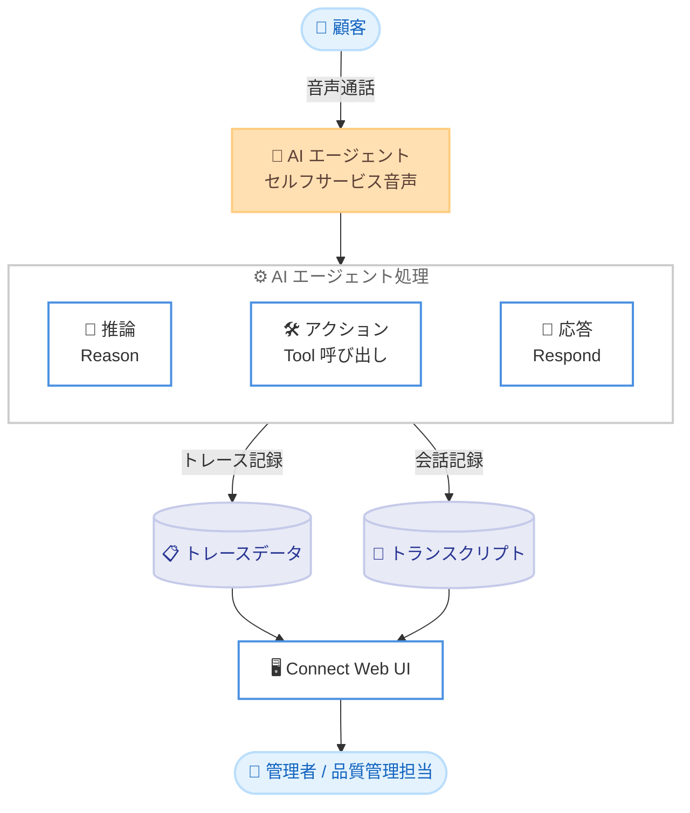

# Amazon Connect - AI エージェントトレース詳細 (セルフサービス音声対話向け)

**リリース日**: 2026年6月8日
**サービス**: Amazon Connect
**機能**: AI Agent Trace Details for Self-Service Voice Interactions

📊 [このアップデートのインフォグラフィックを見る](https://takech9203.github.io/aws-news-summary/20260608-amazon-connect-ai-agent-traces.html)

## 概要

Amazon Connect Customer に、セルフサービス音声対話における AI エージェントのトレース詳細機能が追加された。この機能により、AI エージェントが顧客との各会話の中でどのように推論し、行動し、応答したかを把握できるようになる。これまでブラックボックスになりがちだった AI エージェントの動作を、ステップバイステップで可視化できる点が大きな特長である。

今回のリリースにより、AI エージェントが対話をどのように処理したかを完全に可視化できるため、何が正しく機能したかの確認、問題の診断、動作の検証が可能になり、自信を持ってエージェント型 (agentic) 体験を本番展開できるようになる。たとえば AI エージェントが顧客のリクエストを解決できなかった場合、Connect Web UI 上で完全なトランスクリプトと並べてステップバイステップのトレースに直接アクセスし、推論を誤ったのか、不正なパラメータでツールを呼び出したのか、応答待ちでタイムアウトしたのかを確認できる。

この機能は、コンタクトセンターで AI エージェントを運用する管理者、コンタクトフローの設計者、品質管理担当者を主な対象としている。

**アップデート前の課題**

AI エージェントの内部動作を確認する手段が限られており、運用上の障壁となっていた。

- AI エージェントが顧客のリクエストを解決できなかった際に、なぜ失敗したのかを特定するのが困難だった
- AI エージェントの推論やツール呼び出しの過程が可視化されておらず、動作検証が難しかった
- 問題の切り分けに時間がかかり、エージェント型体験を本番環境へ展開する際の確信を得にくかった

**アップデート後の改善**

トレース詳細により、AI エージェントの挙動が透明化された。

- AI エージェントの推論、アクション、応答をステップバイステップで可視化できるようになった
- Connect Web UI 上で完全なトランスクリプトと並べてトレースを直接確認できるようになった
- 推論ミス、不正なパラメータでのツール呼び出し、応答待ちタイムアウトといった失敗原因を迅速に切り分けられるようになった

## アーキテクチャ図



AI エージェントが音声対話を処理する過程で生成される推論・アクション・応答の各ステップがトレースとして記録され、トランスクリプトと並べて Connect Web UI で確認できる流れを示している。

## サービスアップデートの詳細

### 主要機能

1. **AI エージェントの推論・アクション・応答の可視化**
   - AI エージェントが各会話の中でどのように推論 (reason)、行動 (act)、応答 (respond) したかを把握できる
   - 対話全体を通じて AI エージェントがどのように処理を進めたかを完全に可視化する
   - 何が正しく機能したかを確認し、動作を検証できる

2. **ステップバイステップのトレース**
   - AI エージェントの処理過程をステップ単位で追跡できる
   - 推論を誤ったのか、不正なパラメータでツールを呼び出したのか、応答待ちでタイムアウトしたのかなど、失敗の具体的な原因を特定できる
   - 問題の診断と切り分けを効率化する

3. **トランスクリプトとの統合表示**
   - Connect Web UI 上で、完全なトランスクリプトと並べてトレースに直接アクセスできる
   - 会話の文脈とエージェントの内部動作を同じ画面で対応付けて確認できる
   - 専用の外部ツールを使わずに、Connect の管理画面内で完結して分析できる

## 技術仕様

### トレースで確認できる情報

| 項目 | 詳細 |
|------|------|
| 推論 (Reason) | AI エージェントがどのような判断・推論を行ったか |
| アクション (Act) | どのツールを、どのようなパラメータで呼び出したか |
| 応答 (Respond) | 顧客に対してどのように応答したか |
| 失敗診断 | 推論ミス、不正なパラメータでのツール呼び出し、タイムアウトなどの原因 |
| 表示場所 | Connect Web UI (完全なトランスクリプトと並べて表示) |
| 対象チャネル | セルフサービス音声対話 (self-service voice interactions) |

### API変更履歴

今回のアップデートに直接対応する公開 API の変更は確認されていない。トレースは Connect Web UI 上で参照する機能として提供される。

## 設定方法

### 前提条件

1. Amazon Connect インスタンスが有効化されていること
2. Amazon Connect Customer AI Agents がサポートされているリージョンでインスタンスを利用していること
3. セルフサービス音声対話向けの AI エージェントが構成されていること

### 手順

#### ステップ1: AI エージェントを構成する

セルフサービス音声向けの AI エージェントを Amazon Connect で構成する。すでに AI エージェントを運用している場合は、追加の有効化操作なしでトレースが利用できる。

#### ステップ2: 対象の対話を特定する

Connect Web UI のコンタクト検索やコンタクト詳細から、トレースを確認したい音声対話を特定する。AI エージェントが解決できなかったリクエストなど、診断対象の対話を選択する。

#### ステップ3: トレースとトランスクリプトを確認する

選択した対話のコンタクト詳細画面で、完全なトランスクリプトと並べて表示されるステップバイステップのトレースを確認する。推論、ツール呼び出し、応答の各ステップを追跡し、失敗があった場合はその原因 (推論ミス、不正なパラメータ、タイムアウトなど) を特定する。

## メリット

### ビジネス面

- **本番展開の自信向上**: AI エージェントの動作を検証してから展開できるため、エージェント型体験を自信を持って本番環境へ投入できる
- **顧客体験の改善**: 失敗原因を迅速に特定し改善することで、セルフサービスでの解決率向上につながる
- **運用効率の向上**: 問題の診断・切り分けにかかる時間を短縮できる

### 技術面

- **可観測性の向上**: AI エージェントの推論・アクション・応答が透明化され、ブラックボックス化を防げる
- **統合された分析環境**: トランスクリプトとトレースを同一画面で確認でき、追加ツールが不要
- **具体的な失敗診断**: 推論ミス、ツールパラメータの誤り、タイムアウトなど、原因の種類を特定できる

## デメリット・制約事項

### 制限事項

- 本機能はセルフサービス音声対話向けに提供される (本発表時点での対象チャネル)
- Amazon Connect Customer AI Agents がサポートされているリージョンでのみ利用可能
- トレースは Connect Web UI 上での確認を主とする機能である

### 考慮すべき点

- トレースに含まれる会話内容には機微な情報が含まれる可能性があるため、アクセス権限の管理に留意する
- 詳細な料金体系は公式の料金ページで確認することが望ましい

## ユースケース

### ユースケース1: 解決できなかったリクエストの原因分析

**シナリオ**: AI エージェントが顧客のリクエストを解決できず、有人エージェントへエスカレーションされた対話が増えている。

**実装例**:
```
1. Connect Web UI でエスカレーションされた対話を特定
2. トランスクリプトと並べてトレースを確認
3. 推論ミス / 不正なツールパラメータ / タイムアウトのいずれかを特定
```

**効果**: 失敗の根本原因を特定し、AI エージェントの構成やツール定義を的確に改善できる。

### ユースケース2: 本番展開前の動作検証

**シナリオ**: 新しい AI エージェントのフローを本番展開する前に、想定どおりに動作するかを確認したい。

**実装例**:
```
1. テスト対話を実施
2. トレースで推論・アクション・応答の各ステップを確認
3. 期待する動作と一致しているかを検証
```

**効果**: 動作を検証したうえで自信を持って本番展開でき、展開後の障害リスクを低減できる。

### ユースケース3: 品質管理とコンプライアンス確認

**シナリオ**: 品質管理担当者が AI エージェントの応答品質を定期的にレビューする必要がある。

**実装例**:
```
1. サンプリングした対話のトレースを確認
2. 推論の妥当性とツール呼び出しの適切性を評価
3. 改善点をフィードバックとして記録
```

**効果**: AI エージェントの動作を継続的に評価し、応答品質の維持・向上に活用できる。

## 料金

本発表では、トレース機能に固有の料金は明示されていない。Amazon Connect Customer AI Agents の利用に伴う料金体系に準じるため、詳細は公式の料金ページで確認することを推奨する。

## 利用可能リージョン

本機能は、Amazon Connect Customer AI Agents がサポートされているすべての AWS リージョンで利用可能である。

## 関連サービス・機能

- **Amazon Connect Customer AI Agents**: 本トレース機能が可視化する対象。セルフサービス音声対話を処理する AI エージェント
- **Amazon Connect コンタクトトランスクリプト**: トレースと並べて表示される会話記録
- **Amazon Connect AI Agent Metrics**: AI エージェントのパフォーマンスを集計・可視化する指標機能 (2026年4月リリース) で、トレースと組み合わせて運用品質を把握できる

## 参考リンク

- 📊 [インフォグラフィック](https://takech9203.github.io/aws-news-summary/20260608-amazon-connect-ai-agent-traces.html)
- [公式発表 (What's New)](https://aws.amazon.com/about-aws/whats-new/2026/06/amazon-connect-ai-agent-traces/)
- [Amazon Connect 管理者ガイド](https://docs.aws.amazon.com/connect/latest/adminguide/)
- [Amazon Connect 製品ページ](https://aws.amazon.com/connect/)

## まとめ

このアップデートは、AI エージェントの動作を可視化することで、セルフサービス音声対話の品質改善と本番展開の確実性を大きく高めるものである。AI エージェントを運用している組織は、トレースを活用して失敗原因の診断と動作検証を行い、エージェント型体験の継続的な改善につなげることを推奨する。
