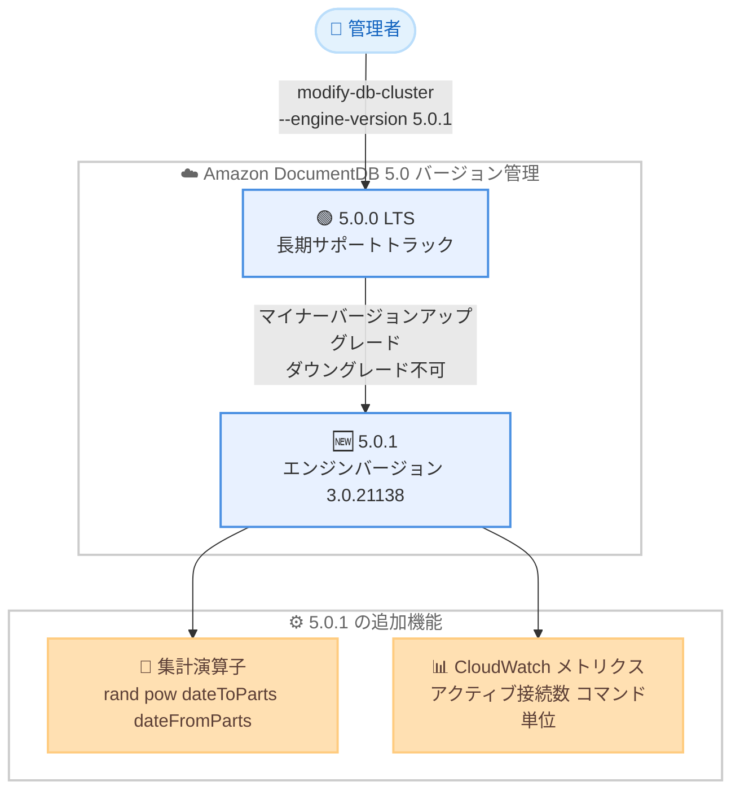

# Amazon DocumentDB - エンジンマイナーバージョン 5.0.1 のサポート

**リリース日**: 2026 年 6 月 8 日
**サービス**: Amazon DocumentDB (with MongoDB compatibility)
**機能**: エンジンマイナーバージョン 5.0.1

📊 [このアップデートのインフォグラフィックを見る](https://takech9203.github.io/aws-news-summary/20260608-amazon-documentdb-engine-minor-version-5-0-1.html)
<!-- INFOGRAPHIC_BASE_URL は環境変数から取得 -->

## 概要

Amazon DocumentDB (with MongoDB compatibility) は、エンジンマイナーバージョンのサポートを開始し、その最初のリリースとして 5.0.1 (エンジンバージョン 3.0.21138) を提供しました。これは Amazon DocumentDB 5.0 メジャーバージョンにおける初のマイナーバージョンリリースであり、同一メジャーバージョン内で新機能、セキュリティ修正、バグ修正を提供します。

このマイナーバージョンでは、集計機能の強化として 4 つの新しい演算子 ($rand、$pow、$dateToParts、$dateFromParts) が追加されました。さらに、インスタンスを監視するためのアクティブ接続数メトリクス、および CloudWatch におけるコマンド単位のきめ細かいパフォーマンスメトリクス (find、insert、findAndModify、update など) が利用可能になりました。

マイナーバージョンの導入により、お客様はクラスターのアップグレード時期と方法をより細かく制御できるようになります。新規クラスター作成時にマイナーバージョン 5.0.1 を指定するか、既存の 5.0.0 クラスターを AWS マネジメントコンソールまたは AWS CLI を使用して手動で 5.0.1 にアップグレードできます。なお、より新しいマイナーバージョンにアップグレードした後は、以前のバージョンへダウングレードすることはできません。

**アップデート前の課題**

- Amazon DocumentDB 5.0 にはマイナーバージョンの概念がなく、新機能やバグ修正は自動エンジンパッチとして適用されるため、適用時期を細かく制御しにくかった
- $rand、$pow、$dateToParts、$dateFromParts といった集計演算子が利用できず、アプリケーション側で代替処理が必要だった
- インスタンスのアクティブ接続数や、コマンド単位のパフォーマンスを CloudWatch で詳細に把握する手段が限られていた

**アップデート後の改善**

- マイナーバージョンを明示的に指定してアップグレードできるため、新機能や修正の適用タイミングをお客様自身で制御できるようになった
- 新しい集計演算子により、乱数生成、べき乗計算、日付の分解・組み立てをデータベース側で実行できるようになった
- アクティブ接続数メトリクスとコマンド単位のパフォーマンスメトリクスにより、運用監視とパフォーマンス分析が強化された

## アーキテクチャ図



5.0.0 LTS クラスターからマイナーバージョンアップグレードを実行すると 5.0.1 に移行し、新しい集計演算子と CloudWatch メトリクスが利用可能になります。アップグレード後のダウングレードはできません。

## サービスアップデートの詳細

### 主要機能

1. **マイナーバージョンの概念の導入**
   - Amazon DocumentDB 5.0 にマイナーバージョン管理が導入され、5.0.1 が最初のマイナーバージョンとしてリリースされた
   - エンジンバージョンは 3.0.21138
   - マイナーバージョンは同一メジャーバージョン内で新機能、セキュリティ修正、バグ修正を提供する
   - アップグレードの時期と方法をお客様が制御できる

2. **新しい集計演算子**
   - `$rand`: 0 以上 1 未満の範囲の乱数を生成する
   - `$pow`: 指定した数値を指定した指数でべき乗する
   - `$dateToParts`: 日付を年、月、日、時、分などの構成要素に分解する
   - `$dateFromParts`: 構成要素から日付を組み立てる

3. **アクティブ接続数メトリクス**
   - インスタンスへのアクティブな接続数を監視するためのメトリクスが追加された
   - 接続数の傾向把握や接続リークの検出に役立つ

4. **コマンド単位のパフォーマンスメトリクス**
   - CloudWatch で find、insert、findAndModify、update などのコマンド単位のパフォーマンスメトリクスがきめ細かく取得できる
   - どのコマンドがレイテンシーやスループットに影響しているかを詳細に分析できる

## 技術仕様

### バージョン情報

| 項目 | 詳細 |
|------|------|
| メジャーバージョン | Amazon DocumentDB 5.0 (MongoDB 5.0 互換) |
| マイナーバージョン | 5.0.1 |
| エンジンバージョン | 3.0.21138 |
| アップグレード元 | 5.0.0 (LTS) |
| ダウングレード | 不可 |
| 対象クラスター | インスタンスベースクラスター |

### 新しい集計演算子

| 演算子 | 機能 |
|--------|------|
| `$rand` | 乱数の生成 |
| `$pow` | べき乗の計算 |
| `$dateToParts` | 日付を構成要素に分解 |
| `$dateFromParts` | 構成要素から日付を生成 |

### LTS トラックとの関係

| 項目 | 詳細 |
|------|------|
| 5.0.0 | LTS (長期サポート) トラック |
| 5.0.1 | LTS トラックから外れる |
| 推奨 | アップグレードを最小限にしたい場合は LTS にとどまる |

### API 変更履歴

| 日付 | サービス | 変更内容 |
|------|----------|----------|
| 2026/06/08 | Amazon DocumentDB | 既存の `modify-db-cluster` API の `--engine-version` パラメータでマイナーバージョン 5.0.1 を指定可能 (新規 API メソッドの追加なし) |

## 設定方法

### 前提条件

1. Amazon DocumentDB 5.0 が利用可能なリージョンであること
2. 既存クラスターをアップグレードする場合、現在のバージョンが 5.0.0 であること
3. クラスターの変更権限を持つ IAM プリンシパルであること

### 手順

#### ステップ1: 新規クラスター作成時にバージョンを指定する

```bash
aws docdb create-db-cluster \
    --db-cluster-identifier my-docdb-cluster \
    --engine docdb \
    --engine-version 5.0.1 \
    --master-username myuser \
    --master-user-password mypassword
```

`--engine-version 5.0.1` を指定して新規クラスターを作成します。最初から 5.0.1 の機能を利用できます。

#### ステップ2: 既存の 5.0.0 クラスターをアップグレードする

```bash
aws docdb modify-db-cluster \
    --db-cluster-identifier my-docdb-cluster \
    --engine-version 5.0.1 \
    --apply-immediately
```

既存の 5.0.0 クラスターを `modify-db-cluster` コマンドの `--engine-version 5.0.1` でマイナーバージョンアップグレードします。`--apply-immediately` を指定すると即時に、指定しない場合は次回メンテナンスウィンドウで適用されます。

#### ステップ3: エンジンバージョンを確認する

```javascript
db.runCommand({getEngineVersion: 1})
```

mongo シェルから上記コマンドを実行し、現在のエンジンパッチバージョンを確認します。AWS マネジメントコンソールからもアップグレードを実行できます。

## メリット

### ビジネス面

- **アップグレード制御の向上**: マイナーバージョンを指定することで、新機能や修正の適用時期を計画的に管理できる
- **運用可視性の向上**: アクティブ接続数とコマンド単位のメトリクスにより、運用チームが問題を早期に検出できる
- **開発効率の向上**: 新しい集計演算子により、データベース側で処理を完結させ、アプリケーションコードを簡素化できる

### 技術面

- **集計パイプラインの強化**: $rand、$pow、$dateToParts、$dateFromParts により表現力が向上した
- **きめ細かいパフォーマンス分析**: コマンド単位のメトリクスでボトルネックを特定しやすくなった
- **接続監視**: アクティブ接続数メトリクスで接続プールの状態を把握できる

## デメリット・制約事項

### 制限事項

- アップグレード後、以前のマイナーバージョンへダウングレードすることはできない
- 5.0.0 (LTS) から 5.0.1 にアップグレードすると、LTS トラックから外れる
- マイナーバージョン管理はインスタンスベースクラスターを対象とする

### 考慮すべき点

- アップグレードを最小限に抑えたい場合は、LTS である 5.0.0 にとどまることが推奨される
- 本番環境へ適用する前に、新しい集計演算子やメトリクスの挙動をテスト環境で検証することが望ましい
- アップグレードのタイミングは、即時適用か次回メンテナンスウィンドウかを慎重に選択する

## ユースケース

### ユースケース1: 集計パイプラインでの日付処理

**シナリオ**: イベントログコレクションから、年月単位で集計レポートを生成したい。

**実装例**:
```javascript
db.events.aggregate([
  { $project: {
      parts: { $dateToParts: { date: "$timestamp" } }
  }},
  { $group: {
      _id: { year: "$parts.year", month: "$parts.month" },
      count: { $sum: 1 }
  }}
])
```

**効果**: $dateToParts により日付の分解をデータベース側で実行でき、アプリケーション側の前処理が不要になる。

### ユースケース2: ランダムサンプリング

**シナリオ**: 大規模コレクションから一部のドキュメントをランダムに抽出して分析したい。

**実装例**:
```javascript
db.users.aggregate([
  { $addFields: { r: { $rand: {} } } },
  { $match: { r: { $lt: 0.1 } } }
])
```

**効果**: $rand を用いることで、約 10% のランダムサンプルをデータベース側で効率的に抽出できる。

### ユースケース3: コマンド単位のパフォーマンス監視

**シナリオ**: 特定の書き込みコマンドのレイテンシーが上昇しており、原因を特定したい。

**実装例**:
```
CloudWatch メトリクス: insert / update / findAndModify など
コマンド単位のレイテンシーとスループットをダッシュボードで可視化
アクティブ接続数メトリクスと併せて監視
```

**効果**: どのコマンドがパフォーマンス低下の原因かを特定し、インデックス設計やクエリ最適化の判断材料にできる。

## 料金

Amazon DocumentDB 5.0.1 へのアップグレード自体に追加料金は発生しません。インスタンス、ストレージ、I/O、バックアップなどの通常の Amazon DocumentDB の料金が適用されます。CloudWatch の新しいメトリクスについては、CloudWatch の標準料金が適用される場合があります。

詳細は Amazon DocumentDB の料金ページを参照してください。

## 利用可能リージョン

Amazon DocumentDB エンジンマイナーバージョン 5.0.1 は、Amazon DocumentDB 5.0 が利用可能なすべての AWS リージョンで利用できます。

## 関連サービス・機能

- **Amazon CloudWatch**: アクティブ接続数メトリクスとコマンド単位のパフォーマンスメトリクスを収集・可視化する
- **Amazon DocumentDB 5.0 LTS (5.0.0)**: マイナーバージョンアップグレードのアップグレード元となる長期サポートバージョン
- **AWS CLI / AWS マネジメントコンソール**: `modify-db-cluster` コマンドや管理画面からマイナーバージョンアップグレードを実行する

## 参考リンク

- 📊 [インフォグラフィック](https://takech9203.github.io/aws-news-summary/20260608-amazon-documentdb-engine-minor-version-5-0-1.html)
- [公式発表 (What's New)](https://aws.amazon.com/about-aws/whats-new/2026/05/amazon-documentdb-engine-minor-version-5-0-1/)
- [Amazon DocumentDB リリースノート](https://docs.aws.amazon.com/documentdb/latest/developerguide/release-notes.html)
- [Amazon DocumentDB Developer Guide](https://docs.aws.amazon.com/documentdb/latest/developerguide/)
- [Amazon DocumentDB 料金ページ](https://aws.amazon.com/documentdb/pricing/)

## まとめ

Amazon DocumentDB 5.0.1 は、5.0 メジャーバージョンにおける初のマイナーバージョンであり、新しい集計演算子と詳細な監視メトリクスを提供しつつ、アップグレードの制御性を高めます。新機能を活用したい場合は 5.0.1 へのアップグレードを、アップグレードを最小限にしたい場合は LTS である 5.0.0 にとどまることを検討してください。アップグレード後はダウングレードできないため、テスト環境での検証を経てから本番環境へ適用することを推奨します。
