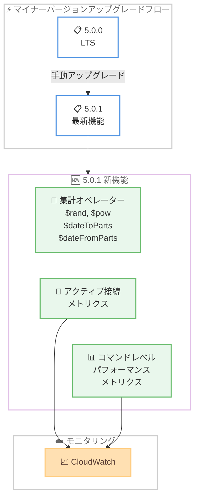

# Amazon DocumentDB - エンジンマイナーバージョン 5.0.1 のサポート開始

**リリース日**: 2026年6月8日
**サービス**: Amazon DocumentDB (with MongoDB compatibility)
**機能**: エンジンマイナーバージョニングシステムの導入と 5.0.1 リリース

📊 [このアップデートのインフォグラフィックを見る](https://takech9203.github.io/aws-news-summary/20260608-amazon-documentdb-engine-minor-version-5-0-1.html)

## 概要

Amazon DocumentDB (with MongoDB compatibility) がエンジンマイナーバージョンのサポートを開始し、最初のマイナーバージョンとして 5.0.1 をリリースした。これにより、メジャーバージョン内でのきめ細かなバージョン管理が可能になり、新機能やバグ修正の適用タイミングをより柔軟にコントロールできるようになった。

5.0.1 では、新しい集計オペレーター ($rand、$pow、$dateToParts、$dateFromParts) の追加、アクティブ接続数メトリクス、CloudWatch でのコマンドレベルのパフォーマンスメトリクス (find、insert、findAndModify、update など) が提供される。

**アップデート前の課題**

- メジャーバージョン単位でしかバージョン管理ができず、個別の機能追加やバグ修正の適用タイミングを制御できなかった
- 集計パイプラインで乱数生成 ($rand) やべき乗計算 ($pow)、日付の部品分解・組み立て ($dateToParts、$dateFromParts) が利用できなかった
- インスタンスのアクティブ接続数を直接監視するメトリクスがなく、接続管理の可視性が不十分だった
- コマンドレベルの詳細なパフォーマンスメトリクスが CloudWatch で利用できず、ボトルネックの特定が困難だった

**アップデート後の改善**

- マイナーバージョン単位での段階的なアップグレードが可能になり、クラスターの更新タイミングをきめ細かく制御できるようになった
- 4 つの新しい集計オペレーターにより、データ変換や分析の柔軟性が大幅に向上した
- アクティブ接続メトリクスにより、接続プールの利用状況をリアルタイムで監視できるようになった
- コマンドレベルのパフォーマンスメトリクスにより、特定のオペレーション (find、insert、update 等) のレイテンシーやスループットを個別に追跡できるようになった

## アーキテクチャ図



5.0.0 (LTS) から 5.0.1 への手動アップグレードにより新機能が利用可能になり、CloudWatch との連携で詳細なモニタリングが実現される。

## サービスアップデートの詳細

### 主要機能

1. **新しい集計オペレーター**
   - `$rand`: 0 から 1 の間のランダムな浮動小数点値を生成する。サンプリングやランダム化処理に活用可能
   - `$pow`: べき乗計算を実行する。科学計算や統計処理のパイプライン内での利用に対応
   - `$dateToParts`: 日付値を年、月、日、時間、分、秒などの構成要素に分解する
   - `$dateFromParts`: 個別の日付構成要素から日付値を組み立てる

2. **アクティブ接続メトリクス**
   - インスタンスへのアクティブな接続数をリアルタイムで監視
   - 接続プールの使用状況の把握と接続枯渇の早期検知に活用可能
   - CloudWatch で他のメトリクスと組み合わせたアラーム設定が可能

3. **コマンドレベルパフォーマンスメトリクス**
   - CloudWatch で個別コマンドのパフォーマンスを追跡
   - 対象コマンド: find、insert、findAndModify、update など
   - オペレーション別のレイテンシーやスループットを可視化し、ボトルネックの特定を支援

### マイナーバージョニングシステム

- メジャーバージョン (5.0) 内でのインクリメンタルなバージョンリリースを実現
- ユーザーがアップグレードのタイミングを主体的に選択可能
- 新機能とバグ修正をより迅速に提供する仕組み

## 技術仕様

### バージョン管理

| 項目 | 詳細 |
|------|------|
| 現行 LTS バージョン | 5.0.0 |
| 新マイナーバージョン | 5.0.1 |
| アップグレード方式 | 手動 (コンソールまたは CLI) |
| ダウングレード | 不可 (一方向のみ) |
| LTS トラック | 5.0.1 にアップグレードすると LTS トラックから外れる |

### 新規集計オペレーター

| オペレーター | 機能 | 用途例 |
|------------|------|--------|
| `$rand` | 0-1 のランダム値生成 | サンプリング、A/B テスト |
| `$pow` | べき乗計算 | 統計処理、科学計算 |
| `$dateToParts` | 日付を構成要素に分解 | 月別集計、時間帯分析 |
| `$dateFromParts` | 構成要素から日付を生成 | 日付正規化、カスタム日付生成 |

### CloudWatch メトリクス

| メトリクス種別 | 説明 |
|--------------|------|
| アクティブ接続数 | インスタンスへの現在の接続数 |
| find パフォーマンス | 読み取りクエリのレイテンシー・スループット |
| insert パフォーマンス | 書き込み操作のレイテンシー・スループット |
| update パフォーマンス | 更新操作のレイテンシー・スループット |
| findAndModify パフォーマンス | アトミック更新操作のレイテンシー・スループット |

## 設定方法

### 前提条件

1. Amazon DocumentDB 5.0.0 クラスターが稼働中であること
2. AWS CLI v2 がインストール済みであること (CLI で操作する場合)
3. クラスターの `modify-db-cluster` 権限を持つ IAM ロールまたはユーザーであること

### 手順

#### ステップ 1: 現在のエンジンバージョンを確認

```bash
aws docdb describe-db-clusters \
  --db-cluster-identifier my-docdb-cluster \
  --query 'DBClusters[0].EngineVersion'
```

現在のクラスターのエンジンバージョンが 5.0.0 であることを確認する。

#### ステップ 2: クラスターを 5.0.1 にアップグレード

```bash
aws docdb modify-db-cluster \
  --db-cluster-identifier my-docdb-cluster \
  --engine-version 5.0.1 \
  --apply-immediately
```

`modify-db-cluster` コマンドで `--engine-version 5.0.1` を指定してアップグレードを実行する。`--apply-immediately` を指定しない場合、次のメンテナンスウィンドウで適用される。

#### ステップ 3: 新規クラスター作成時にマイナーバージョンを指定

```bash
aws docdb create-db-cluster \
  --db-cluster-identifier my-new-docdb-cluster \
  --engine docdb \
  --engine-version 5.0.1 \
  --master-username adminuser \
  --master-user-password <password>
```

新規クラスター作成時に `--engine-version 5.0.1` を指定することで、最初から 5.0.1 でクラスターを構築できる。

## メリット

### ビジネス面

- **柔軟なアップグレード管理**: マイナーバージョン単位でのアップグレードにより、変更管理プロセスの負荷を軽減し、リスクを最小化できる
- **運用可視性の向上**: コマンドレベルのメトリクスにより、パフォーマンス問題の原因特定と解決が迅速化し、ダウンタイムを削減できる
- **開発生産性の向上**: 新しい集計オペレーターにより、アプリケーション側で実装していた処理をデータベース層に委譲でき、開発工数を削減できる

### 技術面

- **きめ細かなモニタリング**: コマンド別のパフォーマンスメトリクスにより、スロークエリやホットスポットの検出精度が向上する
- **集計パイプラインの拡張**: $rand、$pow、$dateToParts、$dateFromParts により、複雑なデータ変換をデータベース内で完結できる
- **接続管理の改善**: アクティブ接続メトリクスにより、接続プールのサイジングやスケーリングの判断材料が得られる

## デメリット・制約事項

### 制限事項

- 5.0.1 にアップグレードすると 5.0.0 へのダウングレードは不可能
- 5.0.0 (LTS) から 5.0.1 にアップグレードすると LTS トラックから外れる
- マイナーバージョンのアップグレードは手動操作が必要 (自動アップグレードは現時点で未提供)

### 考慮すべき点

- LTS トラックを維持したい場合は 5.0.0 に留まる必要があり、新機能の恩恵を受けられないトレードオフがある
- アップグレード時にはクラスターの再起動が発生する可能性があるため、メンテナンスウィンドウでの実施を推奨
- 今後のマイナーバージョン (5.0.2 等) への段階的なアップグレードパスの詳細は今後のアナウンスに依存する

## ユースケース

### ユースケース 1: E コマースプラットフォームのランダムサンプリング

**シナリオ**: 大量の商品レビューデータからランダムにサンプルを抽出し、品質チェックやレコメンデーションモデルのトレーニングデータとして活用したい。

**実装例**:
```javascript
db.reviews.aggregate([
  { $addFields: { randomScore: { $rand: {} } } },
  { $match: { randomScore: { $lt: 0.01 } } },
  { $project: { randomScore: 0 } }
])
```

**効果**: アプリケーション層でのランダムサンプリングロジックが不要になり、データベースレベルで効率的にサンプル抽出が可能になる。

### ユースケース 2: 時系列データの月別・時間帯別分析

**シナリオ**: IoT センサーデータを月別・時間帯別に集計し、パターン分析やレポーティングに活用したい。

**実装例**:
```javascript
db.sensorData.aggregate([
  { $addFields: {
      dateParts: { $dateToParts: { date: "$timestamp" } }
  }},
  { $group: {
      _id: { year: "$dateParts.year", month: "$dateParts.month", hour: "$dateParts.hour" },
      avgValue: { $avg: "$value" },
      count: { $sum: 1 }
  }},
  { $sort: { "_id.year": 1, "_id.month": 1, "_id.hour": 1 } }
])
```

**効果**: $dateToParts を使用してデータベース内で日付の分解と集計を完結でき、アプリケーション側の後処理が不要になる。

### ユースケース 3: CloudWatch メトリクスによるパフォーマンスボトルネック検出

**シナリオ**: 本番環境の DocumentDB クラスターでレスポンスタイムが劣化しており、どの種類のオペレーションがボトルネックになっているかを特定したい。

**実装例**:
```bash
# find オペレーションのレイテンシーを確認
aws cloudwatch get-metric-statistics \
  --namespace AWS/DocDB \
  --metric-name FindLatency \
  --dimensions Name=DBClusterIdentifier,Value=my-docdb-cluster \
  --start-time 2026-06-08T00:00:00Z \
  --end-time 2026-06-08T23:59:59Z \
  --period 300 \
  --statistics Average
```

**効果**: コマンドレベルのメトリクスにより、find が遅いのか insert が遅いのかを即座に判別でき、インデックス最適化やシャーディング戦略の見直しなど、適切な対策を迅速に講じることができる。

## 料金

Amazon DocumentDB のマイナーバージョンアップグレードに追加料金は発生しない。通常の DocumentDB クラスターの利用料金が適用される。

### 料金例

| 項目 | 料金 (東京リージョン) |
|------|----------------------|
| db.r6g.large インスタンス | $0.277/時間 |
| db.r6g.xlarge インスタンス | $0.554/時間 |
| ストレージ | $0.10/GB/月 |
| I/O | $0.20/100 万リクエスト |

※ CloudWatch メトリクスの追加取得に伴う CloudWatch 利用料は別途発生する可能性がある。

## 利用可能リージョン

Amazon DocumentDB 5.0 が提供されているすべての AWS リージョンで利用可能。

主要リージョン:
- 米国東部 (バージニア北部、オハイオ)
- 米国西部 (オレゴン)
- 欧州 (アイルランド、フランクフルト、ロンドン)
- アジアパシフィック (東京、シンガポール、シドニー、ムンバイ、ソウル)
- カナダ (中部)

## 関連サービス・機能

- **Amazon CloudWatch**: コマンドレベルのパフォーマンスメトリクスとアクティブ接続メトリクスの監視先
- **Amazon DocumentDB Elastic Clusters**: シャーディングによるスケーラビリティを提供する関連デプロイメントオプション
- **AWS Database Migration Service (DMS)**: MongoDB からの移行や DocumentDB クラスター間のデータ移行に活用

## 参考リンク

- 📊 [インフォグラフィック](https://takech9203.github.io/aws-news-summary/20260608-amazon-documentdb-engine-minor-version-5-0-1.html)
- [公式発表 (What's New)](https://aws.amazon.com/about-aws/whats-new/2026/05/amazon-documentdb-engine-minor-version-5-0-1/)
- [Amazon DocumentDB ドキュメント](https://docs.aws.amazon.com/documentdb/latest/developerguide/)
- [Amazon DocumentDB 料金ページ](https://aws.amazon.com/documentdb/pricing/)

## まとめ

Amazon DocumentDB のマイナーバージョニングシステムの導入は、クラスター管理の柔軟性を大幅に向上させるアップデートである。5.0.1 で提供される新しい集計オペレーターとコマンドレベルのパフォーマンスメトリクスは、データ処理能力と運用可視性の両面で即座に価値をもたらす。LTS トラックとの互換性を考慮しつつ、新機能が必要なワークロードでは積極的に 5.0.1 へのアップグレードを検討することを推奨する。
