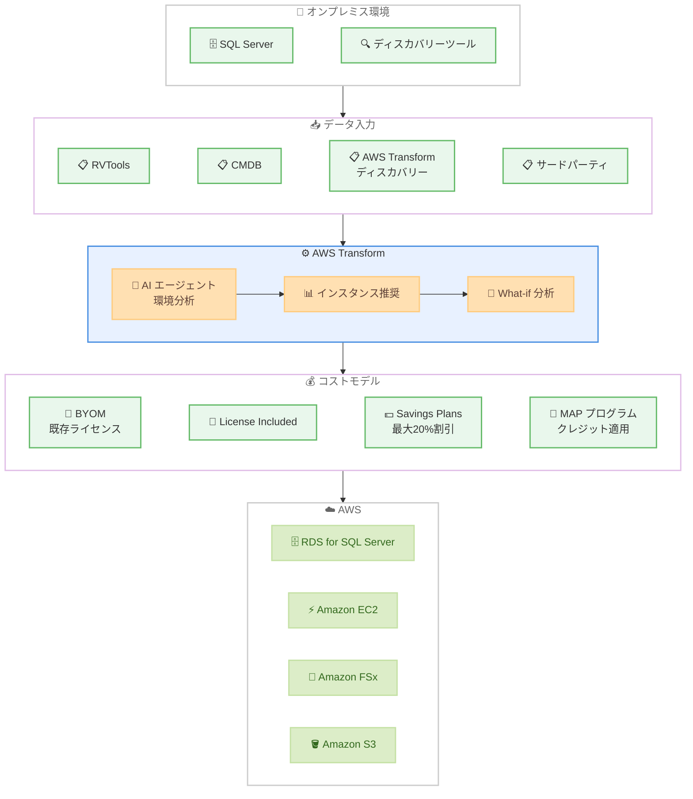

# Amazon RDS for SQL Server - AWS Transform での移行コスト評価機能

**リリース日**: 2026年6月8日
**サービス**: Amazon RDS for SQL Server / AWS Transform
**機能**: オンプレミス SQL Server から RDS for SQL Server への TCO 評価

📊 [このアップデートのインフォグラフィックを見る](https://takech9203.github.io/aws-news-summary/20260608-amazon-rds-sql-server-cost-assessment-aws-transform.html)

## 概要

Amazon RDS for SQL Server の移行コスト評価機能が AWS Transform で利用可能になった。この機能により、オンプレミスの SQL Server データベースを RDS for SQL Server に移行する際の総所有コスト (TCO) を AI エージェントを活用して見積もることができる。

AWS Transform は AI パワードエージェントを使用してオンプレミスの SQL Server 環境を分析し、ワークロード要件を満たしつつコストを削減する最適なデータベースインスタンスの推奨を提供する。さらに、AI を活用した What-if 分析により、異なるオプションの評価、コスト比較、最適な移行パスの選択が可能になる。

**アップデート前の課題**

- オンプレミス SQL Server から RDS for SQL Server への移行コストを正確に見積もるには、手動で複雑な計算が必要だった
- ワークロードに最適なインスタンスタイプの選定に専門知識と時間を要した
- ライセンスオプション (BYOM vs LI) の比較や Savings Plans 適用後のコスト試算が煩雑だった
- 複数の移行シナリオを比較検討する統合的なツールがなかった

**アップデート後の改善**

- AI エージェントが自動でオンプレミス環境を分析し、最適なインスタンス推奨を提供
- What-if 分析でリージョン、リソース使用率、料金条件を変更したシナリオを即座に比較可能
- Database Savings Plans や MAP プログラムの適用を含めた包括的なコスト最適化を提示
- RVTools、CMDB、AWS Transform ディスカバリーツールなど多様なデータ形式に対応

## アーキテクチャ図



オンプレミス SQL Server 環境のデータを AWS Transform に入力すると、AI エージェントが分析を行い、複数のコストモデルを比較した上で最適な移行先を推奨するフローを示している。

## サービスアップデートの詳細

### 主要機能

1. **AI パワード環境分析**
   - オンプレミス SQL Server 環境を自動で分析
   - ワークロード要件に基づいた最適なデータベースインスタンスの推奨
   - コスト削減を考慮したインスタンスサイジング

2. **What-if 分析**
   - 複数のコストモデルを同時に比較可能
   - カスタマイズ可能な前提条件: リージョン、リソース使用率、料金条件
   - 異なるシナリオの即時比較と最適解の選択

3. **多様なデータ入力形式のサポート**
   - RVTools エクスポート
   - 構成管理データベース (CMDB) エクスポート
   - AWS Transform ディスカバリーツールからのエクスポート
   - その他のサードパーティディスカバリーツール

4. **ライセンスオプション対応**
   - Bring Your Own Media (BYOM): 既存の SQL Server ライセンスを持ち込み
   - License Included (LI): ライセンス込みオプション

5. **コスト最適化機能**
   - Database Savings Plans: On-Demand 料金と比較して最大 20% の節約
   - AWS Migration Acceleration Program (MAP): 移行コストを相殺するクレジットとサポートの適格性評価

6. **他サービスとの統合評価**
   - Amazon EC2、Amazon FSx、Amazon S3、SQL Server on EC2、仮想デスクトップとの組み合わせ評価
   - クラウド価値提案の柱: スタッフ生産性、運用レジリエンス、ビジネスアジリティ、サステナビリティ

## 技術仕様

### サポートされるデータ形式

| データソース | 説明 |
|------|------|
| RVTools | VMware 環境のインベントリエクスポート |
| CMDB | 構成管理データベースからのエクスポート |
| AWS Transform ディスカバリーツール | AWS 提供のディスカバリーツール出力 |
| サードパーティツール | その他の検出ツールからのエクスポート |

### ライセンスモデル比較

| 項目 | BYOM | License Included |
|------|------|------|
| SQL Server ライセンス | 既存ライセンスを使用 | AWS が提供 |
| 適用シナリオ | Software Assurance 保有時 | 新規ライセンス不要な場合 |
| コスト構造 | インスタンス料金のみ | インスタンス + ライセンス料金 |

### What-if シナリオのカスタマイズ可能パラメータ

| パラメータ | 説明 |
|------|------|
| リージョン | デプロイ先の AWS リージョン |
| リソース使用率 | CPU、メモリ、ストレージの想定使用率 |
| 料金条件 | On-Demand、Savings Plans、リザーブドインスタンス |
| ライセンスモデル | BYOM または License Included |
| MAP 適用 | Migration Acceleration Program の適格性 |

### API 変更履歴

| 日付 | サービス | 変更内容 |
|------|----------|----------|
| 2026/06/08 | [Application Migration Service](https://awsapichanges.com/archive/changes/a09b61-mgn.html) | 4 updated api methods - AWS Transform ディスカバリーツールをネットワーク移行の入力ソースとしてサポート |

## 設定方法

### 前提条件

1. AWS アカウント
2. AWS Transform コンソールへのアクセス権限
3. オンプレミス SQL Server 環境のインベントリデータ (RVTools、CMDB 等)

### 手順

#### ステップ 1: AWS Transform コンソールにアクセス

AWS マネジメントコンソールにサインインし、AWS Transform コンソールを開く。左メニューから「Migration Assessment」を選択する。

#### ステップ 2: データのインポート

```
RVTools、CMDB、AWS Transform ディスカバリーツール、
またはサードパーティツールからエクスポートしたデータをアップロード
```

サポートされる形式のいずれかでオンプレミス SQL Server 環境のインベントリデータをインポートする。

#### ステップ 3: 評価の実行

AI エージェントがインポートされたデータを分析し、ワークロード要件に基づいた最適なインスタンス推奨を生成する。

#### ステップ 4: What-if シナリオの作成

リージョン、リソース使用率、料金条件などのパラメータを調整し、複数のコストモデルを比較する。BYOM と License Included の両方のオプションで評価を実施する。

#### ステップ 5: コスト最適化の確認

Database Savings Plans (最大 20% 割引) や MAP プログラムの適格性を含めた最適化提案を確認し、最終的な移行計画を決定する。

## メリット

### ビジネス面

- **移行判断の迅速化**: AI による自動分析で、従来数週間かかっていた TCO 評価を短期間で完了
- **コスト最適化の最大化**: Savings Plans や MAP プログラムを含めた包括的なコスト分析で、最大限の節約を実現
- **リスクの低減**: データに基づいた客観的な移行判断により、過小・過大なサイジングのリスクを最小化

### 技術面

- **多様なデータソース対応**: RVTools、CMDB 等の既存ツールのデータをそのまま活用可能
- **統合的な移行計画**: EC2、FSx、S3 等の他サービスとの組み合わせ評価が一元的に実施可能
- **柔軟なシナリオ比較**: What-if 分析で複数の移行パスを同時に評価し、最適解を選択

## デメリット・制約事項

### 制限事項

- AWS Transform が提供されているリージョンでのみ利用可能
- 評価の精度はインポートするデータの品質に依存
- AI による推奨は参考値であり、実際のワークロードでの検証が必要

### 考慮すべき点

- オンプレミス環境のデータ収集にはディスカバリーツールの事前セットアップが必要な場合がある
- 複雑なライセンス体系 (Enterprise Agreement 等) の場合、BYOM の適用可否について追加確認が必要
- TCO 評価にはネットワーク転送コストやデータ移行にかかる一時的なコストは含まれない可能性がある

## ユースケース

### ユースケース 1: 大規模 SQL Server 環境の一括移行計画

**シナリオ**: 数十台のオンプレミス SQL Server を保有する企業が、データセンター契約更新前にクラウド移行のコスト効果を評価したい。

**実装例**:
```
1. RVTools で全 SQL Server のインベントリを収集・エクスポート
2. AWS Transform にデータをインポート
3. AI エージェントによる分析で各サーバーの最適インスタンス推奨を取得
4. What-if 分析でリージョン別・Savings Plans 適用時のコストを比較
5. MAP プログラムの適格性を確認し、移行クレジットを考慮した最終コストを算出
```

**効果**: 手動計算では数週間かかる TCO 分析を AI が自動化し、データに基づいた移行判断を迅速に実施

### ユースケース 2: ライセンス最適化の検討

**シナリオ**: Software Assurance を保有する企業が、既存ライセンスの持ち込み (BYOM) と License Included のどちらが有利か判断したい。

**実装例**:
```
1. CMDB から SQL Server ライセンス情報とインスタンス情報をエクスポート
2. AWS Transform で BYOM シナリオと LI シナリオの両方を作成
3. 各シナリオに Savings Plans を適用したコストを比較
4. ライセンス更新時期を考慮した長期コストモデルを評価
```

**効果**: ライセンスコストを含めた総合的な比較により、3-5 年間で最もコスト効率の高いオプションを特定

### ユースケース 3: 段階的移行における優先順位付け

**シナリオ**: 移行を段階的に進めるため、コスト削減効果の高いワークロードから優先的に移行したい。

**実装例**:
```
1. AWS Transform ディスカバリーツールで全環境を自動検出
2. 各ワークロードの移行後コスト削減率を AI が算出
3. What-if 分析で移行順序ごとの累積節約額をシミュレーション
4. MAP プログラム適用による初期コスト軽減を加味して最終的な移行ロードマップを策定
```

**効果**: データドリブンな優先順位付けにより、移行の早い段階からコスト削減効果を実現

## 料金

AWS Transform のコスト評価機能自体の利用料金は公式発表では明示されていない。評価後に選択する RDS for SQL Server の料金体系は以下の通り。

### コスト最適化オプション

| オプション | 節約率 | 説明 |
|--------|--------|------|
| On-Demand | - | 従量課金、コミットメントなし |
| Database Savings Plans | 最大 20% | 1 年または 3 年のコミットメント |
| MAP プログラム | 追加クレジット | 移行コストを相殺するクレジットとサポート |

## 利用可能リージョン

AWS Transform が提供されている全リージョンで利用可能。具体的なリージョン一覧は [AWS Transform のリージョン対応ドキュメント](https://docs.aws.amazon.com/transform/latest/userguide/regions.html) を参照。

## 関連サービス・機能

- **AWS Transform**: クラウド移行のための TCO 評価とビジネスケース構築プラットフォーム
- **Amazon RDS for SQL Server**: フルマネージドの SQL Server データベースサービス
- **AWS Migration Acceleration Program (MAP)**: 移行を加速するためのクレジット・サポートプログラム
- **AWS Application Migration Service (MGN)**: サーバー移行の自動化サービス
- **Database Savings Plans**: データベースサービスの長期コミットメント割引
- **Amazon EC2**: SQL Server on EC2 としての移行先オプション
- **Amazon FSx**: ファイルストレージの移行先オプション

## 参考リンク

- 📊 [インフォグラフィック](https://takech9203.github.io/aws-news-summary/20260608-amazon-rds-sql-server-cost-assessment-aws-transform.html)
- [公式発表 (What's New)](https://aws.amazon.com/about-aws/whats-new/2026/06/amazon-rds-sql-server-cost-assessment-aws-transform/)
- [AWS Transform 入門ガイド](https://docs.aws.amazon.com/transform/latest/userguide/getting-started.html)
- [AWS Transform 移行評価ドキュメント](https://docs.aws.amazon.com/transform/latest/userguide/transform-app-assessments.html)
- [AWS Transform リージョン対応](https://docs.aws.amazon.com/transform/latest/userguide/regions.html)
- [AWS クラウドバリュープロポジション](https://aws.amazon.com/executive-insights/content/business-value-on-aws/)

## まとめ

Amazon RDS for SQL Server の AWS Transform でのコスト評価機能は、オンプレミス SQL Server の移行を検討する企業にとって強力なツールとなる。AI エージェントによる自動分析と What-if シナリオの比較機能により、データに基づいた迅速な移行判断が可能になった。SQL Server の移行を計画している組織は、まず AWS Transform コンソールにアクセスし、既存のインベントリデータ (RVTools や CMDB) をインポートして TCO 評価を開始することを推奨する。
