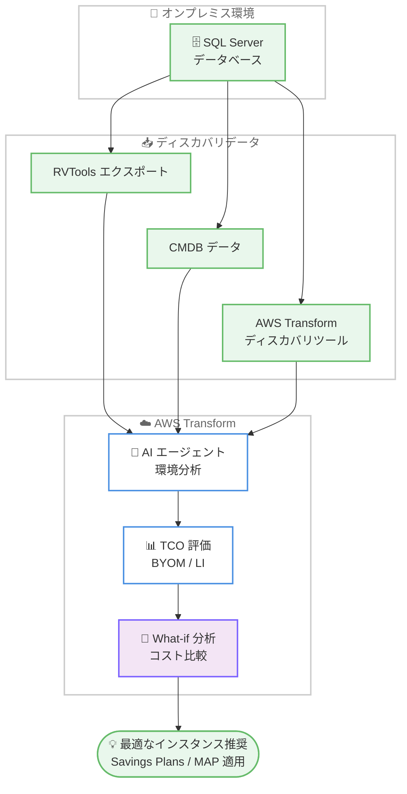

# Amazon RDS for SQL Server - AWS Transform での移行コスト評価機能

**リリース日**: 2026 年 6 月 8 日
**サービス**: Amazon RDS for SQL Server / AWS Transform
**機能**: AWS Transform での RDS for SQL Server 移行 TCO 評価

📊 [このアップデートのインフォグラフィックを見る](https://takech9203.github.io/aws-news-summary/20260608-amazon-rds-sql-server-cost-assessment-aws-transform.html)
<!-- INFOGRAPHIC_BASE_URL は環境変数から取得 -->

## 概要

Amazon RDS for SQL Server が AWS Transform 上で TCO (総所有コスト) 評価機能を提供開始しました。これにより、オンプレミスの SQL Server データベースを RDS for SQL Server へ移行する際のコストを事前に見積もれるようになりました。AWS Transform は AI 搭載エージェントを活用してオンプレミスの SQL Server 環境を分析し、ワークロード要件を満たしつつコストを削減する最適なデータベースインスタンスの推奨構成を提示します。

AI を活用した What-if 分析 (仮説検証) により、複数の選択肢を評価し、コストを比較して、移行に最適なオプションを選択できます。今回の評価機能は、既存の SQL Server ライセンスを活用できる BYOM (Bring Your Own Media) と、ライセンス込みの LI (License Included) の両方のオプションに対応しています。評価には、On-Demand 料金と比較して最大 20% の削減が可能な Database Savings Plans を使ったコスト最適化や、AWS Migration Acceleration Program (MAP) の対象判定が含まれます。

移行担当者やソリューションアーキテクトは、RVTools エクスポート、CMDB データ、AWS Transform ディスカバリツールのエクスポート、その他のサードパーティ製ディスカバリツールなど、手元にある任意のデータ形式から評価を開始できます。RDS for SQL Server は AWS Transform の既存の移行評価機能群に加わり、Amazon EC2、Amazon FSx、Amazon S3、EC2 上の SQL Server、仮想デスクトップのコストモデリングと組み合わせて What-if シナリオで検討できます。

**アップデート前の課題**

今回のアップデート以前、オンプレミスの SQL Server を RDS for SQL Server へ移行する際のコスト評価には以下のような課題がありました。

- 移行後のコストを見積もるために、インスタンスサイズやライセンス形態を手作業で見積もる必要があった
- BYOM と LI のどちらが有利か、ワークロードごとに比較検討する手段が限られていた
- Database Savings Plans や MAP による削減効果を移行計画に組み込んで定量的に評価することが難しかった
- データベースの移行コストと、EC2 や FSx など他のサービスのコストを 1 つのシナリオで統合的に比較できなかった

**アップデート後の改善**

今回のアップデートにより、以下が可能になりました。

- AI 搭載エージェントがオンプレミス環境を分析し、ワークロード要件に合った最適なインスタンスを自動推奨する
- BYOM と LI の両オプションを同一シナリオで比較し、最適なライセンス戦略を選択できる
- Database Savings Plans (最大 20% 削減) と MAP の対象判定を評価に組み込める
- RDS for SQL Server を EC2、FSx、S3、EC2 上の SQL Server、仮想デスクトップと組み合わせた What-if シナリオで統合的にコストを比較できる

## アーキテクチャ図



オンプレミスのディスカバリデータを AWS Transform に取り込み、AI エージェントが分析して TCO 評価と What-if 分析を行い、最適なインスタンス推奨を導き出す流れを示しています。

## サービスアップデートの詳細

### 主要機能

1. **AI 搭載による TCO 評価**
   - AI エージェントがオンプレミスの SQL Server 環境を分析する
   - ワークロード要件を満たしつつコストを削減する最適なデータベースインスタンスを推奨する
   - オンプレミスから RDS for SQL Server への移行コストを事前に見積もれる

2. **BYOM と LI の両ライセンスオプション対応**
   - BYOM (Bring Your Own Media): 既存の SQL Server ライセンスを持ち込んで活用できる
   - LI (License Included): SQL Server ライセンスを RDS の料金に含める形態
   - 両オプションのコストを比較し、最適なライセンス戦略を選択できる

3. **コスト最適化と移行支援プログラムの統合**
   - Database Savings Plans により On-Demand 料金と比較して最大 20% の削減が可能
   - AWS Migration Acceleration Program (MAP) の対象判定を含む
   - 移行コストを抑えるための定量的な評価を提供する

4. **AI を活用した What-if 分析**
   - リージョン、リソース使用率、料金条件などの前提条件をカスタマイズして複数のコストモデルを比較できる
   - RDS for SQL Server を EC2、FSx、S3、EC2 上の SQL Server、仮想デスクトップのコストモデリングと組み合わせられる
   - 移行に最適なオプションを根拠を持って選択できる

5. **柔軟なデータ入力**
   - RVTools エクスポート
   - CMDB データ
   - AWS Transform ディスカバリツールのエクスポート
   - その他のサードパーティ製ディスカバリツール

## 技術仕様

### ライセンスオプションの比較

| 項目 | BYOM (Bring Your Own Media) | LI (License Included) |
|------|------------------------------|------------------------|
| ライセンス | 既存の SQL Server ライセンスを持ち込み | RDS 料金にライセンスを含む |
| 適したケース | ライセンスモビリティ権を持つ既存ライセンス資産がある場合 | 新規にライセンスを調達したい場合 |
| 評価対応 | AWS Transform で評価対応 | AWS Transform で評価対応 |

### コスト最適化要素

| 項目 | 詳細 |
|------|------|
| Database Savings Plans | On-Demand 料金と比較して最大 20% の削減が可能 |
| MAP | AWS Migration Acceleration Program の対象判定。移行コストの相殺に向けたクレジットと支援 |
| What-if 分析 | リージョン、リソース使用率、料金条件をカスタマイズした複数モデルの比較 |

### 評価対象サービス (What-if シナリオでの組み合わせ)

| サービス | 対象 |
|----------|------|
| Amazon RDS for SQL Server | 今回追加 |
| Amazon EC2 | 既存対応 |
| Amazon FSx | 既存対応 |
| Amazon S3 | 既存対応 |
| SQL Server on EC2 | 既存対応 |
| Virtual Desktops (仮想デスクトップ) | 既存対応 |

## 設定方法

### 前提条件

1. AWS Transform を利用可能な AWS アカウントとアクセス権限
2. オンプレミス SQL Server 環境のディスカバリデータ (RVTools、CMDB、AWS Transform ディスカバリツール、サードパーティツールのいずれか)
3. 移行対象ワークロードの要件 (パフォーマンス、可用性など) の把握

### 手順

#### ステップ 1: AWS Transform コンソールにサインインする

AWS Transform コンソールにサインインし、[Migration Assessment] を選択します。移行評価ワークフローを開始する起点となります。

#### ステップ 2: ディスカバリデータを取り込む

手元のディスカバリデータ (RVTools エクスポート、CMDB データ、AWS Transform ディスカバリツールのエクスポートなど) を AWS Transform に取り込みます。AI エージェントがこのデータを基にオンプレミス環境を分析します。

#### ステップ 3: RDS for SQL Server 評価を実行し What-if 分析で比較する

RDS for SQL Server の評価を実行し、BYOM と LI のライセンスオプション、Database Savings Plans、MAP の対象判定を含む推奨構成を確認します。What-if 分析でリージョンやリソース使用率などの前提条件を変えながら複数のコストモデルを比較し、最適なオプションを選択します。必要に応じて EC2 や FSx など他サービスのコストモデルと組み合わせて統合的に評価します。

## メリット

### ビジネス面

- **移行コストの可視化**: 移行前に TCO を見積もることで、投資判断や予算策定の精度が向上する
- **ライセンス費用の最適化**: BYOM と LI を比較し、既存ライセンス資産を最大限に活用できる
- **削減効果の定量化**: Database Savings Plans (最大 20% 削減) と MAP を組み込み、コスト削減の根拠を提示できる

### 技術面

- **AI による最適化推奨**: ワークロード要件に合ったインスタンスを AI エージェントが自動で推奨する
- **統合的なシナリオ評価**: データベースだけでなく EC2、FSx、S3 などを含めた全体コストを 1 つのシナリオで評価できる
- **柔軟なデータ入力**: 既存のディスカバリツールの出力をそのまま活用でき、追加の準備作業が少ない

## デメリット・制約事項

### 制限事項

- AWS Transform が提供されているリージョンでのみ移行評価機能を利用できる
- 評価結果はディスカバリデータの精度に依存するため、入力データの品質が重要となる
- MAP の対象判定や Savings Plans の適用は条件に基づくため、実際の適用可否は別途確認が必要

### 考慮すべき点

- 評価結果はあくまで見積もりであり、実際の運用コストは移行後の利用状況により変動する
- BYOM を選択する場合、SQL Server ライセンスのライセンスモビリティ権など利用条件の確認が必要

## ユースケース

### ユースケース 1: オンプレミス SQL Server の RDS 移行コスト試算

**シナリオ**: データセンター撤退に伴い、オンプレミスで稼働する多数の SQL Server データベースを RDS for SQL Server へ移行したい。移行前に総コストと最適なインスタンス構成を把握したい。

**実装例**:
```
1. RVTools で既存環境をエクスポート
2. AWS Transform の Migration Assessment にデータを取り込む
3. RDS for SQL Server 評価で推奨インスタンスと TCO を確認
```

**効果**: 手作業の見積もりを排除し、AI による推奨構成と定量的な TCO に基づいて移行計画を策定できる

### ユースケース 2: BYOM と LI のライセンス戦略比較

**シナリオ**: 既存の SQL Server ライセンスを保有しているが、RDS 移行時に持ち込むべきか、ライセンス込みプランにすべきか判断したい。

**実装例**:
```
1. What-if シナリオで BYOM オプションのコストモデルを作成
2. 同じワークロードで LI オプションのコストモデルを作成
3. 両者を比較し、Database Savings Plans 適用後のコストを評価
```

**効果**: ライセンス資産を最大限に活用しつつ、最もコスト効率の高いライセンス形態を根拠を持って選択できる

### ユースケース 3: マルチサービス移行の統合コスト評価

**シナリオ**: SQL Server データベースだけでなく、アプリケーションサーバー (EC2)、ファイルストレージ (FSx)、オブジェクトストレージ (S3) を含めた Windows ワークロード全体を移行する際の総コストを把握したい。

**実装例**:
```
1. AWS Transform で RDS for SQL Server 評価を実行
2. 同一の What-if シナリオに EC2、FSx、S3 のコストモデルを追加
3. リージョンや利用率の前提条件を変えて複数案を比較
```

**効果**: ワークロード全体の移行コストを 1 つのシナリオで統合的に評価し、最適な構成を選択できる

## 料金

AWS Transform の移行評価機能の利用に関する料金は AWS Transform の料金体系に従います。評価で推奨される RDS for SQL Server のコストには、Database Savings Plans (On-Demand 料金と比較して最大 20% 削減) や MAP による移行コストの相殺が反映されます。詳細な料金は AWS Transform および Amazon RDS for SQL Server の料金ページを参照してください。

## 利用可能リージョン

AWS Transform の移行評価機能は、AWS Transform が提供されているすべての AWS リージョンで利用可能です。

## 関連サービス・機能

- **AWS Transform**: AI 搭載エージェントによる企業 IT 変革プラットフォーム。今回の RDS for SQL Server 評価機能の提供基盤
- **Amazon RDS for SQL Server**: 今回の評価対象となるマネージドリレーショナルデータベースサービス
- **AWS Migration Acceleration Program (MAP)**: 移行コストの相殺に向けたクレジットと支援を提供するプログラム
- **Database Savings Plans**: On-Demand 料金と比較して最大 20% の削減を提供するコスト最適化プラン

## 参考リンク

- 📊 [インフォグラフィック](https://takech9203.github.io/aws-news-summary/20260608-amazon-rds-sql-server-cost-assessment-aws-transform.html)
- [公式発表 (What's New)](https://aws.amazon.com/about-aws/whats-new/2026/06/amazon-rds-sql-server-cost-assessment-aws-transform/)
- [AWS Transform](https://aws.amazon.com/transform/)
- [Amazon RDS for SQL Server](https://aws.amazon.com/rds/sqlserver/)

## まとめ

今回のアップデートにより、オンプレミス SQL Server から RDS for SQL Server への移行コストを、AI 搭載エージェントを活用して事前に評価できるようになりました。BYOM と LI の比較、Database Savings Plans や MAP による削減効果の組み込み、他サービスを含む What-if 分析により、移行計画の精度が大きく向上します。SQL Server の移行を検討している場合は、AWS Transform コンソールの Migration Assessment から手元のディスカバリデータを使って評価を開始することを推奨します。
