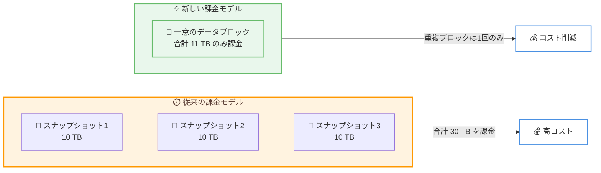

# Amazon Redshift - 手動スナップショットのコスト削減 (Serverless および RG インスタンス)

**リリース日**: 2026年6月8日
**サービス**: Amazon Redshift
**機能**: 手動スナップショットのインクリメンタル課金モデル

📊 [このアップデートのインフォグラフィックを見る](https://takech9203.github.io/aws-news-summary/20260608-amazon-redshift-incremental-manual-snapshots.html)
<!-- INFOGRAPHIC_BASE_URL は環境変数から取得 -->

## 概要

Amazon Redshift は、Amazon Redshift Serverless および Amazon Redshift RG インスタンスにおける手動スナップショットの新しい課金モデルを発表しました。この機能強化により、Amazon Redshift は手動スナップショットのストレージを、個々のスナップショットの合計サイズではなく、複数のスナップショット間で保存される一意のデータブロックに基づいて課金するようになりました。

従来、複数の手動スナップショットを保持する場合、各スナップショットの全体サイズに対して課金されていました。新しいモデルでは、スナップショット間で変更されていないデータブロックは 1 回のみカウントされ、重複して課金されることはありません。これにより、ディザスタリカバリ、テスト、長期保管を目的として複数の手動スナップショットを維持しているお客様は、ストレージコストの削減を実現できます。

この新しい課金モデルでは、コストを比例的に増加させることなく、より高い頻度で手動スナップショットを取得し、より優れた目標復旧時点 (RPO) を達成できます。新しい課金モデルは既存および新規の手動スナップショットの両方に自動的に適用されるため、お客様による設定変更は不要です。

**アップデート前の課題**

- スナップショットごとに、変更されていないデータも含めた全体サイズに対して課金されていた
- 複数の手動スナップショットを保持すると、同一データが重複して課金されストレージコストが増大していた
- コスト増を懸念して、スナップショットの取得頻度や保持期間を抑制する必要があった

**アップデート後の改善**

- 複数のスナップショット間で共通する一意のデータブロックに対してのみ課金されるようになった
- 複数のスナップショットを維持するお客様のストレージコストが削減された
- コストの比例的な増加を伴わずに、より頻繁なスナップショット取得と長期保持が可能になり、RPO を改善できるようになった

## アーキテクチャ図

10 TB のウェアハウスから 3 つのスナップショットを取得した場合、従来は合計 30 TB が課金対象でしたが、新モデルでは共通ブロックが重複排除され、一意のデータブロック (例: 11 TB) のみが課金対象となります。

## サービスアップデートの詳細

### 主要機能

1. **一意のデータブロック単位の課金**
   - 個々のスナップショットの合計サイズではなく、すべてのアクティブなスナップショット間で保存される一意のデータブロックに基づいて課金される
   - スナップショット間で変更されていないデータは 1 回のみカウントされる
   - 重複排除はアカウントレベルで Serverless と RG の両方に適用される

2. **既存および新規スナップショットへの自動適用**
   - 2026年6月8日より、既存の手動スナップショットは自動的に新しい課金モデルへ移行される
   - 新規に取得する手動スナップショットにも自動的に適用される
   - お客様による設定変更や移行作業は不要

3. **RPO の改善とコスト効率の両立**
   - 1 日あたり 5% のデータ変更がある場合、1 時間ごとのスナップショットでも追加される一意のデータは約 0.2% 程度にとどまる
   - コストの比例的な増加なしに、より頻繁なスナップショットの取得が可能
   - クロスリージョンへコピーしたスナップショットも一意のブロック単位で課金され、マルチリージョン冗長構成がより手頃になる

## 技術仕様

### 課金モデルの比較

| 項目 | 従来のモデル | 新しいモデル |
|------|--------------|--------------|
| 課金対象 | 各スナップショットの全体サイズの合計 | スナップショット間の一意のデータブロック |
| 重複データの扱い | スナップショットごとに重複課金 | 1 回のみカウント |
| 対象インスタンス | - | Amazon Redshift Serverless、RG インスタンス |
| 適用方法 | - | 既存・新規ともに自動適用 |
| 単価 | リージョンごとのスナップショット料金 | リージョンごとのスナップショット料金 (変更なし) |

### 適用範囲に関する補足

- 本課金モデルは **Amazon Redshift Serverless** および **Amazon Redshift RG** (Graviton ベースのプロビジョンド) インスタンスに適用される
- **RA3 インスタンス**は引き続き現行の階層型 S3 課金が適用される
- 自動スナップショットは従来どおり無料 (プロビジョンド: 最大 35 日、Serverless: 1 日)

## 設定方法

### 前提条件

1. Amazon Redshift Serverless または Amazon Redshift RG インスタンスを利用していること
2. 手動スナップショットを取得・保持していること
3. 課金状況を確認するための AWS Billing コンソールへのアクセス権限

### 手順

#### ステップ1: 自動適用の確認

新しい課金モデルは 2026年6月8日より既存および新規の手動スナップショットに自動的に適用されます。お客様による有効化や移行作業は不要です。

#### ステップ2: スナップショット使用状況の確認

AWS Billing コンソールでスナップショットのストレージ使用状況とコストを確認します。一意のデータブロックに基づく課金へ移行したことで、複数スナップショットを保持している場合のコストが削減されているかを確認できます。

#### ステップ3: スナップショット戦略の最適化

コスト効率が向上したことを活かし、スナップショットの取得頻度の引き上げや保持期間の延長を検討します。RA3 から RG への移行や、24 時間を超えるバックアップ保持のための Serverless の活用も評価できます。

## メリット

### ビジネス面

- **ストレージコストの削減**: 複数の手動スナップショットを保持するお客様は、重複データの排除によりコストを削減できる
- **設定不要の自動適用**: 既存・新規のスナップショットに自動的に適用されるため、移行コストや運用負荷が発生しない
- **DR コストの最適化**: クロスリージョンへコピーしたスナップショットも一意のブロック単位で課金され、マルチリージョン冗長構成のコストを抑えられる

### 技術面

- **RPO の改善**: コストの比例的な増加なしに、より頻繁なスナップショット取得が可能となり、復旧時点を細かく設定できる
- **長期保持の容易化**: コンプライアンス要件などで長期間スナップショットを保持する場合のコスト負担が軽減される
- **アカウントレベルの重複排除**: Serverless と RG の両方でアカウント単位の重複排除が適用される

## デメリット・制約事項

### 制限事項

- 本課金モデルは Amazon Redshift Serverless および RG インスタンスのみが対象であり、RA3 インスタンスは対象外
- 自動スナップショットの保持期間 (プロビジョンド: 最大 35 日、Serverless: 1 日) 自体に変更はない
- 単価そのものはリージョンごとの既存のスナップショット料金に基づくため、リージョンによって異なる

### 考慮すべき点

- データ変更率が高いワークロードでは、一意のデータブロックも増加するため削減効果は変動する
- 実際の課金額は保持しているスナップショット数、保持期間、データ変更率によって異なるため、Billing コンソールでの確認を推奨

## ユースケース

### ユースケース1: 頻繁なスナップショット取得による RPO 改善

**シナリオ**: 重要なデータウェアハウスに対し、より細かい復旧時点を確保するために 1 時間ごとのバックアップを取得したい。

**効果**: 1 日あたり 5% のデータ変更がある場合、各スナップショットで追加される一意のデータは約 0.2% にとどまるため、コストを大幅に増加させずに高頻度のバックアップを実現できる。

### ユースケース2: コンプライアンスのための長期保持

**シナリオ**: 規制要件により、10 TB のウェアハウスを 1 日 1 回スナップショットし、90 日間保持する必要がある。

**効果**: 1 日あたり 5% のデータ変更の場合、合計で約 14.5 TB の一意のデータブロックのみが課金対象となり、従来の全体サイズ課金と比べて長期保持コストを大幅に抑えられる。

### ユースケース3: クロスリージョン DR の最適化

**シナリオ**: ディザスタリカバリのため、手動スナップショットを別リージョンへコピーして冗長性を確保したい。

**効果**: コピー先のスナップショットも一意のブロック単位で課金されるため、マルチリージョン冗長構成をより低コストで運用できる。

## 料金

新しい課金モデルでは、手動スナップショットのストレージは、すべてのアクティブなスナップショット間で保存される一意のデータブロックに基づいて課金されます。単価はリージョンごとの既存のスナップショット料金が適用されます。自動スナップショットは引き続き無料です。

### 料金例

米国東部 (オハイオ) リージョンで、10 TB のワークグループに対して 1 日 1 回スナップショットを取得し、7 日間保持、1 日あたり 5% のデータ変更がある場合の概算です。

| 項目 | 月額料金 (概算) |
|------|------------------|
| アクティブデータ | $235.52 |
| 一意のスナップショットブロック (約 13 TB) | $306.18 |
| 合計 | $541.70 |

※料金は一例であり、リージョン、保持しているスナップショット数、保持期間、データ変更率によって異なります。最新の料金は公式の料金ページを参照してください。

## 利用可能リージョン

新しい手動スナップショットの課金モデルは、Amazon Redshift Serverless および Amazon Redshift RG インスタンスが利用可能なすべての AWS 商用リージョンおよび AWS GovCloud (US) リージョンで利用できます。

## 関連サービス・機能

- **Amazon Redshift Serverless**: プロビジョニング不要でデータウェアハウスを実行できるサーバーレス構成。本課金モデルの対象
- **Amazon Redshift RG インスタンス**: Graviton ベースのプロビジョンドインスタンス。RA3 と比較して 30% の割引やリザーブドインスタンス対応などと組み合わせ、より大きなコスト削減が見込める
- **Amazon Redshift スナップショット**: バックアップとリストアの中核機能。手動スナップショットと自動スナップショットを提供

## 参考リンク

- 📊 [インフォグラフィック](https://takech9203.github.io/aws-news-summary/20260608-amazon-redshift-incremental-manual-snapshots.html)
- [公式発表 (What's New)](https://aws.amazon.com/about-aws/whats-new/2026/06/amazon-redshift-incremental-manual-snapshots/)
- [AWS Blog](https://aws.amazon.com/blogs/big-data/unlock-cost-savings-with-incremental-snapshot-billing-for-amazon-redshift-serverless-and-amazon-redshift-rg/)
- [Amazon Redshift 料金ページ](https://aws.amazon.com/redshift/pricing/)

## まとめ

今回のアップデートにより、Amazon Redshift Serverless および RG インスタンスの手動スナップショットが一意のデータブロック単位で課金されるようになり、複数スナップショットを保持する際のコストが削減されます。設定変更は不要で既存・新規スナップショットに自動適用されるため、お客様は AWS Billing コンソールで使用状況を確認し、スナップショットの取得頻度の引き上げや保持期間の延長を検討することで、コストを抑えつつ RPO を改善することを推奨します。
