# Amazon Redshift - 手動スナップショットのインクリメンタル課金モデル

**リリース日**: 2026年6月8日
**サービス**: Amazon Redshift
**機能**: 手動スナップショットのインクリメンタル (増分) ストレージ課金

📊 [このアップデートのインフォグラフィックを見る](https://takech9203.github.io/aws-news-summary/20260608-amazon-redshift-incremental-manual-snapshots.html)

## 概要

Amazon Redshift は、Redshift Serverless および Redshift RG インスタンスにおける手動スナップショットの課金モデルを刷新した。従来はスナップショットごとに全体のサイズで課金されていたが、今回のアップデートにより、複数のスナップショット間で共有されるデータブロックは一度だけ課金される「インクリメンタル課金」方式に変更された。

この変更により、ディザスタリカバリ、テスト環境、長期保存のために複数の手動スナップショットを保持しているユーザーは、追加の操作なしにストレージコストの削減を享受できる。また、コスト増加を抑えながらより頻繁にスナップショットを取得できるようになり、RPO (Recovery Point Objective) の改善が可能になる。

**アップデート前の課題**

- 各手動スナップショットがそれぞれの合計サイズで個別に課金されていた
- スナップショット間で重複するデータブロックが二重、三重に課金されるため、複数スナップショット保持時のコストが高かった
- コストを抑えるためにスナップショットの取得頻度を制限せざるを得ず、RPO が大きくなりがちだった
- ディザスタリカバリや長期保存のための柔軟なスナップショット戦略が取りづらかった

**アップデート後の改善**

- スナップショット間で共有される重複データブロックは一度だけ課金される
- 複数の手動スナップショットを保持するコストが大幅に削減される
- より頻繁にスナップショットを取得しても比例的なコスト増加が発生しない
- 既存および新規の手動スナップショットに自動的に適用され、ユーザー側の操作は不要

## アーキテクチャ図

```mermaid
flowchart LR
    subgraph Before["❌ 従来の課金モデル"]
        direction TB
        S1B["📸 Snapshot A<br/>100GB"]
        S2B["📸 Snapshot B<br/>100GB"]
        S3B["📸 Snapshot C<br/>100GB"]
        BillB["💰 課金: 300GB"]
    end

    subgraph After["✅ 新しいインクリメンタル課金"]
        direction TB
        S1A["📸 Snapshot A<br/>100GB"]
        S2A["📸 Snapshot B<br/>+10GB 差分"]
        S3A["📸 Snapshot C<br/>+5GB 差分"]
        BillA["💰 課金: 115GB<br/>ユニークブロックのみ"]
    end

    Before -.->|"課金方式の変更"| After

    classDef before fill:#FFEBEE,stroke:#F44336,stroke-width:2px,color:#B71C1C
    classDef after fill:#E9F7EC,stroke:#66BB6A,stroke-width:2px,color:#1B5E20
    classDef bill fill:#FFF3E0,stroke:#FF9800,stroke-width:2px,color:#E65100
    classDef billGood fill:#E8F5E9,stroke:#4CAF50,stroke-width:2px,color:#1B5E20

    class S1B,S2B,S3B before
    class S1A,S2A,S3A after
    class BillB bill
    class BillA billGood
```



従来は各スナップショットの合計サイズがそのまま課金対象だったが、新しいモデルではスナップショット間で重複するデータブロックが重複排除され、ユニークなデータブロックのみが課金される。

## サービスアップデートの詳細

### 主要機能

1. **データブロックレベルの重複排除課金**
   - 複数の手動スナップショット間で同一のデータブロックは一度だけ課金される
   - スナップショットの増分データ (変更されたブロック) のみが追加課金の対象
   - ブロックレベルでの重複排除により、最大限のコスト効率を実現

2. **既存スナップショットへの自動適用**
   - 新規作成のスナップショットだけでなく、既存の手動スナップショットにも自動適用
   - ユーザー側でのオプトインや設定変更は不要
   - 即座にコスト削減効果が反映される

3. **Serverless と RG インスタンスの両方に対応**
   - Amazon Redshift Serverless の手動スナップショットに適用
   - Amazon Redshift RG (Graviton ベース) インスタンスの手動スナップショットに適用
   - 両方のデプロイメントモデルで同一の課金ロジック

## 技術仕様

### 課金モデルの比較

| 項目 | 従来モデル | 新モデル |
|------|-----------|---------|
| 課金単位 | スナップショットごとの合計サイズ | スナップショット全体のユニークデータブロック |
| 重複データの扱い | 各スナップショットで個別に課金 | 一度だけ課金 |
| 対象サービス | - | Redshift Serverless / RG インスタンス |
| 適用方法 | - | 自動 (操作不要) |
| 適用範囲 | - | 既存 + 新規スナップショット |

### スナップショットストレージ料金

| リージョン | 料金 |
|-----------|------|
| US East (Ohio) | $0.023/GB-月 |
| US East (N. Virginia) | $0.024/GB-月 |
| その他のリージョン | リージョンにより異なる |

### 対象外のインスタンスタイプ

| インスタンスタイプ | スナップショット課金方式 |
|-------------------|----------------------|
| RA3 | 標準 S3 料金でバックアップストレージとして課金 |
| DC/DS (旧世代) | プロビジョニングストレージ超過分を標準 S3 料金で課金 |

## 設定方法

### 前提条件

1. Amazon Redshift Serverless ワークグループ、または Redshift RG インスタンスが稼働していること
2. 手動スナップショットの作成権限があること

### 手順

#### ステップ 1: 現在のスナップショット使用状況の確認

```bash
# Redshift Serverless のスナップショット一覧を確認
aws redshift-serverless list-snapshots \
  --namespace-name my-namespace

# Provisioned クラスター (RG) のスナップショット一覧を確認
aws redshift describe-cluster-snapshots \
  --cluster-identifier my-cluster \
  --snapshot-type manual
```

現在保持している手動スナップショットの数とサイズを確認する。新しい課金モデルは自動適用されるため、追加の設定は不要。

#### ステップ 2: 手動スナップショットの作成 (Serverless)

```bash
# Serverless の手動スナップショットを作成
aws redshift-serverless create-snapshot \
  --namespace-name my-namespace \
  --snapshot-name my-manual-snapshot-$(date +%Y%m%d)
```

通常どおりスナップショットを作成する。インクリメンタル課金は自動的に適用される。

#### ステップ 3: コスト効果の確認

```bash
# AWS Cost Explorer でスナップショットストレージコストを確認
aws ce get-cost-and-usage \
  --time-period Start=2026-06-01,End=2026-06-30 \
  --granularity MONTHLY \
  --metrics "UnblendedCost" \
  --filter '{"Dimensions":{"Key":"SERVICE","Values":["Amazon Redshift"]}}'
```

AWS Cost Explorer を使用して、新しい課金モデル適用後のストレージコスト変化を確認する。

## メリット

### ビジネス面

- **ストレージコスト削減**: 複数の手動スナップショットを保持する場合、重複データの課金が排除されるため大幅なコスト削減が見込まれる
- **RPO の改善**: コスト増加を気にせずより頻繁にスナップショットを取得でき、データ損失リスクを最小化できる
- **運用の柔軟性向上**: ディザスタリカバリ、テスト、長期保存など、複数の目的で手動スナップショットを活用しやすくなる

### 技術面

- **ゼロオペレーション**: 既存スナップショットに自動適用されるため、移行作業やコード変更が不要
- **ブロックレベルの効率化**: データブロック単位での重複排除により、ストレージ利用効率が最大化される
- **柔軟なバックアップ戦略**: 時間帯別、日次、週次など複数の保持ポリシーを組み合わせたスナップショット戦略が低コストで実現可能

## デメリット・制約事項

### 制限事項

- RA3 インスタンスや旧世代 (DC/DS) のスナップショットには適用されない
- 自動スナップショットではなく手動スナップショットのみが対象
- コスト削減効果はスナップショット間のデータ変更量に依存するため、変更量が多い場合は効果が限定的

### 考慮すべき点

- スナップショット間のデータ変更率が高いワークロードでは、コスト削減効果が小さくなる可能性がある
- Cost Explorer でのコスト表示が従来と異なるため、コスト分析の基準を見直す必要がある場合がある
- RA3 インスタンスを使用している場合は本アップデートの恩恵を受けられないため、RG への移行を検討する際の考慮要素となる

## ユースケース

### ユースケース 1: ディザスタリカバリの強化

**シナリオ**: 金融機関がコンプライアンス要件に基づき、1 時間ごとの手動スナップショットを保持する必要がある。従来は 24 スナップショット/日 x 全データサイズで課金されていた。

**実装例**:
```bash
# 1 時間ごとにスナップショットを自動作成する EventBridge ルール + Lambda
aws events put-rule \
  --name "hourly-redshift-snapshot" \
  --schedule-expression "rate(1 hour)"
```

**効果**: 日次変更率が 5% のワークロードの場合、従来の 24 倍課金から約 1.2 倍程度の課金に削減される。RPO を 24 時間から 1 時間に短縮しつつコストを大幅に抑制できる。

### ユースケース 2: テスト環境の効率的な管理

**シナリオ**: 開発チームが本番データのスナップショットを複数保持し、各機能ブランチのテスト用にリストアしている。

**実装例**:
```bash
# 機能ブランチごとにスナップショットを作成
aws redshift-serverless create-snapshot \
  --namespace-name production \
  --snapshot-name "test-feature-auth-$(date +%Y%m%d)"

aws redshift-serverless create-snapshot \
  --namespace-name production \
  --snapshot-name "test-feature-billing-$(date +%Y%m%d)"
```

**効果**: 複数のテスト用スナップショットが実質的に差分のみの課金になるため、チームメンバー全員が独自のテスト環境を持てるようになる。

### ユースケース 3: 長期保存とコンプライアンス対応

**シナリオ**: 監査要件により月次のデータスナップショットを 7 年間保持する必要がある組織。

**実装例**:
```bash
# 月次スナップショットを作成しタグで保持期間を管理
aws redshift-serverless create-snapshot \
  --namespace-name analytics \
  --snapshot-name "monthly-archive-202606" \
  --tags Key=RetentionPolicy,Value=7years Key=Purpose,Value=compliance
```

**効果**: 84 か月分のスナップショットを保持する場合、テーブル構造やマスターデータなど変更の少ないデータブロックが重複排除されるため、従来比で大幅なコスト削減が可能。

## 料金

手動スナップショットのストレージ料金は、スナップショット全体で使用されるユニークデータブロックの合計サイズに基づいて計算される。

### 料金例

| シナリオ | 従来の課金 (概算) | 新モデルの課金 (概算) |
|---------|-------------------|---------------------|
| 100GB x 5 スナップショット (日次変更率 5%) | $11.50/月 (500GB x $0.023) | $2.76/月 (120GB x $0.023) |
| 1TB x 10 スナップショット (日次変更率 2%) | $235.52/月 (10TB x $0.023) | $27.85/月 (約 1.18TB x $0.023) |
| 500GB x 24 スナップショット (時間変更率 0.5%) | $276.48/月 (12TB x $0.023) | $14.95/月 (約 650GB x $0.023) |

※ 上記は US East (Ohio) リージョン ($0.023/GB-月) での概算。実際のコストはデータ変更パターンにより変動する。

## 利用可能リージョン

Amazon Redshift Serverless および Redshift RG インスタンスが利用可能なすべての AWS 商用リージョンおよび AWS GovCloud (US) リージョンで利用可能。

## 関連サービス・機能

- **Amazon Redshift Serverless**: サーバーレスデプロイメントモデルで、本アップデートの直接対象
- **Amazon Redshift RG インスタンス**: Graviton ベースのプロビジョニングモデルで、本アップデートの直接対象
- **AWS Backup**: Redshift のバックアップライフサイクル管理で使用可能
- **Amazon EventBridge**: スナップショット作成の自動化スケジューリングに活用可能
- **AWS Cost Explorer**: 新課金モデルのコスト効果をモニタリングするために使用

## 参考リンク

- 📊 [インフォグラフィック](https://takech9203.github.io/aws-news-summary/20260608-amazon-redshift-incremental-manual-snapshots.html)
- [公式発表 (What's New)](https://aws.amazon.com/about-aws/whats-new/2026/06/amazon-redshift-incremental-manual-snapshots/)
- [Amazon Redshift 料金ページ](https://aws.amazon.com/redshift/pricing/)
- [Amazon Redshift スナップショットドキュメント](https://docs.aws.amazon.com/redshift/latest/mgmt/working-with-snapshots.html)

## まとめ

Amazon Redshift の手動スナップショットにインクリメンタル課金モデルが導入されたことで、複数のスナップショットを保持するユーザーは即座にコスト削減の恩恵を受けられる。特に、ディザスタリカバリの強化や長期保存要件がある組織にとって、コストを気にせず RPO を改善できる点は大きな価値がある。既存スナップショットにも自動適用されるため、利用者は追加の操作なしに新しい課金モデルの恩恵を享受できる。
