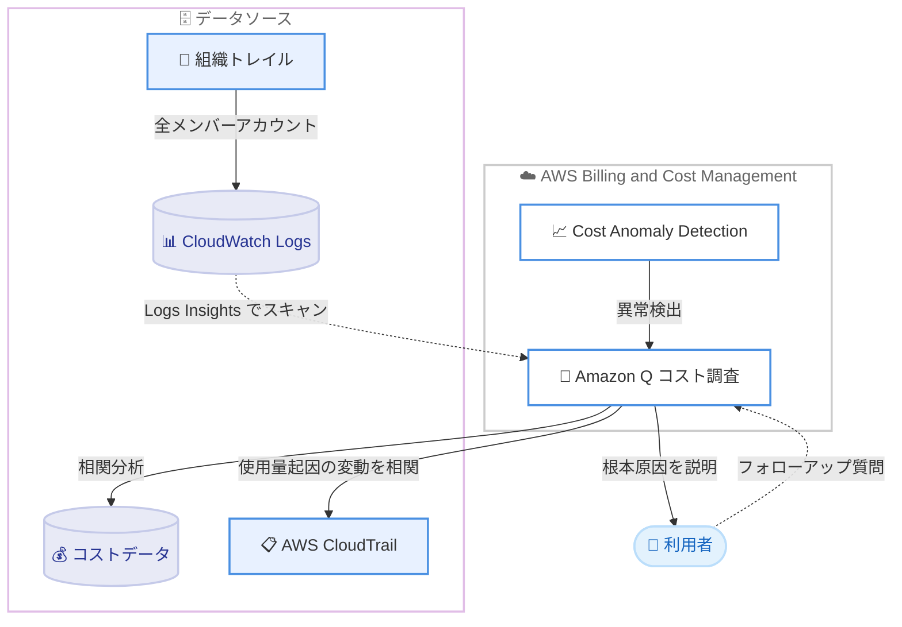

# AWS Cost Anomaly Detection - AI を活用したコスト調査機能

**リリース日**: 2026年6月8日
**サービス**: AWS Cost Anomaly Detection
**機能**: AI-Powered Cost Investigations (AI を活用したコスト調査)

📊 [このアップデートのインフォグラフィックを見る](https://takech9203.github.io/aws-news-summary/20260608-aws-ai-powered-cost-investigations.html)

## 概要

AWS Cost Anomaly Detection に、Amazon Q を活用してコスト異常の根本原因を分析する AI 駆動のコスト調査機能が追加されました。検出されたコスト異常に対して、Amazon Q がコストの変動要因を分析し、平易な言葉による説明を数分で提供します。

従来、コストの変動を調査するには、コストデータを AWS CloudTrail のイベントやリソースのアクティビティと相関付ける必要があり、この作業には数時間を要することが一般的でした。今回のコスト調査機能では、Amazon Q がこの相関付け作業を自動化し、コスト変動が使用量の増加によるもの (usage-driven) か、料金単価の変動によるもの (rate-driven) かを判定します。さらに、寄与しているサービス、アカウント、リージョンを特定し、使用量に起因する変動については CloudTrail と相関付けて、特定の API 呼び出しや IAM プリンシパルに変動を帰属させます。

この機能は本日よりすべての商用 AWS リージョンで追加料金なしで利用できます。コスト管理担当者や FinOps チーム、クラウド運用チームにとって、コスト異常の原因究明にかかる時間を大幅に短縮できる点が主要な価値です。

**アップデート前の課題**

- 以前はコスト異常の原因を特定するために、コストデータと CloudTrail イベント、リソースアクティビティを手動で相関付ける必要があった
- 以前はこの調査作業に数時間を要することが一般的で、原因特定までに時間がかかっていた
- 以前はコスト変動が使用量の増加によるものか料金単価の変動によるものかを、担当者が個別に分析する必要があった
- マルチアカウント環境では、各メンバーアカウントを横断した調査を手動で行う必要があった

**アップデート後の改善**

- 今回のアップデートにより、Amazon Q がコスト異常の根本原因を数分で平易な言葉で説明できるようになった
- 今回のアップデートにより、使用量起因か料金単価起因かの判定が自動化された
- 今回のアップデートにより、使用量起因の変動について特定の API 呼び出しと IAM プリンシパルへの帰属が自動化された
- CloudTrail の組織トレイルを利用している組織では、すべてのメンバーアカウントを横断した調査が自動的に実行されるようになった

## アーキテクチャ図



利用者がコスト異常の調査を開始すると、Amazon Q がコストデータと CloudTrail を相関分析し、根本原因を平易な言葉で説明します。組織トレイルがある場合は全メンバーアカウントを横断して分析が実行されます。

## サービスアップデートの詳細

### 主要機能

1. **使用量起因か料金単価起因かの自動判定**
   - Amazon Q がコストの変動が使用量の増加 (usage-driven) によるものか、料金単価の変動 (rate-driven) によるものかを自動的に判定する
   - 担当者が手動でコストデータを分解する必要がなくなる

2. **寄与要因の特定**
   - コスト変動に寄与しているサービス、アカウント、リージョンを特定する
   - どの要素が異常の主因なのかを素早く把握できる

3. **CloudTrail との相関付けによる帰属分析**
   - 使用量起因の変動について、AWS CloudTrail と相関付けを行う
   - 特定の API 呼び出しや IAM プリンシパルに変動を帰属させ、誰が何を実行したことが原因かを明らかにする

4. **組織トレイルによるクロスアカウント調査**
   - CloudTrail の組織トレイルを構成している組織では、すべてのメンバーアカウントを横断して調査が自動的に実行される
   - マルチアカウント環境での原因究明を一元化できる

5. **フォローアップ質問への対応**
   - 初回の分析結果に対して追加の質問を行い、パターンの深掘りや個別リソースの調査ができる
   - 対話的に原因を掘り下げられる

## 技術仕様

### 機能概要

| 項目 | 詳細 |
|------|------|
| 基盤 AI | Amazon Q |
| 分析対象 | AWS Cost Anomaly Detection が検出したコスト異常 |
| 変動分類 | 使用量起因 (usage-driven) / 料金単価起因 (rate-driven) |
| 相関データソース | コストデータ、AWS CloudTrail イベント |
| クロスアカウント対応 | CloudTrail 組織トレイル利用時に自動 |
| 出力形式 | 平易な言葉による根本原因の説明 |
| 所要時間 | 数分 (従来は数時間) |

### 前提となるデータソース

使用量起因の変動を API 呼び出しや IAM プリンシパルへ帰属させるには、AWS CloudTrail のイベントが必要です。クロスアカウント調査には、組織全体の CloudTrail トレイルが構成されていることが前提となります。

## 設定方法

### 前提条件

1. AWS Billing and Cost Management の AWS Cost Anomaly Detection を有効化していること
2. 使用量起因の変動を詳細に分析する場合は、AWS CloudTrail のイベントが記録されていること
3. クロスアカウント調査を行う場合は、組織全体の CloudTrail トレイルが構成されていること

### 手順

#### ステップ1: AWS Cost Anomaly Detection を開く

AWS Billing and Cost Management コンソールで AWS Cost Anomaly Detection の画面を開き、検出されたコスト異常の一覧を確認します。

#### ステップ2: 異常を調査する

調査したいコスト異常に対して、[Investigate with Amazon Q] (Amazon Q で調査) を選択します。Amazon Q がコストデータと CloudTrail を相関分析し、根本原因の説明を生成します。

#### ステップ3: 結果の確認とフォローアップ

Amazon Q が提示した使用量起因/料金単価起因の判定、寄与しているサービス・アカウント・リージョン、関連する API 呼び出しと IAM プリンシパルを確認します。必要に応じてフォローアップの質問を行い、パターンや個別リソースを深掘りします。

## メリット

### ビジネス面

- **調査時間の短縮**: 従来数時間かかっていたコスト異常の原因究明が数分に短縮され、対応の迅速化につながる
- **専門知識への依存軽減**: 平易な言葉で根本原因が説明されるため、コスト分析の専門知識が浅い担当者でも原因を把握しやすい
- **追加料金なし**: 機能自体は追加料金なしで利用できるため、コスト管理の高度化を低コストで実現できる

### 技術面

- **自動相関分析**: コストデータと CloudTrail イベントの相関付けが自動化され、手動作業が不要になる
- **責任の明確化**: 特定の API 呼び出しと IAM プリンシパルへの帰属により、変動の原因となった操作を特定できる
- **マルチアカウント対応**: 組織トレイル利用時にすべてのメンバーアカウントを横断して自動調査が行われる

## デメリット・制約事項

### 制限事項

- 利用可能なのはすべての商用 AWS リージョンであり、AWS GovCloud (US) や中国リージョンについては明記されていない
- 使用量起因の変動を API 呼び出しや IAM プリンシパルへ帰属させるには CloudTrail のイベントが必要となる
- クロスアカウント調査には組織全体の CloudTrail トレイルの構成が前提となる

### 考慮すべき点

- Amazon CloudWatch Logs に配信される組織全体の CloudTrail トレイルを使用したクロスアカウント調査では、スキャンされるデータ量に応じて標準の CloudWatch Logs Insights 料金が発生する可能性がある
- AI による分析結果は調査の出発点として活用し、重要な意思決定では内容を確認することが望ましい

## ユースケース

### ユースケース1: 突発的なコスト急増の原因特定

**シナリオ**: ある日、特定アカウントの EC2 コストが急増したとアラートが上がったが、原因が分からない。

**実装例**:
```
1. Cost Anomaly Detection で該当の異常を選択
2. [Investigate with Amazon Q] を実行
3. Amazon Q が「使用量起因」と判定し、特定の IAM ロールによる RunInstances 呼び出しが急増したことを提示
```

**効果**: どの操作とプリンシパルが原因かを数分で特定でき、是正アクションを素早く実行できる。

### ユースケース2: マルチアカウント環境での横断調査

**シナリオ**: 複数のメンバーアカウントを持つ組織で、組織全体のコスト異常を一括で調査したい。

**実装例**:
```
1. 組織全体の CloudTrail トレイルを構成
2. 検出された異常を Amazon Q で調査
3. 全メンバーアカウントを横断して寄与アカウントと API 呼び出しを特定
```

**効果**: アカウントごとに個別調査する手間を省き、組織全体の原因を一元的に把握できる。

### ユースケース3: 料金単価変動の切り分け

**シナリオ**: コストが増加したが、使用量の増加なのか割引適用の変化なのかを切り分けたい。

**実装例**:
```
1. 該当の異常を Amazon Q で調査
2. 「料金単価起因 (rate-driven)」との判定結果を確認
3. Savings Plans やリザーブドインスタンスのカバレッジ変化を追加質問で深掘り
```

**効果**: 使用量と料金単価のどちらが原因かを明確に切り分け、適切な対策につなげられる。

## 料金

AI を活用したコスト調査機能自体は、すべての商用 AWS リージョンで追加料金なしで利用できます。

ただし、Amazon CloudWatch Logs に配信される組織全体の CloudTrail トレイルを使用したクロスアカウント調査では、スキャンされたデータ量に基づく標準の CloudWatch Logs Insights 料金が発生する可能性があります。

### 料金例

| 使用量 | 月額料金 (概算) |
|--------|------------------|
| 機能自体の利用 | 追加料金なし |
| 組織トレイルを使ったクロスアカウント調査 (CloudWatch Logs 経由) | スキャンしたデータ量に応じた標準の CloudWatch Logs Insights 料金 |

## 利用可能リージョン

すべての商用 AWS リージョンで本日 (2026年6月8日) より利用可能です。

## 関連サービス・機能

- **Amazon Q**: コスト異常の根本原因分析を担う基盤 AI
- **AWS Cost Anomaly Detection**: コスト異常を検出する基盤サービスで、本機能の起点となる
- **AWS CloudTrail**: 使用量起因の変動を特定の API 呼び出しと IAM プリンシパルへ帰属させるためのイベントソース
- **Amazon CloudWatch Logs**: 組織トレイルの配信先で、クロスアカウント調査時に Logs Insights によるスキャンが行われる

## 参考リンク

- 📊 [インフォグラフィック](https://takech9203.github.io/aws-news-summary/20260608-aws-ai-powered-cost-investigations.html)
- [公式発表 (What's New)](https://aws.amazon.com/about-aws/whats-new/2026/06/aws-ai-powered-cost-investigations/)
- [AWS Cost Anomaly Detection ドキュメント](https://docs.aws.amazon.com/cost-management/latest/userguide/getting-started-ad.html)

## まとめ

AI を活用したコスト調査機能は、コスト異常の根本原因究明という従来数時間かかっていた作業を数分に短縮する、FinOps やコスト管理担当者にとって大きな価値のあるアップデートです。すべての商用リージョンで追加料金なしで利用できるため、まずは検出済みの異常に対して [Investigate with Amazon Q] を試し、組織トレイルの構成によるクロスアカウント調査の活用を検討することを推奨します。
