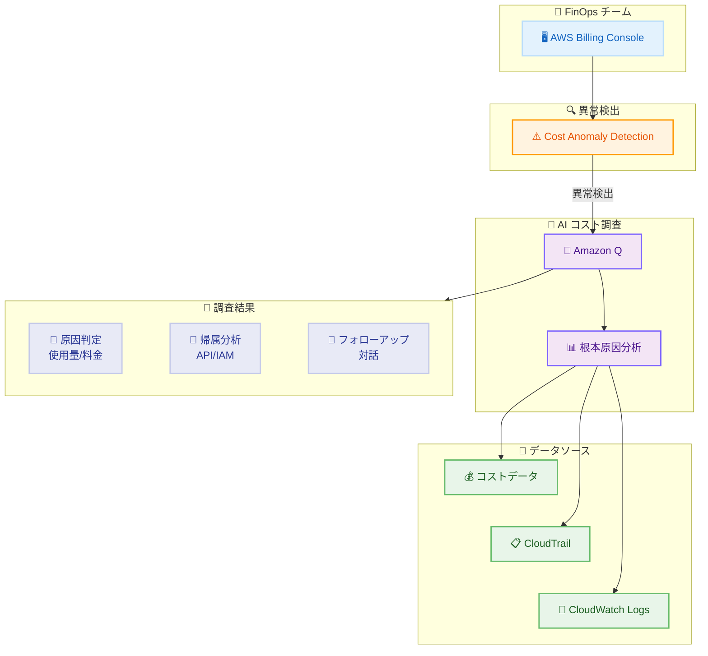

# AWS Cost Anomaly Detection - AI を活用したコスト調査機能

**リリース日**: 2026年6月8日
**サービス**: AWS Cost Anomaly Detection
**機能**: AI-Powered Cost Investigations

📊 [このアップデートのインフォグラフィックを見る](https://takech9203.github.io/aws-news-summary/20260608-aws-ai-powered-cost-investigations.html)

## 概要

AWS Cost Anomaly Detection に Amazon Q を活用した AI コスト調査機能が追加された。検出されたコスト異常の根本原因を AI が自動分析し、自然言語で分かりやすい説明を数分以内に提供する。これにより、FinOps 担当者やエンジニアリングチームがアラートから具体的なアクションへ迅速に移行できるようになった。

従来、コスト変動の原因調査には AWS CloudTrail イベントやリソースアクティビティとコストデータの相関分析が必要であり、数時間を要していた。本機能により、この調査プロセスが数分に短縮される。AWS Organizations の CloudTrail 組織証跡を設定している場合は、全メンバーアカウントにまたがる調査が自動的に実行される。

**アップデート前の課題**

- コスト異常の根本原因調査に CloudTrail イベントとコストデータの手動相関分析が必要で、数時間かかっていた
- 使用量起因か料金変更起因かの判別に複数のコンソール画面を行き来する必要があった
- マルチアカウント環境では各アカウントの CloudTrail ログを個別に確認する手間が発生していた
- コスト変動を特定の API コールや IAM プリンシパルに帰属させる分析には専門知識が必要だった

**アップデート後の改善**

- Amazon Q がコスト異常の根本原因を自動分析し、自然言語で数分以内に説明を提供
- 使用量起因 (usage-driven) か料金起因 (rate-driven) かを自動判別
- 組織証跡を活用したクロスアカウント調査が自動的に全メンバーアカウントに対して実行
- フォローアップ質問による対話的な深掘り分析が可能に

## アーキテクチャ図



Amazon Q がコスト異常検出のアラートを受け取り、コストデータ・CloudTrail・CloudWatch Logs を相関分析して根本原因を特定し、自然言語で結果を提供する。

## サービスアップデートの詳細

### 主要機能

1. **コスト変動の種別判定**
   - 使用量起因 (usage-driven): API コールの増加やリソースのスケールアップが原因
   - 料金起因 (rate-driven): 料金プランの変更や Savings Plans の期限切れが原因
   - 判定結果に基づいて適切な分析アプローチを自動選択

2. **貢献要因の特定**
   - 異常に寄与しているサービス、アカウント、リージョンを自動識別
   - 各要因のコスト影響度を定量的に提示
   - マルチアカウント環境でも組織全体を横断的に分析

3. **CloudTrail 相関分析**
   - 使用量起因の変動に対して CloudTrail イベントと自動相関
   - 特定の API コールへの帰属を実現
   - コスト変動を引き起こした IAM プリンシパルを特定

4. **対話型フォローアップ**
   - 調査結果に対してフォローアップ質問を投げかけることが可能
   - パターンの探索や特定リソースへの深掘りに対応
   - 自然言語でのやり取りにより技術的背景がなくても利用可能

## 技術仕様

### 分析の仕組み

| 項目 | 詳細 |
|------|------|
| 分析エンジン | Amazon Q |
| 対応する異常タイプ | 使用量起因、料金起因 |
| データソース | コストデータ、CloudTrail、CloudWatch Logs |
| クロスアカウント対応 | 組織証跡で自動対応 |
| 応答時間 | 数分以内 |
| 対話機能 | フォローアップ質問対応 |

### 前提条件

| 条件 | 詳細 |
|------|------|
| Cost Anomaly Detection | 有効化済みであること |
| CloudTrail | 使用量起因分析には有効な証跡が必要 |
| 組織証跡 | クロスアカウント分析には Organization Trail が必要 |
| CloudWatch Logs | 組織証跡のログ配信先として設定 |

### API 変更履歴

| 日付 | サービス | 変更内容 |
|------|----------|----------|
| 2026/06/03 | [AWS Cost Explorer Service](https://awsapichanges.com/archive/changes/d1b776-ce.html) | 3 updated methods - Savings Plans 購入分析にターゲットカバレッジベースの分析タイプを追加 |

## 設定方法

### 前提条件

1. AWS Cost Anomaly Detection が有効化されていること
2. AWS CloudTrail の証跡が有効であること
3. クロスアカウント調査には AWS Organizations の組織証跡を CloudWatch Logs に配信する設定が必要

### 手順

#### ステップ 1: Cost Anomaly Detection でアラートを確認

AWS Billing and Cost Management コンソールにアクセスし、Cost Anomaly Detection の画面で検出された異常を確認する。

#### ステップ 2: Amazon Q による調査を開始

検出された異常に対して「Investigate with Amazon Q」を選択する。Amazon Q がコストデータと CloudTrail イベントの相関分析を自動的に開始する。

#### ステップ 3: 調査結果の確認とフォローアップ

数分以内に自然言語による根本原因の説明が表示される。必要に応じてフォローアップ質問を行い、詳細なパターンや特定リソースについて深掘りする。

## メリット

### ビジネス面

- **調査時間の大幅短縮**: 数時間かかっていた根本原因分析が数分に短縮され、迅速な意思決定が可能に
- **追加コスト不要**: 全商用リージョンで追加料金なしで利用可能
- **FinOps の効率化**: アラートからアクションまでの時間を削減し、コスト最適化サイクルを加速

### 技術面

- **自動クロスアカウント分析**: 組織証跡を活用した全メンバーアカウントの横断調査が自動化
- **API コール/IAM プリンシパルの特定**: コスト変動を具体的な操作者・操作に帰属可能
- **対話型インターフェース**: フォローアップ質問により、追加のスクリプト作成や手動分析が不要

## デメリット・制約事項

### 制限事項

- 使用量起因の分析には有効な CloudTrail 証跡が必要
- クロスアカウント調査には組織証跡の CloudWatch Logs への配信設定が必須
- 料金起因の変動に対しては CloudTrail 相関分析は実施されない

### 考慮すべき点

- クロスアカウント調査時に CloudWatch Logs Insights のスキャン料金が発生する可能性がある
- 分析精度は CloudTrail ログの保持期間と配信設定に依存する
- Amazon Q との対話は英語が主要言語として想定される

## ユースケース

### ユースケース 1: 予期しない EC2 コスト増加の調査

**シナリオ**: 月次コストレポートで EC2 の費用が前月比 40% 増加したアラートを受信した。

**実装例**:
```
1. Cost Anomaly Detection で該当アラートを選択
2. "Investigate with Amazon Q" をクリック
3. Amazon Q の分析結果を確認:
   - 原因: usage-driven
   - 寄与サービス: EC2 (us-east-1)
   - 帰属: auto-scaling-role による RunInstances API コール増加
   - 原因: Auto Scaling グループの設定変更による最大インスタンス数の増加
```

**効果**: 従来は CloudTrail ログを手動検索して特定に数時間を要していた原因が、数分で特定される。

### ユースケース 2: マルチアカウント環境での異常コスト特定

**シナリオ**: 組織の合計コストが急増し、どのメンバーアカウントが原因か不明な状態。

**実装例**:
```
1. 管理アカウントの Cost Anomaly Detection で組織レベルの異常を確認
2. Amazon Q で調査を開始
3. 分析結果:
   - 原因アカウント: 開発チーム A のアカウント (123456789012)
   - 寄与サービス: Amazon Bedrock
   - 帰属: 新しい IAM ロールによる InvokeModel API の大量呼び出し
4. フォローアップ: "この変動はいつから始まりましたか?" と質問
5. 回答: "6月3日 14:00 UTC から開始、デプロイメントパイプラインの実行と一致"
```

**効果**: 組織全体の可視性を維持しながら、具体的なアカウント・ユーザー・タイミングまで迅速に特定できる。

### ユースケース 3: 料金変更起因のコスト増加調査

**シナリオ**: S3 のコストが増加したが、使用パターンに変化がない。

**実装例**:
```
1. Cost Anomaly Detection のアラートから Amazon Q で調査
2. 分析結果:
   - 原因: rate-driven
   - 詳細: Savings Plans の期限切れによりオンデマンド料金が適用
   - 影響リージョン: ap-northeast-1
3. フォローアップ: "推奨されるアクションはありますか?"
4. 回答: Savings Plans の再購入または新規購入を推奨
```

**効果**: 料金起因と使用量起因を即座に判別でき、適切な対応策を迅速に決定できる。

## 料金

AI を活用したコスト調査機能自体は追加料金なしで利用可能。

### 追加コストが発生するケース

| ケース | 料金 |
|--------|------|
| AI コスト調査機能の利用 | 無料 |
| クロスアカウント調査 (組織証跡 + CloudWatch Logs) | CloudWatch Logs Insights の標準料金 (スキャンデータ量に基づく) |

**CloudWatch Logs Insights の参考料金**: スキャンされたデータ 1 GB あたり $0.0076 (東京リージョン)

## 利用可能リージョン

全ての商用 AWS リージョンで利用可能。

## 関連サービス・機能

- **AWS Cost Anomaly Detection**: コスト異常の自動検出を行う基盤サービス
- **Amazon Q**: AI による分析と自然言語対話を提供する基盤エンジン
- **AWS CloudTrail**: API コールの記録と IAM プリンシパルの追跡に使用
- **Amazon CloudWatch Logs Insights**: クロスアカウント調査時のログクエリに使用
- **AWS Organizations**: 組織証跡によるマルチアカウント一括調査の基盤

## 参考リンク

- 📊 [インフォグラフィック](https://takech9203.github.io/aws-news-summary/20260608-aws-ai-powered-cost-investigations.html)
- [公式発表 (What's New)](https://aws.amazon.com/about-aws/whats-new/2026/06/aws-ai-powered-cost-investigations/)
- [ドキュメント - Investigating anomaly root causes with Amazon Q](https://docs.aws.amazon.com/cost-management/latest/userguide/ce-anomaly-investigation.html)
- [AWS Cost Anomaly Detection](https://aws.amazon.com/aws-cost-management/aws-cost-anomaly-detection/)
- [料金ページ - CloudWatch](https://aws.amazon.com/cloudwatch/pricing/)

## まとめ

AWS Cost Anomaly Detection の AI コスト調査機能は、コスト異常の根本原因分析を数時間から数分に短縮する画期的なアップデートである。追加料金なしで全商用リージョンから利用可能であり、特にマルチアカウント環境を運用する組織にとって FinOps ワークフローの大幅な効率化が期待できる。Cost Anomaly Detection を既に利用している組織は、CloudTrail 組織証跡の設定を確認し、本機能を活用したコスト調査プロセスの迅速化を検討すべきである。
