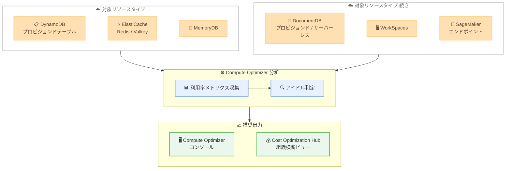

# AWS Compute Optimizer - 6 つの追加リソースタイプに対するアイドルリソース推奨の提供開始

**リリース日**: 2026 年 6 月 8 日
**サービス**: AWS Compute Optimizer
**機能**: アイドルリソース推奨の対象リソースタイプ拡大

📊 [このアップデートのインフォグラフィックを見る](https://takech9203.github.io/aws-news-summary/20260608-aws-compute-optimizer-six-new-idle.html)

## 概要

AWS Compute Optimizer が、新たに 6 つのリソースタイプに対してアイドルリソースの推奨機能をサポートした。対象となるのは、Amazon DynamoDB (プロビジョンドテーブル)、Amazon ElastiCache (Redis および Valkey)、Amazon MemoryDB、Amazon DocumentDB (プロビジョンドおよびサーバーレス)、Amazon WorkSpaces、Amazon SageMaker エンドポイントである。

この機能拡張により、AWS 環境全体でより多くの未使用リソースを検出し、潜在的なコスト削減機会を特定できるようになる。Compute Optimizer は利用率メトリクスを分析してリソースがアイドル状態かどうかを判定し、コンソール上で詳細な利用率メトリクスと推定削減額を含む推奨事項を表示する。

**アップデート前の課題**

- Compute Optimizer のアイドルリソース推奨は、EC2 インスタンス、Auto Scaling グループ、EBS ボリューム、ECS サービス、RDS インスタンス、NAT ゲートウェイなど限られたリソースタイプのみが対象だった
- DynamoDB、ElastiCache、MemoryDB、DocumentDB、WorkSpaces、SageMaker エンドポイントについては、アイドル状態の検出を手動で行う必要があった
- 組織全体で使用されていないリソースを横断的に把握するには、個別のサービスごとにメトリクスを確認する手間がかかっていた

**アップデート後の改善**

- 6 つの新しいリソースタイプに対して自動的にアイドルリソースを検出できるようになった
- 各リソースタイプに応じたサービス固有のシグナル (消費キャパシティ、キャッシュヒット、アクティブ接続、CPU 使用率など) を評価して正確にアイドル判定を行う
- Cost Optimization Hub を通じて組織内の全 AWS アカウントのアイドルリソース推奨を一元的に確認でき、他の推奨との重複排除された推定削減額を把握できる

## アーキテクチャ図



Compute Optimizer が 6 つの新しいリソースタイプからメトリクスを収集し、アイドル判定を行った上で、コンソールおよび Cost Optimization Hub に推奨を表示するフローを示している。

## サービスアップデートの詳細

### 主要機能

1. **6 つの新規対象リソースタイプ**
   - Amazon DynamoDB プロビジョンドテーブル: 消費読み取り/書き込みキャパシティユニットを評価
   - Amazon ElastiCache (Redis および Valkey): キャッシュヒット、Get/Set コマンド、接続数、ElastiCache Processing Units を評価
   - Amazon MemoryDB: キースペースヒット/ミス、新規接続数、エンジン CPU 使用率を評価
   - Amazon DocumentDB (プロビジョンドおよびサーバーレス): データベース接続数、エンジン CPU 使用率を評価
   - Amazon WorkSpaces: UserConnected メトリクスを評価
   - Amazon SageMaker エンドポイント: Invocations メトリクスを評価

2. **カスタマイズ可能なルックバック期間**
   - ワークロードの特性に応じてルックバック期間を設定可能
   - 季節性のあるワークロードやバッチ処理など、利用パターンに合わせた判定が可能

3. **Cost Optimization Hub との統合**
   - 組織内の全 AWS アカウントのアイドルリソース推奨を横断的に確認
   - 同一リソースに対する他の推奨との重複排除による正確な推定削減額の提供

## 技術仕様

### リソースタイプ別の評価メトリクス

| リソースタイプ | 主な評価メトリクス |
|------|------|
| DynamoDB プロビジョンドテーブル | ConsumedReadCapacityUnits, ConsumedWriteCapacityUnits, ConsumedChangeDataCaptureUnits |
| ElastiCache (Redis/Valkey) | CacheHits, CacheMisses, GetTypeCmds, SetTypeCmds, CurrConnections, ElastiCacheProcessingUnits |
| MemoryDB | KeyspaceHits, KeyspaceMisses, NewConnections, EngineCPUUtilization |
| DocumentDB | DatabaseConnections, EngineCPUUtilization |
| WorkSpaces | UserConnected, IsIdle |
| SageMaker エンドポイント | Invocations |

### API 変更履歴

| 日付 | サービス | 変更内容 |
|------|----------|----------|
| 2026/06/08 | [compute-optimizer](https://awsapichanges.com/archive/changes/a09b61-compute-optimizer.html) | 4 updated api methods - アイドル推奨の新規リソースタイプ追加 |

### 更新された API メソッド

以下の 4 つの API メソッドが更新され、新しいリソースタイプとメトリクスをサポートするようになった。

1. **ExportIdleRecommendations**
   - `fieldsToExport` に新しいメトリクスフィールドが追加 (CacheHitsSum, CacheMissesSum, ConsumedReadCapacityUnitsSum, ConsumedWriteCapacityUnitsSum, CurrConnectionsSum, DatabaseConnectionsSum, ElastiCacheProcessingUnitsSum, EngineCPUUtilizationMaximum, GetTypeCmdsSum, InvocationsSum, IsIdleMinimum, KeyspaceHitsSum, KeyspaceMissesSum, NewConnectionsSum, SetTypeCmdsSum, UserConnectedSum)

2. **GetIdleRecommendations**
   - `resourceType` フィルタに新しいタイプ (DynamoDBTable, ElastiCacheCluster, MemoryDBCluster, DocumentDBCluster, WorkSpaces, SageMakerEndpoint) を追加
   - `utilizationMetrics` に dimensions フィールドおよび新しいメトリクス名を追加

3. **GetEC2InstanceRecommendations**
   - `recommendationSourceType` に新しいリソースタイプを追加

4. **GetRecommendationSummaries**
   - `recommendationResourceType` に新しいリソースタイプを追加

### IAM ポリシー

Compute Optimizer のアイドルリソース推奨を利用するには、以下の権限が必要である。

```json
{
  "Version": "2012-10-17",
  "Statement": [
    {
      "Effect": "Allow",
      "Action": [
        "compute-optimizer:GetIdleRecommendations",
        "compute-optimizer:ExportIdleRecommendations",
        "compute-optimizer:GetRecommendationSummaries"
      ],
      "Resource": "*"
    }
  ]
}
```

## 設定方法

### 前提条件

1. Compute Optimizer のオプトインが完了していること
2. 対象リソースが十分な期間稼働し、メトリクスが蓄積されていること
3. 適切な IAM 権限が付与されていること

### 手順

#### ステップ 1: Compute Optimizer コンソールでアイドル推奨を確認

AWS マネジメントコンソールから Compute Optimizer にアクセスし、左ナビゲーションの「Idle resources」セクションを選択する。新しいリソースタイプ (DynamoDB、ElastiCache、MemoryDB、DocumentDB、WorkSpaces、SageMaker) のアイドルリソースが一覧表示される。

#### ステップ 2: ルックバック期間を設定

```bash
# AWS CLI でルックバック期間の推奨設定を確認
aws compute-optimizer get-recommendation-preferences \
  --resource-type DynamoDBTable
```

ワークロードの特性に合わせてルックバック期間を設定する。バッチ処理や季節変動があるワークロードの場合は、より長い期間を設定することを推奨する。

#### ステップ 3: アイドルリソース推奨をエクスポート

```bash
# アイドルリソース推奨を S3 にエクスポート
aws compute-optimizer export-idle-recommendations \
  --s3-destination-config bucket=my-bucket,keyPrefix=idle-recommendations/ \
  --filters "name=ResourceType,values=DynamoDBTable,ElastiCacheCluster,MemoryDBCluster,DocumentDBCluster,WorkSpaces,SageMakerEndpoint" \
  --file-format Csv \
  --include-member-accounts
```

組織内の全アカウントのアイドルリソース推奨を CSV 形式で S3 バケットにエクスポートする。

#### ステップ 4: Cost Optimization Hub で組織横断ビューを確認

AWS Billing コンソールの Cost Optimization Hub にアクセスし、アイドルリソースの推奨を組織全体で確認する。重複排除された推定削減額が表示される。

## メリット

### ビジネス面

- **コスト削減機会の拡大**: データベース、キャッシュ、仮想デスクトップ、ML エンドポイントなど、より広い範囲で未使用リソースを特定し、コストを削減できる
- **組織全体の可視性向上**: Cost Optimization Hub を通じて組織全体のアイドルリソースを一元管理し、FinOps の取り組みを加速できる
- **推定削減額の精度向上**: 重複排除された推定削減額により、実際の削減効果をより正確に見積もることができる

### 技術面

- **サービス固有のインテリジェント分析**: 各リソースタイプに最適化されたメトリクスを使用してアイドル判定を行うため、誤検知を低減できる
- **カスタマイズ可能な判定基準**: ルックバック期間を調整することで、ワークロードパターンに応じた適切なアイドル判定が可能
- **API による自動化**: CLI/SDK を通じてプログラマティックにアイドルリソースを検出・エクスポートでき、既存の運用ワークフローに統合できる

## デメリット・制約事項

### 制限事項

- DynamoDB はプロビジョンドテーブルのみが対象であり、オンデマンドキャパシティモードのテーブルは含まれない
- 十分なメトリクスデータが蓄積されるまで推奨が生成されないため、新規作成されたリソースには適用されない
- アイドル判定はメトリクスベースであり、災害復旧用のスタンバイリソースなど意図的に低利用率を維持しているリソースも検出される可能性がある

### 考慮すべき点

- アイドルと判定されたリソースを即座に削除する前に、季節性や定期バッチなどワークロードの特性を考慮する必要がある
- Cost Optimization Hub の推定削減額は概算であり、リザーブドインスタンスや Savings Plans の適用状況により実際の削減額は異なる場合がある

## ユースケース

### ユースケース 1: 開発/テスト環境のクリーンアップ

**シナリオ**: 開発チームがプロジェクト完了後にクリーンアップし忘れた DynamoDB テーブル、ElastiCache クラスター、SageMaker エンドポイントが残っている。

**実装例**:
```bash
# アイドルリソースを確認して開発アカウントのコスト削減
aws compute-optimizer get-idle-recommendations \
  --filters "name=ResourceType,values=DynamoDBTable,ElastiCacheCluster,SageMakerEndpoint" \
  --account-ids "123456789012"
```

**効果**: 開発/テスト環境で使用されていないリソースを自動的に検出し、月額コストを削減。特にコストの高い SageMaker エンドポイントの放置防止に有効。

### ユースケース 2: 組織全体のコスト最適化レビュー

**シナリオ**: FinOps チームが四半期ごとのコスト最適化レビューで、全アカウントのアイドルリソースを一括で把握したい。

**実装例**:
```bash
# 組織全体のアイドルリソース推奨をエクスポート
aws compute-optimizer export-idle-recommendations \
  --s3-destination-config bucket=finops-reports,keyPrefix=quarterly-review/ \
  --include-member-accounts \
  --file-format Csv
```

**効果**: Cost Optimization Hub と合わせて組織全体の未使用リソースを可視化し、各チームに削減アクションを割り当てることで、組織全体のクラウドコストを最適化。

### ユースケース 3: WorkSpaces のライセンスコスト管理

**シナリオ**: 退職者や異動者の WorkSpaces が放置され、月額ライセンス費用が発生し続けている。

**実装例**:
```bash
# アイドル状態の WorkSpaces を特定
aws compute-optimizer get-idle-recommendations \
  --filters "name=ResourceType,values=WorkSpaces" \
  --order-by "dimension=SavingsValue,order=Desc"
```

**効果**: UserConnected メトリクスに基づいて長期間使用されていない WorkSpaces を特定し、不要なライセンスコストを削減。

## 料金

AWS Compute Optimizer のアイドルリソース推奨は追加料金なしで利用できる。Compute Optimizer 自体は無料で利用可能であり、拡張推奨機能 (Enhanced Infrastructure Metrics) を有効にする場合のみ追加料金が発生する。

### 料金例

| 機能 | 月額料金 |
|--------|------------------|
| Compute Optimizer (標準) | 無料 |
| Enhanced Infrastructure Metrics | リソースあたり月額料金が発生 |

## 利用可能リージョン

Compute Optimizer が利用可能な全リージョンで本機能を使用可能。詳細は AWS リージョン表を参照。

## 関連サービス・機能

- **AWS Cost Optimization Hub**: 組織全体のコスト最適化推奨を集約・重複排除して表示するサービス
- **AWS Cost Explorer**: コスト分析と予測に使用。Compute Optimizer の推奨と併用してコスト最適化の効果を追跡可能
- **Amazon CloudWatch**: Compute Optimizer がアイドル判定に使用するメトリクスのソース。カスタムアラームと組み合わせることで独自の監視も可能
- **AWS Trusted Advisor**: コスト最適化を含む多角的な推奨を提供。Compute Optimizer とは異なるアプローチで未使用リソースを検出

## 参考リンク

- 📊 [インフォグラフィック](https://takech9203.github.io/aws-news-summary/20260608-aws-compute-optimizer-six-new-idle.html)
- [公式発表 (What's New)](https://aws.amazon.com/about-aws/whats-new/2026/06/aws-compute-optimizer-six-new-idle)
- [AWS Compute Optimizer ドキュメント](https://docs.aws.amazon.com/compute-optimizer/latest/ug/what-is-compute-optimizer.html)
- [Cost Optimization Hub ドキュメント](https://docs.aws.amazon.com/cost-management/latest/userguide/cost-optimization-hub.html)
- [料金ページ](https://aws.amazon.com/compute-optimizer/pricing/)

## まとめ

AWS Compute Optimizer のアイドルリソース推奨が DynamoDB、ElastiCache、MemoryDB、DocumentDB、WorkSpaces、SageMaker エンドポイントに拡大されたことで、AWS 環境全体で未使用リソースの検出範囲が大幅に広がった。特にデータベースやキャッシュサービスでは見落とされがちな放置リソースを自動検出できるため、FinOps の取り組みにおいて即座に活用すべき機能である。まずは Compute Optimizer コンソールまたは Cost Optimization Hub で現在のアイドルリソースを確認し、不要なリソースの削除やスケールダウンを検討することを推奨する。
