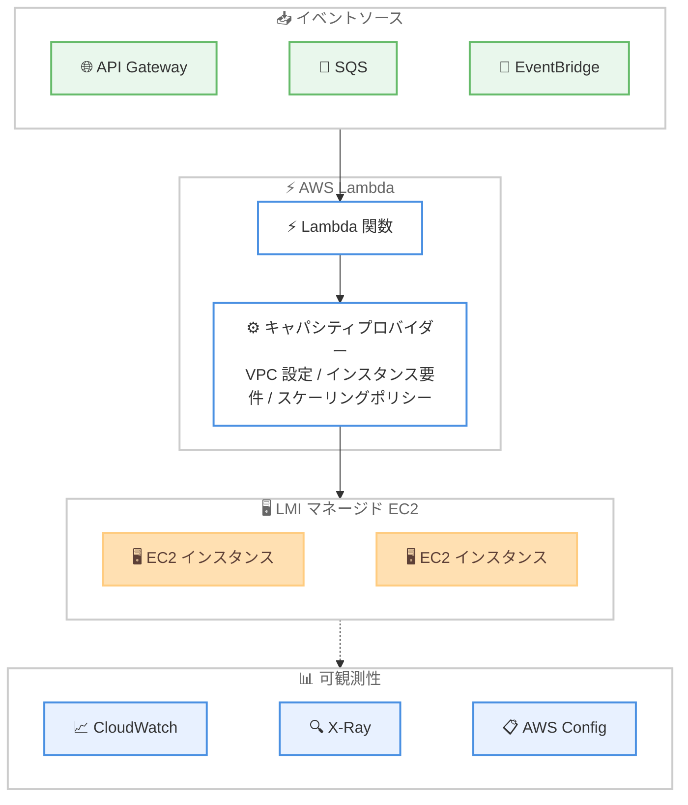

# AWS Lambda Managed Instances - 利用可能リージョンの拡大

**リリース日**: 2026 年 6 月 8 日
**サービス**: AWS Lambda
**機能**: AWS Lambda Managed Instances (LMI)

📊 [このアップデートのインフォグラフィックを見る](https://takech9203.github.io/aws-news-summary/20260608-aws-lambda-managed-instances-region-expansion.html)
<!-- INFOGRAPHIC_BASE_URL は環境変数から取得 -->

## 概要

AWS Lambda Managed Instances (LMI) が、新たに多くの AWS リージョンで利用可能になりました。今回の拡大により、LMI はイスラエル (テルアビブ)、中東 (バーレーン)、中東 (アラブ首長国連邦)、アジアパシフィック (オークランド) を除く、すべての商用 AWS リージョンで利用できるようになりました。

LMI は、Lambda 関数をマネージド型の Amazon EC2 インスタンス上で実行できる機能です。これにより、Lambda が提供する運用のシンプルさを維持しながら、特殊なコンピューティング構成へのアクセスや EC2 の料金面でのメリットを得られます。AWS が、インスタンスのライフサイクル、OS とランタイムのパッチ適用、ルーティング、ロードバランシング、オートスケーリングを完全にマネージドで管理します。

LMI は、各実行環境内で複数のリクエストを並列処理できるため、リソース使用率を最大化し、価格性能比を向上させます。さらに Compute Savings Plans やリザーブドインスタンスなどの EC2 料金モデルを活用することで、コストをさらに最適化できます。特殊なハードウェア構成を必要とするお客様や、定常的で予測可能なワークロードを実行するお客様に最適です。

**アップデート前の課題**

今回の拡大以前は、LMI を利用できるリージョンが限られていました。

- 特定のリージョンでしか LMI を利用できず、ローカルでのデータ処理要件やレイテンシー要件を満たせないケースがあった
- 標準の Lambda では、GPU や大容量メモリといった特殊なコンピューティング構成を利用できなかった
- 定常的なワークロードに対して、Lambda の従量課金モデルでは EC2 のような長期コミットメントによるコスト最適化ができなかった

**アップデート後の改善**

今回のリージョン拡大により、より多くの地域で LMI を活用できるようになりました。

- ほぼすべての商用リージョンで LMI を利用できるようになり、データレジデンシーやレイテンシーの要件に対応しやすくなった
- 各リージョンで特殊なインスタンスタイプを活用した Lambda 関数を実行できるようになった
- 各リージョンで Compute Savings Plans やリザーブドインスタンスを活用し、定常的なワークロードのコストを最適化できるようになった

## アーキテクチャ図



イベントソースからの呼び出しを受けた Lambda 関数が、キャパシティプロバイダーで定義したコンピューティング設定に基づいてマネージド EC2 インスタンス上で実行され、CloudWatch、X-Ray、AWS Config と統合される構成を示しています。

## サービスアップデートの詳細

### 主要機能

1. **マネージド EC2 インスタンス上での Lambda 実行**
   - Lambda 関数を AWS がマネージドで管理する EC2 インスタンス上で実行する
   - インスタンスのライフサイクル、OS とランタイムのパッチ適用、ルーティング、ロードバランシング、オートスケーリングを AWS が完全に管理する
   - Lambda の運用のシンプルさを維持したまま、EC2 の柔軟性を活用できる

2. **特殊なコンピューティング構成へのアクセス**
   - 標準の Lambda では選択できない、特殊なハードウェア構成を持つ EC2 インスタンスタイプを利用できる
   - x86_64 と arm64 の両アーキテクチャに対応する
   - キャパシティプロバイダーで許可または除外するインスタンスタイプを指定できる

3. **並列リクエスト処理による価格性能比の向上**
   - 各実行環境内で複数のリクエストを並列処理できる
   - リソース使用率を最大化し、価格性能比を改善する

4. **EC2 料金モデルの活用**
   - EC2 の料金面でのメリットを得られる
   - Compute Savings Plans やリザーブドインスタンスを活用してコストをさらに最適化できる
   - 定常的または予測可能なワークロードに適している

## 技術仕様

### キャパシティプロバイダーの構成要素

| 項目 | 詳細 |
|------|------|
| VPC 設定 | サブネット ID とセキュリティグループ ID を指定 |
| インスタンス要件 | アーキテクチャ (x86_64 / arm64)、許可または除外するインスタンスタイプ |
| スケーリング設定 | 最大 vCPU 数、スケーリングモード (Auto / Manual)、スケーリングポリシー |
| 暗号化 | KMS キー ARN を指定可能 |
| 権限設定 | キャパシティプロバイダー運用ロールの ARN |

### API 変更履歴

| 日付 | サービス | 変更内容 |
|------|----------|----------|
| 2026/06/02 | [lambda](https://awsapichanges.com/archive/changes/250cdc-lambda.html) | 5 updated api methods - Lambda マネージドリソースへのタグ伝播設定を追加 |

キャパシティプロバイダー関連の API (`CreateCapacityProvider`、`UpdateCapacityProvider`、`GetCapacityProvider`、`ListCapacityProviders`、`DeleteCapacityProvider`) に、Lambda がマネージドするリソースへタグを伝播するための `PropagateTags` 設定が追加されています。

### キャパシティプロバイダー作成の設定例

```json
{
  "CapacityProviderName": "my-capacity-provider",
  "VpcConfig": {
    "SubnetIds": ["subnet-xxxxxxxx", "subnet-yyyyyyyy"],
    "SecurityGroupIds": ["sg-zzzzzzzz"]
  },
  "InstanceRequirements": {
    "Architectures": ["arm64"],
    "AllowedInstanceTypes": ["c7g.large", "c7g.xlarge"]
  },
  "CapacityProviderScalingConfig": {
    "MaxVCpuCount": 128,
    "ScalingMode": "Auto",
    "ScalingPolicies": [
      {
        "PredefinedMetricType": "LambdaCapacityProviderAverageCPUUtilization",
        "TargetValue": 70.0
      }
    ]
  }
}
```

## 設定方法

### 前提条件

1. 利用するリージョンが LMI のサポート対象であること (イスラエル (テルアビブ)、中東 (バーレーン)、中東 (アラブ首長国連邦)、アジアパシフィック (オークランド) を除く商用リージョン)
2. キャパシティプロバイダーがインスタンスを起動するための VPC、サブネット、セキュリティグループが構成されていること
3. キャパシティプロバイダー運用ロールなど、必要な IAM 権限が設定されていること

### 手順

#### ステップ1: キャパシティプロバイダーの作成

```bash
aws lambda create-capacity-provider \
  --capacity-provider-name my-capacity-provider \
  --vpc-config 'SubnetIds=["subnet-xxxxxxxx"],SecurityGroupIds=["sg-zzzzzzzz"]' \
  --instance-requirements 'Architectures=["arm64"]' \
  --capacity-provider-scaling-config 'MaxVCpuCount=128,ScalingMode=Auto'
```

VPC 設定、インスタンス要件、スケーリングポリシーといったコンピューティングの設定を定義したキャパシティプロバイダーを作成します。

#### ステップ2: Lambda 関数のアタッチ

```bash
aws lambda update-function-configuration \
  --function-name my-function \
  --capacity-provider-name my-capacity-provider
```

作成したキャパシティプロバイダーに Lambda 関数を関連付け、関数がマネージド EC2 インスタンス上で実行されるように設定します。Lambda コンソール、API、または Infrastructure as Code ツールからも設定できます。

#### ステップ3: 動作確認と可観測性の設定

関数を呼び出した後、Amazon CloudWatch でメトリクスとログ、AWS X-Ray でトレース、AWS Config で構成変更を確認し、想定どおりにマネージドインスタンス上で実行されていることを検証します。

## メリット

### ビジネス面

- **コスト最適化**: EC2 の料金モデルに加え、Compute Savings Plans やリザーブドインスタンスを活用することで、定常的なワークロードのコストを削減できる
- **対応リージョンの拡大**: ほぼすべての商用リージョンで利用できるようになり、データレジデンシーやレイテンシーの要件に対応しやすくなった
- **運用負荷の低減**: インスタンス管理やパッチ適用を AWS に任せることで、運用チームの負担を軽減できる

### 技術面

- **特殊なハードウェアの活用**: 標準 Lambda では利用できない特殊なインスタンスタイプを利用できる
- **価格性能比の向上**: 各実行環境内での並列リクエスト処理によりリソース使用率を高められる
- **既存ツールとの統合**: すべての Lambda イベントソース、CloudWatch、X-Ray、AWS Config とそのまま統合できる

## デメリット・制約事項

### 制限事項

- イスラエル (テルアビブ)、中東 (バーレーン)、中東 (アラブ首長国連邦)、アジアパシフィック (オークランド) では利用できない
- キャパシティプロバイダー向けの VPC、サブネット、セキュリティグループの事前構成が必要となる
- マネージドとはいえ EC2 ベースのため、純粋な従量課金モデルの標準 Lambda とはコスト構造が異なる

### 考慮すべき点

- 定常的または予測可能なワークロードに適しており、トラフィックの変動が極端に大きいワークロードでは標準の Lambda の方が適している場合がある
- Compute Savings Plans やリザーブドインスタンスの活用には、利用量の見積もりとコミットメントの計画が必要となる
- インスタンスタイプの選定やスケーリングポリシーの設計が、コストとパフォーマンスに影響する

## ユースケース

### ユースケース1: GPU を必要とする機械学習推論

**シナリオ**: 機械学習モデルの推論処理を Lambda で実装したいが、標準の Lambda では GPU を利用できない。

**実装例**:
```
GPU 搭載インスタンスタイプを許可するキャパシティプロバイダーを作成し、
推論用 Lambda 関数をアタッチする
```

**効果**: Lambda のイベント駆動モデルと運用のシンプルさを保ちながら、GPU を活用した推論を実行できる。

### ユースケース2: 定常的なバックエンド処理のコスト最適化

**シナリオ**: 一定の負荷で継続的に稼働するバックエンド API を Lambda で運用しており、コストを削減したい。

**実装例**:
```
キャパシティプロバイダーに Compute Savings Plans を適用し、
定常稼働分のコストを長期コミットメントで最適化する
```

**効果**: 予測可能なワークロードに対して EC2 の料金メリットを適用し、コストを削減できる。

### ユースケース3: データレジデンシー要件への対応

**シナリオ**: 特定の国や地域でデータを処理する必要があり、これまで LMI が利用できないリージョンで運用していた。

**実装例**:
```
今回拡大されたリージョンでキャパシティプロバイダーを作成し、
対象リージョン内で Lambda 関数をマネージド EC2 上で実行する
```

**効果**: データレジデンシーやレイテンシーの要件を満たしながら、LMI のメリットを活用できる。

## 料金

LMI は EC2 の料金体系に基づいて課金されます。利用するインスタンスタイプの料金が適用され、Compute Savings Plans やリザーブドインスタンスを活用することで、定常的なワークロードのコストをさらに最適化できます。詳細な料金は AWS Lambda の料金ページを参照してください。

## 利用可能リージョン

イスラエル (テルアビブ)、中東 (バーレーン)、中東 (アラブ首長国連邦)、アジアパシフィック (オークランド) を除く、すべての商用 AWS リージョンで利用可能です。

## 関連サービス・機能

- **Amazon EC2**: LMI のマネージドインスタンスの基盤となるコンピューティングサービス。特殊なインスタンスタイプや料金モデルを提供する
- **AWS Lambda**: イベント駆動の関数実行サービス。LMI により実行環境として EC2 を選択できる
- **Amazon CloudWatch / AWS X-Ray / AWS Config**: LMI 上で実行される関数のメトリクス、トレース、構成監視を提供する
- **Compute Savings Plans / リザーブドインスタンス**: 定常的なワークロードのコストを最適化する料金モデル

## 参考リンク

- 📊 [インフォグラフィック](https://takech9203.github.io/aws-news-summary/20260608-aws-lambda-managed-instances-region-expansion.html)
- [公式発表 (What's New)](https://aws.amazon.com/about-aws/whats-new/2026/06/aws-lambda-managed-instances-region-expansion/)
- [AWS Lambda ドキュメント](https://docs.aws.amazon.com/lambda/)
- [AWS Lambda 料金ページ](https://aws.amazon.com/lambda/pricing/)

## まとめ

今回のリージョン拡大により、AWS Lambda Managed Instances がほぼすべての商用リージョンで利用できるようになり、特殊なハードウェアを必要とするワークロードや定常的なワークロードを、より多くの地域でコスト効率よく実行できるようになりました。特殊なインスタンスタイプの活用や Compute Savings Plans による最適化を検討しているチームは、対象リージョンでキャパシティプロバイダーを作成し、既存の Lambda 関数への適用を評価することをおすすめします。
