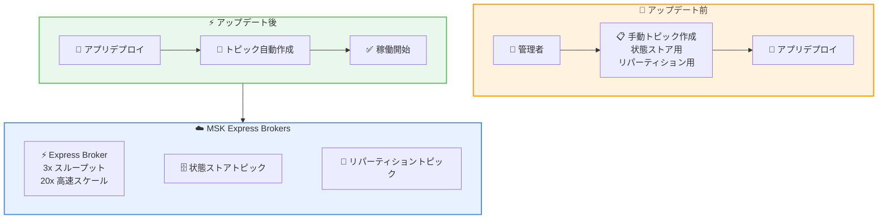

# Amazon MSK Express Brokers - Kafka Streams 自動トピック作成サポート

**リリース日**: 2026年6月8日
**サービス**: Amazon Managed Streaming for Apache Kafka (Amazon MSK)
**機能**: Express Brokers での Kafka Streams 自動トピック作成

📊 [このアップデートのインフォグラフィックを見る](https://takech9203.github.io/aws-news-summary/20260608-aws-msk-express-topic-support-kstreams.html)

## 概要

Amazon MSK Express Brokers が Kafka Streams アプリケーションでの自動トピック作成をサポートした。これにより、Kafka Streams のステートフル操作に必要な内部トピック (状態ストアやリパーティションデータ用) が、アプリケーション起動時に自動的に作成されるようになった。

MSK Express Brokers は、ブローカーあたり最大 3 倍のスループット、最大 20 倍高速なスケーリング、90% のリカバリ時間短縮を実現する高性能ブローカーとして設計されている。今回のアップデートにより、Express Brokers 上での Kafka Streams アプリケーションのデプロイがさらに簡素化された。

**アップデート前の課題**

- Kafka Streams を Express Brokers で実行する場合、ステートフル操作に必要な内部トピックを手動で事前に命名・作成する必要があった
- アプリケーションデプロイ前のトピック管理が運用負荷を増大させていた
- トピックの命名規則やパーティション数の設定を個別に管理する必要があり、ヒューマンエラーのリスクがあった

**アップデート後の改善**

- Kafka Streams アプリケーション起動時に必要なトピックが自動作成されるようになった
- 手動でのトピック事前作成が不要になり、デプロイワークフローが簡素化された
- 追加の設定やセットアップは一切不要で、即座に利用可能

## アーキテクチャ図



アップデート前は管理者が手動でトピックを作成する必要があったが、アップデート後はアプリケーション起動時に自動的にトピックが作成される。

## サービスアップデートの詳細

### 主要機能

1. **自動トピック作成**
   - Kafka Streams が内部的に使用する状態ストアトピックとリパーティショントピックを自動生成
   - アプリケーション起動時にトピックが自動作成されるため、事前準備が不要
   - トピックの命名やパーティション設定も Kafka Streams のデフォルト動作に従い自動設定

2. **ゼロコンフィグレーション**
   - 追加の設定やセットアップは一切不要
   - 既存の Kafka Streams アプリケーションをそのまま Express Brokers にデプロイ可能
   - MSK クラスター側での変更も不要

3. **Express Brokers の高性能特性との組み合わせ**
   - ブローカーあたり最大 3 倍のスループットで、ステートフル処理の高速化が可能
   - 最大 20 倍高速なスケーリングにより、ワークロード変動に迅速に対応
   - 90% 短縮されたリカバリ時間で、障害時の状態復旧が高速化

## 技術仕様

### Kafka Streams 内部トピックの種類

| トピック種別 | 用途 | 自動作成 |
|------|------|------|
| 状態ストアトピック | KTable やウィンドウ操作の状態を永続化 | 対応 |
| リパーティショントピック | キーの変更後にデータを再分配 | 対応 |
| チェンジログトピック | 状態ストアの変更履歴を記録 | 対応 |

### Express Brokers のパフォーマンス仕様

| 項目 | 詳細 |
|------|------|
| スループット | ブローカーあたり最大 3 倍 (標準ブローカー比) |
| スケーリング速度 | 最大 20 倍高速 |
| リカバリ時間 | 90% 短縮 |
| 課金単位 | 秒単位 |

## 設定方法

### 前提条件

1. Amazon MSK クラスターが Express Brokers タイプで作成されていること
2. Kafka Streams アプリケーションが準備されていること
3. 適切な IAM 権限が設定されていること

### 手順

#### ステップ 1: Express Brokers クラスターの確認

```bash
# MSK クラスターの情報を確認
aws kafka describe-cluster --cluster-arn <cluster-arn> \
  --query 'ClusterInfo.BrokerNodeGroupInfo'
```

Express Brokers タイプのクラスターが稼働していることを確認する。

#### ステップ 2: Kafka Streams アプリケーションのデプロイ

```java
// Kafka Streams の設定例
Properties props = new Properties();
props.put(StreamsConfig.BOOTSTRAP_SERVERS_CONFIG, "<msk-express-bootstrap-servers>");
props.put(StreamsConfig.APPLICATION_ID_CONFIG, "my-streams-app");
// 追加設定は不要 - トピックは自動作成される

KafkaStreams streams = new KafkaStreams(topology, props);
streams.start();
```

Express Brokers のブートストラップサーバーを指定してアプリケーションを起動するだけで、必要なトピックが自動的に作成される。

#### ステップ 3: 動作確認

```bash
# 自動作成されたトピックの確認
kafka-topics.sh --bootstrap-server <msk-express-bootstrap-servers> \
  --list | grep "<application-id>"
```

アプリケーション ID をプレフィックスとしたトピックが自動生成されていることを確認する。

## メリット

### ビジネス面

- **運用コスト削減**: トピックの手動管理が不要になり、運用チームの負荷が軽減される
- **デプロイ時間短縮**: 事前のトピック作成ステップが省略され、アプリケーションのリリースサイクルが高速化
- **ヒューマンエラー削減**: 手動でのトピック設定ミスによる障害リスクが排除される

### 技術面

- **デプロイパイプラインの簡素化**: CI/CD パイプラインからトピック作成スクリプトを削除できる
- **環境構築の自動化**: 新しい環境へのデプロイ時にトピック管理の考慮が不要
- **Kafka Streams ネイティブ動作との整合**: 標準的な Apache Kafka と同様の自動トピック作成動作が Express Brokers でも実現

## デメリット・制約事項

### 制限事項

- Express Brokers タイプのクラスターでのみ利用可能 (標準ブローカーとは異なるアーキテクチャ)
- 自動作成されるトピックのパーティション数やレプリケーションファクターは Kafka Streams のデフォルト設定に従う
- カスタムトピック設定 (保持期間やクリーンアップポリシーなど) が必要な場合は、引き続き手動作成が推奨される場合がある

### 考慮すべき点

- 本番環境では、自動作成されるトピックの設定が要件を満たしているか事前に検証することを推奨
- 既存の手動作成済みトピックがある場合、自動作成機能との競合がないか確認が必要

## ユースケース

### ユースケース 1: リアルタイムイベント処理パイプライン

**シナリオ**: EC サイトでユーザーの購買行動をリアルタイムに分析し、レコメンデーションを生成する Kafka Streams アプリケーションを Express Brokers にデプロイする。

**実装例**:
```java
StreamsBuilder builder = new StreamsBuilder();
KStream<String, PurchaseEvent> purchases = builder.stream("purchase-events");

// ステートフル操作 - 内部トピックが自動作成される
KTable<String, Long> purchaseCounts = purchases
    .groupByKey()
    .count(Materialized.as("purchase-counts-store"));

purchaseCounts.toStream().to("recommendation-input");
```

**効果**: トピックの事前作成なしで、即座にステートフルなストリーム処理を開始でき、新規サービスの立ち上げ時間を短縮できる。

### ユースケース 2: マイクロサービスのイベント駆動アーキテクチャ

**シナリオ**: 複数のマイクロサービスが Kafka Streams を使用してイベントを処理する環境で、サービスの追加・更新を頻繁に行う。

**実装例**:
```yaml
# Kubernetes Deployment - トピック作成の init container が不要に
apiVersion: apps/v1
kind: Deployment
metadata:
  name: order-processing-streams
spec:
  template:
    spec:
      containers:
        - name: streams-app
          image: order-processing:latest
          env:
            - name: BOOTSTRAP_SERVERS
              value: "<msk-express-bootstrap-servers>"
```

**効果**: デプロイマニフェストからトピック管理の依存関係を排除でき、マイクロサービスの独立性が向上する。

### ユースケース 3: 開発・テスト環境の迅速な構築

**シナリオ**: 開発チームが新機能の検証のために Kafka Streams アプリケーションの開発環境を頻繁に作成・破棄する。

**実装例**:
```bash
# 環境構築が大幅に簡素化
# 以前: トピック作成スクリプト実行 → アプリデプロイ
# 現在: アプリデプロイのみ
aws ecs run-task \
  --cluster dev-cluster \
  --task-definition kafka-streams-app:latest
```

**効果**: 開発環境のセットアップ時間が短縮され、開発者の生産性が向上する。

## 料金

Amazon MSK Express Brokers の料金体系に変更はなく、自動トピック作成機能による追加料金は発生しない。

### 料金例 (米国東部リージョン)

| 項目 | 料金 |
|------|------|
| express.m7g.large インスタンス | $0.408/時間 |
| データ取り込み | $0.01/GB |
| ストレージ | $0.10/GB 月 |

### 月額料金例 (3 ブローカー構成、1TB ストレージ)

| コンポーネント | 月額料金 (概算) |
|--------|------------------|
| ブローカーインスタンス (2,232 時間 x $0.408) | $910.66 |
| データ取り込み (1,000 GB x $0.01) | $10.00 |
| ストレージ (1,000 GB x $0.10) | $100.00 |
| **合計** | **$1,020.66** |

## 利用可能リージョン

MSK Express Brokers が利用可能なすべての AWS リージョンで提供される。主要なリージョンは以下の通り。

- 米国東部 (バージニア北部、オハイオ)
- 米国西部 (オレゴン)
- アジアパシフィック (東京、シンガポール、シドニー、ムンバイ、ソウル)
- 欧州 (フランクフルト、アイルランド、ロンドン、パリ、ストックホルム)
- カナダ (中部)

最新のリージョン対応状況は [AWS リージョン別サービス一覧](https://aws.amazon.com/about-aws/global-infrastructure/regional-product-services/) を参照。

## 関連サービス・機能

- **Amazon MSK Serverless**: サーバーレスで Apache Kafka を実行するオプション。Express Brokers とは異なるプロビジョニングモデル
- **Amazon Kinesis Data Streams**: AWS ネイティブのストリーミングサービス。Kafka エコシステムが不要な場合の代替選択肢
- **AWS Glue Streaming**: ストリーミング ETL ジョブ。MSK からのデータ変換・ロードに利用可能
- **Amazon MSK Connect**: Kafka Connect のマネージドサービス。ソース・シンクコネクタによるデータ連携

## 参考リンク

- 📊 [インフォグラフィック](https://takech9203.github.io/aws-news-summary/20260608-aws-msk-express-topic-support-kstreams.html)
- [公式発表 (What's New)](https://aws.amazon.com/about-aws/whats-new/2026/06/aws-msk-express-topic-support-kstreams/)
- [Amazon MSK 開発者ガイド](https://docs.aws.amazon.com/msk/latest/developerguide/getting-started.html)
- [Amazon MSK 料金ページ](https://aws.amazon.com/msk/pricing/)

## まとめ

Amazon MSK Express Brokers での Kafka Streams 自動トピック作成サポートは、ステートフルなストリーム処理アプリケーションのデプロイを大幅に簡素化するアップデートである。追加設定が一切不要で即座に利用できるため、既に Express Brokers を使用している、または Kafka Streams ワークロードの移行を検討しているチームは、このアップデートを活用してデプロイパイプラインの簡素化と運用負荷の軽減を実現することを推奨する。
