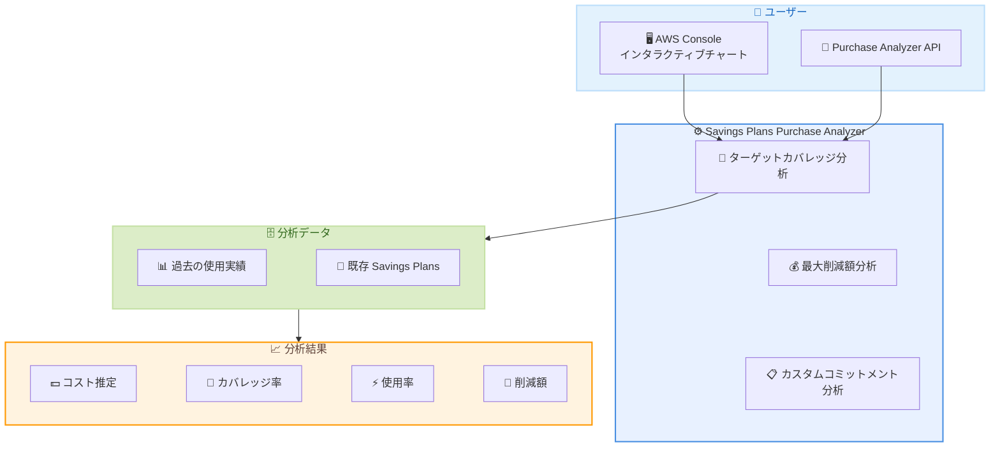

# AWS Savings Plans Purchase Analyzer - ターゲットカバレッジ分析

**リリース日**: 2026年6月8日
**サービス**: AWS Billing and Cost Management
**機能**: Savings Plans Purchase Analyzer ターゲットカバレッジ分析

📊 [このアップデートのインフォグラフィックを見る](https://takech9203.github.io/aws-news-summary/20260608-aws-savings-plans-coverage.html)

## 概要

AWS は Savings Plans Purchase Analyzer にターゲットカバレッジ分析機能を追加した。この機能により、オンデマンド支出のうち Savings Plans でカバーしたい割合 (目標カバレッジ率) を指定すると、過去の使用実績に基づいて必要な購入額を推奨してくれる。

Savings Plans Purchase Analyzer は AWS Billing and Cost Management の一機能であり、Savings Plans の購入がコスト、カバレッジ、使用率、削減額に与える影響をシミュレーションするツールである。今回のターゲットカバレッジ分析により、「80% のオンデマンド支出を Savings Plans でカバーしたい」といった目標ベースの計画立案が可能になった。

**アップデート前の課題**

- Savings Plans の購入額を決める際、最大削減額やカスタムコミットメント額からしか分析できなかった
- 目標とするカバレッジ率を達成するために必要な購入額を手動で試行錯誤する必要があった
- 複数のカバレッジ目標を比較検討する際、個別にシミュレーションを実行する手間が発生していた

**アップデート後の改善**

- 目標カバレッジ率を指定するだけで、必要な Savings Plans 購入額の推奨を自動で取得できるようになった
- カスタムルックバック期間や期限切れ Savings Plans の除外など、分析パラメータを柔軟にカスタマイズできるようになった
- 異なるカバレッジ目標間でコスト、カバレッジ、使用率、削減額を比較できるようになった

## アーキテクチャ図



ユーザーはコンソールまたは API からターゲットカバレッジ分析を実行し、過去の使用実績データに基づいて推奨購入額と予測結果を取得する。

## サービスアップデートの詳細

### 主要機能

1. **ターゲットカバレッジ率の指定**
   - オンデマンド支出のうち Savings Plans でカバーしたい割合をパーセンテージで指定
   - 過去の使用実績に基づき、目標達成に必要な購入額を自動算出
   - 整数値でカバレッジ率を指定 (例: 80 で 80% カバレッジ)

2. **カスタマイズ可能な分析パラメータ**
   - カスタムルックバック期間の設定 (分析対象の過去データ期間)
   - 期限切れ予定の Savings Plans を分析から除外するオプション
   - アカウントスコープの指定 (PAYER または LINKED)

3. **複数目標の比較分析**
   - 異なるカバレッジ目標を設定し、結果を並べて比較
   - コスト、カバレッジ、使用率、削減額の 4 つの指標で評価
   - インタラクティブチャートによる可視化

4. **API アクセス**
   - Purchase Analyzer API 経由でプログラマティックに分析を実行
   - 自動化ワークフローへの組み込みが可能

## 技術仕様

### 分析タイプ

| 分析タイプ | 説明 | ユースケース |
|------|------|------|
| MAX_SAVINGS | 最大の削減額を達成する購入額を推奨 | コスト最適化を最大化したい場合 |
| CUSTOM_COMMITMENT | 指定したコミットメント額での影響を分析 | 予算枠が決まっている場合 |
| TARGET_AVERAGE_COVERAGE (新規) | 目標カバレッジ率を達成する購入額を推奨 | カバレッジ目標がある場合 |

### API 変更履歴

| 日付 | サービス | 変更内容 |
|------|----------|----------|
| 2026/06/03 | [AWS Cost Explorer Service](https://awsapichanges.com/archive/changes/d1b776-ce.html) | 3 updated api methods - ターゲットカバレッジ分析のサポート追加 |

### 変更された API メソッド

| メソッド | 変更内容 |
|----------|----------|
| `StartCommitmentPurchaseAnalysis` | `AnalysisType` に `TARGET_AVERAGE_COVERAGE` を追加、`SavingsPlansTargetCoverage` パラメータを追加 |
| `GetCommitmentPurchaseAnalysis` | レスポンスに `TARGET_AVERAGE_COVERAGE` タイプとカバレッジ目標値を含む構成情報を追加 |
| `ListCommitmentPurchaseAnalyses` | 分析サマリーリストに新しい分析タイプとカバレッジ目標値を追加 |

### リクエストパラメータ

```json
{
  "CommitmentPurchaseAnalysisConfiguration": {
    "SavingsPlansPurchaseAnalysisConfiguration": {
      "AccountScope": "PAYER",
      "AnalysisType": "TARGET_AVERAGE_COVERAGE",
      "SavingsPlansTargetCoverage": 80,
      "LookBackTimePeriod": {
        "Start": "2026-05-01",
        "End": "2026-06-01"
      },
      "SavingsPlansToExclude": [
        "sp-12345678"
      ]
    }
  }
}
```

### レスポンスに含まれる主要メトリクス

| メトリクス | 説明 |
|------------|------|
| `CurrentAverageCoverage` | 現在の平均カバレッジ率 |
| `EstimatedAverageCoverage` | 推奨購入後の推定カバレッジ率 |
| `EstimatedAverageUtilization` | 推定平均使用率 |
| `EstimatedMonthlySavingsAmount` | 推定月間削減額 |
| `HourlyCommitmentToPurchase` | 推奨する時間あたりコミットメント額 |
| `EstimatedROI` | 推定投資収益率 |
| `MetricsOverLookbackPeriod` | ルックバック期間中のメトリクス時系列データ |

## 設定方法

### 前提条件

1. AWS Billing and Cost Management へのアクセス権限
2. Cost Explorer API (`ce:StartCommitmentPurchaseAnalysis`, `ce:GetCommitmentPurchaseAnalysis`) の IAM 権限
3. Savings Plans の過去使用履歴 (分析対象のデータ)

### 手順

#### ステップ 1: コンソールでの利用

AWS Billing and Cost Management コンソールから Savings Plans Purchase Analyzer にアクセスし、分析タイプとして「ターゲットカバレッジ」を選択する。目標カバレッジ率を入力すると、インタラクティブチャートで結果が表示される。

#### ステップ 2: API での分析実行

```bash
# ターゲットカバレッジ分析を開始
aws ce start-commitment-purchase-analysis \
  --commitment-purchase-analysis-configuration '{
    "SavingsPlansPurchaseAnalysisConfiguration": {
      "AccountScope": "PAYER",
      "AnalysisType": "TARGET_AVERAGE_COVERAGE",
      "SavingsPlansTargetCoverage": 80,
      "LookBackTimePeriod": {
        "Start": "2026-05-01",
        "End": "2026-06-01"
      }
    }
  }'
```

ターゲットカバレッジ率を 80% に設定し、2026 年 5 月 1 日から 6 月 1 日までの使用実績に基づいて分析を開始する。

#### ステップ 3: 分析結果の取得

```bash
# 分析結果を取得
aws ce get-commitment-purchase-analysis \
  --analysis-id "analysis-12345678"
```

分析 ID を指定して結果を取得する。レスポンスには推奨購入額、推定カバレッジ率、推定削減額などが含まれる。

#### ステップ 4: 期限切れ Savings Plans を除外した分析

```bash
# 期限切れ予定の Savings Plans を除外して分析
aws ce start-commitment-purchase-analysis \
  --commitment-purchase-analysis-configuration '{
    "SavingsPlansPurchaseAnalysisConfiguration": {
      "AccountScope": "PAYER",
      "AnalysisType": "TARGET_AVERAGE_COVERAGE",
      "SavingsPlansTargetCoverage": 75,
      "SavingsPlansToExclude": ["sp-expiring-001", "sp-expiring-002"]
    }
  }'
```

期限切れが近い Savings Plans を除外することで、更新計画を含めたより正確な推奨を取得する。

## メリット

### ビジネス面

- **目標ベースの計画立案**: カバレッジ目標に基づいて Savings Plans 購入を計画でき、財務目標との整合性が向上する
- **意思決定の迅速化**: 複数のカバレッジ目標を比較分析することで、最適な購入シナリオを素早く特定できる
- **コスト予測の精度向上**: 過去の使用実績に基づく推奨により、過剰購入や不足のリスクを軽減できる

### 技術面

- **API による自動化**: Purchase Analyzer API を活用して定期的なカバレッジ分析を自動化できる
- **カスタマイズ可能な分析**: ルックバック期間や除外条件を柔軟に設定し、精度の高い分析が可能
- **時系列メトリクス**: ルックバック期間中のカバレッジと使用率の推移を確認でき、トレンド分析に活用できる

## デメリット・制約事項

### 制限事項

- カバレッジ目標値は整数値で指定する必要がある (小数点以下は不可)
- 分析は非同期処理のため、結果取得まで待機が必要
- 過去の使用実績が十分にない場合、推奨の精度が低下する可能性がある

### 考慮すべき点

- カバレッジ率を高く設定しすぎると、使用率が低下し Savings Plans の無駄が発生する可能性がある
- ワークロードの変動が大きい環境では、推奨額が実際のニーズと乖離する場合がある
- 期限切れ Savings Plans の除外設定を活用して、更新計画を含めた分析を行うことを推奨

## ユースケース

### ユースケース 1: 年度予算計画に基づく Savings Plans 購入

**シナリオ**: 年度のクラウド予算策定時に、オンデマンド支出の 80% を Savings Plans でカバーするという目標を設定し、必要な購入額を算出したい。

**実装例**:
```bash
aws ce start-commitment-purchase-analysis \
  --commitment-purchase-analysis-configuration '{
    "SavingsPlansPurchaseAnalysisConfiguration": {
      "AccountScope": "PAYER",
      "AnalysisType": "TARGET_AVERAGE_COVERAGE",
      "SavingsPlansTargetCoverage": 80,
      "LookBackTimePeriod": {
        "Start": "2025-06-01",
        "End": "2026-06-01"
      }
    }
  }'
```

**効果**: 年間の使用実績に基づく推奨により、予算計画の精度が向上し、過剰購入や不足を防止できる。

### ユースケース 2: Savings Plans 更新時のカバレッジ最適化

**シナリオ**: 3 か月後に期限切れとなる Savings Plans があり、更新と同時にカバレッジ率を 70% から 85% に引き上げたい。

**実装例**:
```bash
aws ce start-commitment-purchase-analysis \
  --commitment-purchase-analysis-configuration '{
    "SavingsPlansPurchaseAnalysisConfiguration": {
      "AccountScope": "PAYER",
      "AnalysisType": "TARGET_AVERAGE_COVERAGE",
      "SavingsPlansTargetCoverage": 85,
      "SavingsPlansToExclude": ["sp-expiring-in-3months"],
      "LookBackTimePeriod": {
        "Start": "2026-03-01",
        "End": "2026-06-01"
      }
    }
  }'
```

**効果**: 期限切れ分を除外した分析により、更新と新規購入を合わせた最適なコミットメント額を算出できる。

### ユースケース 3: 複数カバレッジ目標の比較による最適値の決定

**シナリオ**: カバレッジ率 70%、80%、90% の 3 パターンで分析し、コストと削減額のバランスが最も良い目標を選定したい。

**実装例**:
```python
import boto3

client = boto3.client('ce')
targets = [70, 80, 90]

for target in targets:
    response = client.start_commitment_purchase_analysis(
        CommitmentPurchaseAnalysisConfiguration={
            'SavingsPlansPurchaseAnalysisConfiguration': {
                'AccountScope': 'PAYER',
                'AnalysisType': 'TARGET_AVERAGE_COVERAGE',
                'SavingsPlansTargetCoverage': target
            }
        }
    )
    print(f"Target {target}%: Analysis ID = {response['AnalysisId']}")
```

**効果**: 複数シナリオを一括で分析し、コスト効率と柔軟性のバランスが取れた最適なカバレッジ目標を特定できる。

## 料金

Savings Plans Purchase Analyzer のターゲットカバレッジ分析機能自体に追加料金は発生しない。AWS Billing and Cost Management の一部として無料で利用可能。ただし、Cost Explorer API の呼び出しには通常の API 料金が適用される。

| 項目 | 料金 |
|------|------|
| ターゲットカバレッジ分析機能 | 無料 |
| Cost Explorer API リクエスト | $0.01/リクエスト (GetCommitmentPurchaseAnalysis 等) |

## 利用可能リージョン

Savings Plans Purchase Analyzer が利用可能なすべての AWS リージョンで利用可能。主要なリージョンを含む。

- 米国東部 (バージニア北部、オハイオ)
- 米国西部 (オレゴン、北カリフォルニア)
- アジアパシフィック (東京、大阪、シンガポール、シドニー、ムンバイ、ソウル)
- 欧州 (アイルランド、フランクフルト、ロンドン、パリ、ストックホルム)
- その他 Savings Plans 対応リージョン

## 関連サービス・機能

- **AWS Cost Explorer**: コスト分析と可視化の基盤サービス。Purchase Analyzer API はこのサービスの一部
- **AWS Savings Plans**: コンピューティング使用量に対する割引コミットメントプラン。本機能の分析対象
- **AWS Cost Optimization Hub**: コスト最適化の推奨事項を一元管理。Savings Plans の推奨と連携
- **AWS Budgets**: 予算設定とアラート。カバレッジ目標と予算管理の組み合わせに有用

## 参考リンク

- 📊 [インフォグラフィック](https://takech9203.github.io/aws-news-summary/20260608-aws-savings-plans-coverage.html)
- [公式発表 (What's New)](https://aws.amazon.com/about-aws/whats-new/2026/06/aws-savings-plans-coverage/)
- [Savings Plans ドキュメント](https://docs.aws.amazon.com/savingsplans/latest/userguide/what-is-savings-plans.html)
- [Cost Explorer API リファレンス](https://docs.aws.amazon.com/aws-cost-management/latest/APIReference/API_StartCommitmentPurchaseAnalysis.html)
- [Savings Plans 料金ページ](https://aws.amazon.com/savingsplans/pricing/)

## まとめ

今回のターゲットカバレッジ分析機能の追加により、Savings Plans の購入計画がより直感的かつ目標指向になった。「カバレッジ率 X% を達成したい」という要件をそのまま入力でき、過去の使用実績に基づいた精度の高い推奨を得られる。FinOps チームや Cloud CoE は、この機能を活用して複数のカバレッジシナリオを比較し、コスト効率と柔軟性のバランスが取れた Savings Plans 購入戦略を策定することを推奨する。
