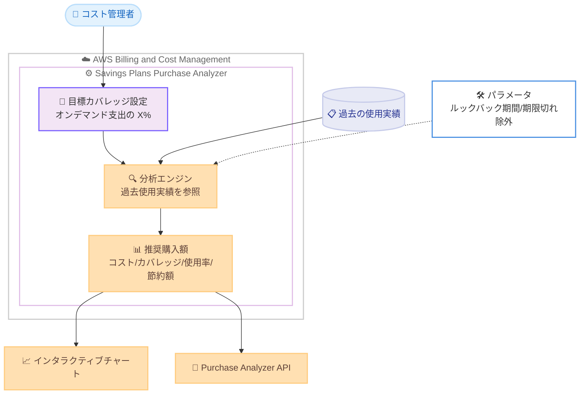

# AWS Savings Plans Purchase Analyzer - 目標カバレッジ分析

**リリース日**: 2026 年 6 月 8 日
**サービス**: AWS Billing and Cost Management
**機能**: Savings Plans Purchase Analyzer の目標カバレッジ分析 (Target Coverage Analysis)

📊 [このアップデートのインフォグラフィックを見る](https://takech9203.github.io/aws-news-summary/20260608-aws-savings-plans-coverage.html)
<!-- INFOGRAPHIC_BASE_URL は環境変数から取得 -->

## 概要

AWS は、AWS Billing and Cost Management の機能である Savings Plans Purchase Analyzer に、目標カバレッジ分析 (Target Coverage Analysis) を追加したことを発表しました。この機能により、お客様はカバレッジ目標に基づいて Savings Plans の購入計画を立てられるようになります。

Savings Plans Purchase Analyzer は、Savings Plans の購入がコスト、カバレッジ、使用率、節約額に与える潜在的な影響を見積もることで、さまざまな購入シナリオを評価できるツールです。今回追加された目標カバレッジ分析では、オンデマンド支出のうち Savings Plans でカバーしたい割合を具体的なパーセンテージで設定できます。Savings Plans Purchase Analyzer は過去の使用実績を基に、その目標を達成するための新しい購入額を推奨します。

カスタムルックバック期間の指定や、有効期限切れが近い Savings Plans の除外といったパラメータを使って分析をさらにカスタマイズでき、異なるカバレッジ目標ごとにコスト、カバレッジ、使用率、節約額を比較できます。推奨内容はインタラクティブなチャートで確認できるほか、Purchase Analyzer API を通じてもアクセスできます。

**アップデート前の課題**

- 以前は、特定のカバレッジ目標 (例: オンデマンド支出の 80% をカバーする) を達成するために、どれだけの Savings Plans を購入すればよいかを手動で試算する必要があった
- 以前は、購入シナリオの評価が支出額ベースの推奨が中心であり、カバレッジ率を起点とした逆算的な計画が立てにくかった
- 以前は、複数のカバレッジ目標を横並びで比較し、コストと節約のトレードオフを評価する作業が煩雑だった

**アップデート後の改善**

- 今回のアップデートにより、目標とするカバレッジ率を指定するだけで、それを達成するための推奨購入額が自動的に算出されるようになった
- 今回のアップデートにより、カスタムルックバック期間や有効期限切れ Savings Plans の除外といったパラメータで分析を柔軟に調整できるようになった
- 今回のアップデートにより、異なるカバレッジ目標ごとのコスト、カバレッジ、使用率、節約額を比較し、最適な購入計画を選択できるようになった

## アーキテクチャ図

コスト管理者が目標カバレッジ率を設定すると、分析エンジンが過去の使用実績とパラメータを基に推奨購入額を算出し、チャートまたは API で結果を提供する流れを示しています。

## サービスアップデートの詳細

### 主要機能

1. **目標カバレッジの指定**
   - オンデマンド支出のうち Savings Plans でカバーしたい割合をパーセンテージで設定できる
   - 設定した目標カバレッジ率を達成するために必要な新しい購入額を、過去の使用実績に基づいて推奨する
   - カバレッジ率を起点とした逆算的な購入計画が可能になる

2. **分析パラメータのカスタマイズ**
   - カスタムルックバック期間を指定して、推奨の基となる過去の使用実績の対象範囲を調整できる
   - 有効期限切れが近い Savings Plans を分析から除外できる
   - これにより、自社の利用状況や契約更新のタイミングに合わせた精度の高い分析が可能になる

3. **複数目標の比較とアクセス手段**
   - 異なるカバレッジ目標ごとに、コスト、カバレッジ、使用率、節約額を比較できる
   - 推奨内容はインタラクティブなチャートで視覚的に確認できる
   - Purchase Analyzer API を通じてプログラムから目標カバレッジ分析にアクセスできる

## 技術仕様

### 分析で評価される指標とパラメータ

| 項目 | 詳細 |
|------|------|
| カバレッジ (Coverage) | オンデマンド支出のうち Savings Plans でカバーされている割合 |
| 使用率 (Utilization) | コミットした Savings Plans のうち実際に使用されている割合 |
| コスト (Cost) | 購入シナリオ適用後の見積もりコスト |
| 節約額 (Savings) | オンデマンド料金と比較した場合の節約見込み額 |
| 目標カバレッジ | オンデマンド支出に対するカバレッジ率の目標値 (パーセンテージ指定) |
| ルックバック期間 | 推奨の基となる過去の使用実績の対象期間 (カスタム指定可能) |
| 期限切れ除外 | 有効期限切れが近い Savings Plans を分析対象から除外するオプション |

### アクセス手段

| 項目 | 詳細 |
|------|------|
| コンソール | AWS Billing and Cost Management 内の Savings Plans Purchase Analyzer から操作、インタラクティブチャートで結果を確認 |
| API | Purchase Analyzer API を通じて目標カバレッジ分析の結果を取得 |

## 設定方法

### 前提条件

1. AWS Billing and Cost Management へのアクセス権限を持つ IAM プリンシパルであること
2. Savings Plans Purchase Analyzer が利用可能なリージョンを使用していること
3. 推奨の精度を確保するため、十分な過去の使用実績が蓄積されていること

### 手順

#### ステップ 1: Savings Plans Purchase Analyzer を開く

AWS Billing and Cost Management コンソールにサインインし、Savings Plans Purchase Analyzer を開きます。ここで Savings Plans の購入シナリオの分析を開始します。

#### ステップ 2: 目標カバレッジを設定する

オンデマンド支出のうち Savings Plans でカバーしたい割合を、目標カバレッジ率として設定します。必要に応じてカスタムルックバック期間を指定し、有効期限切れが近い Savings Plans を除外するかどうかを選択します。これらのパラメータにより、自社の利用状況に合わせた分析条件を設定します。

#### ステップ 3: 推奨内容を確認・比較する

分析結果として推奨される購入額を確認します。インタラクティブなチャートで、設定したカバレッジ目標におけるコスト、カバレッジ、使用率、節約額を確認できます。異なる目標を設定して結果を比較し、最適な購入計画を選択します。プログラムから結果を取得する場合は、Purchase Analyzer API を利用します。

## メリット

### ビジネス面

- **計画立案の効率化**: カバレッジ目標を指定するだけで必要な購入額が自動算出されるため、手動試算の工数を削減できる
- **コスト最適化の見える化**: 異なる目標ごとのコスト、節約額、使用率を比較し、データに基づいた意思決定ができる
- **追加費用なしでの利用**: Savings Plans Purchase Analyzer の機能として提供され、分析自体に追加料金はかからない

### 技術面

- **柔軟なパラメータ調整**: カスタムルックバック期間や期限切れ Savings Plans の除外により、分析精度を高められる
- **API による自動化**: Purchase Analyzer API を利用して、目標カバレッジ分析を自動化されたコスト管理ワークフローに組み込める
- **過去実績ベースの推奨**: 実際の使用実績を基にした推奨により、現実的な購入計画を立てられる

## デメリット・制約事項

### 制限事項

- 利用可能リージョンは Savings Plans Purchase Analyzer が提供されているリージョンに限定される
- 推奨は過去の使用実績に基づくため、今後の使用パターンが大きく変化する場合は実際の結果と差異が生じる可能性がある

### 考慮すべき点

- 設定する目標カバレッジ率が高すぎると、使用率の低下や過剰コミットのリスクが生じる可能性があるため、使用率の指標も併せて確認する
- ルックバック期間の設定によって推奨額が変動するため、自社の利用状況の安定性を踏まえて適切な期間を選択する

## ユースケース

### ユースケース 1: カバレッジ目標に基づく購入計画

**シナリオ**: 財務部門からオンデマンド支出の 80% を Savings Plans でカバーするよう指示を受けたコスト管理者が、必要な購入額を把握したい。

**効果**: 目標カバレッジを 80% に設定するだけで、それを達成するための推奨購入額が自動算出され、手動試算が不要になる。

### ユースケース 2: 複数シナリオの比較検討

**シナリオ**: カバレッジ 70%、80%、90% のそれぞれで、コストと節約額のトレードオフを比較したい。

**効果**: 各目標における使用率や節約額を横並びで比較でき、過剰コミットを避けつつ最適なバランスのカバレッジ目標を選択できる。

### ユースケース 3: 契約更新を見据えた分析

**シナリオ**: まもなく有効期限を迎える既存の Savings Plans を考慮しつつ、新たな購入計画を立てたい。

**効果**: 有効期限切れが近い Savings Plans を除外して分析することで、更新を見越した現実的な購入額の推奨を得られる。

## 料金

目標カバレッジ分析は Savings Plans Purchase Analyzer の機能として提供されます。公式発表では本機能自体の料金に関する記載はありません。Savings Plans の購入料金については、Savings Plans の料金体系に従います。最新かつ正確な料金は公式の料金ページで確認してください。

## 利用可能リージョン

目標カバレッジ分析は、Savings Plans Purchase Analyzer が利用可能なすべての AWS リージョンで利用できます。

## 関連サービス・機能

- **AWS Savings Plans**: コンピューティング使用量に対する割引購入プラン。本機能はその購入計画を支援する
- **AWS Cost Explorer**: コストと使用状況の可視化・分析を行うツール。Savings Plans の使用率やカバレッジレポートと連携する
- **AWS Billing and Cost Management**: 本機能が提供されるコンソール。請求とコスト管理の中心的なサービス

## 参考リンク

- 📊 [インフォグラフィック](https://takech9203.github.io/aws-news-summary/20260608-aws-savings-plans-coverage.html)
- [公式発表 (What's New)](https://aws.amazon.com/about-aws/whats-new/2026/06/aws-savings-plans-coverage/)
- [AWS Savings Plans](https://aws.amazon.com/savingsplans/)

## まとめ

目標カバレッジ分析は、カバレッジ率を起点とした Savings Plans の購入計画を可能にする実用的な機能です。手動試算の工数を削減しつつ、コスト、カバレッジ、使用率、節約額のバランスをデータに基づいて評価できます。Savings Plans を活用してコスト最適化を進めているお客様は、コンソールまたは Purchase Analyzer API から本機能を試し、自社のカバレッジ目標に沿った購入計画を立案することを推奨します。
