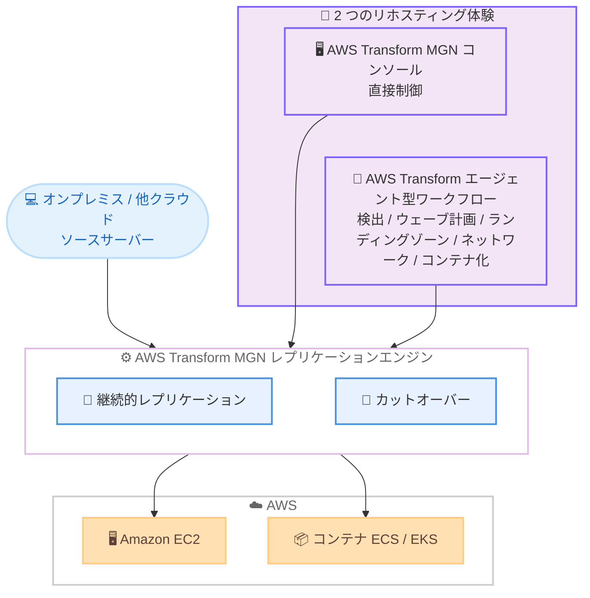

# AWS Transform MGN - AWS Application Migration Service のリブランド

**リリース日**: 2026 年 6 月 8 日
**サービス**: AWS Transform MGN (旧 AWS Application Migration Service)
**機能**: サービス名称変更および AWS Transform プラットフォームとの統合

📊 [このアップデートのインフォグラフィックを見る](https://takech9203.github.io/aws-news-summary/20260608-aws-transform-mgn-rebrand.html)
<!-- INFOGRAPHIC_BASE_URL は環境変数から取得 -->

## 概要

AWS Application Migration Service (MGN) は、AWS Transform MGN として提供されることになりました。この名称変更は、MGN が実績のあるレプリケーションエンジンとして、エージェント型移行サービスである AWS Transform を支える役割を担っていることを反映したものです。サービスの中核となるレプリケーション機能や運用方法は変わらず、これまで MGN を利用してきたお客様は引き続き同じ機能を利用できます。

今回のリブランドにより、お客様は 2 つのリホスティング体験から選択できるようになりました。1 つは、レプリケーションとカットオーバーを直接制御する従来型の AWS Transform MGN コンソールです。もう 1 つは、エージェントが検出、ウェーブ計画、ランディングゾーンの構築、ネットワーク作成、リホスティングまたはコンテナ化を代行する AWS Transform のエージェント型ワークフローです。お客様は移行の規模や管理ニーズに応じて、最適なアプローチを選択できます。

AWS Transform MGN は、FedRAMP High、HIPAA、PCI DSS、ISO、SOC 1、2、3 を含む既存のすべてのコンプライアンス認証を維持しています。また、すべての商用リージョンおよび両方の GovCloud (US) リージョンで利用可能です。

**アップデート前の課題**

このアップデート以前は、移行作業において以下の課題がありました。

- 移行のレプリケーションエンジン (MGN) とエージェント型移行サービス (AWS Transform) が別々のブランドとして認識され、両者の関係性が分かりにくかった
- 移行プロセスの検出、ウェーブ計画、ランディングゾーン構築、ネットワーク作成などを手動で計画・実行する必要があった
- 大規模な移行では、これらの一連の作業を人手で調整する工数が大きかった

**アップデート後の改善**

今回のアップデートにより、以下が可能になりました。

- MGN が AWS Transform を支えるレプリケーションエンジンであることが名称上も明確になり、サービス間の位置付けが整理された
- 従来のコンソールによる直接制御と、エージェントによる自動化ワークフローの 2 つの体験から選択できるようになった
- エージェント型ワークフローにより、検出からリホスティングまたはコンテナ化までの一連の作業をエージェントに委任できるようになった

## アーキテクチャ図



同一の MGN レプリケーションエンジンを基盤としながら、コンソールによる直接制御とエージェント型ワークフローの 2 つの体験から、Amazon EC2 へのリホスティングまたはコンテナ化を実行できることを示しています。

## サービスアップデートの詳細

### 主要機能

1. **サービス名称の変更**
   - AWS Application Migration Service (MGN) が AWS Transform MGN に名称変更された
   - MGN が実績あるレプリケーションエンジンとして AWS Transform を支える位置付けを反映
   - 既存のレプリケーション機能や運用フローは変更なし

2. **AWS Transform MGN コンソール (直接制御)**
   - レプリケーションとカットオーバーをお客様が直接制御する従来型の体験
   - 移行の各ステップを細かく管理したいケースに適する
   - 既存の MGN 利用者が引き続き同じ操作感で利用可能

3. **AWS Transform エージェント型ワークフロー**
   - エージェントが検出、ウェーブ計画、ランディングゾーン構築、ネットワーク作成、リホスティングまたはコンテナ化を代行
   - 一連の移行作業の自動化により、AWS への移行を加速
   - 大規模な移行やコンテナ化を含む移行で工数を削減

4. **コンプライアンス認証の維持**
   - FedRAMP High、HIPAA、PCI DSS、ISO、SOC 1、2、3 を含む既存のすべての認証を維持
   - 規制業界や公共部門のお客様も従来どおり利用可能

## 技術仕様

### 2 つのリホスティング体験の比較

| 項目 | AWS Transform MGN コンソール | AWS Transform エージェント型ワークフロー |
|------|------------------------------|------------------------------------------|
| 制御方式 | お客様による直接制御 | エージェントによる自動化 |
| 検出 | 手動 | エージェントが実行 |
| ウェーブ計画 | 手動 | エージェントが実行 |
| ランディングゾーン構築 | 手動 | エージェントが実行 |
| ネットワーク作成 | 手動 | エージェントが実行 |
| リホスティング / コンテナ化 | リホスティング中心 | リホスティングまたはコンテナ化 |
| 適したケース | 細かな制御が必要な移行 | 大規模・自動化を重視する移行 |

### コンプライアンス認証

| 認証 | 概要 |
|------|------|
| FedRAMP High | 米国政府機関向けの高レベルセキュリティ要件 |
| HIPAA | 医療情報の保護に関する米国の法令対応 |
| PCI DSS | クレジットカード業界のデータセキュリティ基準 |
| ISO | 国際標準化機構による情報セキュリティ管理規格 |
| SOC 1, 2, 3 | 内部統制およびセキュリティに関する監査報告 |

### API 変更履歴

今回のアップデートはサービス名称の変更が中心であり、awsapichanges.com 上で確認できる該当期間の API メソッドの追加・変更は確認されませんでした。既存の MGN API は引き続き利用可能です。

## 設定方法

### 前提条件

1. AWS アカウントと適切な IAM 権限を保有していること
2. 移行対象のソースサーバー (オンプレミスまたは他クラウド) にアクセスできること
3. ソースサーバーに AWS Replication Agent をインストールできること
4. 移行先となる AWS リージョンを決定していること

### 手順

#### ステップ 1: AWS Transform MGN の初期化

AWS Transform MGN コンソールでサービスを初期化し、レプリケーション設定テンプレート (サブネット、インスタンスタイプ、セキュリティグループなど) を構成します。これにより、レプリケーションサーバーが起動するネットワーク環境が定義されます。

#### ステップ 2: レプリケーションエージェントのインストール

```bash
# ソースサーバーで AWS Replication Agent をダウンロードして実行
sudo python3 aws-replication-installer-init.py \
  --region <aws-region> \
  --aws-access-key-id <access-key> \
  --aws-secret-access-key <secret-key>
```

このコマンドは、ソースサーバーに AWS Replication Agent をインストールし、AWS Transform MGN への継続的なブロックレベルレプリケーションを開始します。レプリケーション完了後、ソースサーバーは AWS 上で起動可能な状態になります。

#### ステップ 3: 体験の選択とリホスティング

直接制御を行う場合は、AWS Transform MGN コンソールからテストインスタンスを起動して検証し、問題がなければカットオーバーを実行します。エージェント型ワークフローを利用する場合は、AWS Transform にウェーブ計画やランディングゾーン構築、リホスティングまたはコンテナ化を委任し、進捗を確認します。

## メリット

### ビジネス面

- **移行アプローチの選択肢拡大**: 直接制御と自動化の 2 つの体験から、組織の体制やスキルに応じて選択できる
- **大規模移行の加速**: エージェント型ワークフローにより、検出からリホスティングまでの工数を削減し、移行期間を短縮できる
- **規制業界での継続利用**: FedRAMP High、HIPAA、PCI DSS などの認証を維持しているため、コンプライアンス要件のある組織も安心して利用できる

### 技術面

- **実績あるレプリケーションエンジン**: MGN の継続的なブロックレベルレプリケーションをそのまま活用できる
- **コンテナ化のサポート**: エージェント型ワークフローでは、単純なリホスティングに加えてコンテナ化の選択肢も提供される
- **広範なリージョン対応**: すべての商用リージョンと両方の GovCloud (US) リージョンで利用可能

## デメリット・制約事項

### 制限事項

- サービス名称の変更が中心であり、既存の MGN 機能そのものに大幅な追加はない
- エージェント型ワークフローで提供される自動化の範囲は、対象の構成や環境に依存する
- 移行先で起動するインスタンスやストレージには、別途 AWS の利用料金が発生する

### 考慮すべき点

- 既存のドキュメント、スクリプト、IAM ポリシーなどに含まれる旧名称 (Application Migration Service) を、運用上の混乱を避けるため必要に応じて確認する
- コンソールによる直接制御とエージェント型ワークフローのどちらを採用するかは、移行規模、自動化への要求、社内体制を踏まえて判断する
- コンテナ化を選択する場合は、移行後のアプリケーションがコンテナ環境に適合するか事前に評価する

## ユースケース

### ユースケース 1: 大規模なデータセンター移行

**シナリオ**: 数百台のサーバーを短期間で AWS に移行したいが、ウェーブ計画やランディングゾーン構築を人手で行う余裕がない。

**実装例**:
```
AWS Transform エージェント型ワークフローを利用
→ エージェントが検出・ウェーブ計画・ランディングゾーン構築・ネットワーク作成・リホスティングを代行
```

**効果**: 移行計画と実行の工数を削減し、移行期間を短縮できる。

### ユースケース 2: 規制要件のあるシステムの移行

**シナリオ**: 医療情報を扱うシステムを AWS に移行する必要があり、HIPAA や SOC への準拠が求められる。

**実装例**:
```
AWS Transform MGN コンソールで直接制御
→ コンプライアンス認証を維持したまま、レプリケーションとカットオーバーを段階的に管理
```

**効果**: 規制要件を満たしながら、移行プロセスをきめ細かく制御できる。

### ユースケース 3: モダナイゼーションを伴う移行

**シナリオ**: 既存アプリケーションを AWS に移行する際に、可能なものはコンテナ化してモダナイズしたい。

**実装例**:
```
AWS Transform エージェント型ワークフローでコンテナ化を選択
→ リホスティングとコンテナ化を組み合わせて移行
```

**効果**: 単純な移行だけでなく、移行と同時にモダナイゼーションを進められる。

## 料金

AWS Transform MGN のレプリケーション機能には無料の移行期間が用意されています。ただし、移行が完全に無償というわけではなく、レプリケーションを実行する間 (無料期間中を含む) はデータレプリケーションを支えるための AWS インフラストラクチャの料金が発生します。また、テストインスタンスやカットオーバーインスタンスを起動する際には、Amazon EC2 のコンピューティングと Amazon EBS のストレージに対して通常の AWS 料金プランに基づく料金がかかります。料金体系はサポートされているすべての AWS リージョンで同一です。

### 料金例

| 使用量 | 月額料金 (概算) |
|--------|------------------|
| レプリケーション中のインフラ (EC2 / EBS) | 起動するレプリケーションサーバーとステージング領域の利用量に応じて発生 |
| テスト / カットオーバーインスタンス | 起動する EC2 / EBS リソースの種類と稼働時間に応じて発生 |

正確な料金は対象リージョンや構成によって異なるため、最新の料金ページを確認してください。

## 利用可能リージョン

すべての商用リージョンおよび両方の AWS GovCloud (US) リージョンで利用可能です。

## 関連サービス・機能

- **AWS Transform**: MGN を支えるレプリケーションエンジンを活用するエージェント型移行サービス。検出からリホスティング・コンテナ化までを自動化する
- **Amazon EC2**: リホスティング後にワークロードが稼働するコンピューティングサービス。移行先インスタンスとして利用される
- **Amazon ECS / Amazon EKS**: コンテナ化を選択した場合の移行先となるコンテナオーケストレーションサービス

## 参考リンク

- 📊 [インフォグラフィック](https://takech9203.github.io/aws-news-summary/20260608-aws-transform-mgn-rebrand.html)
- [公式発表 (What's New)](https://aws.amazon.com/about-aws/whats-new/2026/06/aws-transform-mgn-rebrand/)
- [AWS Application Migration Service 製品ページ](https://aws.amazon.com/application-migration-service/)
- [AWS Application Migration Service 料金ページ](https://aws.amazon.com/application-migration-service/pricing/)

## まとめ

AWS Transform MGN へのリブランドは、実績あるレプリケーションエンジンである MGN が、エージェント型移行サービス AWS Transform を支える基盤であることを名称上も明確にしたアップデートです。お客様はコンソールによる直接制御と、エージェントによる自動化ワークフローの 2 つの体験から選択でき、コンプライアンス認証も従来どおり維持されます。移行プロジェクトを計画している場合は、移行規模や自動化への要求に応じて、どちらの体験が適しているかを評価することを推奨します。
