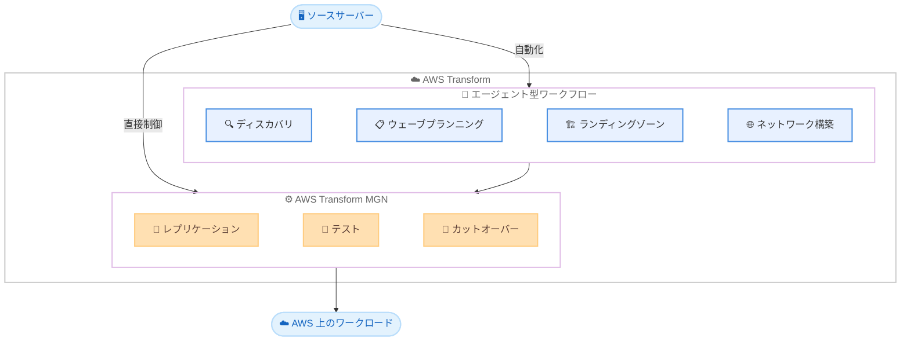

# AWS Transform MGN - AWS Application Migration Service のリブランド

**リリース日**: 2026年6月8日
**サービス**: AWS Transform MGN (旧 AWS Application Migration Service)
**機能**: サービス名称変更および AWS Transform プラットフォームとの統合

📊 [このアップデートのインフォグラフィックを見る](https://takech9203.github.io/aws-news-summary/20260608-aws-transform-mgn-rebrand.html)

## 概要

AWS Application Migration Service (MGN) が「AWS Transform MGN」に名称変更された。これは MGN が AWS Transform のエージェント型マイグレーションサービスを支えるレプリケーションエンジンとしての役割を明確にするためのリブランドである。サービスの技術的な機能自体に変更はなく、既存のコンプライアンス認証もすべて維持される。

AWS Transform は、AI エージェントによる自動化を活用したエンタープライズ IT 変革プラットフォームであり、MGN はその中核となるリホスティングエンジンとして位置付けられた。ユーザーは従来通りの手動制御によるマイグレーションと、エージェント型ワークフローによる自動化マイグレーションの 2 つの方法を選択できる。

**アップデート前の課題**

- AWS Application Migration Service (MGN) は独立したサービスとして存在し、AWS Transform との関係が名称から分かりにくかった
- マイグレーション作業において、ディスカバリ、ウェーブプランニング、ランディングゾーンセットアップ、ネットワーク構築、リホスティングの各フェーズを個別に管理する必要があった
- コンテナ化を含むモダナイゼーションの選択肢との統合的な体験が不足していた

**アップデート後の改善**

- MGN が AWS Transform エコシステムの一部であることが名称から明確になり、サービス間の関係が分かりやすくなった
- エージェント型ワークフローにより、ディスカバリからカットオーバーまでの全プロセスを AI エージェントが自動化可能になった
- リホスティングとコンテナ化の両方を統合的なプラットフォーム上で選択可能になった

## アーキテクチャ図



AWS Transform MGN は 2 つの利用方法を提供する。直接 MGN コンソールを使用する方法と、AWS Transform エージェント型ワークフローを通じて自動化する方法である。

## サービスアップデートの詳細

### 主要機能

1. **AWS Transform MGN コンソール**
   - レプリケーションとカットオーバーを直接制御するインターフェース
   - 従来の AWS Application Migration Service と同一の操作体験
   - 既存の自動化スクリプトや CI/CD パイプラインとの互換性を維持

2. **AWS Transform エージェント型ワークフロー**
   - AI エージェントがディスカバリ、ウェーブプランニング、ランディングゾーンセットアップ、ネットワーク構築を自動化
   - リホスティングまたはコンテナ化を自動的に実行
   - AWS への移行パスを大幅に加速

3. **コンプライアンス認証の維持**
   - FedRAMP High
   - HIPAA
   - PCI DSS
   - ISO
   - SOC 1, 2, 3

## 技術仕様

### リブランドの範囲

| 項目 | 詳細 |
|------|------|
| 旧名称 | AWS Application Migration Service (MGN) |
| 新名称 | AWS Transform MGN |
| 技術的変更 | なし (名称変更のみ) |
| API エンドポイント | 変更なし (mgn) |
| コンプライアンス | 全認証を維持 |

### サポートする移行方式

| 方式 | 説明 |
|------|------|
| リホスティング | ソースサーバーをそのまま AWS に移行 |
| コンテナ化 | エージェント型ワークフローによるコンテナへの変換 |
| ネットワーク移行 | VMware NSX、Cisco ACI 等からの自動変換 |

### API 変更履歴

| 日付 | サービス | 変更内容 |
|------|----------|----------|
| 2026/06/08 | [mgn](https://awsapichanges.com/archive/changes/a09b61-mgn.html) | 4 updated api methods - AWS Transform Discovery Collector をネットワーク移行の入力ソースとしてサポート |

### ネットワーク移行ソース環境

今回の API 更新で `AWS_DISCOVERY_COLLECTOR` が追加され、以下のソース環境がサポートされるようになった。

```python
# CreateNetworkMigrationDefinition の sourceEnvironment 列挙値
source_environments = [
    'NSX',                    # VMware NSX
    'VSPHERE',                # VMware vSphere
    'FORTIGATE_FIREWALL',     # FortiGate Firewall
    'PALO_ALTO_FIREWALL',     # Palo Alto Firewall
    'CISCO_ACI',              # Cisco ACI
    'LOGICAL_MODEL',          # 論理モデル
    'MODELIZE_IT',            # modelizeIT
    'AWS_DISCOVERY_COLLECTOR'  # AWS Transform Discovery Collector (新規)
]
```

## 設定方法

### 前提条件

1. AWS アカウントへのアクセス権限
2. 移行対象のソースサーバーへのエージェントインストール権限
3. IAM ポリシーの設定 (既存の MGN 関連ポリシーがそのまま使用可能)

### 手順

#### ステップ 1: AWS Transform MGN コンソールへのアクセス

```bash
# AWS CLI で MGN サービスを確認
aws mgn describe-source-servers --region ap-northeast-1
```

既存の `aws mgn` CLI コマンドはそのまま利用可能。API エンドポイントやサービス名前空間に変更はない。

#### ステップ 2: エージェント型ワークフローの利用

```bash
# AWS Transform コンソールからエージェント型ワークフローを開始
# https://console.aws.amazon.com/transform/ にアクセス
# ワークロードの検出と移行プランの自動生成が可能
```

AWS Transform コンソールからエージェント型ワークフローを選択することで、ディスカバリからカットオーバーまでの自動化が開始される。

#### ステップ 3: ネットワーク移行定義の作成

```python
import boto3

client = boto3.client('mgn')

response = client.create_network_migration_definition(
    name='my-network-migration',
    description='VMware and non-VMware hybrid migration',
    sourceConfigurations=[
        {
            'sourceEnvironment': 'AWS_DISCOVERY_COLLECTOR',
            'sourceS3Configuration': {
                's3Bucket': 'my-discovery-bucket',
                's3BucketOwner': '123456789012',
                's3Key': 'discovery-data/'
            }
        }
    ],
    targetNetwork={
        'topology': 'HUB_AND_SPOKE',
        'inboundCidr': '10.0.0.0/16',
        'outboundCidr': '10.1.0.0/16',
        'inspectionCidr': '10.2.0.0/16'
    },
    targetDeployment='MULTI_ACCOUNT'
)
```

AWS Transform Discovery Collector の結果を使用して、ネットワーク移行定義を作成する。これにより VMware と非 VMware のハイブリッド環境のネットワーク移行が可能になる。

## メリット

### ビジネス面

- **ブランド統一による明確な価値提案**: AWS Transform ファミリーとしての位置付けにより、マイグレーションサービスの全体像が把握しやすくなった
- **エージェント型自動化による工数削減**: ディスカバリ、プランニング、実行の各フェーズを AI エージェントが自動化し、移行プロジェクトの期間短縮が可能
- **コンプライアンス維持による継続的信頼性**: FedRAMP High を含む全認証が維持されるため、規制産業でも安心して利用可能

### 技術面

- **既存ワークフローとの完全互換**: API エンドポイント、CLI コマンド、SDK の変更なし
- **ハイブリッドソース環境のサポート拡大**: AWS Discovery Collector が追加され、VMware と非 VMware の混在環境に対応
- **コンテナ化パスの統合**: リホスティングだけでなくコンテナ化も同一プラットフォームで選択可能

## デメリット・制約事項

### 制限事項

- ドキュメントやコンソールの URL が変更される可能性があり、ブックマークや社内ドキュメントの更新が必要になる場合がある
- エージェント型ワークフローの全機能が全リージョンで同時に利用可能とは限らない
- 名称変更に伴い、IAM ポリシーのサービス名やアクション名が将来的に変更される可能性がある

### 考慮すべき点

- 社内のマイグレーション手順書やランブックの名称を更新する必要がある
- パートナーツールやサードパーティ連携が新名称に対応するまでのタイムラグが発生する可能性がある

## ユースケース

### ユースケース 1: 大規模エンタープライズのリフト&シフト

**シナリオ**: 数百台のオンプレミスサーバーを AWS に移行する必要があるが、移行チームのリソースが限られている。

**実装例**:
```bash
# AWS Transform エージェント型ワークフローを使用
# 1. ディスカバリエージェントによる自動検出
# 2. AI によるウェーブプランニング (依存関係分析含む)
# 3. ランディングゾーンの自動セットアップ
# 4. レプリケーションとカットオーバーの自動実行
```

**効果**: AI エージェントが計画から実行までを自動化し、従来数カ月かかっていた移行プロジェクトを大幅に短縮できる。

### ユースケース 2: VMware と非 VMware の混在環境のネットワーク移行

**シナリオ**: データセンターに VMware 環境と物理サーバーが混在しており、ネットワーク構成を AWS に移行したい。

**実装例**:
```python
# AWS Discovery Collector と modelizeIT の両方をソースとして使用
response = client.create_network_migration_definition(
    name='hybrid-network-migration',
    sourceConfigurations=[
        {
            'sourceEnvironment': 'AWS_DISCOVERY_COLLECTOR',
            'sourceS3Configuration': {
                's3Bucket': 'discovery-data',
                's3BucketOwner': '123456789012',
                's3Key': 'non-vmware/'
            }
        },
        {
            'sourceEnvironment': 'NSX',
            'sourceS3Configuration': {
                's3Bucket': 'discovery-data',
                's3BucketOwner': '123456789012',
                's3Key': 'vmware-nsx/'
            }
        }
    ],
    targetNetwork={
        'topology': 'HUB_AND_SPOKE',
        'inboundCidr': '10.0.0.0/16',
        'outboundCidr': '10.1.0.0/16',
        'inspectionCidr': '10.2.0.0/16'
    },
    targetDeployment='MULTI_ACCOUNT'
)
```

**効果**: VMware と非 VMware の両方のネットワーク情報を統合的に処理し、一貫した AWS ネットワーク設計を自動生成できる。

### ユースケース 3: 規制産業でのコンプライアンス準拠マイグレーション

**シナリオ**: 金融機関や医療機関が PCI DSS や HIPAA のコンプライアンス要件を満たしながらクラウド移行を行いたい。

**実装例**:
```bash
# AWS Transform MGN コンソールで直接制御
# カットオーバー前のテストで監査証跡を確認
aws mgn start-test \
    --source-server-ids s-1234567890abcdef0 \
    --region us-gov-west-1

# テスト完了後にカットオーバー実行
aws mgn start-cutover \
    --source-server-ids s-1234567890abcdef0 \
    --region us-gov-west-1
```

**効果**: FedRAMP High、HIPAA、PCI DSS の認証が維持されているため、追加のコンプライアンス評価なしでマイグレーションを実行できる。

## 料金

AWS Transform MGN の料金体系は従来の AWS Application Migration Service と同一である。

### 料金例

| 項目 | 料金 |
|------|------|
| MGN サービス利用料 | 無料 (追加課金なし) |
| レプリケーションインフラ | 標準 EC2/EBS 料金 |
| テスト/カットオーバーインスタンス | 標準 EC2/EBS 料金 |

レプリケーション中は、データ転送用の軽量 EC2 インスタンスと EBS ボリュームが自動的にプロビジョニングされ、それらの標準 AWS リソース料金が発生する。

## 利用可能リージョン

- 全商用リージョン
- AWS GovCloud (US) 両リージョン (US-East、US-West)

## 関連サービス・機能

- **AWS Transform**: MGN を含むエージェント型 IT 変革プラットフォーム。メインフレームモダナイゼーション、Windows/.NET モダナイゼーション、カスタムコード変換も提供
- **AWS Migration Hub**: 移行の進捗を一元的に追跡するダッシュボード
- **AWS Application Discovery Service**: オンプレミス環境の自動検出とデータ収集
- **AWS Transform Discovery Collector**: 非 VMware 環境のネットワーク情報を収集する新しいディスカバリツール

## 参考リンク

- 📊 [インフォグラフィック](https://takech9203.github.io/aws-news-summary/20260608-aws-transform-mgn-rebrand.html)
- [公式発表 (What's New)](https://aws.amazon.com/about-aws/whats-new/2026/06/aws-transform-mgn-rebrand/)
- [AWS Transform サービスページ](https://aws.amazon.com/transform/)
- [AWS Transform MGN 料金](https://aws.amazon.com/application-migration-service/pricing/)
- [AWS Transform MGN ドキュメント](https://docs.aws.amazon.com/mgn/latest/ug/what-is-application-migration-service.html)

## まとめ

AWS Application Migration Service (MGN) から AWS Transform MGN へのリブランドは、AWS のマイグレーションサービス戦略における重要な統合ステップである。技術的な機能変更はないため既存ユーザーへの影響は最小限だが、エージェント型ワークフローとの統合により、移行プロジェクト全体の自動化が促進される。特に大規模マイグレーションを計画している組織は、AWS Transform のエージェント型ワークフローを活用することで、ディスカバリからカットオーバーまでのプロセスを大幅に効率化できる。
