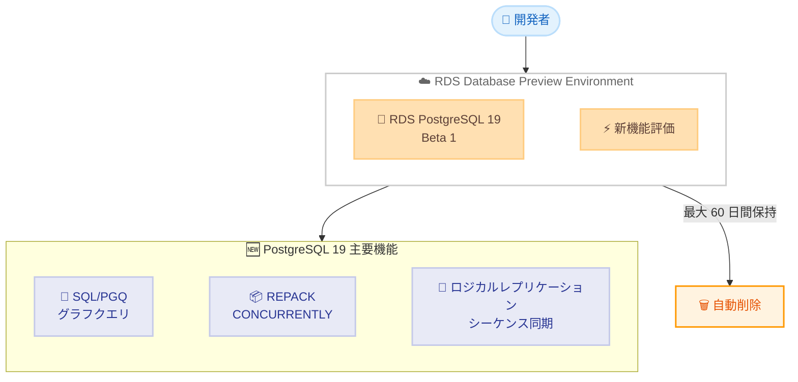

# Amazon RDS for PostgreSQL - PostgreSQL 19 Beta 1 プレビュー提供開始

**リリース日**: 2026年6月8日
**サービス**: Amazon RDS for PostgreSQL
**機能**: PostgreSQL 19 Beta 1 (Database Preview Environment)

📊 [このアップデートのインフォグラフィックを見る](https://takech9203.github.io/aws-news-summary/20260608-postgresql-19-beta-1-amazon-rds-database-preview-environment.html)

## 概要

Amazon RDS Database Preview Environment で PostgreSQL 19 Beta 1 が利用可能になった。これにより、PostgreSQL 19 のプレリリースバージョンを Amazon RDS 上で事前評価できるようになる。PostgreSQL 19 は 2026 年 9 月〜10 月の正式リリースに先立ち、6 月 4 日にコミュニティからベータ版が公開されたばかりの最新メジャーバージョンである。

PostgreSQL 19 の最大の特徴は、SQL Property Graph Queries (SQL/PGQ) によるネイティブグラフクエリサポートの追加である。これにより、複雑なリレーションシップのトラバーサルを標準 SQL 内で直接表現でき、別途グラフデータベースを構築したりデータを同期したりする必要がなくなる。また、REPACK CONCURRENTLY によるノンブロッキングテーブル再構築、ロジカルレプリケーションのシーケンス自動同期、再起動なしでのロジカルレプリケーション有効化など、運用面の大幅な改善も含まれている。

**アップデート前の課題**

- グラフクエリを実行するには専用のグラフデータベースを別途構築し、PostgreSQL からデータを同期する必要があった
- テーブルの VACUUM FULL やリビルドはテーブルロックが必要で、本番環境で実行するとダウンタイムが発生していた
- メジャーバージョンアップグレード後にシーケンス値を手動で調整する必要があった
- ロジカルレプリケーションを有効化するにはサーバーの再起動が必要だった

**アップデート後の改善**

- SQL/PGQ により PostgreSQL 内でグラフパターンマッチングが直接実行可能になった
- REPACK CONCURRENTLY でテーブルへのアクセスを維持したまま再構築・ストレージ回収が可能になった
- ロジカルレプリケーションでシーケンス値がレプリカに自動同期されるようになった
- wal_level=replica の状態からサーバー再起動なしでロジカルレプリケーションを動的に有効化できるようになった

## アーキテクチャ図



RDS Database Preview Environment で PostgreSQL 19 Beta 1 を評価し、正式リリース前に新機能の互換性やパフォーマンスを検証できる構成を示している。

## サービスアップデートの詳細

### 主要機能

1. **SQL Property Graph Queries (SQL/PGQ)**
   - SQL 標準に準拠したプロパティグラフクエリをネイティブサポート
   - `CREATE PROPERTY GRAPH` でグラフスキーマを定義し、グラフパターンマッチングを標準 SQL 内で実行可能
   - 別途グラフデータベースを構築・同期する必要が不要に
   - ソーシャルネットワーク分析、不正検知、推薦システムなどのユースケースに最適

2. **REPACK CONCURRENTLY によるノンブロッキングテーブル再構築**
   - テーブルのリビルドと未使用ストレージの回収を本番稼働中に実行可能
   - VACUUM FULL と異なりテーブルロックが不要
   - ルーチンメンテナンス中もデータベースへのアクセスを維持

3. **ロジカルレプリケーションのシーケンス自動同期**
   - シーケンス値がレプリカに自動的に同期
   - メジャーバージョンアップグレードのカットオーバー後に手動でシーケンスを調整する作業が不要に
   - `CREATE PUBLICATION ... EXCEPT` で特定テーブルを除外したパブリケーションも可能に

4. **ロジカルレプリケーションの動的有効化**
   - `wal_level=replica` の状態からサーバー再起動なしでロジカルレプリケーションを有効化
   - 計画的ダウンタイムを削減
   - 新しい読み取り専用パラメータ `effective_wal_level` で現在有効な WAL レベルを確認可能

5. **パフォーマンス改善**
   - 外部キーチェック付き INSERT で最大 2 倍のパフォーマンス向上
   - パラレル autovacuum (`autovacuum_max_parallel_workers` で設定)
   - Anti-join 最適化、インクリメンタルソートの拡張適用
   - Eager aggregation (`enable_eager_aggregate`) による高速行処理
   - LISTEN/NOTIFY のマルチチャネルワークロードでのスケーラビリティ改善

6. **開発者体験の向上**
   - `INSERT ... ON CONFLICT DO SELECT ... RETURNING` で競合行を返却可能
   - `GROUP BY ALL` による自動グルーピング
   - `WAIT FOR LSN` コマンドでレプリカ上の read-your-writes パターンを実現
   - jsonpath に `lower()`, `upper()`, `replace()` 等の文字列関数を追加
   - テンポラルクエリで `UPDATE`/`DELETE` の `FOR PORTION OF` 句をサポート

7. **セキュリティ強化**
   - Server Name Indication (SNI) サポートによるホスト名別 TLS 証明書の提示
   - パスワード有効期限警告 (`password_expiration_warning_threshold`)
   - MD5 認証の非推奨化警告
   - RADIUS 認証の削除

## 技術仕様

### Database Preview Environment の制約

| 項目 | 詳細 |
|------|------|
| インスタンス保持期間 | 最大 60 日間 |
| 期間経過後 | 自動削除 |
| スナップショット | Preview Environment 内でのみ利用可能 |
| データ移行 | PostgreSQL dump/load で Import/Export 可能 |
| 料金体系 | US East (Ohio) リージョンの料金に準拠 |

### PostgreSQL 19 の主要な設定パラメータ

| パラメータ | 説明 |
|-----------|------|
| `autovacuum_max_parallel_workers` | パラレル autovacuum のワーカー数 |
| `enable_eager_aggregate` | Eager aggregation の有効化 |
| `effective_wal_level` | 現在有効な WAL レベル (読み取り専用) |
| `password_expiration_warning_threshold` | パスワード有効期限警告の日数 (デフォルト: 7) |
| `default_toast_compression` | TOAST 圧縮のデフォルト (lz4 に変更) |
| `io_min_workers` / `io_max_workers` | 非同期 I/O ワーカーの自動スケール範囲 |

## 設定方法

### 前提条件

1. AWS アカウントを持っていること
2. Amazon RDS Database Preview Environment へのアクセス権限があること
3. 評価目的であることを理解していること (本番利用不可)

### 手順

#### ステップ 1: RDS Database Preview Environment にアクセス

```bash
# AWS CLI で Preview Environment のエンドポイントを使用
# Preview Environment 専用のコンソール URL にアクセス
# https://us-east-2.console.aws.amazon.com/rds-preview/home
```

RDS Database Preview Environment は通常の RDS コンソールとは別のインターフェースで提供される。US East (Ohio) リージョンで利用可能である。

#### ステップ 2: PostgreSQL 19 Beta 1 インスタンスを作成

```bash
aws rds create-db-instance \
  --db-instance-identifier my-pg19-beta-test \
  --db-instance-class db.m6g.large \
  --engine postgres \
  --engine-version 19.0 \
  --master-username postgres \
  --master-user-password <your-password> \
  --allocated-storage 100 \
  --endpoint-url https://rds-preview.us-east-2.amazonaws.com
```

Preview Environment 用のエンドポイント URL を指定して DB インスタンスを作成する。エンジンバージョンとして PostgreSQL 19 を指定する。

#### ステップ 3: SQL/PGQ グラフクエリの評価例

```sql
-- プロパティグラフの作成
CREATE PROPERTY GRAPH social_network
  VERTEX TABLES (
    users KEY (user_id)
      LABEL Person PROPERTIES (name, age)
  )
  EDGE TABLES (
    friendships KEY (friendship_id)
      SOURCE KEY (user_id_1) REFERENCES users (user_id)
      DESTINATION KEY (user_id_2) REFERENCES users (user_id)
      LABEL Knows
  );

-- グラフパターンマッチングクエリ
SELECT p1.name, p2.name
FROM social_network GRAPH_TABLE (
  MATCH (p1:Person)-[:Knows]->(p2:Person)
  WHERE p1.age > 30
  COLUMNS (p1.name, p2.name)
);
```

SQL/PGQ を使用してリレーショナルテーブル上にグラフ構造を定義し、標準 SQL でグラフパターンマッチングを実行する。

#### ステップ 4: REPACK CONCURRENTLY の評価例

```sql
-- テーブルをノンブロッキングで再構築
REPACK TABLE large_table CONCURRENTLY;
```

本番環境を想定した負荷テスト中に REPACK CONCURRENTLY を実行し、テーブルへのアクセスが維持されることを確認する。

## メリット

### ビジネス面

- **事前評価によるリスク低減**: 正式リリース前に互換性やパフォーマンスを検証でき、アップグレード計画を早期に策定可能
- **グラフデータベースコストの削減**: SQL/PGQ により別途グラフデータベースを運用する必要がなくなり、インフラコストと運用負荷を削減
- **ダウンタイムの短縮**: REPACK CONCURRENTLY とロジカルレプリケーションの動的有効化により、メンテナンスウィンドウを最小化

### 技術面

- **統合データモデル**: グラフクエリとリレーショナルクエリを同一データベースで実行可能
- **運用の簡素化**: シーケンス自動同期によりメジャーバージョンアップグレードの手順が大幅に簡略化
- **パフォーマンス向上**: パラレル autovacuum、Eager aggregation、外部キーチェック最適化などにより全体的なスループットが向上
- **標準 SQL 準拠**: SQL/PGQ は SQL 標準に準拠しており、ベンダーロックインのリスクが低い

## デメリット・制約事項

### 制限事項

- Preview Environment のインスタンスは最大 60 日で自動削除される
- Preview Environment で作成したスナップショットは Preview Environment 内でのみ利用可能
- 本番ワークロードには使用不可 (ベータ版のため)
- 利用可能リージョンは US East (Ohio) のみ
- PostgreSQL 19 はベータ版であり、正式リリースまでに仕様変更の可能性がある

### 考慮すべき点

- SQL/PGQ の実装はベータ段階であり、パフォーマンス特性が最終版と異なる可能性がある
- 既存のアプリケーションやエクステンションとの互換性を十分にテストする必要がある
- JIT がデフォルト無効化されたため、JIT に依存していたワークロードはパフォーマンス影響を確認する必要がある
- RADIUS 認証が削除されたため、RADIUS を使用している環境はアップグレード前に認証方式の変更が必要

## ユースケース

### ユースケース 1: ソーシャルグラフ分析の統合

**シナリオ**: SNS アプリケーションでユーザー間の友達関係や推薦を分析するために、PostgreSQL とは別に Neo4j を運用していた。データ同期のラグやインフラコストが課題となっていた。

**実装例**:
```sql
-- 友達の友達を探す (2 ホップ)
SELECT DISTINCT p3.name
FROM social_network GRAPH_TABLE (
  MATCH (p1:Person)-[:Knows]->(p2:Person)-[:Knows]->(p3:Person)
  WHERE p1.name = 'Alice' AND p3.name <> 'Alice'
  COLUMNS (p3.name)
);
```

**効果**: グラフデータベースの運用コスト削減、データ同期ラグの解消、SQL スキルのみでグラフクエリを記述可能

### ユースケース 2: ゼロダウンタイムメジャーバージョンアップグレード

**シナリオ**: 大規模な EC サイトのデータベースを PostgreSQL 18 から 19 にアップグレードする際、ロジカルレプリケーションを使用した Blue/Green デプロイメントを計画している。

**実装例**:
```sql
-- PostgreSQL 19 でロジカルレプリケーションを動的に有効化 (再起動不要)
ALTER SYSTEM SET wal_level = 'logical';
-- effective_wal_level で確認
SHOW effective_wal_level;

-- シーケンスも自動同期されるため、カットオーバー時の手動調整が不要
CREATE SUBSCRIPTION upgrade_sub
  CONNECTION 'host=old-primary dbname=mydb'
  PUBLICATION all_tables;
```

**効果**: アップグレード時のダウンタイムを数秒レベルに短縮、シーケンス不整合によるエラーリスクを排除

### ユースケース 3: 大規模テーブルのオンラインメンテナンス

**シナリオ**: 数百 GB のログテーブルで UPDATE/DELETE が頻繁に発生し、テーブルの肥大化 (bloat) が進行しているが、VACUUM FULL はテーブルロックが必要なため営業時間中に実行できない。

**実装例**:
```sql
-- ノンブロッキングでテーブルを再構築
REPACK TABLE access_logs CONCURRENTLY;

-- パラレル autovacuum で大規模テーブルの VACUUM を高速化
ALTER SYSTEM SET autovacuum_max_parallel_workers = 4;
SELECT pg_reload_conf();
```

**効果**: メンテナンスウィンドウ不要でテーブルサイズを最適化、I/O パフォーマンスの継続的な維持

## 料金

Database Preview Environment は US East (Ohio) リージョンの Amazon RDS for PostgreSQL の標準料金に準拠する。

### 料金例

| インスタンスクラス | 月額料金 (概算) |
|-------------------|----------------|
| db.m6g.large (2 vCPU, 8 GiB) | 約 $135/月 (オンデマンド) |
| db.m6g.xlarge (4 vCPU, 16 GiB) | 約 $270/月 (オンデマンド) |
| db.r6g.large (2 vCPU, 16 GiB) | 約 $170/月 (オンデマンド) |

※ Preview Environment は評価目的のため、最大 60 日間のみ課金される。ストレージ料金は別途発生する。

## 利用可能リージョン

Amazon RDS Database Preview Environment は US East (Ohio) リージョンで利用可能である。

## 関連サービス・機能

- **Amazon RDS for PostgreSQL**: PostgreSQL のフルマネージドデータベースサービス。PostgreSQL 19 の正式リリース後に本番環境で利用可能になる予定
- **Amazon Aurora PostgreSQL**: PostgreSQL 互換の高性能データベース。将来的に PostgreSQL 19 互換バージョンの提供が見込まれる
- **Amazon Neptune**: フルマネージドグラフデータベース。SQL/PGQ の登場により、シンプルなグラフワークロードでは RDS PostgreSQL への統合が選択肢になる
- **AWS Database Migration Service (DMS)**: ロジカルレプリケーションと組み合わせたデータベース移行に利用可能
- **Amazon RDS Blue/Green Deployments**: メジャーバージョンアップグレード時のダウンタイム最小化に活用

## 参考リンク

- 📊 [インフォグラフィック](https://takech9203.github.io/aws-news-summary/20260608-postgresql-19-beta-1-amazon-rds-database-preview-environment.html)
- [公式発表 (What's New)](https://aws.amazon.com/about-aws/whats-new/2026/06/postgresql-19-beta-1-amazon-rds-database-preview-environment/)
- [PostgreSQL 19 Beta 1 Released (コミュニティ)](https://www.postgresql.org/about/news/postgresql-19-beta-1-released-3313/)
- [Amazon RDS Database Preview Environment ドキュメント](https://docs.aws.amazon.com/AmazonRDS/latest/UserGuide/CHAP_PostgreSQL.html#PostgreSQL.Concepts.General.DBVersions)
- [Amazon RDS for PostgreSQL 料金ページ](https://aws.amazon.com/rds/postgresql/pricing/)

## まとめ

PostgreSQL 19 Beta 1 が Amazon RDS Database Preview Environment で利用可能になったことで、SQL/PGQ によるネイティブグラフクエリ、REPACK CONCURRENTLY によるノンブロッキングテーブル再構築、ロジカルレプリケーションのシーケンス自動同期と動的有効化など、PostgreSQL 19 の革新的な新機能を早期に評価できるようになった。特にグラフデータベースの代替としての可能性を検証したい組織や、メジャーバージョンアップグレード戦略を計画中のチームは、60 日間の Preview Environment を活用して互換性テストを開始することを推奨する。正式リリースは 2026 年 9 月〜10 月が予定されている。
