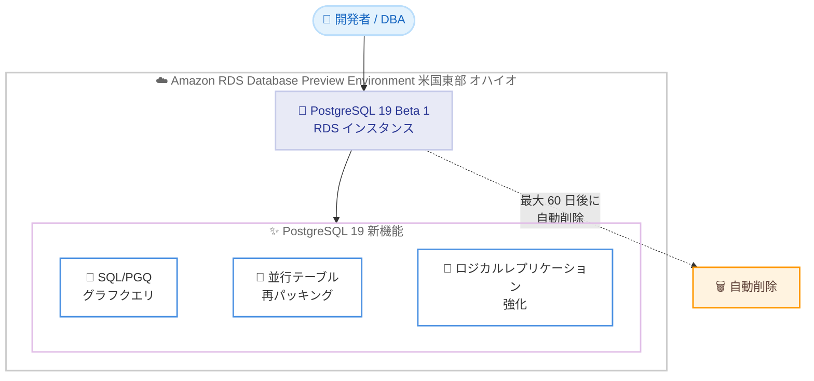

# Amazon RDS for PostgreSQL - PostgreSQL 19 Beta 1 プレビュー提供開始

**リリース日**: 2026 年 6 月 8 日
**サービス**: Amazon RDS for PostgreSQL
**機能**: PostgreSQL 19 Beta 1 (Amazon RDS Database Preview Environment)

📊 [このアップデートのインフォグラフィックを見る](https://takech9203.github.io/aws-news-summary/20260608-postgresql-19-beta-1-amazon-rds-database-preview-environment.html)
<!-- INFOGRAPHIC_BASE_URL は環境変数から取得 -->

## 概要

Amazon RDS for PostgreSQL 19 Beta 1 が Amazon RDS Database Preview Environment で利用可能になりました。これにより、お客様はマネージドデータベースサービスである Amazon RDS 上で、正式リリース前の PostgreSQL 19 を評価できます。本番環境に影響を与えることなく、新バージョンの新機能や互換性を事前に検証できる点が大きな価値です。

PostgreSQL 19 は、いくつかの注目すべき機能を追加しています。SQL Property Graph Queries (SQL/PGQ) によるネイティブなグラフクエリのサポートにより、複雑なリレーションシップの探索を標準 SQL で直接表現できます。また、テーブルの再構築と未使用ストレージの再利用を行う並行テーブル再パッキング (concurrent table repacking) により、定期的なテーブルメンテナンス中も本番データベースをアクセス可能な状態に保てます。さらに、ロジカルレプリケーションがシーケンス値をレプリカに自動同期するようになり、メジャーバージョンアップグレードのカットオーバー後の手動シーケンス調整が不要になります。

本機能の対象は、新バージョンの検証を計画しているデータベース管理者、開発者、ソリューションアーキテクトです。Amazon RDS Database Preview Environment のデータベースインスタンスは最大 60 日間保持され、保持期間経過後は自動的に削除されます。料金は米国東部 (オハイオ) リージョンの料金に従います。

**アップデート前の課題**

これまでの PostgreSQL では、以下のような課題がありました。

- グラフ構造のデータに対する複雑なリレーションシップ探索を行うには、アプリケーション側で独自のロジックを構築するか、専用のグラフデータベースとデータを同期する必要があった
- テーブルの再構築やストレージ再利用のためのメンテナンス操作は排他ロックを伴い、実行中は本番データベースへのアクセスが制限された
- メジャーバージョンアップグレードのカットオーバー後、ロジカルレプリケーションではシーケンス値が同期されないため、手動でのシーケンス調整が必要だった
- ロジカルレプリケーションを有効化するにはサーバーの再起動が必要で、計画的なダウンタイムが発生していた

**アップデート後の改善**

PostgreSQL 19 Beta 1 のプレビュー提供により、以下が可能になりました。

- SQL/PGQ により、複雑なリレーションシップ探索を標準 SQL で直接表現でき、別途アプリケーションロジックの構築や 2 つのデータベース間のデータ同期が不要になった
- 並行テーブル再パッキングにより、定期的なテーブルメンテナンス中も本番データベースをアクセス可能な状態に保てるようになった
- ロジカルレプリケーションがシーケンス値をレプリカに自動同期するため、アップグレードカットオーバー後の手動シーケンス調整が不要になった
- ロジカルレプリケーションをサーバーの再起動なしで動的に有効化できるようになり、計画的なダウンタイムが削減された

## アーキテクチャ図



開発者や DBA が Amazon RDS Database Preview Environment に PostgreSQL 19 Beta 1 のインスタンスを作成し、新機能を検証する流れを示しています。プレビュー環境のインスタンスは最大 60 日後に自動削除されます。

## サービスアップデートの詳細

### 主要機能

1. **SQL Property Graph Queries (SQL/PGQ) によるネイティブグラフクエリ**
   - 複雑なリレーションシップの探索を標準 SQL で直接表現できる
   - 別途アプリケーションロジックを構築する必要がなくなる
   - 専用のグラフデータベースとデータを同期する必要がなくなり、データの一元管理が可能になる

2. **並行テーブル再パッキング (concurrent table repacking)**
   - テーブルを再構築し、未使用ストレージを再利用する
   - 定期的なテーブルメンテナンス中も本番データベースをアクセス可能な状態に保てる
   - 従来の排他ロックを伴うメンテナンス操作によるダウンタイムを回避できる

3. **ロジカルレプリケーションのシーケンス値自動同期**
   - シーケンス値をレプリカに自動同期する
   - メジャーバージョンアップグレードのカットオーバー後の手動シーケンス調整が不要になる
   - アップグレード作業のリスクと手間を低減する

4. **ロジカルレプリケーションの動的有効化**
   - サーバーの再起動なしでロジカルレプリケーションを有効化できる
   - 計画的なダウンタイムを削減する

## 技術仕様

### Amazon RDS Database Preview Environment の特性

| 項目 | 詳細 |
|------|------|
| エンジンバージョン | PostgreSQL 19 Beta 1 (正式リリース前) |
| インスタンス保持期間 | 最大 60 日間 (経過後に自動削除) |
| 提供リージョン | 米国東部 (オハイオ) |
| 料金 | 米国東部 (オハイオ) リージョンの料金に準拠 |
| データのインポート / エクスポート | PostgreSQL の dump および load 機能を利用可能 |
| スナップショットの利用範囲 | プレビュー環境内でのインスタンス作成・復元のみに利用可能 |

### PostgreSQL 19 の主な新機能

| 機能 | 概要 |
|------|------|
| SQL/PGQ | 標準 SQL によるネイティブなグラフクエリのサポート |
| 並行テーブル再パッキング | アクセスを維持したままテーブル再構築とストレージ再利用 |
| シーケンス値の自動同期 | ロジカルレプリケーションでシーケンス値を自動同期 |
| 動的なロジカルレプリケーション | サーバー再起動なしでの有効化 |

## 設定方法

### 前提条件

1. AWS アカウントと、Amazon RDS の操作権限を持つ IAM ユーザーまたはロール
2. 米国東部 (オハイオ) リージョンの利用
3. プレビュー環境のインスタンスは本番利用を想定していないことの理解

### 手順

#### ステップ 1: Amazon RDS Database Preview Environment へアクセス

AWS マネジメントコンソールで Amazon RDS のコンソールを開き、Database Preview Environment に切り替えます。プレビュー環境は通常の本番環境とは分離されており、専用のコンソール画面から操作します。

#### ステップ 2: PostgreSQL 19 Beta 1 インスタンスの作成

データベースの作成時に、エンジンとして PostgreSQL を選択し、バージョンとして PostgreSQL 19 Beta 1 を指定します。インスタンスクラスやストレージなどのパラメータを設定して、インスタンスを起動します。

#### ステップ 3: 新機能の検証とデータの投入

PostgreSQL の dump および load 機能を使用して、検証対象のデータをインポートします。投入したデータに対して SQL/PGQ によるグラフクエリや並行テーブル再パッキングなどの新機能を検証します。検証完了後、必要なデータは dump 機能でエクスポートしておきます。プレビュー環境のインスタンスは最大 60 日で自動削除されるため、重要なデータを残さないよう注意してください。

## メリット

### ビジネス面

- **本番移行前の早期検証**: 正式リリース前に PostgreSQL 19 の新機能を評価でき、本番移行の計画を前倒しで進められる
- **マネージドサービスでの検証**: フルマネージドな Amazon RDS 上で検証できるため、検証環境の構築・運用負荷が低い
- **アップグレード作業の効率化**: シーケンス値の自動同期や動的なロジカルレプリケーションにより、将来のメジャーバージョンアップグレードのダウンタイムとリスクを低減できる

### 技術面

- **グラフ処理の簡素化**: SQL/PGQ により、専用のグラフデータベースを併用せずに標準 SQL でグラフクエリを実行できる
- **可用性の向上**: 並行テーブル再パッキングにより、メンテナンス中もデータベースへのアクセスを維持できる
- **運用の自動化**: ロジカルレプリケーションのシーケンス同期が自動化され、手動調整によるヒューマンエラーを防げる

## デメリット・制約事項

### 制限事項

- プレビュー環境のデータベースインスタンスは最大 60 日間で自動削除される
- プレビュー環境で作成したスナップショットは、同一のプレビュー環境内でのインスタンス作成・復元にのみ利用できる
- 提供リージョンは米国東部 (オハイオ) に限定される
- Beta 版であるため、本番ワークロードでの利用は推奨されない

### 考慮すべき点

- Beta 1 は正式リリース前のバージョンであり、機能や仕様が正式リリースまでに変更される可能性がある
- 重要なデータはプレビュー環境に残さず、dump 機能でエクスポートして保管する必要がある
- プレビュー環境から本番環境への直接的なアップグレードパスはないため、検証結果をもとに正式リリース後に改めて移行を計画する

## ユースケース

### ユースケース 1: グラフ構造データの SQL/PGQ への移行検証

**シナリオ**: ソーシャルネットワークや推薦エンジンなど、リレーションシップ探索が中心のアプリケーションで、専用グラフデータベースと PostgreSQL を併用している。SQL/PGQ への一本化を検討している。

**実装例**:
```
1. プレビュー環境に PostgreSQL 19 Beta 1 インスタンスを作成
2. 既存のリレーションシップデータを dump / load でインポート
3. SQL/PGQ を用いたグラフクエリで探索処理を再実装し、結果と性能を検証
```

**効果**: アプリケーションロジックやデータ同期処理を削減し、データストアを PostgreSQL に一元化できる見通しを立てられる

### ユースケース 2: メンテナンスダウンタイムの削減検証

**シナリオ**: 大規模テーブルの肥大化により、定期的なメンテナンス操作の実行時にダウンタイムが発生している。

**実装例**:
```
1. プレビュー環境で対象テーブルを再現
2. 並行テーブル再パッキングを実行し、アクセス可能性とストレージ再利用効果を検証
3. メンテナンスウィンドウへの影響を測定
```

**効果**: メンテナンス中もアクセスを維持できることを確認し、本番運用での可用性向上を見込める

### ユースケース 3: メジャーバージョンアップグレードのリハーサル

**シナリオ**: ロジカルレプリケーションを用いたメジャーバージョンアップグレードを計画しているが、シーケンス値の手動調整やレプリケーション有効化時の再起動が運用上の負担となっている。

**実装例**:
```
1. プレビュー環境で PostgreSQL 19 Beta 1 を用意
2. ロジカルレプリケーションを動的に有効化し、再起動が不要であることを確認
3. カットオーバー後にシーケンス値が自動同期されることを検証
```

**効果**: アップグレード手順を簡素化し、計画ダウンタイムと手動作業を削減できる

## 料金

Amazon RDS Database Preview Environment のデータベースインスタンスは、米国東部 (オハイオ) リージョンの Amazon RDS for PostgreSQL の料金に従って課金されます。プレビュー環境専用の特別料金や割引はなく、通常の RDS インスタンス、ストレージ、I/O などの料金が適用されます。

### 料金例

| 使用量 | 月額料金 (概算) |
|--------|------------------|
| インスタンス料金 | 米国東部 (オハイオ) リージョンの RDS for PostgreSQL 料金に準拠 |
| ストレージ / I/O 料金 | 通常の RDS 料金体系に準拠 |

正確な料金は Amazon RDS for PostgreSQL の料金ページを参照してください。

## 利用可能リージョン

Amazon RDS Database Preview Environment は **米国東部 (オハイオ)** リージョンで提供されています。本機能の評価は同リージョンで実施します。

## 関連サービス・機能

- **Amazon RDS for PostgreSQL**: 本機能の対象となるマネージド PostgreSQL データベースサービス
- **Amazon Aurora PostgreSQL**: 高可用性とスケーラビリティを備えた PostgreSQL 互換のマネージドデータベース。本番移行先の選択肢として検討可能
- **AWS Database Migration Service (DMS)**: 検証後の本番移行やデータ移行に活用できるサービス

## 参考リンク

- 📊 [インフォグラフィック](https://takech9203.github.io/aws-news-summary/20260608-postgresql-19-beta-1-amazon-rds-database-preview-environment.html)
- [公式発表 (What's New)](https://aws.amazon.com/about-aws/whats-new/2026/06/postgresql-19-beta-1-amazon-rds-database-preview-environment/)
- [Amazon RDS for PostgreSQL ドキュメント](https://docs.aws.amazon.com/AmazonRDS/latest/UserGuide/CHAP_PostgreSQL.html)
- [Amazon RDS Database Preview Environment ドキュメント](https://docs.aws.amazon.com/AmazonRDS/latest/UserGuide/Concepts.RDS_Fea_Regions_DB-eng.Feature.PreviewEnvironment.html)
- [Amazon RDS for PostgreSQL 料金ページ](https://aws.amazon.com/rds/postgresql/pricing/)

## まとめ

PostgreSQL 19 Beta 1 が Amazon RDS Database Preview Environment で利用可能になり、SQL/PGQ によるネイティブグラフクエリ、並行テーブル再パッキング、ロジカルレプリケーションの強化といった注目機能をマネージド環境で事前検証できるようになりました。本番移行を見据えるお客様は、米国東部 (オハイオ) リージョンのプレビュー環境で早期に互換性と性能を評価することを推奨します。プレビュー環境のインスタンスは最大 60 日で自動削除されるため、重要なデータは必ずエクスポートして保管してください。
