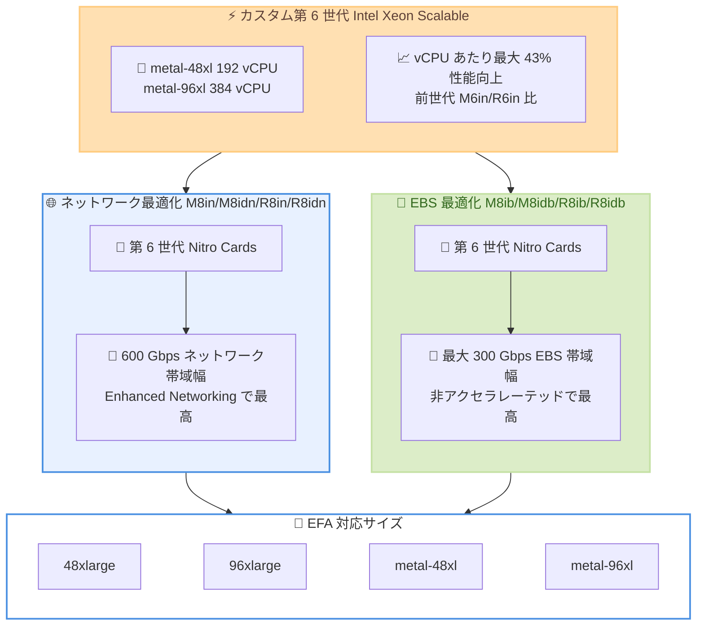

# Amazon EC2 - ネットワーク/EBS 最適化インスタンス向け metal-48xl および metal-96xl サイズ

**リリース日**: 2026 年 6 月 9 日
**サービス**: Amazon EC2
**機能**: M8in/M8ib/M8idn/M8idb/R8in/R8ib/R8idn/R8idb の metal-48xl および metal-96xl サイズ

📊 [このアップデートのインフォグラフィックを見る](https://takech9203.github.io/aws-news-summary/20260609-amazon-ec2-metal-sizes-network-EBS.html)
<!-- INFOGRAPHIC_BASE_URL は環境変数から取得 -->

## 概要

AWS は、Amazon EC2 の M8in、M8ib、M8idn、M8idb、R8in、R8ib、R8idn、R8idb インスタンスに対して、新しい metal-48xl および metal-96xl サイズの一般提供を発表した。これらのインスタンスは AWS でのみ利用可能なカスタム第 6 世代 Intel Xeon Scalable プロセッサを搭載し、最新の第 6 世代 AWS Nitro Cards を備える。前世代の M6in、M6idn、R6in、R6idn インスタンスと比較して、vCPU あたり最大 43% 優れたコンピューティングパフォーマンスを提供する。

これらの新しいベアメタルサイズにより、ハードウェアへの直接アクセスを必要とするワークロードでも、ネットワーク最適化および EBS 最適化インスタンスの高い性能を活用できるようになった。M8in、M8idn、R8in、R8idn インスタンスは 600 Gbps のネットワーク帯域幅を提供し、これは Enhanced Networking 対応 EC2 インスタンスの中で最高である。一方、M8ib、M8idb、R8ib、R8idb インスタンスは最大 300 Gbps の EBS 帯域幅を提供し、これは非アクセラレーテッドコンピューティング EC2 インスタンスの中で最高である。

対象ユーザーは、リアルタイムビッグデータ分析、分散型 Web スケールインメモリキャッシュ、AI/ML クラスタ向けキャッシュフリート、Telco 5G UPF といったネットワーク集約型ワークロード、および高性能ファイルシステム、NoSQL データベース、大規模商用データベース、データレイクといったストレージ集約型ワークロードを運用する組織である。

**アップデート前の課題**

- M8in/M8ib/M8idn/M8idb/R8in/R8ib/R8idn/R8idb インスタンスにはベアメタルサイズが提供されていなかった
- ハイパーバイザーを介さない直接的なハードウェアアクセスを必要とするワークロードでは、これらのネットワーク/EBS 最適化インスタンスを利用できなかった
- 仮想化を許可しないライセンス要件を持つアプリケーションや、独自のハイパーバイザーを実行するワークロードで、第 8 世代の高帯域幅インスタンスを活用しにくかった

**アップデート後の改善**

- metal-48xl (192 vCPU) と metal-96xl (384 vCPU) のベアメタルサイズが利用可能に
- ベアメタル環境でも 600 Gbps ネットワーク帯域幅 (M8in/M8idn/R8in/R8idn) または 300 Gbps EBS 帯域幅 (M8ib/M8idb/R8ib/R8idb) を活用可能
- 48xlarge、96xlarge、metal-48xl、metal-96xl の各サイズで Elastic Fabric Adapter (EFA) ネットワーキングをサポート
- 前世代比で vCPU あたり最大 43% のコンピューティングパフォーマンス向上を実現

## アーキテクチャ図



新しいベアメタルサイズは、第 6 世代 Intel Xeon Scalable プロセッサと第 6 世代 Nitro Cards を組み合わせ、ネットワーク最適化系では 600 Gbps、EBS 最適化系では最大 300 Gbps の帯域幅をベアメタルで提供する。

## サービスアップデートの詳細

### 主要機能

1. **新しいベアメタルサイズの追加**
   - metal-48xl: 192 vCPU
   - metal-96xl: 384 vCPU
   - ハイパーバイザーを介さず、基盤となるサーバーハードウェアへ直接アクセス可能
   - 対象は M8in、M8ib、M8idn、M8idb、R8in、R8ib、R8idn、R8idb の 8 ファミリー

2. **高いネットワーク帯域幅 (M8in/M8idn/R8in/R8idn)**
   - 600 Gbps のネットワーク帯域幅を提供
   - Enhanced Networking 対応 EC2 インスタンスの中で最高
   - リアルタイムビッグデータ分析、分散型インメモリキャッシュ、AI/ML クラスタのキャッシュフリート、Telco 5G UPF に最適

3. **高い EBS 帯域幅 (M8ib/M8idb/R8ib/R8idb)**
   - 最大 300 Gbps の EBS 帯域幅を提供
   - 非アクセラレーテッドコンピューティング EC2 インスタンスの中で最高
   - 高性能ファイルシステム、NoSQL データベース、大規模商用データベース、データレイクに最適

4. **Elastic Fabric Adapter (EFA) のサポート**
   - 48xlarge、96xlarge、metal-48xl、metal-96xl の各サイズで EFA ネットワーキングをサポート
   - 密結合された HPC やクラスタワークロードで低レイテンシと高いクラスタ性能を実現

## 技術仕様

### インスタンスファミリーとサイズ

| ファミリー | 特性 | metal-48xl | metal-96xl |
|------|------|------------|------------|
| M8in / M8idn | 汎用 + ネットワーク最適化 (600 Gbps) | 192 vCPU / 768 GiB | 384 vCPU / 1,536 GiB |
| M8ib / M8idb | 汎用 + EBS 最適化 (最大 300 Gbps) | 192 vCPU / 768 GiB | 384 vCPU / 1,536 GiB |
| R8in / R8idn | メモリ最適化 + ネットワーク最適化 (600 Gbps) | 192 vCPU / 1,536 GiB | 384 vCPU / 3,072 GiB |
| R8ib / R8idb | メモリ最適化 + EBS 最適化 (最大 300 Gbps) | 192 vCPU / 1,536 GiB | 384 vCPU / 3,072 GiB |

> 注: `d` 付き (M8idn、M8idb、R8idn、R8idb) はローカル NVMe SSD ストレージを搭載するバリエーションである。メモリ容量はインスタンスファミリーの標準的な vCPU 対メモリ比に基づく値であり、正確な仕様は公式ドキュメントで確認すること。

### 主要な性能指標

| 項目 | 詳細 |
|------|------|
| プロセッサ | カスタム第 6 世代 Intel Xeon Scalable (AWS 専用) |
| Nitro | 第 6 世代 AWS Nitro Cards |
| コンピューティング性能 | 前世代 M6in/M6idn/R6in/R6idn 比で vCPU あたり最大 43% 向上 |
| ネットワーク帯域幅 | 600 Gbps (M8in/M8idn/R8in/R8idn) |
| EBS 帯域幅 | 最大 300 Gbps (M8ib/M8idb/R8ib/R8idb) |
| EFA 対応サイズ | 48xlarge、96xlarge、metal-48xl、metal-96xl |

### API変更履歴

今回のアップデートに直接関連する API の変更は確認されていない。新しいインスタンスサイズは既存の EC2 API (`RunInstances` など) で `InstanceType` に指定することで利用できる。

## 設定方法

### 前提条件

1. AWS US East (N. バージニア) リージョンで EC2 を利用できる権限を持つ AWS アカウント
2. 対象インスタンスタイプの起動に必要な vCPU クォータ (大規模サイズのため事前にクォータ引き上げが必要な場合がある)
3. ベアメタルサイズを使用する場合、OS およびアプリケーションがベアメタル環境に対応していること

### 手順

#### ステップ1: 利用可能なインスタンスタイプの確認

```bash
aws ec2 describe-instance-types \
  --filters "Name=instance-type,Values=m8in.metal-48xl,m8in.metal-96xl" \
  --region us-east-1
```

指定したベアメタルサイズが対象リージョンで提供されているか、および vCPU やメモリなどの詳細仕様を確認する。

#### ステップ2: ベアメタルインスタンスの起動

```bash
aws ec2 run-instances \
  --image-id ami-xxxxxxxxxxxxxxxxx \
  --instance-type m8in.metal-48xl \
  --region us-east-1 \
  --count 1
```

metal-48xl サイズの M8in インスタンスを起動する。`--instance-type` を `r8ib.metal-96xl` などに変更することで他のファミリーやサイズを起動できる。

#### ステップ3: EFA を有効化したクラスタ構成 (任意)

密結合された HPC やキャッシュクラスタを構築する場合は、EFA 対応のネットワークインターフェイスを作成し、クラスタプレイスメントグループ内でインスタンスを起動する。これにより低レイテンシと高いクラスタ性能を実現できる。

## メリット

### ビジネス面

- **既存ワークロードの移行容易性**: 仮想化を許可しないライセンス要件や独自ハイパーバイザーを必要とするアプリケーションを、最新世代のネットワーク/EBS 最適化インスタンスへ移行できる
- **コスト効率の向上**: vCPU あたり最大 43% の性能向上により、同等のワークロードをより少ないリソースで処理できる可能性がある
- **大規模ワークロードの集約**: metal-96xl の 384 vCPU により、大規模データベースや分析基盤を単一インスタンスに集約できる

### 技術面

- **直接的なハードウェアアクセス**: ハイパーバイザーのオーバーヘッドなしで CPU やメモリの全リソースを活用できる
- **最高クラスの帯域幅**: 600 Gbps ネットワークまたは最大 300 Gbps EBS をベアメタルで利用可能
- **EFA による高性能クラスタ**: 密結合された分散ワークロードで低レイテンシ通信を実現

## デメリット・制約事項

### 制限事項

- 現時点では AWS US East (N. バージニア) リージョンでのみ提供
- 600 Gbps のネットワーク帯域幅はネットワーク最適化系 (M8in/M8idn/R8in/R8idn) のみ、最大 300 Gbps の EBS 帯域幅は EBS 最適化系 (M8ib/M8idb/R8ib/R8idb) のみが対象
- 大規模なベアメタルサイズのため、相応の vCPU クォータと予算が必要

### 考慮すべき点

- ベアメタルインスタンスは仮想化されたインスタンスと比べて起動に時間がかかる場合がある
- ワークロードがベアメタルの全リソースを活用できない場合、仮想化された 48xlarge/96xlarge サイズの方がコスト効率が良い可能性がある
- 帯域幅特性 (ネットワーク重視か EBS 重視か) に応じて適切なファミリーを選択する必要がある

## ユースケース

### ユースケース1: AI/ML クラスタ向けの大規模インメモリキャッシュ

**シナリオ**: AI/ML 学習クラスタへ高速にデータを供給するため、分散型のインメモリキャッシュフリートを構築したい。ネットワーク帯域幅がボトルネックになっている。

**実装例**:
```
インスタンス: R8in.metal-96xl (384 vCPU / 3,072 GiB)
ネットワーク: 600 Gbps + EFA
構成: クラスタプレイスメントグループ内に複数台を配置
```

**効果**: 600 Gbps のネットワーク帯域幅と EFA により、キャッシュノード間およびクラスタへのデータ供給を低レイテンシで実現する。

### ユースケース2: 大規模商用データベースのベアメタル運用

**シナリオ**: 仮想化を許可しないライセンス要件を持つ大規模商用データベースを、高い EBS スループットで運用したい。

**実装例**:
```
インスタンス: R8ib.metal-48xl (192 vCPU / 1,536 GiB)
ストレージ: 最大 300 Gbps EBS 帯域幅
```

**効果**: ベアメタルによる直接ハードウェアアクセスでライセンス要件を満たしつつ、最大 300 Gbps の EBS 帯域幅でデータベース I/O 性能を最大化する。

### ユースケース3: Telco 5G UPF (User Plane Function)

**シナリオ**: 5G コアネットワークのユーザープレーン機能 (UPF) を、低レイテンシかつ高スループットで処理したい。

**実装例**:
```
インスタンス: M8in.metal-96xl (384 vCPU / 1,536 GiB)
ネットワーク: 600 Gbps
```

**効果**: ベアメタルの直接ハードウェアアクセスと 600 Gbps のネットワーク帯域幅により、大量のパケット処理を低レイテンシで安定して実行できる。

## 料金

これらのインスタンスは、オンデマンド、Savings Plans、リザーブドインスタンス、スポットインスタンスの各料金モデルで利用できる。具体的な時間あたり料金はインスタンスファミリーとサイズによって異なるため、最新の価格は EC2 オンデマンド料金ページで確認すること。

### 料金例

| 使用量 | 月額料金（概算） |
|--------|------------------|
| 正確な料金 | EC2 料金ページを参照 |
| 最適化手段 | Savings Plans / リザーブドインスタンスで割引適用可能 |

## 利用可能リージョン

新しい metal-48xl および metal-96xl サイズは、AWS US East (N. バージニア) リージョンで利用可能である。

## 関連サービス・機能

- **AWS Nitro System**: 第 6 世代 Nitro Cards が高帯域幅ネットワークと EBS 性能、ベアメタルアクセスを支える基盤である
- **Elastic Fabric Adapter (EFA)**: 密結合された HPC やクラスタワークロードで低レイテンシ通信を実現するネットワークインターフェイス
- **Amazon EBS**: M8ib/M8idb/R8ib/R8idb の最大 300 Gbps の帯域幅で接続される高性能ブロックストレージ
- **クラスタプレイスメントグループ**: EFA と組み合わせて低レイテンシなクラスタを構成する配置戦略

## 参考リンク

- 📊 [インフォグラフィック](https://takech9203.github.io/aws-news-summary/20260609-amazon-ec2-metal-sizes-network-EBS.html)
- [公式発表 (What's New)](https://aws.amazon.com/about-aws/whats-new/2026/06/amazon-ec2-metal-sizes-network-EBS/)
- [Amazon EC2 M8i インスタンス](https://aws.amazon.com/ec2/instance-types/m8i/)
- [Amazon EC2 ベアメタルインスタンス](https://aws.amazon.com/ec2/instance-types/)
- [Amazon EC2 オンデマンド料金](https://aws.amazon.com/ec2/pricing/on-demand/)

## まとめ

今回のアップデートにより、ネットワーク最適化および EBS 最適化された第 8 世代インスタンス (M8in/M8ib/M8idn/M8idb/R8in/R8ib/R8idn/R8idb) でベアメタルサイズが利用可能になり、仮想化を許可しないワークロードや独自ハイパーバイザーを必要とするワークロードでも最高クラスの帯域幅と性能を活用できるようになった。ネットワーク集約型ワークロードには 600 Gbps の M8in/R8in 系、ストレージ集約型ワークロードには最大 300 Gbps の M8ib/R8ib 系を選択するとよい。まずは AWS US East (N. バージニア) リージョンで、対象ワークロードに適したファミリーとサイズの検証を進めることを推奨する。
