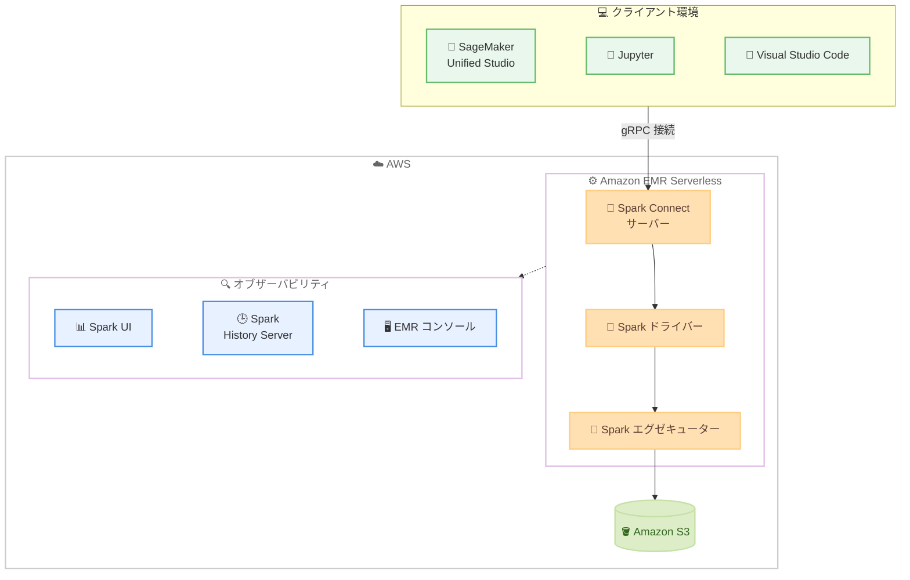

# Amazon EMR Serverless - Spark Connect によるインタラクティブワークロード

**リリース日**: 2026 年 6 月 9 日
**サービス**: Amazon EMR Serverless
**機能**: Spark Connect を利用したインタラクティブセッション

📊 [このアップデートのインフォグラフィックを見る](https://takech9203.github.io/aws-news-summary/20260609-amazon-emr-serverless-spark-connect.html)
<!-- INFOGRAPHIC_BASE_URL は環境変数から取得 -->

## 概要

Amazon EMR Serverless が Spark Connect を利用したインタラクティブセッションに対応しました。これにより、Amazon SageMaker Unified Studio のマネージドノートブックに加えて、Jupyter や Visual Studio Code などのノートブック環境や IDE から、Apache Spark アプリケーションを開発および実行できるようになりました。

この機能は Spark Connect のクライアントサーバーアーキテクチャによって実現されています。Spark Connect はアプリケーションクライアントを Spark ドライバーから分離します。これにより、Spark インフラストラクチャを独立して実行しながら、お客様は使い慣れたツールをそのまま利用できます。インタラクティブセッションはセルやスクリプトをまたいで持続する Spark コンテキストを提供するため、ローカルでの Python コード実行とリモートでの Spark 処理を組み合わせて 1 つの環境で扱えます。

このアーキテクチャにより、アドホックなデータ探索、反復的なステップバイステップのデバッグ、本番デプロイ前の段階的な PySpark ジョブ開発といったワークフローが可能になります。オブザーバビリティの面では、Spark UI によるリアルタイムのセッション監視、Spark History Server による履歴追跡、EMR コンソールまたは API/CLI/SDK によるセッション管理が利用できます。本機能は EMR リリース 7.13 で利用可能です。対象ユーザーは、Spark を用いたデータ分析や ETL 開発を行うデータエンジニア、データサイエンティスト、データアナリストです。

**アップデート前の課題**

- 開発時に使い慣れた Jupyter や Visual Studio Code などのローカル IDE から EMR Serverless の Spark コンテキストへ直接接続して開発する手段が限られていた
- 個々のインタラクティブセッション単位での詳細なコストや使用状況の可視化が難しかった
- アクティブなセッションと完了したセッションを EMR コンソール上で一元的に監視・デバッグする仕組みが整っていなかった

**アップデート後の改善**

- SageMaker Unified Studio のマネージドノートブックに加え、Jupyter や Visual Studio Code などの好みの IDE から Spark アプリケーションを開発・実行できるようになった
- 個々のセッション単位で詳細なコストと使用状況を可視化できるようになった
- Spark UI、Spark History Server、EMR コンソール/API/CLI/SDK を通じて、セッションの監視・デバッグ・管理が可能になった

## アーキテクチャ図



Spark Connect のクライアントサーバーアーキテクチャにより、ローカル IDE やノートブックがクライアントとして EMR Serverless 上の Spark ドライバーから分離され、リモートの Spark コンテキストへ接続して処理を実行します。

## サービスアップデートの詳細

### 主要機能

1. **Spark Connect によるインタラクティブセッション**
   - クライアントサーバーアーキテクチャにより、アプリケーションクライアントを Spark ドライバーから分離する
   - セルやスクリプトをまたいで持続する Spark コンテキストを提供する
   - ローカルの Python コード実行とリモートの Spark 処理を 1 つの環境で組み合わせて実行できる

2. **複数のノートブック環境および IDE のサポート**
   - Amazon SageMaker Unified Studio のマネージドノートブック
   - Jupyter
   - Visual Studio Code をはじめとする好みの IDE およびノートブック環境

3. **セッションのオブザーバビリティと管理**
   - Spark UI によるリアルタイムのセッション監視
   - Spark History Server による履歴追跡
   - EMR コンソールまたは API/CLI/SDK によるセッション管理
   - アクティブなセッションと完了したセッションを EMR コンソールで監視・デバッグできる

4. **セッション単位のコストと使用状況の可視化**
   - 個々のセッション単位で詳細なコストと使用状況を把握できる

## 技術仕様

### 主要な技術要素

| 項目 | 詳細 |
|------|------|
| 対応 EMR リリース | EMR リリース 7.13 |
| 接続方式 | Spark Connect (クライアントサーバーアーキテクチャ) |
| 対応クライアント | SageMaker Unified Studio、Jupyter、Visual Studio Code などの IDE/ノートブック |
| 対応エンジン | Apache Spark (PySpark を含む) |
| 監視 | Spark UI、Spark History Server、EMR コンソール |
| 管理インターフェース | EMR コンソール、API/CLI/SDK |

### API 変更履歴

本アップデートに直接関連する公開済みの API 変更履歴は確認されていません。セッションの管理は EMR Serverless の既存の API/CLI/SDK を通じて行えます。

## 設定方法

### 前提条件

1. EMR リリース 7.13 に対応した EMR Serverless アプリケーションを利用できること
2. EMR Serverless へのアクセスに必要な基本的な IAM 権限が設定されていること
3. インタラクティブセッションに接続するクライアント (SageMaker Unified Studio、Jupyter、Visual Studio Code など) が準備されていること
4. インタラクティブワークロードを実行するための十分な vCPU サービスクォータが確保されていること

### 手順

#### ステップ 1: インタラクティブ対応の EMR Serverless アプリケーションを作成する

```bash
aws emr-serverless create-application \
  --release-label emr-7.13.0 \
  --type SPARK \
  --name interactive-spark-connect-app
```

EMR リリース 7.13 を指定して Spark タイプの EMR Serverless アプリケーションを作成します。インタラクティブセッションを利用する前提となるアプリケーションを用意するステップです。

#### ステップ 2: アプリケーションを事前起動する

```bash
aws emr-serverless start-application \
  --application-id <your-application-id>
```

アプリケーションを事前に起動し、クライアントからセッションを接続する際にすぐ利用できる状態にします。事前初期化容量を構成しておくと、起動時の待ち時間を短縮できます。

#### ステップ 3: クライアントから Spark Connect で接続する

SageMaker Unified Studio のマネージドノートブック、または Jupyter や Visual Studio Code から Spark Connect を介して EMR Serverless 上の Spark コンテキストに接続します。接続後はセルやスクリプトをまたいで持続する Spark コンテキスト上で、アドホックなデータ探索や段階的な PySpark ジョブ開発を行えます。

## メリット

### ビジネス面

- **開発生産性の向上**: 使い慣れた IDE やノートブックから直接 Spark を扱えるため、開発からデバッグまでの反復サイクルを高速化できる
- **コスト管理の精緻化**: 個々のセッション単位でコストと使用状況を可視化できるため、チームやプロジェクトごとの費用配賦や最適化が容易になる
- **運用負荷の低減**: サーバーレスのため、クラスター管理を行わずにインタラクティブ分析環境を提供できる

### 技術面

- **クライアントとドライバーの分離**: Spark Connect のアーキテクチャにより、クライアント環境と Spark インフラストラクチャを独立して扱える
- **持続的な Spark コンテキスト**: セルやスクリプトをまたいで状態を保持し、ローカル Python とリモート Spark を組み合わせた開発ができる
- **充実したオブザーバビリティ**: Spark UI、Spark History Server、EMR コンソールにより、リアルタイム監視と履歴追跡の両方を実現できる

## デメリット・制約事項

### 制限事項

- 本機能を利用するには EMR リリース 7.13 が必要となる
- SageMaker Unified Studio の体験はサポートされるリージョンに限定される
- インタラクティブワークロードの実行には十分な vCPU サービスクォータが必要となる

### 考慮すべき点

- インタラクティブセッションは持続的な Spark コンテキストを維持するため、アイドル時の自動停止設定やコスト管理を適切に行う必要がある
- 最適な起動体験のためには、ドライバーおよびエグゼキューターの事前初期化容量の構成とアプリケーションの事前起動を検討する必要がある

## ユースケース

### ユースケース 1: アドホックなデータ探索

**シナリオ**: データアナリストが Amazon S3 上の大規模データセットを Jupyter ノートブックから対話的に探索したい。

**実装例**:
```
Jupyter ノートブックから Spark Connect で EMR Serverless に接続し、
データの読み込み・集計・可視化を反復的に実行する
```

**効果**: クラスター管理を意識せずに、使い慣れた環境から大規模データを探索でき、分析の試行錯誤を高速化できる。

### ユースケース 2: 段階的な PySpark ジョブ開発

**シナリオ**: データエンジニアが本番デプロイ前に PySpark の ETL ジョブを段階的に開発・検証したい。

**実装例**:
```
Visual Studio Code から Spark Connect で接続し、
処理ロジックをセル単位で実装・実行しながら段階的に組み立てる
```

**効果**: 持続的な Spark コンテキスト上でステップバイステップの検証ができ、本番ジョブの品質を高めながら開発期間を短縮できる。

### ユースケース 3: 反復的なデバッグとチューニング

**シナリオ**: 既存の Spark 処理のパフォーマンス問題を切り分けてチューニングしたい。

**実装例**:
```
SageMaker Unified Studio のマネージドノートブックから接続し、
Spark UI でリアルタイムに実行状況を確認しながら処理を調整する
```

**効果**: Spark UI と Spark History Server による可視化を活用して、ボトルネックを特定し効率的にチューニングできる。

## 料金

Spark Connect によるインタラクティブセッションの利用に対する追加料金は、EMR Serverless の標準的な従量課金体系に基づきます。実行に使用した vCPU、メモリ、ストレージなどのリソースに応じて課金されます。本アップデートにより、個々のセッション単位で詳細なコストと使用状況を可視化できるため、費用の把握と最適化が容易になります。

最新かつ正確な料金は、公式の料金ページを参照してください。

## 利用可能リージョン

Amazon EMR Serverless 上の Spark Connect は EMR リリース 7.13 で、Amazon EMR Serverless が利用可能なすべての AWS リージョンで提供されます。ただし、SageMaker Unified Studio の体験はサポートされるリージョンに限定されます。

## 関連サービス・機能

- **Amazon SageMaker Unified Studio**: マネージドノートブックから Spark Connect 経由で EMR Serverless に接続し、統合された開発体験を提供する
- **Apache Spark Connect**: クライアントとドライバーを分離するクライアントサーバーアーキテクチャを提供し、本機能の基盤となっている
- **Amazon S3**: Spark 処理の入出力データストアとして利用される

## 参考リンク

- 📊 [インフォグラフィック](https://takech9203.github.io/aws-news-summary/20260609-amazon-emr-serverless-spark-connect.html)
- [公式発表 (What's New)](https://aws.amazon.com/about-aws/whats-new/2026/05/amazon-emr-serverless-spark-connect)
- [Amazon EMR Serverless ユーザーガイド](https://docs.aws.amazon.com/emr/latest/EMR-Serverless-UserGuide/emr-serverless.html)
- [Amazon EMR 料金ページ](https://aws.amazon.com/emr/pricing/)

## まとめ

本アップデートにより、使い慣れた IDE やノートブックから Spark Connect を介して EMR Serverless のインタラクティブセッションを利用できるようになり、アドホックなデータ探索から段階的な PySpark ジョブ開発まで一貫して行えます。Spark を活用するデータエンジニアやデータサイエンティストは、EMR リリース 7.13 への対応とセッション単位のコスト可視化を確認したうえで、自分たちの開発ワークフローへの導入を検討することをお勧めします。
