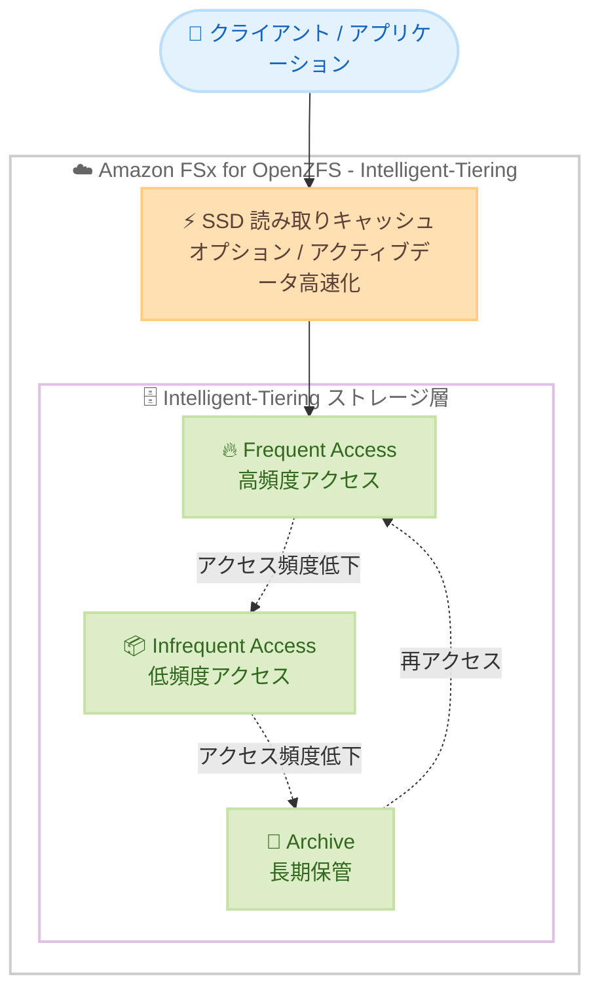

# Amazon FSx for OpenZFS - Intelligent-Tiering ストレージクラスの提供リージョン拡大

**リリース日**: 2026 年 6 月 9 日
**サービス**: Amazon FSx for OpenZFS
**機能**: Intelligent-Tiering ストレージクラス

📊 [このアップデートのインフォグラフィックを見る](https://takech9203.github.io/aws-news-summary/20260609-amazon-fsx-openzfs.html)
<!-- INFOGRAPHIC_BASE_URL は環境変数から取得 -->

## 概要

Amazon FSx for OpenZFS の Intelligent-Tiering ストレージクラスが、新たに 8 つの AWS リージョンで利用可能になりました。今回の拡大により、米国、欧州、アジアパシフィック、南米の各地域で Intelligent-Tiering を使った FSx for OpenZFS ファイルシステムを作成できます。

FSx Intelligent-Tiering は、ファイル共有、アーカイブ、メディアライブラリ、オンプレミスの HDD ストレージからの移行といった汎用的なファイルワークロード向けに設計されています。アクセスパターンに基づいて、データを 3 つのストレージ階層 (Frequent Access、Infrequent Access、Archive) 間で自動的に移動します。さらにオプションの SSD 読み取りキャッシュにより、アクティブなデータへの高速アクセスを維持できます。

このストレージクラスでは、アクティブなワークロードに対する高いパフォーマンスと、それ以外のデータに対する低コストなストレージを両立できます。保存したデータ量に対してのみ課金され、容量を管理する必要はありません。FSx SSD ストレージクラスと比較して最大 85%、オンプレミスの HDD ベースの NAS と比較して最大 20% のコスト削減が見込めます。

**アップデート前の課題**

- 一部のリージョンでは Intelligent-Tiering ストレージクラスが利用できず、コスト効率の高い汎用ファイルストレージを構築できなかった
- 対象リージョン外のワークロードでは、コストの高い SSD ストレージクラスを選択するか、オンプレミスの HDD ベース NAS に依存する必要があった
- データのアクセス頻度に応じた階層化を AWS 上で自動化できないケースがあった

**アップデート後の改善**

- 米国西部 (北カリフォルニア)、欧州 (ロンドン、ストックホルム、スペイン、チューリッヒ)、アジアパシフィック (ハイデラバード、ソウル)、南米 (サンパウロ) で Intelligent-Tiering が利用可能になった
- 対象リージョンのワークロードでも、保存データ量に応じた従量課金とアクセスパターンに基づく自動階層化を活用できるようになった
- リージョンに近い場所でコスト効率の高いファイルストレージを構築でき、データレイテンシとコストの両方を最適化できるようになった

## アーキテクチャ図

FSx for OpenZFS の Intelligent-Tiering は、アクセス頻度に応じてデータを 3 つの階層間で自動移動し、オプションの SSD 読み取りキャッシュでアクティブデータへの高速アクセスを実現します。

## サービスアップデートの詳細

### 主要機能

1. **3 階層の自動データ移動**
   - アクセスパターンに基づき、Frequent Access、Infrequent Access、Archive の 3 階層間でデータを自動的に移動
   - 管理者による手動の階層管理は不要
   - 頻繁にアクセスされなくなったデータは、より低コストな階層へ自動的に移動

2. **オプションの SSD 読み取りキャッシュ**
   - アクティブなデータをキャッシュし、高速な読み取りパフォーマンスを維持
   - アクティブワークロードには高いパフォーマンス、それ以外のデータには低コストストレージを提供

3. **容量管理不要の従量課金**
   - 保存したデータ量に対してのみ課金され、事前のキャパシティプロビジョニングが不要
   - 汎用ファイルワークロード (ファイル共有、アーカイブ、メディアライブラリ、オンプレミス HDD からの移行) に最適化

## 技術仕様

### コスト削減効果

| 比較対象 | 削減率 |
|------|------|
| FSx SSD ストレージクラス | 最大 85% |
| オンプレミスの HDD ベース NAS | 最大 20% |

### ストレージ階層

| 階層 | 用途 |
|------|------|
| Frequent Access | 高頻度でアクセスされるアクティブなデータ |
| Infrequent Access | アクセス頻度が低下したデータ |
| Archive | 長期保管向けの低頻度アクセスデータ |

### API 変更履歴

今回のアップデートはリージョン拡大が中心であり、新規 API メソッドの追加は確認されていません。

## メリット

### ビジネス面

- **コスト削減**: FSx SSD ストレージクラスと比較して最大 85%、オンプレミス HDD ベース NAS と比較して最大 20% のコスト削減が可能
- **地理的な選択肢の拡大**: 北カリフォルニア、ロンドン、ストックホルム、スペイン、チューリッヒ、ハイデラバード、ソウル、サンパウロでデータレジデンシー要件やレイテンシ要件に対応しやすくなる
- **運用負荷の軽減**: 容量管理が不要で、保存データ量に応じた従量課金により予測可能なコスト構造を実現

### 技術面

- **自動階層化**: アクセスパターンに基づくデータの自動移動により、手動でのデータ管理が不要
- **パフォーマンスとコストの両立**: SSD 読み取りキャッシュによりアクティブデータへの高速アクセスを維持しつつ、低頻度データは低コスト階層へ
- **移行の容易さ**: オンプレミス HDD ストレージからの移行先として適した特性を持つ

## デメリット・制約事項

### 制限事項

- すべての AWS リージョンで利用できるわけではないため、利用前に最新のリージョン対応状況を確認する必要がある
- SSD 読み取りキャッシュはオプションであり、利用する場合はプロビジョニングしたキャッシュ容量に応じた追加料金が発生

### 考慮すべき点

- アクセスパターンが頻繁に変動するワークロードでは、データアクセス時のリクエスト課金や階層間の移動を考慮する必要がある
- 低レイテンシが常時求められる高 IOPS ワークロードでは、SSD ストレージクラスの方が適している場合がある

## ユースケース

### ユースケース1: 大規模ファイル共有

**シナリオ**: 部門間で共有される大量のファイルのうち、一部のみが頻繁にアクセスされ、大半は時間の経過とともにアクセスされなくなる。

**効果**: アクティブなファイルは SSD 読み取りキャッシュと Frequent Access 階層で高速に提供しつつ、アクセス頻度の低いファイルは自動的に低コスト階層へ移動し、ストレージコストを削減できる。

### ユースケース2: メディアライブラリのアーカイブ

**シナリオ**: 放送・制作業界で大容量のメディアアセットを保管し、過去のコンテンツは稀にしかアクセスされない。

**効果**: 過去のメディアアセットを Archive 階層へ自動的に移動することで、保管コストを抑えながら必要時にアクセスできる。

### ユースケース3: オンプレミス HDD NAS からの移行

**シナリオ**: オンプレミスの HDD ベース NAS で運用していた汎用ファイルワークロードをクラウドへ移行したい。

**効果**: オンプレミス HDD ベース NAS と比較して最大 20% のコスト削減を実現しつつ、容量管理不要の従量課金モデルで運用負荷を軽減できる。

## 料金

FSx for OpenZFS の Intelligent-Tiering ストレージクラスでは、各階層で消費した平均ストレージ量 (GB - 月単位) に対して課金されます。料金は以下の要素で構成されます。

- **ストレージ**: Frequent Access、Infrequent Access、Archive の各階層で消費した平均ストレージ量 (GB - 月)
- **モニタリングと自動化**: Intelligent-Tiering ストレージ層全体で消費した平均ストレージ量 (GB - 月)
- **SSD 読み取りキャッシュ (オプション)**: プロビジョニングした平均キャッシュ容量 (GB - 月)
- **データアクセス**: ファイルシステムと Intelligent-Tiering ストレージ層間の読み取り / 書き込みリクエスト操作の平均回数

保存したデータ量に対してのみ課金され、事前にキャパシティをプロビジョニングする必要はありません。具体的な料金はリージョンによって異なるため、最新の料金は料金ページを参照してください。

## 利用可能リージョン

今回の拡大により、FSx for OpenZFS の Intelligent-Tiering ストレージクラスが以下のリージョンで新たに利用可能になりました。

- 米国西部 (北カリフォルニア)
- 欧州 (ロンドン、ストックホルム、スペイン、チューリッヒ)
- アジアパシフィック (ハイデラバード、ソウル)
- 南米 (サンパウロ)

最新のリージョン対応状況は、FSx for OpenZFS のリージョン対応表を参照してください。

## 関連サービス・機能

- **Amazon FSx for OpenZFS**: 本アップデートの対象となるフルマネージド型の OpenZFS ファイルシステムサービス
- **FSx SSD ストレージクラス**: 高いパフォーマンスが求められるワークロード向けのストレージクラス。Intelligent-Tiering と比較して最大 85% のコスト差
- **AWS DataSync**: オンプレミスの NAS から FSx for OpenZFS へのデータ移行に活用できるサービス

## 参考リンク

- 📊 [インフォグラフィック](https://takech9203.github.io/aws-news-summary/20260609-amazon-fsx-openzfs.html)
- [公式発表 (What's New)](https://aws.amazon.com/about-aws/whats-new/2026/06/amazon-fsx-openzfs/)
- [Amazon FSx for OpenZFS](https://aws.amazon.com/fsx/openzfs/)
- [料金ページ](https://aws.amazon.com/fsx/openzfs/pricing/)

## まとめ

今回のアップデートにより、FSx for OpenZFS の Intelligent-Tiering ストレージクラスが 8 つの新規リージョンで利用可能になり、より多くの地域でコスト効率の高い汎用ファイルストレージを構築できるようになりました。ファイル共有やメディアライブラリ、オンプレミス HDD からの移行を検討している場合は、対象リージョンでの導入を検討し、ワークロードのアクセスパターンに基づいたコスト最適化を進めることをおすすめします。
