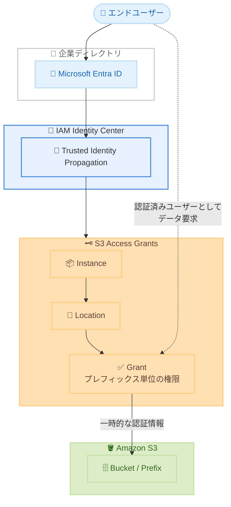

# Amazon S3 - S3 Access Grants が AWS European Sovereign Cloud (Germany) リージョンで利用可能に

**リリース日**: 2026年6月9日
**サービス**: Amazon S3 (Simple Storage Service)
**機能**: S3 Access Grants

📊 [このアップデートのインフォグラフィックを見る](https://takech9203.github.io/aws-news-summary/20260609-amazon-s3-access-grants-european-sovereign-cloud-germany-region.html)
<!-- INFOGRAPHIC_BASE_URL は環境変数から取得 -->

## 概要

Amazon S3 Access Grants が AWS European Sovereign Cloud (Germany) リージョンで利用可能になりました。S3 Access Grants は、Microsoft Entra ID などのディレクトリ内の ID や、AWS Identity and Access Management (IAM) プリンシパルを、S3 上のデータセットにマッピングする機能です。これにより、企業の ID に基づいてエンドユーザーへ S3 へのアクセスを自動的に付与し、大規模なデータアクセス権限の管理を実現します。

従来、S3 のアクセス制御は IAM ポリシーや S3 バケットポリシーで定義するのが一般的でしたが、これらにはポリシーサイズの上限 (バケットポリシー 20 KB、IAM ポリシー 5 KB) やアカウントあたりの IAM プリンシパル数の制限があります。データセットやユースケースの数が増えるにつれて、こうした制限がスケーラビリティの課題となっていました。S3 Access Grants は、プレフィックス、バケット、オブジェクト単位でアクセス権限をシンプルに定義できるモデルを提供し、IAM プリンシパルだけでなく企業ディレクトリのユーザーやグループへ直接アクセスを付与できます。

AWS European Sovereign Cloud (Germany) リージョンは、欧州のデジタル主権要件に対応するために設計された独立した AWS クラウドです。今回の対応により、欧州のデータ主権やコンプライアンス要件を満たしながら、S3 Access Grants による大規模なアクセス管理を活用できるようになりました。

**アップデート前の課題**

- AWS European Sovereign Cloud (Germany) リージョンでは S3 Access Grants が利用できず、大規模なアクセス管理を IAM ポリシーやバケットポリシーで実装する必要があった
- IAM ポリシー (5 KB) やバケットポリシー (20 KB) のサイズ上限により、データセットやユーザー数の増加に伴うアクセス制御のスケーリングが困難だった
- 企業ディレクトリのユーザーを S3 アクセスにマッピングするには、IAM プリンシパルへの変換ロジックを別途構築する必要があった

**アップデート後の改善**

- AWS European Sovereign Cloud (Germany) リージョンでも S3 Access Grants を作成し、大規模なアクセス権限管理が可能になった
- 企業 ID (Microsoft Entra ID など) や IAM プリンシパルを S3 のデータセットへ直接マッピングできるようになった
- 欧州のデータ主権要件を満たしながら、企業の ID に基づくアクセス付与を自動化できるようになった

## アーキテクチャ図



エンドユーザーの企業 ID を IAM Identity Center の Trusted Identity Propagation を介して S3 Access Grants へ伝播し、プレフィックス単位の権限に基づいて S3 への一時的なアクセス認証情報を発行する流れを示しています。

## サービスアップデートの詳細

### 主要機能

1. **ID とデータセットのマッピング**
   - Microsoft Entra ID などの企業ディレクトリ内の ID を S3 のデータセットへマッピング
   - IAM プリンシパル (ユーザー、ロール) も同様にマッピング可能
   - 企業 ID に基づいてエンドユーザーへ S3 アクセスを自動付与

2. **プレフィックス単位の権限定義**
   - バケット、プレフィックス、オブジェクト単位でアクセス権限を定義
   - 読み取り専用 (read-only)、書き込み専用 (write-only)、読み書き (read-write) を S3 プレフィックスごとに付与
   - IAM ポリシーやバケットポリシーのサイズ上限に縛られず、大規模なアクセスパターンをサポート

3. **Trusted Identity Propagation との統合**
   - IAM Identity Center の Trusted Identity Propagation と統合することで、認証済みの企業ディレクトリユーザーに代わってアプリケーションが S3 へ直接リクエスト可能
   - ユーザーを IAM プリンシパルへ変換する処理が不要
   - エンドユーザー ID が S3 まで伝播されるため、CloudTrail データイベントに直接ユーザー参照が含まれ、監査が容易に

## 技術仕様

### S3 Access Grants の主要コンポーネント

| 項目 | 詳細 |
|------|------|
| Instance | リージョンおよびアカウント単位で作成する S3 Access Grants のコンテナ |
| Location | S3 Access Grants が管理する S3 のロケーション (バケットやプレフィックスのスコープ) |
| Grant | 特定の ID に対してプレフィックス単位でアクセス権限を付与する設定 |
| 権限レベル | READ、WRITE、READWRITE |
| 対応 ID | IAM プリンシパル、企業ディレクトリのユーザー・グループ (Microsoft Entra ID など) |

### 設定例 (アクセスグラントの作成)

```bash
aws s3control create-access-grant \
  --account-id 111122223333 \
  --access-grants-location-id default \
  --access-grants-location-configuration S3SubPrefix="reports/*" \
  --permission READ \
  --grantee GranteeType=DIRECTORY_USER,GranteeIdentifier="user-id"
```

上記は、企業ディレクトリのユーザーに対して `reports/*` プレフィックスへの読み取りアクセスを付与する例です。

## 設定方法

### 前提条件

1. AWS European Sovereign Cloud (Germany) リージョンを利用できる AWS アカウント
2. アクセス対象となる S3 バケットおよびプレフィックス
3. 企業ディレクトリ ID を使用する場合は、IAM Identity Center の Trusted Identity Propagation の構成

### 手順

#### ステップ1: S3 Access Grants インスタンスの作成

```bash
aws s3control create-access-grants-instance \
  --account-id 111122223333
```

リージョンおよびアカウント単位で S3 Access Grants インスタンスを作成します。これがロケーションやグラントを管理するコンテナとなります。

#### ステップ2: ロケーションの登録

```bash
aws s3control create-access-grants-location \
  --account-id 111122223333 \
  --location-scope "s3://my-bucket/" \
  --iam-role-arn arn:aws:iam::111122223333:role/AccessGrantsRole
```

S3 Access Grants が管理対象とする S3 ロケーションを登録します。指定した IAM ロールが、エンドユーザーへ一時的な認証情報を発行する際に使用されます。

#### ステップ3: グラントの作成

ステップ1で示した `create-access-grant` コマンドで、ID とプレフィックスを紐付けたアクセス権限を付与します。これによりエンドユーザーは、認証された ID に基づいて該当する S3 データへアクセスできます。

## メリット

### ビジネス面

- **データ主権の確保**: AWS European Sovereign Cloud (Germany) 上で運用することで、欧州のデジタル主権およびコンプライアンス要件を満たしながらアクセス管理を実現
- **管理コストの削減**: 企業 ID に基づくアクセス付与を自動化し、権限管理にかかる運用負荷を軽減
- **監査の容易化**: CloudTrail データイベントにエンドユーザー参照が含まれ、誰がどのデータにアクセスしたかの追跡が簡素化

### 技術面

- **スケーラビリティ**: IAM ポリシーやバケットポリシーのサイズ上限に縛られず、大規模なアクセスパターンを管理可能
- **きめ細かな権限制御**: プレフィックスやオブジェクト単位で READ / WRITE / READWRITE を付与可能
- **ID 変換の不要化**: Trusted Identity Propagation により、企業ディレクトリユーザーを IAM プリンシパルへ変換せずに S3 へアクセス可能

## デメリット・制約事項

### 制限事項

- S3 Access Grants には、管理可能なグラント数やロケーション数などのサービスクォータが存在する
- 企業ディレクトリ ID を利用するには、IAM Identity Center の Trusted Identity Propagation の構成が前提となる
- 一部の S3 機能や統合との互換性に制約がある場合があるため、利用前に S3 Access Grants の制限事項を確認する必要がある

### 考慮すべき点

- 既存の IAM ポリシーやバケットポリシーによるアクセス制御との関係性を整理し、権限の重複や競合を避ける設計が必要
- リージョンごとに S3 Access Grants インスタンスを作成する必要があるため、マルチリージョン構成では各リージョンでの設定を考慮する

## ユースケース

### ユースケース1: 部門単位のデータアクセス管理

**シナリオ**: 多数の部門が共通の S3 バケットを利用しており、部門ごとに異なるプレフィックスへのアクセスを許可したい。

**実装例**:
```
財務部門ユーザー (Entra ID グループ) → s3://data-lake/finance/* に READWRITE
営業部門ユーザー (Entra ID グループ) → s3://data-lake/sales/* に READ
```

**効果**: 企業ディレクトリのグループに基づいて、プレフィックス単位のアクセスを自動で付与でき、部門の増減にも柔軟に対応できます。

### ユースケース2: 大規模なデータレイクのアクセス制御

**シナリオ**: 数千のデータセットを持つデータレイクで、IAM ポリシーのサイズ上限を超えるアクセス制御が必要。

**実装例**:
```
S3 Access Grants でプレフィックスごとにグラントを作成し、
データセットの増加に応じてグラントを追加
```

**効果**: ポリシーサイズの制約を受けずに、データセット数の増加に合わせてアクセス制御をスケールできます。

### ユースケース3: 監査要件への対応

**シナリオ**: 規制対象データへのアクセスについて、エンドユーザー単位での監査証跡を確保したい。

**実装例**:
```
Trusted Identity Propagation と S3 Access Grants を統合し、
CloudTrail データイベントにエンドユーザー ID を記録
```

**効果**: IAM セッションとユーザーの関係を再構築することなく、誰がどのオブジェクトにアクセスしたかを直接追跡でき、コンプライアンス監査に対応できます。

## 料金

S3 Access Grants の利用には、グラントを使用してデータにアクセスする際のリクエストに対して料金が発生します。詳細な料金体系は、対象リージョンの Amazon S3 料金ページを参照してください。リージョンによって料金が異なる場合があるため、AWS European Sovereign Cloud (Germany) リージョンの料金を確認することを推奨します。

## 利用可能リージョン

今回のアップデートにより、AWS European Sovereign Cloud (Germany) リージョンで S3 Access Grants が利用可能になりました。完全なリージョン別提供状況については、AWS リージョン表を参照してください。

## 関連サービス・機能

- **AWS IAM Identity Center**: Trusted Identity Propagation により企業ディレクトリ ID を S3 Access Grants へ伝播
- **Microsoft Entra ID**: 企業ディレクトリ ID のソースとして S3 Access Grants にマッピング可能
- **AWS CloudTrail**: S3 Access Grants 経由のデータアクセスをエンドユーザー単位で監査
- **S3 Access Points**: 大規模なアクセス制御を実現する別のアプローチとして併用可能

## 参考リンク

- 📊 [インフォグラフィック](https://takech9203.github.io/aws-news-summary/20260609-amazon-s3-access-grants-european-sovereign-cloud-germany-region.html)
- [公式発表 (What's New)](https://aws.amazon.com/about-aws/whats-new/2026/06/amazon-s3-access-grants-european-sovereign-cloud-germany-region)
- [ドキュメント (Managing access with S3 Access Grants)](https://docs.aws.amazon.com/AmazonS3/latest/userguide/access-grants.html)
- [料金ページ (Amazon S3 pricing)](https://aws.amazon.com/s3/pricing/)

## まとめ

S3 Access Grants が AWS European Sovereign Cloud (Germany) リージョンで利用可能になったことで、欧州のデータ主権要件を満たしながら、企業 ID に基づく大規模な S3 アクセス管理が実現できるようになりました。同リージョンで大量のデータセットや多数のユーザーを扱う場合は、IAM ポリシーや S3 Access Grants の特性を比較し、スケーラビリティと監査要件に応じた最適なアクセス制御方式を検討することを推奨します。
