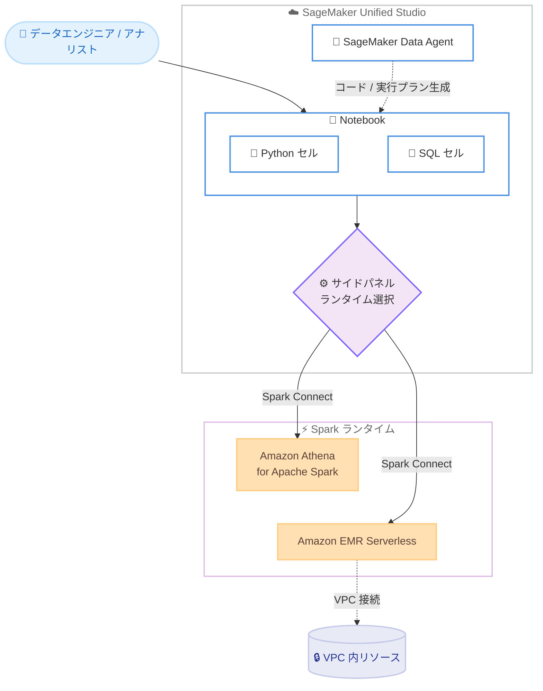

# Amazon SageMaker Unified Studio - Notebooks の EMR Serverless サポート

**リリース日**: 2026年6月9日
**サービス**: Amazon SageMaker Unified Studio
**機能**: Notebooks における Amazon EMR Serverless サポート (Apache Spark Connect 経由)

📊 [このアップデートのインフォグラフィックを見る](https://takech9203.github.io/aws-news-summary/20260609-amazon-sagemaker-unified-studio-emr.html)
<!-- INFOGRAPHIC_BASE_URL は環境変数から取得 -->

## 概要

Amazon SageMaker Unified Studio の Notebooks が、Apache Spark Connect を経由した Amazon EMR Serverless をサポートするようになりました。これにより、データエンジニアやアナリストは、インタラクティブ分析やデータエンジニアリングのワークロードに対して、Spark ランタイムをより柔軟に選択できるようになります。

これまで Notebooks の Spark ランタイムは Amazon Athena for Apache Spark が中心でした。今回のアップデートにより、Amazon Athena Spark に加えて Amazon EMR Serverless を Spark ランタイムとして利用できるようになり、ワークロードの要件に応じて最適なエンジンを選択できます。Notebook のセル内で PySpark と Spark SQL を EMR Serverless の Spark アプリケーション上で実行でき、ランタイムは Notebook のサイドパネルから選択します。選択したランタイムは Python セルと SQL セルの両方に適用されます。

さらに、組み込みの AI アシスタントである SageMaker Data Agent を活用することで、自然言語のプロンプトからコードや実行プランを生成できます。EMR Serverless では、事前初期化済みキャパシティ (pre-initialized capacity) によるセッション起動時間の短縮や、統一された Spark UI でのモニタリング、ネットワーク分離を必要とするワークロード向けの VPC 接続のサポートといった利点が得られます。

**アップデート前の課題**

- Notebooks の Spark ランタイムの選択肢が限られており、ワークロードに応じて柔軟にエンジンを切り替えることが難しかった
- デフォルトの Amazon Athena for Apache Spark は VPC 接続をサポートしていないため、ネットワーク分離を必要とするワークロードを Notebooks 内で実行できなかった
- 既存の EMR Serverless 環境を Unified Studio の Notebook から直接利用する統合手段が不足していた

**アップデート後の改善**

- Amazon Athena Spark に加えて Amazon EMR Serverless を Spark ランタイムとして選択できるようになり、要件に応じて最適なエンジンを選べるようになった
- EMR Serverless が VPC 接続をサポートするため、ネットワーク分離が必要なワークロードを Notebooks 内で実行できるようになった
- 事前初期化済みキャパシティによりセッション起動時間を短縮でき、統一された Spark UI でジョブの実行状況を一貫して監視できるようになった

## アーキテクチャ図



Notebook のサイドパネルから Spark ランタイムを選択し、Spark Connect 経由で Amazon Athena Spark または Amazon EMR Serverless 上で PySpark / Spark SQL を実行する構成を示しています。

## サービスアップデートの詳細

### 主要機能

1. **EMR Serverless を Spark ランタイムとして選択**
   - Amazon Athena for Apache Spark に加えて、Amazon EMR Serverless を Spark ランタイムとして選択できる
   - Notebook のセル内で PySpark と Spark SQL を EMR Serverless の Spark アプリケーション上で実行できる
   - ワークロードの要件に応じて最適なエンジンを選択できる

2. **サイドパネルからのランタイム選択**
   - Notebook のサイドパネルから Spark ランタイムを選択する
   - 選択したランタイムは Python セルと SQL セルの両方に適用される
   - 接続は Apache Spark Connect を介して行われる

3. **SageMaker Data Agent による AI 支援**
   - 組み込みの AI アシスタントである SageMaker Data Agent を利用できる
   - 自然言語のプロンプトからコードや実行プランを生成する
   - エラー診断やデータ分析の推奨も提供する

4. **事前初期化済みキャパシティと統合モニタリング**
   - 事前初期化済みキャパシティ (pre-initialized capacity) によりセッションの起動時間を短縮できる
   - 統一された Spark UI でジョブの実行状況を一貫して監視できる
   - EMR Serverless は VPC 接続をサポートし、ネットワーク分離を必要とするワークロードに対応する

## 技術仕様

### Spark ランタイムの比較

| 項目 | Amazon Athena for Apache Spark | Amazon EMR Serverless |
|------|-------------------------------|------------------------|
| 位置づけ | デフォルトの Spark ランタイム | 追加で選択可能な Spark ランタイム |
| 接続方式 | Notebooks 標準 | Apache Spark Connect |
| VPC 接続 | 非対応 | 対応 (ネットワーク分離が可能) |
| 起動時間の短縮 | - | 事前初期化済みキャパシティを利用可能 |
| 対応言語 | PySpark / Spark SQL | PySpark / Spark SQL |

### API変更履歴

今回のアップデートに直接関連する公開 API の変更は確認されていません。EMR Serverless の利用は Notebook のサイドパネルおよび Spark Connect 経由で構成されます。

## 設定方法

### 前提条件

1. Amazon SageMaker Unified Studio のドメインへのアクセス権限
2. データソースへアクセスするための適切な IAM 権限
3. Notebook を作成できるプロジェクトメンバーシップ
4. Spark ランタイムとして利用する Amazon EMR Serverless の Spark アプリケーション

### 手順

#### ステップ1: Notebook を開く

SageMaker Unified Studio のプロジェクト内で Notebook を開きます。Python、Spark、SQL のコードをインタラクティブなセルで実行できます。

#### ステップ2: サイドパネルから Spark ランタイムを選択

Notebook のサイドパネルから Spark ランタイムとして Amazon EMR Serverless を選択します。選択したランタイムは Python セルと SQL セルの両方に適用されます。

#### ステップ3: PySpark / Spark SQL を実行

```python
# 例: PySpark で S3 上のデータを読み込む
df = spark.read.parquet("s3://your-bucket/data/")
df.show()
```

EMR Serverless の Spark アプリケーション上で PySpark や Spark SQL を実行します。必要に応じて、SageMaker Data Agent に自然言語でプロンプトを与え、コードや実行プランを生成させることもできます。

## メリット

### ビジネス面

- **エンジン選択の柔軟性**: ワークロードの要件に応じて Amazon Athena Spark と Amazon EMR Serverless を使い分けられ、コストとパフォーマンスを最適化できる
- **生産性の向上**: SageMaker Data Agent により、自然言語からコードや実行プランを生成でき、開発のスピードが向上する
- **統合された分析環境**: Unified Studio 内で複数の Spark エンジンを統一的に利用でき、ツールの分散を防げる

### 技術面

- **ネットワーク分離への対応**: EMR Serverless の VPC 接続により、ネットワーク分離を必要とするワークロードを Notebooks 内で実行できる
- **起動時間の短縮**: 事前初期化済みキャパシティにより、Spark セッションの起動時間を短縮できる
- **統一されたモニタリング**: 統一された Spark UI でジョブの実行状況とパフォーマンスを一貫して可視化できる

## デメリット・制約事項

### 制限事項

- デフォルトの Amazon Athena for Apache Spark は VPC 接続をサポートしないため、ネットワーク分離が必要な場合は EMR Serverless などのランタイムを選択する必要がある
- 選択した Spark ランタイムは Python セルと SQL セルの両方に一括適用されるため、セル単位で異なるランタイムを使い分けることはできない
- EMR Serverless を利用するには、対応する Spark アプリケーションの準備が必要

### 考慮すべき点

- 事前初期化済みキャパシティは起動時間を短縮する一方で、待機中のキャパシティに対するコストが発生する点を考慮する必要がある
- ワークロードの特性 (インタラクティブ性、データ量、ネットワーク要件) に応じて、Athena Spark と EMR Serverless のどちらが適切かを評価することが望ましい

## ユースケース

### ユースケース1: ネットワーク分離が必要なデータエンジニアリング

**シナリオ**: VPC 内のプライベートなデータソースに対して、Notebooks からインタラクティブに Spark 処理を実行したい。

**実装例**:
```
Notebook のサイドパネルで EMR Serverless を選択し、VPC 接続を構成した Spark アプリケーション上で PySpark を実行する
```

**効果**: ネットワーク分離要件を満たしつつ、Unified Studio の Notebook から直接インタラクティブな分析を実行できる。

### ユースケース2: 自然言語によるデータ分析コードの生成

**シナリオ**: Spark の記述に不慣れなアナリストが、自然言語の指示でデータ変換コードを作成したい。

**実装例**:
```
SageMaker Data Agent に「S3 の売上データを月別に集計して」と自然言語で指示し、生成された PySpark コードを EMR Serverless 上で実行する
```

**効果**: コーディングの負担を軽減し、分析に集中できるようになる。

### ユースケース3: 起動時間を重視したインタラクティブ分析

**シナリオ**: 反復的な探索的データ分析において、Spark セッションの起動待ち時間を短縮したい。

**実装例**:
```
EMR Serverless の事前初期化済みキャパシティを構成し、Notebook から繰り返しセッションを起動する
```

**効果**: セッション起動時間が短縮され、探索的分析のサイクルを高速化できる。

## 料金

今回のアップデート自体に追加の料金は発生しません。Spark 処理の実行に対しては、選択したランタイム (Amazon Athena for Apache Spark または Amazon EMR Serverless) のそれぞれの料金体系が適用されます。EMR Serverless では、利用したコンピューティングおよびメモリのリソースに対して課金され、事前初期化済みキャパシティを利用する場合は待機中のキャパシティに対しても料金が発生します。詳細は各サービスの料金ページを参照してください。

## 利用可能リージョン

Amazon SageMaker Unified Studio が利用可能なすべての AWS リージョンで利用できます。

## 関連サービス・機能

- **Amazon EMR Serverless**: 今回追加された Spark ランタイム。サーバーレスで Spark アプリケーションを実行し、VPC 接続と事前初期化済みキャパシティをサポートする
- **Amazon Athena for Apache Spark**: Notebooks のデフォルトの Spark ランタイム。サーバーレスで Spark を実行する
- **SageMaker Data Agent**: 自然言語からコードや実行プランを生成する組み込みの AI アシスタント
- **Apache Spark Connect**: Notebook と Spark ランタイムを接続するための仕組み

## 参考リンク

- 📊 [インフォグラフィック](https://takech9203.github.io/aws-news-summary/20260609-amazon-sagemaker-unified-studio-emr.html)
- [公式発表 (What's New)](https://aws.amazon.com/about-aws/whats-new/2026/06/amazon-sagemaker-unified-studio-emr/)
- [Notebooks ドキュメント (SageMaker Unified Studio)](https://docs.aws.amazon.com/sagemaker-unified-studio/latest/userguide/notebooks.html)
- [Amazon EMR Serverless](https://aws.amazon.com/emr/serverless/)
- [Amazon Athena for Apache Spark](https://docs.aws.amazon.com/athena/latest/ug/notebooks-spark.html)

## まとめ

Amazon SageMaker Unified Studio の Notebooks が Amazon EMR Serverless をサポートしたことで、データエンジニアやアナリストは Spark ランタイムをワークロードの要件に応じて柔軟に選択できるようになりました。特に VPC 接続や事前初期化済みキャパシティを必要とするワークロードに有効です。SageMaker Unified Studio を利用しているチームは、自身のワークロード特性に基づいて Athena Spark と EMR Serverless の使い分けを検討することをお勧めします。
