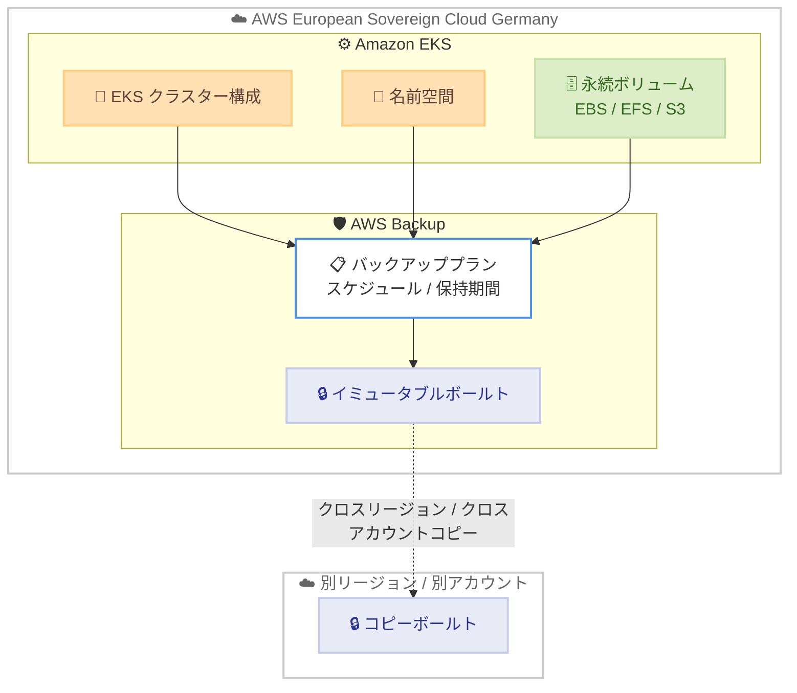

# AWS Backup - Amazon EKS サポートが AWS European Sovereign Cloud (Germany) リージョンで利用可能に

**リリース日**: 2026 年 6 月 9 日
**サービス**: AWS Backup / Amazon Elastic Kubernetes Service (EKS)
**機能**: AWS Backup support for Amazon EKS in the AWS European Sovereign Cloud (Germany) Region

📊 [このアップデートのインフォグラフィックを見る](https://takech9203.github.io/aws-news-summary/20260609-aws-backup-amazon-eks-aws-european-sovereign-cloud.html)
<!-- INFOGRAPHIC_BASE_URL は環境変数から取得 -->

## 概要

Amazon Elastic Kubernetes Service (EKS) に対する AWS Backup サポートが、AWS European Sovereign Cloud (Germany) リージョンで利用可能になりました。これにより、新たにサポートされたこのリージョンの Amazon EKS クラスターに対して、フルマネージドかつポリシーベースのデータ保護とリカバリ機能が提供されます。具体的には、自動スケジューリング、保持期間管理、イミュータブルなボールト (vault) 、クロスリージョンおよびクロスアカウントコピーといった機能が含まれます。

AWS Backup for Amazon EKS を使用すると、EKS クラスター全体、特定の名前空間 (namespace) 、または個々の永続ボリューム (persistent volume) を保護できます。これは中央集約型でエージェントレスのソリューションであり、独自に作成したカスタムスクリプトやサードパーティツールを置き換えるものです。このサポートは、データ主権 (data sovereignty) に関する厳格な要件を持つ規制対象業界の組織にとって、特に重要な意味を持ちます。

ディザスタリカバリ、コンプライアンス要件への対応、または EKS クラスターのアップグレード前のバックアップ取得など、さまざまな目的で AWS Backup を利用してクラスターを保護できます。

**アップデート前の課題**

- AWS European Sovereign Cloud (Germany) リージョンでは、Amazon EKS のバックアップに AWS Backup を利用できなかった
- Kubernetes アプリケーションのバックアップにはカスタムスクリプトやサードパーティツールの運用が必要で、管理負荷が高かった
- クラスター構成とステートフルなアプリケーションデータの保護を、他の AWS サービスと統一されたポリシーで一元管理できなかった

**アップデート後の改善**

- AWS European Sovereign Cloud (Germany) リージョンで、Amazon EKS に対するフルマネージドな AWS Backup を利用できるようになった
- エージェントレスで EKS クラスター全体、名前空間、永続ボリュームを保護でき、カスタムスクリプトやサードパーティツールが不要になった
- 自動スケジューリング、保持期間管理、イミュータブルボールト、クロスリージョン / クロスアカウントコピーといった既存の AWS Backup 機能を、同リージョンの EKS 保護に活用できるようになった

## アーキテクチャ図



エージェントレスの AWS Backup が、EKS クラスター構成、名前空間、永続ボリュームを一元的に保護し、イミュータブルボールトへ保存します。さらにクロスリージョン / クロスアカウントコピーにより、別リージョンや別アカウントへ複製できます。

## サービスアップデートの詳細

### 主要機能

1. **保護対象の柔軟な指定**
   - EKS クラスター全体を保護対象に指定できる (Kubernetes のデプロイメントやリソース構成を含む)
   - 特定の名前空間単位での保護が可能
   - Amazon EBS、Amazon EFS、Amazon S3 に保存された永続ボリューム (ステートフルデータ) を保護できる

2. **ポリシーベースの自動データ保護**
   - 自動スケジューリングによる定期的なバックアップ取得
   - 保持期間管理 (retention management) によるバックアップライフサイクルの自動化
   - 中央集約型で他の AWS サービスと統一されたポリシー管理

3. **イミュータブルボールトとコピー機能**
   - イミュータブルボールトにより、悪意のある変更や誤った変更からバックアップデータを保護
   - クロスリージョンコピーによる地理的冗長性の確保
   - クロスアカウントコピーによる、誤削除リスクの低減と分離されたバックアップ保管

4. **エージェントレスのリストアワークフロー**
   - フル EKS クラスターを既存クラスターへ、または新規クラスターとしてリストア可能
   - リストア時に過去の構成設定から新しい EKS クラスターをプロビジョニングできる
   - リストアは非破壊的 (non-destructive) で、既存クラスターへのリストアでは差分のみが反映される

## 技術仕様

### 保護対象とリストア先

| 保護対象 | 保存先ストレージ | リストア先 |
|----------|------------------|------------|
| EKS クラスター全体 | クラスター構成 + 永続ボリューム | 既存クラスター または 新規クラスター |
| 名前空間 | 名前空間内のリソースとデータ | 既存クラスターのみ |
| 永続ボリューム | Amazon EBS / Amazon EFS / Amazon S3 | 既存クラスター |

### IAM 権限

```text
バックアップ / リストアには必要な権限を持つ IAM ロールを指定する。
永続ボリュームとして Amazon S3 を含める場合は、以下のポリシーを IAM ロールに追加する。
  - AWSBackupServiceRolePolicyForS3Backup
```

## 設定方法

### 前提条件

1. AWS European Sovereign Cloud (Germany) リージョンで Amazon EKS クラスターが稼働していること
2. AWS Backup および Amazon EKS の利用に必要な IAM ロールが用意されていること
3. AWS Backup の設定で Amazon EKS 保護のオプトインが完了していること

### 手順

#### ステップ 1: Amazon EKS 保護のオプトイン

AWS Backup コンソールで [設定 (Settings)] から [リソースを設定 (Configure resources)] を開き、Amazon EKS の保護を有効化 (オプトイン) します。これにより AWS Backup が EKS リソースを保護対象として扱えるようになります。

#### ステップ 2: オンデマンドバックアップの作成

[保護されたリソース (Protected resources)] から [オンデマンドバックアップを作成 (Create on-demand backup)] を選択します。リソースタイプとして EKS を選び、対象クラスターを指定します。次に必要な権限を持つ IAM ロールを選択します。永続ボリュームに Amazon S3 を含める場合は、`AWSBackupServiceRolePolicyForS3Backup` ポリシーを IAM ロールに追加してください。最後に [オンデマンドバックアップを作成] を実行します。

定期的なバックアップが必要な場合は、オンデマンドではなくバックアッププランを作成し、スケジュールと保持期間を定義します。

#### ステップ 3: リストアの実行

リストアでは、対象となる複合リカバリポイント (composite recovery point) を選択し、[フル EKS クラスターをリストア (Restore full EKS cluster)] を選びます。既存クラスターへのリストアと、新規クラスターとしてのリストアのいずれかを選択できます。続いて永続ストレージを構成し、IAM ロールを指定してリストアを実行します。新規クラスターを選択した場合、AWS Backup が過去の構成設定からクラスターのプロビジョニングを行います。

## メリット

### ビジネス面

- **データ主権要件への対応**: AWS European Sovereign Cloud (Germany) リージョン内で EKS のバックアップとリカバリを完結できるため、厳格なデータ主権・規制要件を持つ組織でも Kubernetes ワークロードを保護できる
- **運用負荷の削減**: カスタムスクリプトやサードパーティツールの運用が不要になり、運用コストと管理負荷を低減できる
- **コンプライアンス対応の強化**: イミュータブルボールトと自動保持期間管理により、監査やコンプライアンス要件への対応を容易にする

### 技術面

- **エージェントレスの一元管理**: クラスターにエージェントを導入することなく、他の AWS サービスと統一されたポリシーでバックアップを集中管理できる
- **柔軟な保護粒度**: クラスター全体、名前空間、永続ボリュームの単位で保護対象を選択できる
- **回復力の向上**: クロスリージョン / クロスアカウントコピーにより、災害やアカウント侵害時にもバックアップを保全できる

## デメリット・制約事項

### 制限事項

- 永続ストレージのバックアップ対象は Amazon EBS、Amazon EFS、Amazon S3 に限定される
- 名前空間のリストア先は既存クラスターのみで、新規クラスターへの名前空間単位リストアはできない
- リストアは非破壊的であり、既存クラスターへのリストアでは Kubernetes バージョンやデータの上書きは行われず、差分のみがリストアされる
- バックアップの一部が失敗した場合、成功した個別コンポーネントはリストアできるが、フル EKS クラスターのリストアはできない

### 考慮すべき点

- AWS Backup および Amazon EKS の両サービスが利用可能なリージョンでのみ EKS バックアップを利用できる
- 永続ストレージが上記 3 サービス以外で構成されている場合、保護対象に含められない点を事前に確認する必要がある

## ユースケース

### ユースケース 1: ディザスタリカバリ

**シナリオ**: AWS European Sovereign Cloud (Germany) リージョンで本番 EKS クラスターを運用しており、障害発生時に迅速な復旧が求められる。

**実装例**:
```text
- バックアッププランで日次スケジュールと保持期間を設定
- イミュータブルボールトへ保存
- クロスリージョンコピーで別リージョンへ複製
- 障害時は新規クラスターとしてフルリストア
```

**効果**: クラスター構成と永続データを一括復旧でき、復旧時間目標 (RTO) を短縮できる。

### ユースケース 2: コンプライアンス対応

**シナリオ**: 規制対象業界で、改ざん不可能なバックアップの長期保持が監査要件として求められている。

**実装例**:
```text
- イミュータブルボールトを使用してバックアップを保護
- 保持期間管理で規定の保管期間を自動適用
- クロスアカウントコピーで分離された監査用アカウントへ保管
```

**効果**: 悪意のある変更や誤削除からバックアップを保護し、監査要件を満たす。

### ユースケース 3: クラスターアップグレード前の保護

**シナリオ**: EKS クラスターの Kubernetes バージョンをアップグレードする前に、安全なロールバックポイントを確保したい。

**実装例**:
```text
- アップグレード直前にオンデマンドバックアップを作成
- 問題発生時は新規クラスターとして過去構成からリストア
```

**効果**: アップグレード失敗時に既知の正常な状態へ復元でき、リスクを低減できる。

## 料金

AWS Backup の料金は、バックアップストレージの使用量、リストアしたデータ量、クロスリージョン / クロスアカウントのデータ転送量などに基づきます。Amazon EKS のバックアップに関する具体的な料金は、AWS Backup の料金ページを参照してください。

## 利用可能リージョン

今回のアップデートにより、AWS Backup support for Amazon EKS が **AWS European Sovereign Cloud (Germany)** リージョンで利用可能になりました。AWS Backup for Amazon EKS は、両サービスが利用可能なすべての商用リージョン (中国を除く) および AWS GovCloud (US) でも提供されています。

## 関連サービス・機能

- **Amazon Elastic Kubernetes Service (EKS)**: 保護対象となるマネージド Kubernetes サービス
- **Amazon EBS / Amazon EFS / Amazon S3**: 永続ボリュームのバックアップ対象となるストレージサービス
- **AWS Backup ボールト**: イミュータブルボールトとして、バックアップの改ざん防止と長期保管を担う

## 参考リンク

- 📊 [インフォグラフィック](https://takech9203.github.io/aws-news-summary/20260609-aws-backup-amazon-eks-aws-european-sovereign-cloud.html)
- [公式発表 (What's New)](https://aws.amazon.com/about-aws/whats-new/2026/06/aws-backup-amazon-eks-aws-european-sovereign-cloud/)
- [AWS Blog](https://aws.amazon.com/blogs/aws/secure-eks-clusters-with-the-new-support-for-amazon-eks-in-aws-backup/)
- [AWS Backup ドキュメント](https://docs.aws.amazon.com/aws-backup/latest/devguide/whatisbackup.html)
- [AWS Backup 料金ページ](https://aws.amazon.com/backup/pricing/)

## まとめ

今回のアップデートにより、データ主権要件の厳しい AWS European Sovereign Cloud (Germany) リージョンでも、Amazon EKS クラスターをフルマネージドかつエージェントレスで保護できるようになりました。ディザスタリカバリ、コンプライアンス対応、クラスターアップグレード前の保護など幅広い用途に活用できます。同リージョンで EKS を運用する組織は、既存のカスタムスクリプトやサードパーティツールを AWS Backup へ移行し、バックアップ運用の一元化と回復力の向上を検討することを推奨します。
