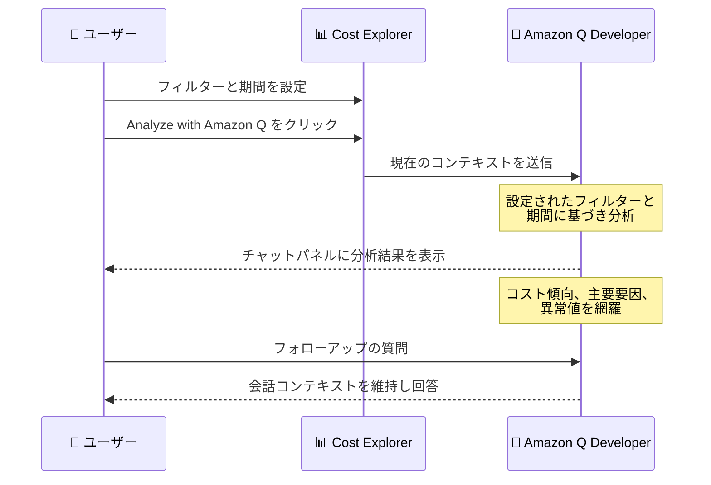

# AWS Cost Explorer - Amazon Q による高度なコスト分析

**リリース日**: 2026 年 6 月 9 日
**サービス**: AWS Cost Explorer
**機能**: Analyze with Amazon Q (Amazon Q による高度なコスト分析)

📊 [このアップデートのインフォグラフィックを見る](https://takech9203.github.io/aws-news-summary/20260609-aws-cost-explorer-intelligent-cost-explanations.html)
<!-- INFOGRAPHIC_BASE_URL は環境変数から取得 -->

## 概要

AWS Cost Explorer に、Amazon Q Developer を活用した新機能「Analyze with Amazon Q」が追加されました。この機能を使用すると、Cost Explorer で構成した任意のレポートに対して、ボタンを 1 回クリックするだけで包括的なコスト分析を取得できます。Amazon Q Developer は、コストの傾向、主要なコスト要因、異常値を網羅した詳細な分析を提供します。

すべての分析は、お客様が設定した正確なフィルターと期間を使用して実行されます。さらに、フォローアップの質問を通じて、コスト最適化の機会を発見するためのガイダンスが提供されます。Amazon Q は現在のコンテキストを分析し、表示している内容に応じて説明をチャットパネルに直接表示します。過去の日付には履歴に基づく説明を、将来の日付には予測に基づく説明を、両方が混在する期間には双方の説明を適応的に提供します。

この機能は、すべての商用 AWS リージョンで追加料金なしで利用できます。コスト管理担当者、財務部門、FinOps チーム、そして自身のサービス利用コストを把握したいエンジニアにとって、コスト分析の手間を大幅に削減する機能です。

**アップデート前の課題**

このアップデート以前は、コスト分析を行うために手動での調査が必要でした。

- 以前はコスト分析のために、複数のフィルターやデータポイントを横断して手動で調査する必要があった
- 以前はコストの傾向や主要なコスト要因、異常値を特定するために、専門的な知識と時間を要した
- 以前は最適化の機会を発見するために、自らデータを掘り下げて解釈する必要があった

**アップデート後の改善**

今回のアップデートにより、コスト分析が大幅に効率化されました。

- 今回のアップデートにより、ボタンを 1 回クリックするだけで包括的なコスト分析を取得できるようになった
- 今回のアップデートにより、複数のフィルターを横断した手動調査が不要になった
- 今回のアップデートにより、フォローアップの質問を通じて最適化の機会を対話的に発見できるようになった

## アーキテクチャ図



ユーザーが Cost Explorer で設定したコンテキストを Amazon Q Developer が分析し、チャットパネル上で対話的にコスト分析結果を提供する流れを示しています。

## サービスアップデートの詳細

### 主要機能

1. **ワンクリックでのコスト分析**
   - Cost Explorer で構成した任意のレポートに対して、ボタンを 1 回クリックするだけで分析を実行
   - Amazon Q Developer がコストの傾向、主要なコスト要因、異常値を網羅した詳細な分析を提供
   - 分析結果は Amazon Q のチャットパネルに直接表示される

2. **コンテキストに応じた適応的な分析**
   - 設定された正確なフィルターと期間を使用して分析を実行
   - 過去の日付には履歴に基づく説明 (historical explanations) を提供
   - 将来の日付には予測に基づく説明 (forecast explanations) を提供
   - 過去と将来が混在する期間には、双方の説明を提供

3. **フォローアップ質問による対話的な深掘り**
   - フォローアップの質問を通じて、コスト最適化の機会を発見するためのガイダンスを取得
   - Amazon Q は会話全体を通じて完全な会話コンテキストを維持し、既に議論した内容を踏まえて回答

## 技術仕様

### 分析タイプとコンテキストの対応

| 表示している期間 | 提供される分析 |
|------|------|
| 過去の日付 | 履歴に基づく説明 (historical explanations) |
| 将来の日付 | 予測に基づく説明 (forecast explanations) |
| 過去と将来が混在 | 履歴と予測の双方の説明 |

### API変更履歴

今回のアップデートに直接関連する公開された API 変更はありません。Cost Explorer コンソールから利用する機能です。

## 設定方法

### 前提条件

1. AWS Cost Explorer が有効化されていること
2. 対象アカウントでコストおよび使用状況データへのアクセス権限を持っていること
3. 商用 AWS リージョンを利用していること

### 手順

#### ステップ1: Cost Explorer でレポートを構成

AWS マネジメントコンソールから Cost Explorer を開き、分析対象のフィルター (サービス、アカウント、タグなど) と期間を設定します。

設定したフィルターと期間が、そのまま Amazon Q による分析の対象範囲となります。

#### ステップ2: Analyze with Amazon Q を実行

構成したレポート画面で「Analyze with Amazon Q」ボタンをクリックします。

Amazon Q Developer が現在のコンテキストを分析し、コストの傾向、主要なコスト要因、異常値を網羅した説明をチャットパネルに表示します。

#### ステップ3: フォローアップの質問で深掘り

チャットパネルでフォローアップの質問を入力し、コストの詳細や最適化の機会についてさらに掘り下げます。

Amazon Q は会話コンテキストを維持するため、前のやり取りを踏まえた連続的な対話が可能です。

## メリット

### ビジネス面

- **コスト分析の迅速化**: ボタン 1 回のクリックで包括的な分析を取得でき、月次のコストレビューや予算管理の作業時間を短縮できる
- **専門知識への依存の軽減**: コスト分析の専門知識がなくても、傾向や異常値、最適化機会を理解できる
- **追加料金なし**: 既存の Cost Explorer 利用の範囲内で、追加コストなく利用できる

### 技術面

- **正確なコンテキストでの分析**: 設定したフィルターと期間がそのまま分析対象となるため、見ているデータと一致した結果が得られる
- **異常検知の補助**: コストの異常値を自動的に検出し、調査の起点を提供する
- **対話的な深掘り**: 会話コンテキストを維持したフォローアップにより、原因の特定や最適化方針の検討を効率化できる

## デメリット・制約事項

### 制限事項

- 商用 AWS リージョンでのみ利用可能 (AWS GovCloud (US) や中国リージョンについては公式情報で言及なし)
- 分析対象は Cost Explorer で設定したフィルターと期間に限定される
- 機能の詳細な制限事項については、公式発表では明示されていない

### 考慮すべき点

- 提示される最適化の提案は、あくまで分析と一般的なガイダンスであり、適用前に各環境への影響を確認することが望ましい
- Amazon Q による分析結果は意思決定の補助として活用し、重要な判断は実際のデータと照らし合わせて行うことを推奨

## ユースケース

### ユースケース1: 月次コストレビューの効率化

**シナリオ**: FinOps チームが毎月のコストレビューで、前月比の増減要因を迅速に把握したい。

**実装例**:
```
1. Cost Explorer で対象期間 (前月) とサービス別フィルターを設定
2. Analyze with Amazon Q をクリック
3. 主要なコスト要因と傾向を確認
4. 「最もコストが増加したサービスの要因は?」とフォローアップ
```

**効果**: 手動でのフィルター操作やデータ集計を行わずに、増減要因を短時間で把握できる。

### ユースケース2: コスト異常の調査

**シナリオ**: 特定の月にコストが急増したが、原因が不明な状況。

**実装例**:
```
1. Cost Explorer で急増した期間を選択
2. Analyze with Amazon Q で異常値の分析を取得
3. 「この異常値の発生時期と関連するサービスは?」とフォローアップ
```

**効果**: 異常値とその要因を自動的に特定し、調査の起点を素早く得られる。

### ユースケース3: 将来コストの予測と最適化検討

**シナリオ**: 次四半期の予算計画のために、コストの推移を予測したい。

**実装例**:
```
1. Cost Explorer で将来の日付を含む期間を設定
2. Analyze with Amazon Q で予測に基づく説明を取得
3. 「コストを抑えるための最適化の機会は?」とフォローアップ
```

**効果**: 予測に基づいた説明と最適化のガイダンスを取得し、予算計画と最適化施策の検討に活用できる。

## 料金

「Analyze with Amazon Q」機能は、すべての商用 AWS リージョンで**追加料金なし**で利用できます。Cost Explorer の既存の利用範囲内で利用可能です。

## 利用可能リージョン

すべての商用 AWS リージョンで利用可能です。

## 関連サービス・機能

- **Amazon Q Developer**: 本機能のコスト分析を担う生成 AI アシスタント。Cost Explorer のコンテキストを解釈し、自然言語で説明を提供する
- **AWS Cost Explorer**: コストと使用状況を可視化・分析するサービス。本機能の基盤となるレポートとフィルターを提供する
- **AWS Cost Anomaly Detection**: コストの異常を機械学習で検出するサービス。本機能の異常値分析と組み合わせることで、コスト管理を強化できる

## 参考リンク

- 📊 [インフォグラフィック](https://takech9203.github.io/aws-news-summary/20260609-aws-cost-explorer-intelligent-cost-explanations.html)
- [公式発表 (What's New)](https://aws.amazon.com/about-aws/whats-new/2026/06/aws-cost-explorer-intelligent-cost-explanations)
- [AWS Cost Explorer](https://aws.amazon.com/aws-cost-management/aws-cost-explorer/)
- [Amazon Q Developer](https://aws.amazon.com/q/developer/)

## まとめ

「Analyze with Amazon Q」は、これまで手間のかかっていた Cost Explorer でのコスト分析を、ボタン 1 回のクリックで完結できる機能です。コストの傾向や異常値の把握、最適化機会の発見を対話的に行えるため、FinOps チームやコスト管理担当者の作業を大幅に効率化します。すべての商用 AWS リージョンで追加料金なく利用できるため、まずは普段確認しているコストレポートで試してみることを推奨します。
