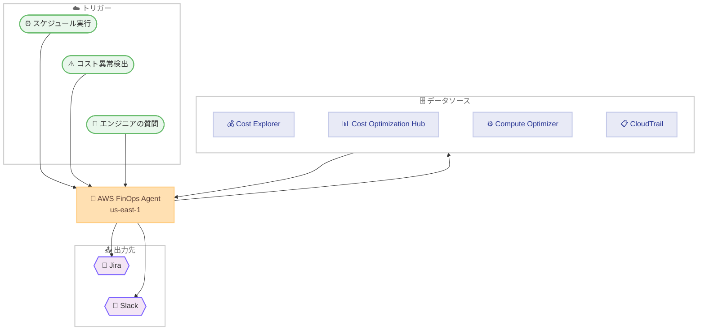

# AWS FinOps Agent - コスト管理を自動化するエージェント

**リリース日**: 2026 年 6 月 9 日
**サービス**: AWS FinOps Agent
**機能**: AWS FinOps Agent (プレビュー)

📊 [このアップデートのインフォグラフィックを見る]({INFOGRAPHIC_BASE_URL}/20260609-aws-finops-agent-preview.html)
<!-- INFOGRAPHIC_BASE_URL は環境変数から取得 -->

## 概要

AWS は、FinOps 担当者やエンジニアリングチーム向けのフロンティアエージェントである AWS FinOps Agent のプレビュー提供を発表しました。AWS FinOps Agent は、コストに関する質問に回答し、最適化の機会を提示し、コスト異常を自動的に調査し、ユーザーが定義したスケジュールで定期的な FinOps ワークフローを実行します。

このエージェントを使用すると、自然言語で AWS コストについて質問したり、クラウドコストレポートを生成したりできます。エージェントは AWS Cost Optimization Hub と AWS Compute Optimizer から、ライトサイジング、アイドルリソース、Savings Plans の推奨事項を抽出し、ユーザーに代わって Jira チケットを作成できます。さらに、コスト異常が検出されると、その根本原因を自動的に調査し、調査結果を Slack チャンネルに投稿できます。

これにより、これまで手作業で行っていたコスト分析、異常調査、レポート作成などの FinOps 業務を、エンジニアが普段利用するツールの中で効率的に進められるようになります。対象ユーザーは FinOps プラクティショナー、財務チーム、そしてコストに責任を持つエンジニアリングチームです。

**アップデート前の課題**

これまで FinOps の運用には、以下のような課題がありました。

- コスト異常が検出された際、AWS Cost Explorer や AWS CloudTrail を手作業で確認し、原因や責任者を特定する必要があった
- ライトサイジングや Savings Plans の推奨事項を確認するために、Cost Optimization Hub や Compute Optimizer を個別に参照する必要があった
- 定期的なコストレポートの作成や関係者への共有を手動で実施する必要があり、運用負荷が高かった
- コストに関する質問への回答に、専門知識を持つ担当者の対応が必要だった

**アップデート後の改善**

今回のアップデートにより、以下が可能になりました。

- コスト異常の検出時に、エージェントが CloudTrail イベントと相関分析を行い、根本原因と責任者の候補を含むレポートを自動生成できるようになった
- 自然言語でコストについて質問し、実際のコスト・使用量データに基づいた回答を得られるようになった
- 日次、週次、月次のスケジュールで定期的な FinOps ワークフローを自動実行できるようになった
- 調査結果や推奨事項を Jira チケットや Slack チャンネルに自動連携でき、手動でのトリアージが不要になった

## アーキテクチャ図



AWS FinOps Agent は、スケジュール実行、コスト異常検出、エンジニアからの質問の 3 つのトリガーで起動し、各種コスト管理サービスからデータを取得して、Jira や Slack に結果を連携します。

## サービスアップデートの詳細

### 主要機能

1. **自然言語によるコスト照会**
   - エンジニアや FinOps 担当者が自然言語で AWS コストについて質問できる
   - 実際のコスト・使用量データに基づいた回答が得られる
   - クラウドコストレポートを生成できる

2. **コスト異常の自動調査**
   - AWS Cost Anomaly Detection のイベントをトリガーとして起動する
   - コストの変化を AWS CloudTrail イベント (誰がいつ何を変更したかの記録) と相関分析する
   - 変化を引き起こした要因を特定し、根本原因の候補と責任者を含むサマリーを生成する
   - ドル単位のしきい値などの条件でフィルタリングできる

3. **最適化機会の提示**
   - AWS Cost Optimization Hub と AWS Compute Optimizer から推奨事項を抽出する
   - ライトサイジング、アイドルリソース、Savings Plans の推奨事項を提示する
   - 推奨事項をまとめて Jira チケットを作成できる

4. **定期的な FinOps ワークフローの実行**
   - 日次、週次、月次など、ユーザーが定義したスケジュールでワークフローを実行する
   - HTML、PDF、PPT 形式で定期的なコストレポートを生成する

5. **コンテキストファイルとメモリ**
   - 組織固有のファイル (アカウントと所有者のマッピング、運用指示など) をアップロードできる
   - セッションをまたいでユーザーの設定や好みを記憶する

## 技術仕様

### サービス連携

| 項目 | 詳細 |
|------|------|
| データソース | AWS Cost Explorer、AWS Cost Anomaly Detection、AWS Cost Optimization Hub、AWS Compute Optimizer |
| 相関分析 | AWS CloudTrail イベント |
| 通知・連携先 | Jira (チケット作成)、Slack (メッセージ投稿) |
| レポート形式 | HTML、PDF、PPT |
| 実行リージョン | US East (N. Virginia) us-east-1 |

### 起動トリガー

| トリガー | 説明 |
|----------|------|
| スケジュール実行 | 日次、週次、月次などの定期スケジュール |
| コスト異常検出 | Cost Anomaly Detection のイベントを契機に自動起動 |
| エンジニアの質問 | 自然言語によるコスト照会 |

## 設定方法

### 前提条件

1. AWS Management Console へのサインインができること
2. US East (N. Virginia) us-east-1 リージョンを利用すること
3. クロスアカウントやクロスリージョンのコスト管理を行う場合は、管理アカウントでセットアップすること
4. IAM ロールのプロビジョニングが可能であること

### 手順

#### ステップ 1: エージェントの作成

AWS Management Console で us-east-1 リージョンに切り替え、AWS FinOps Agent のページからエージェントを作成します。コンソールから新しいエージェントを作成する操作を行います。

#### ステップ 2: IAM ロールのセットアップ

ワンクリックの IAM ロールセットアップを完了します。これにより、エージェントが各種コスト管理サービスにアクセスするために必要なカスタマー管理ロールが作成されます。

#### ステップ 3: 外部ツールの連携 (任意)

必要に応じて、Jira のスペースキーや Slack チャンネルを接続します。これにより、調査結果や推奨事項を Jira チケットや Slack メッセージとして連携できるようになります。

#### ステップ 4: コンテキストのアップロードと利用開始

エージェントの作成を確認後、Web アプリケーションを開きます。任意で初期コンテキスト (アカウントと所有者のマッピング、運用指示など) をアップロードし、最初の自然言語クエリを実行します。続けて、最初のイベント駆動型の自動化を設定します。

## メリット

### ビジネス面

- **運用負荷の削減**: コスト異常調査やレポート作成などの手作業を自動化し、FinOps チームの負荷を軽減します
- **コスト最適化の促進**: ライトサイジングや Savings Plans の推奨事項を自動的に提示することで、最適化の機会を見逃しにくくします
- **意思決定の迅速化**: コストに関する質問にすぐ回答が得られ、財務やエンジニアリングの意思決定を加速します

### 技術面

- **既存ツールとの統合**: Jira や Slack など、エンジニアが普段利用するツールに結果を連携できます
- **根本原因の自動特定**: CloudTrail との相関分析により、コスト変動の要因や責任者を自動的に特定します
- **柔軟なスケジューリング**: 日次、週次、月次など、組織のニーズに合わせたワークフローを定義できます

## デメリット・制約事項

### 制限事項

- プレビュー版であり、利用には月間の使用量上限が設定されている
- US East (N. Virginia) us-east-1 リージョンでのみエージェントを利用できる
- コスト・使用量データのカバー範囲は、AWS GovCloud (US) リージョンと AWS 中国 (北京、寧夏) リージョンを除く全リージョンに限定される
- クロスアカウントやクロスリージョンのコスト管理には、管理アカウントでのセットアップが必要

### 考慮すべき点

- エージェント自体はプレビュー中は追加料金なしで利用できるが、関連して使用する他の AWS サービスには標準料金が適用される
- IAM ロールのプロビジョニングが必要なため、適切な権限管理を検討する必要がある
- プレビュー版のため、本番環境での利用は機能や制約を十分に評価したうえで判断することが望ましい

## ユースケース

### ユースケース 1: コスト異常の自動調査と通知

**シナリオ**: 特定のアカウントで予期しないコスト増加が発生した際に、原因の特定と関係者への通知を迅速に行いたい。

**実装例**:
```
1. Cost Anomaly Detection で異常を検出
2. AWS FinOps Agent がイベントを受信して起動
3. CloudTrail イベントと相関分析し、根本原因と責任者を特定
4. 調査結果のサマリーを Slack チャンネルに自動投稿
```

**効果**: 手動でのトリアージが不要になり、コスト異常への対応を迅速化できます。

### ユースケース 2: 定期的なコストレポートの自動配信

**シナリオ**: 経営層やプロジェクトチームに対し、毎月のコストレポートを定期的に共有したい。

**実装例**:
```
1. AWS FinOps Agent で月次スケジュールのワークフローを定義
2. 指定した日時にコストレポートを HTML、PDF、PPT 形式で生成
3. 必要に応じて関係者へ共有
```

**効果**: レポート作成の手作業がなくなり、定期的なコスト可視化を継続的に実現できます。

### ユースケース 3: 最適化推奨事項のチケット化

**シナリオ**: コスト最適化の推奨事項をエンジニアリングチームのタスクとして管理したい。

**実装例**:
```
1. AWS FinOps Agent が Cost Optimization Hub と Compute Optimizer から推奨事項を抽出
2. ライトサイジング、アイドルリソース、Savings Plans の推奨をまとめる
3. 推奨事項を Jira チケットとして自動作成
```

**効果**: 最適化施策を既存の課題管理ワークフローに組み込み、対応漏れを防止できます。

## 料金

AWS FinOps Agent は、プレビュー期間中は追加料金なしで利用できます。ただし、月間の使用量上限が設定されています。また、エージェントに関連して使用する他の AWS サービスには、標準料金が適用されます。

### 料金例

| 使用量 | 月額料金 (概算) |
|--------|------------------|
| プレビュー期間中のエージェント利用 (月間使用量上限内) | 追加料金なし |
| 関連する他の AWS サービスの利用 | 各サービスの標準料金が適用 |

## 利用可能リージョン

AWS FinOps Agent (プレビュー) は、US East (N. Virginia) us-east-1 リージョンで利用できます。コスト・使用量データは、AWS GovCloud (US) リージョンと AWS 中国 (北京、寧夏) リージョンを除く、すべての AWS リージョンをカバーします。管理アカウントでセットアップした場合、エージェントは複数のリージョンおよびアカウントにまたがるコストを管理できます。

## 関連サービス・機能

- **AWS Cost Explorer**: コスト・使用量データの分析基盤として、エージェントの回答の根拠となります
- **AWS Cost Anomaly Detection**: コスト異常を検出し、エージェントの自動調査のトリガーとなります
- **AWS Cost Optimization Hub**: ライトサイジングや Savings Plans などの最適化推奨事項の提供元です
- **AWS Compute Optimizer**: コンピューティングリソースの最適化推奨事項の提供元です
- **AWS CloudTrail**: コスト変動の根本原因と責任者を特定するための相関分析に利用されます

## 参考リンク

- 📊 [インフォグラフィック]({INFOGRAPHIC_BASE_URL}/20260609-aws-finops-agent-preview.html)
- [公式発表 (What's New)](https://aws.amazon.com/about-aws/whats-new/2026/06/aws-finops-agent-preview/)
- [AWS Blog](https://aws.amazon.com/blogs/aws-cloud-financial-management/aws-finops-agent-is-now-public-preview)

## まとめ

AWS FinOps Agent (プレビュー) は、コスト異常の調査、最適化機会の提示、定期的なレポート作成といった FinOps 業務を自動化するエージェントです。Jira や Slack との連携により、エンジニアが普段利用するツールの中でコスト管理を進められる点が大きな価値です。プレビュー期間中は追加料金なしで利用できるため、US East (N. Virginia) リージョンでエージェントを作成し、コスト管理ワークフローの自動化を検証することをお勧めします。
