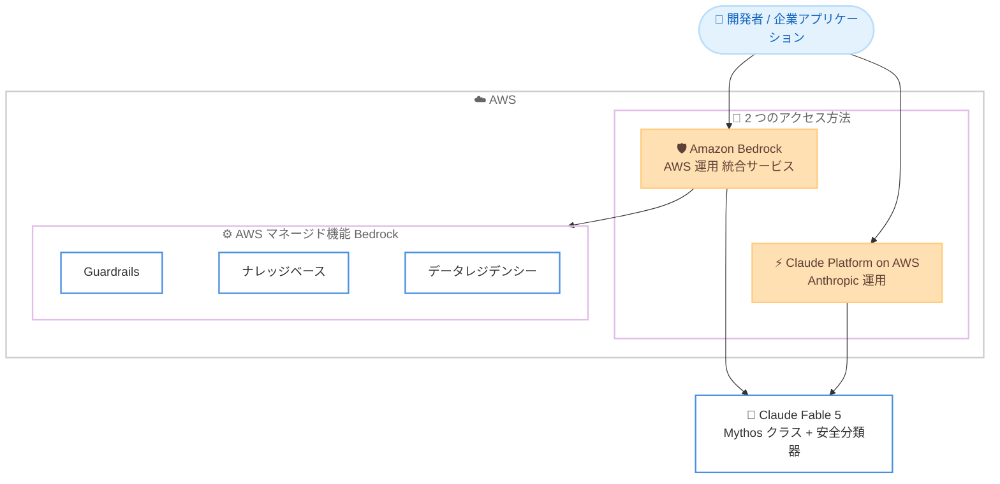

# Claude Fable 5 - 初の一般提供 Mythos クラスモデル

**リリース日**: 2026年6月9日
**サービス**: Amazon Bedrock / Claude Platform on AWS
**機能**: Claude Fable 5 (初の一般提供 Mythos クラスモデル)

📊 [このアップデートのインフォグラフィックを見る](https://takech9203.github.io/aws-news-summary/20260609-claude-fable-5-aws.html)
<!-- INFOGRAPHIC_BASE_URL は環境変数から取得 -->

## 概要

AWS は、Anthropic の Claude Fable 5 が一般提供 (GA) になったことを発表しました。Claude Fable 5 は、初めて一般提供される Mythos クラスのモデルであり、より広範な利用を安全にするために設計された強力なセーフガード (安全分類器) を備えた状態で、Mythos レベルの能力をすべてのお客様に提供します。Fable 5 は、テストされたほぼすべてのベンチマークで最高水準 (state-of-the-art) を達成しており、自律的なナレッジワークと開発者・企業向けのコーディングにおいて段階的な進化をもたらします。

Claude Fable 5 は、複雑なナレッジワークやコーディングタスクを、人間の介入なしで長時間にわたって自律的に実行できるように設計されています。金融、法務、マーケティング、営業、データ、エンジニアリングといった専門的な業務向けに構築されており、本番環境の AI アプリケーションを構築する企業に適しています。

お客様が Claude Fable 5 を利用する方法は 2 つあります。Amazon Bedrock と Claude Platform on AWS です。Amazon Bedrock はデータを AWS インフラストラクチャ内に保持し、Guardrails、ナレッジベース、リージョナルデータレジデンシーといった AWS マネージドの機能を備えた統合サービスを通じてアクセスを提供します。Claude Platform on AWS は Anthropic が運用しており、統合された AWS の請求と認証を利用しながら、Anthropic ネイティブの Claude プラットフォーム体験への直接的なアクセスを提供します。

なお、安全分類器を含まない同一のモデルである Claude Mythos 5 は、現在 Claude Mythos Preview へのアクセス権を持つ少数のお客様に限定して提供されています。

**アップデート前の課題**

このアップデート以前は、最上位クラスのモデル能力の利用やデプロイに以下のような制約がありました。

- Mythos レベルの最先端の能力は、一般のお客様が利用できる形では提供されていなかった
- 長時間にわたる自律的なナレッジワークやコーディングタスクを、安全に本番環境で実行できるモデルの選択肢が限られていた
- 専門業務 (金融、法務、マーケティング、営業、データ、エンジニアリング) に特化した最高水準のモデルを、AWS のガバナンス機能と組み合わせて利用する手段が限定的だった

**アップデート後の改善**

今回のアップデートにより、以下が可能になりました。

- 強力なセーフガードを備えた Mythos クラスの能力を、すべてのお客様が一般提供として利用できるようになった
- 複雑なタスクを人間の介入なしで長時間自律実行する、最高水準のモデルを本番アプリケーションで活用できるようになった
- Amazon Bedrock 経由でデータを AWS 内に保持しつつ、Guardrails やナレッジベースなどの AWS マネージド機能と組み合わせて利用できるようになった

## アーキテクチャ図



Claude Fable 5 へは、AWS マネージド機能を備えた Amazon Bedrock 経由、または Anthropic 運用の Claude Platform on AWS 経由の 2 通りの方法でアクセスできます。

## サービスアップデートの詳細

### 主要機能

1. **初の一般提供 Mythos クラスモデル**
   - Mythos レベルの能力を、すべてのお客様が一般提供として利用可能
   - より広範な利用を安全にするために設計された強力なセーフガード (安全分類器) を内蔵
   - 安全分類器を含まない同一モデルの Claude Mythos 5 は、Claude Mythos Preview のアクセス権を持つ少数のお客様に限定提供

2. **最高水準のベンチマーク性能**
   - テストされたほぼすべてのベンチマークで最高水準 (state-of-the-art) を達成
   - 自律的なナレッジワークとコーディングにおいて段階的な進化を提供
   - 本番環境の AI アプリケーションを構築する開発者・企業を対象

3. **長時間の自律実行**
   - 複雑なナレッジワークやコーディングタスクを、人間の介入なしで長時間にわたって実行可能
   - 金融、法務、マーケティング、営業、データ、エンジニアリングといった専門業務向けに構築

4. **2 つのアクセス方法**
   - Amazon Bedrock: データを AWS インフラストラクチャ内に保持し、Guardrails、ナレッジベース、リージョナルデータレジデンシーといった AWS マネージド機能を統合サービスとして提供
   - Claude Platform on AWS: Anthropic が運用し、統合された AWS の請求と認証を利用しつつ、Anthropic ネイティブの Claude プラットフォーム体験に直接アクセス

## 技術仕様

### モデルの主要スペック

| 項目 | 詳細 |
|------|------|
| モデル ID (Claude Platform on AWS) | `claude-fable-5` |
| モデル ID (Amazon Bedrock) | `anthropic.claude-fable-5` (プロバイダープレフィックス付き) |
| コンテキストウィンドウ | 1M トークン |
| 最大出力トークン | 128K (大きな出力にはストリーミングが必要) |
| 思考モード (thinking) | アダプティブのみ (`thinking: {type: "adaptive"}`) |
| ティア | Opus を上回る新ティア |

### 利用上の注意点 (API)

Claude Fable 5 は最新ティアのモデルであり、API のリクエスト仕様は Opus 4.7 / 4.8 とほぼ共通ですが、いくつか固有の留意点があります。

- アダプティブ思考のみをサポートします。`thinking: {type: "enabled", budget_tokens: N}` は 400 エラーになります
- サンプリングパラメータ (`temperature`、`top_p`、`top_k`) は利用できず、指定すると 400 エラーになります
- 明示的な `thinking: {type: "disabled"}` は Fable 5 では 400 エラーになります。思考を無効にする場合は `thinking` パラメータ自体を省略します
- アシスタントターンのプレフィル (末尾のアシスタントメッセージ) は 400 エラーになります。出力形式を制御するには構造化出力 (`output_config.format`) を使用します
- 思考ブロックのテキストはデフォルトで省略されます。ユーザーに思考内容を表示する場合は `thinking: {type: "adaptive", display: "summarized"}` を指定します

### API 呼び出し例 (Python)

```python
import anthropic

# Amazon Bedrock 経由の場合は AnthropicBedrock クライアントを使用
client = anthropic.Anthropic()

response = client.messages.create(
    model="claude-fable-5",
    max_tokens=64000,
    thinking={"type": "adaptive"},
    output_config={"effort": "high"},
    messages=[{"role": "user", "content": "長時間の自律タスクを実行してください"}],
)
```

上記は Claude Platform on AWS / 第一者 API でのモデル呼び出し例です。アダプティブ思考を有効化し、`effort` で思考の深さを制御しています。

## 設定方法

### 前提条件

1. AWS アカウントを保有していること
2. Amazon Bedrock または Claude Platform on AWS のいずれかへのアクセスが有効化されていること
3. 適切な IAM 権限が設定されていること (モデル呼び出しに必要なアクション)

### 手順

#### ステップ1: アクセス方法の選択

データを AWS インフラストラクチャ内に保持し、Guardrails やナレッジベースなどの AWS マネージド機能を活用したい場合は Amazon Bedrock を選択します。Anthropic ネイティブの Claude プラットフォーム体験を直接利用したい場合は Claude Platform on AWS を選択します。

#### ステップ2: Amazon Bedrock でモデルへのアクセスを有効化

Amazon Bedrock を利用する場合は、Bedrock コンソールのモデルアクセス設定で Claude Fable 5 へのアクセスをリクエスト・有効化します。利用可能なリージョンについては、Bedrock のモデルカードおよびリージョン提供状況のドキュメントを確認してください。

#### ステップ3: API からモデルを呼び出し

有効化後、各 AWS SDK または Anthropic SDK を使用してモデルを呼び出します。Amazon Bedrock ではモデル ID にプロバイダープレフィックス (`anthropic.claude-fable-5`) が付与され、Claude Platform on AWS ではプレフィックスなしの `claude-fable-5` を使用します。

## メリット

### ビジネス面

- **最先端の能力をすべての顧客へ**: これまで限定されていた Mythos レベルの能力を、一般提供として広く活用できます
- **専門業務への適用**: 金融、法務、マーケティング、営業、データ、エンジニアリングといった高付加価値業務に特化した最高水準のモデルを業務に取り込めます
- **柔軟な調達**: Amazon Bedrock の統合請求、または Claude Platform on AWS の統合された AWS 請求・認証から、組織の運用方針に合わせて選択できます

### 技術面

- **長時間の自律実行**: 複雑なタスクを人間の介入なしで長時間処理でき、エージェント型ワークロードの実装を効率化します
- **安全性の組み込み**: 広範な利用を安全にするための強力なセーフガード (安全分類器) が組み込まれています
- **AWS ガバナンスとの統合**: Amazon Bedrock 経由ではデータを AWS 内に保持しつつ、Guardrails、ナレッジベース、リージョナルデータレジデンシーと組み合わせて運用できます

## デメリット・制約事項

### 制限事項

- Claude Mythos 5 (安全分類器を含まない同一モデル) は、Claude Mythos Preview のアクセス権を持つ少数のお客様に限定されており、一般提供ではありません
- 利用可能なリージョンは限定される場合があります。最新の提供状況は Bedrock のリージョン提供状況ドキュメントで確認が必要です
- Amazon Bedrock では Managed Agents や Anthropic のサーバーサイドツールはサポートされません。これらを利用する場合は Claude Platform on AWS を選択する必要があります

### 考慮すべき点

- 最上位ティアのモデルであるため、利用コストはモデル選択の判断材料となります (料金セクションを参照)
- 大きな出力 (高い `max_tokens`) を扱う場合はストリーミングが必要です
- API のリクエスト仕様が Opus 系と一部異なる (サンプリングパラメータ不可、思考無効化の指定方法など) ため、既存コードの移行時には確認が必要です

## ユースケース

### ユースケース1: 自律的なコーディングエージェント

**シナリオ**: 大規模なコードベースのリファクタリングや複数ファイルにまたがる機能実装を、人間が逐一指示することなく自律的に進めたい。

**実装例**:
```
タスク仕様を最初の 1 ターンで明確に提示し、effort を high または xhigh に設定して
長時間の自律実行を行わせる。
```

**効果**: 複雑なコーディングタスクを介入なしで長時間実行でき、開発者の負荷を軽減します。

### ユースケース2: 専門業務のナレッジワーク自動化

**シナリオ**: 金融や法務などの専門業務で、文書分析やレポート作成といったナレッジワークを高い精度で自動化したい。

**実装例**:
```
Amazon Bedrock のナレッジベースと組み合わせ、社内文書を参照しながら
専門業務向けのナレッジワークを実行する。
```

**効果**: 専門業務に特化した最高水準のモデルにより、高品質な成果物を効率的に生成できます。

### ユースケース3: ガバナンスを重視した本番 AI アプリケーション

**シナリオ**: データを AWS インフラストラクチャ内に保持し、ガードレールを適用したうえで本番環境に AI 機能を組み込みたい。

**実装例**:
```
Amazon Bedrock 経由で Claude Fable 5 を呼び出し、Guardrails を適用して
入出力のポリシー制御を行いながらアプリケーションに統合する。
```

**効果**: データレジデンシーやガードレールといった AWS マネージド機能と組み合わせ、ガバナンス要件を満たしながら最先端モデルを活用できます。

## 料金

Claude Fable 5 は Opus を上回る新ティアのモデルであり、トークンベースの従量課金で提供されます。第一者 API における標準価格は以下のとおりです。Amazon Bedrock 経由の価格は Bedrock の料金ページを参照してください。

### 料金例

| 項目 | 価格 (100 万トークンあたり) |
|--------|------------------|
| 入力トークン | 10.00 USD |
| 出力トークン | 50.00 USD |

実際の利用料金は、アクセス方法 (Amazon Bedrock または Claude Platform on AWS) や利用量により異なります。最新の正確な料金は各料金ページで確認してください。

## 利用可能リージョン

利用可能なリージョンについては、Amazon Bedrock のモデルカードおよびリージョン提供状況のドキュメントを確認してください。提供状況は順次拡大される場合があります。

## 関連サービス・機能

- **Amazon Bedrock**: データを AWS 内に保持し、Guardrails、ナレッジベース、リージョナルデータレジデンシーといったマネージド機能とともに Claude Fable 5 を利用できる統合サービス
- **Claude Platform on AWS**: Anthropic が運用し、統合された AWS の請求と認証を利用しながら Anthropic ネイティブの Claude プラットフォーム体験を提供
- **Amazon Bedrock Guardrails**: 入出力のポリシー制御により、安全性とコンプライアンス要件を満たすための機能

## 参考リンク

- 📊 [インフォグラフィック](https://takech9203.github.io/aws-news-summary/20260609-claude-fable-5-aws.html)
- [公式発表 (What's New)](https://aws.amazon.com/about-aws/whats-new/2026/06/claude-fable-5-aws/)
- [Amazon Bedrock](https://aws.amazon.com/bedrock/)

## まとめ

Claude Fable 5 の一般提供は、Mythos クラスの最先端能力を強力なセーフガードとともにすべてのお客様へ届ける重要なマイルストーンです。長時間の自律的なナレッジワークとコーディングを実現し、Amazon Bedrock のガバナンス機能または Claude Platform on AWS のネイティブ体験という 2 つのアクセス方法から、組織の要件に合わせて選択できます。本番 AI アプリケーションを検討している場合は、利用可能リージョンと料金を確認のうえ、まずは小規模な検証から導入を進めることを推奨します。
