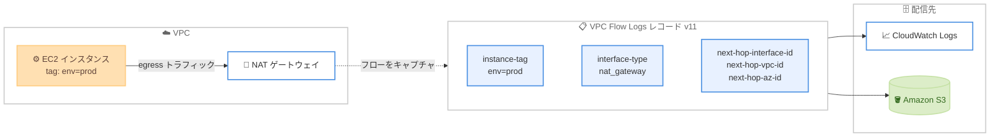

# Amazon VPC Flow Logs - 追加メタデータ (EC2 リソースタグと次ホップメタデータ)

**リリース日**: 2026年6月10日
**サービス**: Amazon Virtual Private Cloud (VPC)
**機能**: VPC Flow Logs の追加メタデータ (EC2 リソースタグ、次ホップインターフェイスメタデータ)

📊 [このアップデートのインフォグラフィックを見る](https://takech9203.github.io/aws-news-summary/20260610-amazon-flow-logs-metadata.html)
<!-- INFOGRAPHIC_BASE_URL は環境変数から取得 -->

## 概要

Amazon Virtual Private Cloud (VPC) Flow Logs が、EC2 リソースタグと次ホップインターフェイスのメタデータをサポートするようになりました。これにより、フローログデータとリソースのメタデータを手動で関連付ける必要がなくなり、ネットワークの監視とトラブルシューティングが大幅に簡素化されます。

EC2 リソースタグのサポートにより、ネットワークインターフェイス、EC2 インスタンス、Auto Scaling グループのタグ値をフローログレコードに直接埋め込めるようになりました。これまでは、フローログに記録されたリソース ID を、別途取得したタグ情報と突き合わせて、どのワークロードのトラフィックかを判別する必要がありました。今回のアップデートにより、フローログレコードを見るだけで、トラフィックがどのアプリケーションやチーム、環境に属するかを把握できます。

次ホップメタデータのサポートにより、各フローの次ホップネットワークインターフェイスに関する詳細 (インターフェイス ID、サブネット、アベイラビリティーゾーン、VPC、インターフェイスタイプ) を取得できるようになりました。これらのフィールドは、NAT ゲートウェイ、Network Load Balancer、Transit Gateway などのネットワークリソースをトラフィックがどのように通過するかを理解するのに役立ちます。これらの機能は、東京、大阪を含む多数の AWS リージョンで利用可能です。

**アップデート前の課題**

- フローログにはリソース ID のみが記録され、タグ情報を含まなかったため、どのワークロードのトラフィックかを判別するには別のシステムでタグデータと突き合わせる必要があった
- トラフィックが NAT ゲートウェイや Transit Gateway などの中間リソースをどのように経由するかを、フローログから直接把握できなかった
- ネットワーク監視やトラブルシューティングのために、フローログデータとリソースメタデータを手動で関連付ける運用負荷が発生していた

**アップデート後の改善**

- ネットワークインターフェイス、EC2 インスタンス、Auto Scaling グループのタグ値をフローログレコードに直接含められるようになった
- 各フローの次ホップネットワークインターフェイスの詳細 (インターフェイス ID、サブネット、AZ、VPC、インターフェイスタイプ) を取得できるようになった
- フローログデータと外部メタデータを手動で突き合わせる作業が不要になり、監視とトラブルシューティングが効率化された

## アーキテクチャ図



タグ情報と次ホップメタデータがフローログレコードに直接埋め込まれ、CloudWatch Logs または Amazon S3 へ配信される流れを示しています。これにより、配信後に外部メタデータと突き合わせる処理が不要になります。

## サービスアップデートの詳細

### 主要機能

1. **EC2 リソースタグのサポート**
   - ネットワークインターフェイス、EC2 インスタンス、Auto Scaling グループのタグ値をフローログレコードに埋め込み可能
   - カスタムフォーマットの `TagFieldSpecifications` で、含めるタグキーを指定する
   - タグ値は UTF-8 のパーセントエンコーディングで特殊文字を変換して表示される
   - インスタンスタグ、インターフェイスタグ、Auto Scaling グループタグそれぞれについて、最大 2 つのタグフィールド (例: `instance-tag`、`instance-tag-2`) を指定できる

2. **次ホップインターフェイスメタデータのサポート**
   - 各フローの次ホップネットワークインターフェイスの詳細を記録
   - egress トラフィックの場合は受信側インターフェイス、ingress トラフィックの場合は送信側インターフェイスを示す
   - 取得できるフィールド: `next-hop-interface-id`、`next-hop-subnet-id`、`next-hop-az-id`、`next-hop-vpc-id`、`next-hop-interface-type`

3. **インターフェイスタイプの識別**
   - `interface-type` フィールドで、フローをキャプチャしたローカルネットワークインターフェイスのタイプを識別
   - サポート値: `nat_gateway`、`network_load_balancer`、`regional_nat_gateway`、`transit_gateway`、`vpc_endpoint`
   - NAT ゲートウェイ、Network Load Balancer、Transit Gateway を経由するトラフィックの経路把握に役立つ

## 技術仕様

### 新しいフローログフィールド (バージョン 11)

これらの新フィールドは VPC Flow Logs のバージョン 11 で導入され、カスタムフォーマットでのみ利用できます。デフォルトフォーマット (バージョン 2) には含まれません。

| フィールド | 説明 |
|------|------|
| instance-tag / instance-tag-2 | `TagFieldSpecifications` に含めた EC2 インスタンスタグの値 |
| interface-tag / interface-tag-2 | `TagFieldSpecifications` に含めたネットワークインターフェイスタグの値 |
| asg-tag / asg-tag-2 | `TagFieldSpecifications` に含めた Auto Scaling グループタグの値 |
| interface-type | フローをキャプチャしたローカルネットワークインターフェイスのタイプ |
| next-hop-interface-id | 次ホップネットワークインターフェイスの ID |
| next-hop-subnet-id | 次ホップインターフェイスが属するサブネットの ID |
| next-hop-az-id | 次ホップインターフェイスが属するアベイラビリティーゾーンの ID |
| next-hop-vpc-id | 次ホップインターフェイスが属する VPC の ID |
| next-hop-interface-type | 次ホップネットワークインターフェイスのタイプ |

### 必要な IAM 権限

タグフィールドを含めるには、対象に応じて以下の権限が必要です。

| 対象 | 必要な権限 |
|------|------|
| インスタンスタグ / インターフェイスタグ | `ec2:DescribeTags`、`iam:CreateServiceLinkedRole` |
| Auto Scaling グループタグ | `autoscaling:DescribeTags`、`iam:CreateServiceLinkedRole` |

Auto Scaling グループのタグ値をリアルタイムで正確に追跡・更新するには、アカウントで少なくとも 1 つの CloudTrail 証跡が有効になっている必要があります。また、これらのタグフィールドは VPC Flow Logs のサービスにリンクされたロール (Service-Linked Role) を使用します。

## 設定方法

### 前提条件

1. フローログの配信先 (CloudWatch Logs または Amazon S3) が準備されていること
2. タグフィールドを使用する場合、上記の IAM 権限が付与されていること
3. Auto Scaling グループタグを使用する場合、有効な CloudTrail 証跡が存在すること

### 手順

#### ステップ1: カスタムフォーマットで新フィールドを指定

VPC Flow Logs はカスタムフォーマットで含めるフィールドを選択します。新しいメタデータフィールドを含めたフローログを作成します。

```bash
aws ec2 create-flow-logs \
  --resource-type VPC \
  --resource-ids vpc-0123456789abcdef0 \
  --traffic-type ALL \
  --log-destination-type cloud-watch-logs \
  --log-group-name my-flow-logs \
  --deliver-logs-permission-arn arn:aws:iam::123456789012:role/flow-logs-role \
  --log-format '${srcaddr} ${dstaddr} ${interface-type} ${next-hop-interface-id} ${next-hop-vpc-id} ${instance-tag} ${asg-tag}'
```

このコマンドは、ソース・宛先アドレスに加えて、インターフェイスタイプ、次ホップインターフェイス ID と VPC ID、インスタンスタグ、Auto Scaling グループタグを含むフローログを作成します。

#### ステップ2: タグフィールドの指定

タグフィールド (`instance-tag`、`interface-tag`、`asg-tag` など) を使用する場合は、`TagFieldSpecifications` でどのタグキーを記録するかを指定します。指定したタグキーの値が、対応するフィールドに記録されます。

#### ステップ3: フローログの確認

作成後、CloudWatch Logs または Amazon S3 に配信されたレコードを確認します。各フィールドが該当しない、または計算できない場合は `-` 記号が表示されます。パケットヘッダーに由来しないメタデータフィールドはベストエフォートでの近似値であり、値が欠落したり不正確になる場合があります。

## メリット

### ビジネス面

- **運用効率の向上**: フローログデータとタグメタデータを手動で突き合わせる作業が不要になり、ネットワーク分析の工数を削減
- **コスト配分の明確化**: タグ値を用いて、トラフィックをチーム、環境、アプリケーション単位で識別しやすくなる
- **トラブルシューティングの迅速化**: トラフィックの経路を直接把握でき、障害切り分けの時間を短縮

### 技術面

- **ワークロード単位の可視化**: タグによりフローを特定のワークロードに直接紐付けられる
- **トラフィック経路の把握**: 次ホップメタデータにより、NAT ゲートウェイや Transit Gateway を経由する経路を明確化
- **後処理の削減**: 配信後に外部メタデータと結合する処理パイプラインが不要になり、分析基盤を簡素化

## デメリット・制約事項

### 制限事項

- 新しいフィールドはカスタムフォーマット (バージョン 11) でのみ利用可能で、デフォルトフォーマットには含まれない
- タグフィールドは対象あたり最大 2 つ (例: `instance-tag`、`instance-tag-2`) に限定される
- パケットヘッダーに由来しないメタデータフィールドはベストエフォートの近似値であり、欠落や不正確な値が含まれる可能性がある

### 考慮すべき点

- タグフィールドの利用には `ec2:DescribeTags` などの追加 IAM 権限とサービスにリンクされたロールが必要
- Auto Scaling グループタグのリアルタイム追跡には、有効な CloudTrail 証跡が前提となる
- 含めるフィールドを増やすとログ量が増加するため、配信先のストレージコストへの影響を考慮する

## ユースケース

### ユースケース1: ワークロード単位のトラフィック分析

**シナリオ**: 複数チームが同じ VPC を共有しており、どのチームのワークロードがどれだけのトラフィックを生成しているかを把握したい。

**実装例**:
```
ログフォーマットに instance-tag を追加し、TagFieldSpecifications で "Team" タグを指定。
フローログレコードから Team タグ値ごとにトラフィック量を集計。
```

**効果**: フローログだけでチーム単位のトラフィックを集計でき、コスト配分や容量計画が容易になります。

### ユースケース2: NAT ゲートウェイ経由トラフィックの経路把握

**シナリオ**: アウトバウンドトラフィックがどの NAT ゲートウェイを経由しているかを特定し、AZ をまたぐデータ転送コストを最適化したい。

**実装例**:
```
ログフォーマットに interface-type、next-hop-interface-id、next-hop-az-id を追加。
egress フローについて、次ホップの AZ が送信元と異なるレコードを抽出。
```

**効果**: AZ をまたぐ NAT ゲートウェイ経由のトラフィックを特定し、不要なクロス AZ 転送を削減できます。

### ユースケース3: Auto Scaling グループ単位のセキュリティ監視

**シナリオ**: Auto Scaling で動的に増減するインスタンス群について、特定のアプリケーショングループからの異常な通信を監視したい。

**実装例**:
```
ログフォーマットに asg-tag を追加し、TagFieldSpecifications で Auto Scaling グループのタグを指定。
asg-tag 値ごとに通信パターンをベースライン化し、逸脱を検知。
```

**効果**: インスタンス ID が頻繁に変わる環境でも、Auto Scaling グループ単位で安定した監視ができます。

## 料金

VPC Flow Logs の料金は、ログの取り込みとストレージに対して発生し、配信先 (CloudWatch Logs または Amazon S3) の料金体系に従います。今回の追加メタデータフィールド自体に対する追加料金については、公式の料金ページを確認してください。フィールドを追加するとレコードのデータ量が増加するため、取り込み量とストレージ量が増える点に留意してください。

## 利用可能リージョン

東京、大阪を含む多数の AWS リージョンで利用可能です。米国、アフリカ、アジアパシフィック、カナダ、ヨーロッパ、イスラエル、南米、メキシコ、European Sovereign Cloud (ドイツ)、AWS GovCloud (US) を含みます。

## 関連サービス・機能

- **Amazon CloudWatch Logs**: フローログの配信先の 1 つ。ログのリアルタイム分析やメトリクスフィルタに利用
- **Amazon S3**: フローログの配信先の 1 つ。Parquet 形式での保存や Amazon Athena による分析に利用
- **AWS Transit Gateway / NAT ゲートウェイ / Network Load Balancer**: 次ホップメタデータと `interface-type` フィールドで経路を可視化できる対象リソース
- **Amazon EC2 Auto Scaling**: `asg-tag` フィールドにより Auto Scaling グループ単位でのトラフィック識別が可能

## 参考リンク

- 📊 [インフォグラフィック](https://takech9203.github.io/aws-news-summary/20260610-amazon-flow-logs-metadata.html)
- [公式発表 (What's New)](https://aws.amazon.com/about-aws/whats-new/2026/06/amazon-flow-logs-metadata)
- [ドキュメント (Flow log records)](https://docs.aws.amazon.com/vpc/latest/userguide/flow-log-records.html)
- [VPC Flow Logs のサービスにリンクされたロール](https://docs.aws.amazon.com/vpc/latest/userguide/flow-logs-slr.html)

## まとめ

今回のアップデートにより、VPC Flow Logs に EC2 リソースタグと次ホップインターフェイスメタデータが追加され、フローログデータと外部メタデータを手動で突き合わせる必要がなくなりました。ネットワークの可視化とトラブルシューティングを効率化したい場合は、カスタムフォーマット (バージョン 11) で新フィールドを指定し、必要な IAM 権限を整えたうえで導入を検討することを推奨します。
