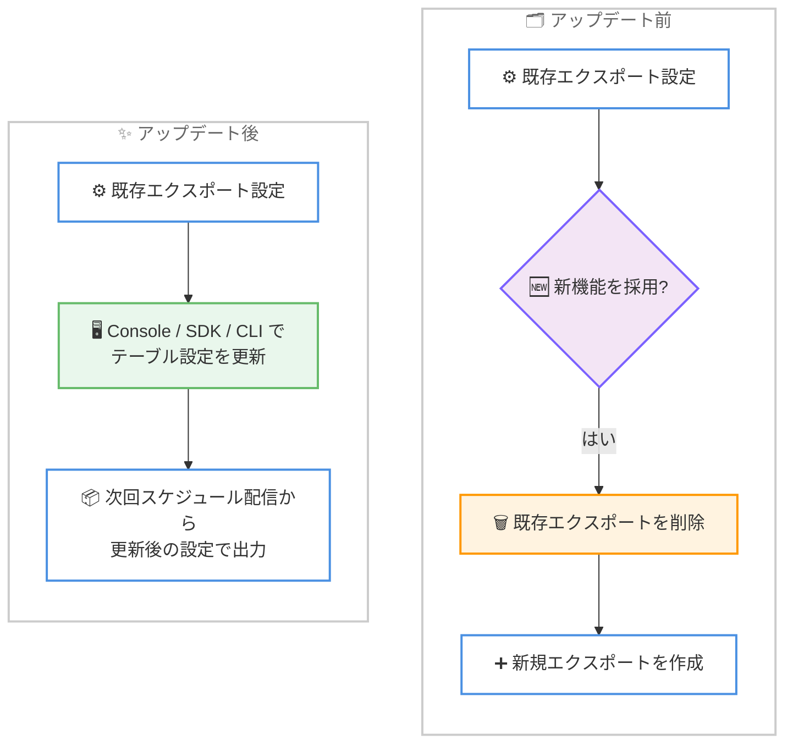

# AWS Cost and Usage Report 2.0 - テーブル設定の更新サポート

**リリース日**: 2026 年 6 月 10 日
**サービス**: AWS Cost and Usage Report 2.0 (CUR 2.0)
**機能**: 既存エクスポートのテーブル設定更新

📊 [このアップデートのインフォグラフィックを見る](https://takech9203.github.io/aws-news-summary/20260610-aws-cost-usage-report.html)
<!-- INFOGRAPHIC_BASE_URL は環境変数から取得 -->

## 概要

AWS Cost and Usage Report 2.0 (CUR 2.0) で、既存のデータテーブル設定を AWS Management Console および SDK/CLI から更新できるようになりました。これにより、お客様はエクスポートを削除して再作成することなく、CUR 2.0 の新機能を既存のエクスポートに適用できます。

CUR 2.0 は、AWS の利用状況とコストに関する最も詳細なデータを提供するレポートであり、FinOps の実践やコスト配分、チャージバックの基盤として広く利用されています。多くのお客様は、CUR 2.0 のエクスポートを ETL パイプラインやデータウェアハウスに取り込み、安定したスキーマを前提とした分析基盤を構築しています。今回のアップデートは、こうした既存の分析基盤を維持しながら、新しいデータ項目や粒度を柔軟に取り込みたいコスト管理担当者やデータエンジニアにとって有用です。

更新したテーブル設定は、次回のスケジュールされたエクスポート配信から反映されます。これにより、エクスポートの再作成に伴う運用上の手間や、エクスポート履歴の断絶を避けながら、最新の CUR 2.0 機能を活用できます。

**アップデート前の課題**

これまで、お客様は CUR 2.0 のエクスポートを特定のテーブル設定 (エクスポート内容、時間粒度、列の選択、エクスポート形式、出力先設定) で構成していました。AWS が新機能 (追加の列や、より細かい行レベルの粒度など) を導入した際、既存のエクスポート設定は ETL ジョブが依存する安定したスキーマを保護するために意図的に変更されませんでした。

- 新しい列やより細かい粒度などの新機能を既存エクスポートに適用できなかった
- 新機能を採用するには、既存のエクスポートを削除して新しいエクスポートを作成する必要があった
- エクスポートの再作成により、設定の作り直しや出力先の再構成といった運用上の手間が発生していた

**アップデート後の改善**

今回のアップデートにより、お客様はテーブル設定を AWS Management Console または SDK/CLI から直接更新し、次回のスケジュールされたエクスポート配信から更新後の設定でエクスポートを受け取れるようになりました。

- 既存エクスポートを削除・再作成せずに、新しい CUR 2.0 機能を適用できるようになった
- AWS Management Console と SDK/CLI の両方からテーブル設定を更新できるようになった
- 更新後の設定が次回のスケジュール配信から反映され、移行作業が不要になった

## アーキテクチャ図



アップデート前は新機能採用のためにエクスポートの削除と再作成が必要でしたが、アップデート後は既存エクスポートのテーブル設定を直接更新するだけで済みます。

## サービスアップデートの詳細

### 主要機能

1. **既存テーブル設定の更新**
   - エクスポートを削除・再作成せずに、既存の CUR 2.0 エクスポートのテーブル設定を変更できる
   - 更新可能な設定には、エクスポート内容、時間粒度、列の選択、エクスポート形式、出力先設定が含まれる
   - 新しく追加された列やより細かい行レベルの粒度といった新機能を、既存エクスポートに取り込める

2. **複数のインターフェースに対応**
   - AWS Management Console から GUI 操作でテーブル設定を更新できる
   - SDK/CLI を利用して、設定更新をプログラムから自動化できる
   - Infrastructure as Code やバッチ運用との親和性が高い

3. **次回スケジュール配信からの反映**
   - 更新したテーブル設定は、次回のスケジュールされたエクスポート配信から反映される
   - エクスポート履歴の断絶を避けながら、設定変更を段階的に適用できる

## 技術仕様

### 更新可能なテーブル設定

| 項目 | 詳細 |
|------|------|
| エクスポート内容 | レポートに含めるデータの種類 |
| 時間粒度 | 時間単位・日次・月次などの集計粒度 |
| 列の選択 | エクスポートに含める列 (新規追加列を含む) |
| エクスポート形式 | Parquet や CSV などの出力形式 |
| 出力先設定 | Amazon S3 バケットなどの配信先設定 |

### API 変更履歴

今回のアップデートに関連する awsapichanges.com 上の新規 API メソッドの追加は、確認時点では公開されていませんでした。CUR 2.0 のエクスポート設定更新は、AWS Data Exports (BCM Data Exports) の `UpdateExport` などの操作を通じて行われます。最新の API 仕様は AWS の公式ドキュメントを参照してください。

## 設定方法

### 前提条件

1. CUR 2.0 (AWS Data Exports) を利用するための適切な IAM 権限があること
2. 更新対象となる既存の CUR 2.0 エクスポートが作成済みであること
3. エクスポート先の Amazon S3 バケットおよびバケットポリシーが正しく構成されていること

### 手順

#### ステップ 1: AWS Management Console での更新

AWS Billing and Cost Management コンソールの [Data Exports] から対象のエクスポートを選択し、[Edit] でテーブル設定 (列、時間粒度、形式など) を変更して保存します。更新内容は次回のスケジュール配信から反映されます。

#### ステップ 2: SDK/CLI での更新

```bash
# 既存エクスポートのテーブル設定を更新する例
aws bcm-data-exports update-export \
  --export-arn "arn:aws:bcm-data-exports:us-east-1:123456789012:export/example-cur2-export" \
  --export file://updated-export-config.json
```

このコマンドは、`--export-arn` で指定した既存エクスポートのテーブル設定を、`updated-export-config.json` に記述した新しい設定で更新します。これにより、エクスポートを削除・再作成することなく列の追加や粒度の変更を適用できます。実際のパラメータ名やフォーマットは AWS CLI および SDK の最新仕様を確認してください。

#### ステップ 3: 反映の確認

更新後、次回のスケジュールされたエクスポート配信のタイミングで、出力先の S3 バケットに更新後の設定に基づくデータが配信されます。配信されたファイルのスキーマや列構成を確認し、ETL パイプラインやデータウェアハウス側のスキーマ定義を必要に応じて調整します。

## メリット

### ビジネス面

- **運用コストの削減**: エクスポートの削除・再作成が不要になり、設定変更にかかる工数を削減できる
- **新機能の迅速な採用**: 追加の列やより細かい粒度といった CUR 2.0 の新機能を、既存基盤を維持したまま活用できる
- **コスト分析の高度化**: 必要なデータ項目を柔軟に追加することで、より詳細なコスト配分やチャージバックを実現できる

### 技術面

- **スキーマ移行の柔軟性**: 既存の ETL ジョブを保護しつつ、計画的にスキーマを更新できる
- **自動化との親和性**: SDK/CLI 対応により、設定更新を Infrastructure as Code やパイプラインに組み込める
- **エクスポート履歴の維持**: エクスポートを再作成しないため、設定の連続性が保たれる

## デメリット・制約事項

### 制限事項

- AWS GovCloud (US) リージョンおよび中国リージョンでは利用できない
- 更新後の設定は次回のスケジュール配信から反映されるため、即時反映ではない

### 考慮すべき点

- 列の追加や粒度の変更はダウンストリームの ETL ジョブやスキーマ定義に影響する可能性があるため、変更前に影響範囲を確認する
- 既存のスキーマに依存するクエリやダッシュボードがある場合、更新内容との整合性を事前に検証する

## ユースケース

### ユースケース 1: 新規追加列の取り込み

**シナリオ**: AWS が CUR 2.0 に新しいコスト配分関連の列を追加した。既存の分析基盤に影響を与えずに、この列を取り込みたい。

**実装例**:
```
1. テスト環境または検証用エクスポートで列を追加して影響を確認
2. 本番エクスポートのテーブル設定で対象列を追加
3. 次回配信後、ETL のスキーマ定義に新列を反映
```

**効果**: エクスポートの再作成なしに、新しいコストデータ項目を分析に取り込める

### ユースケース 2: 時間粒度の見直し

**シナリオ**: 月次粒度で運用していたコストレポートを、より詳細な分析のために日次粒度へ変更したい。

**実装例**:
```
aws bcm-data-exports update-export \
  --export-arn "<既存エクスポートの ARN>" \
  --export file://daily-granularity-config.json
```

**効果**: エクスポートを作り直すことなく、必要な粒度でのコスト可視化に切り替えられる

### ユースケース 3: 設定変更の自動化

**シナリオ**: 複数アカウントの CUR 2.0 エクスポート設定を統一的に管理し、変更をパイプラインから適用したい。

**実装例**:
```
CI/CD パイプライン内で SDK/CLI を呼び出し、
各アカウントのエクスポート設定を更新する
```

**効果**: 設定変更を標準化・自動化し、運用の一貫性とガバナンスを向上できる

## 料金

今回のアップデートに関する追加料金についての記載は、公式発表にはありません。CUR 2.0 (AWS Data Exports) の利用料金、およびエクスポート先となる Amazon S3 のストレージ・リクエスト料金が適用されます。最新の料金は AWS の公式料金ページを参照してください。

## 利用可能リージョン

AWS GovCloud (US) リージョンおよび中国リージョンを除く、すべての商用 AWS リージョンで利用できます。

## 関連サービス・機能

- **AWS Data Exports (BCM Data Exports)**: CUR 2.0 を含むエクスポートを作成・管理するサービス。今回のテーブル設定更新はこの仕組みを通じて行う
- **AWS Billing and Cost Management**: コストと使用状況の可視化・管理を行うサービス群。CUR 2.0 はその中核的なデータソース
- **Amazon S3**: CUR 2.0 エクスポートの出力先として利用されるストレージサービス

## 参考リンク

- 📊 [インフォグラフィック](https://takech9203.github.io/aws-news-summary/20260610-aws-cost-usage-report.html)
- [公式発表 (What's New)](https://aws.amazon.com/about-aws/whats-new/2026/06/aws-cost-usage-report/)
- [AWS Data Exports ドキュメント](https://docs.aws.amazon.com/cur/latest/userguide/what-is-data-exports.html)
- [AWS Billing and Cost Management ユーザーガイド](https://docs.aws.amazon.com/cost-management/)

## まとめ

このアップデートにより、CUR 2.0 のエクスポートを削除・再作成することなく、新しい列や粒度などの機能を既存基盤に取り込めるようになりました。コスト分析基盤を運用しているお客様は、まず検証用のエクスポートで設定変更の影響を確認し、ダウンストリームの ETL やスキーマ定義への影響を踏まえたうえで本番エクスポートへ適用することを推奨します。
