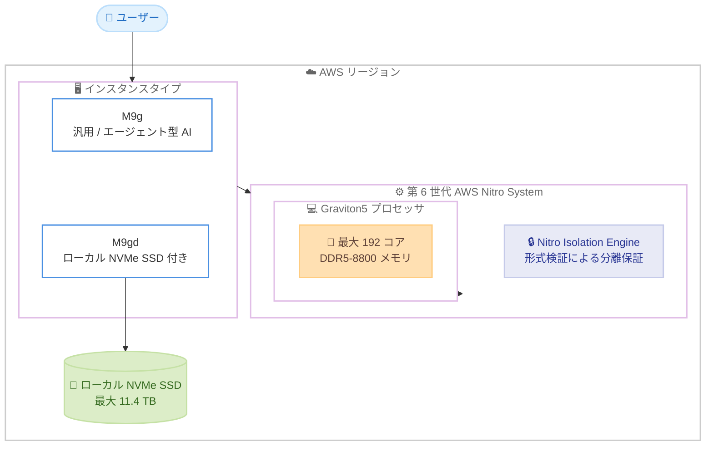

# Amazon EC2 - M9g および M9gd 汎用インスタンス

**リリース日**: 2026年6月10日
**サービス**: Amazon EC2
**機能**: AWS Graviton5 プロセッサ搭載 M9g / M9gd 汎用インスタンス

📊 [このアップデートのインフォグラフィックを見る](https://takech9203.github.io/aws-news-summary/20260610-ec2-m9g-m9gd-instances-graviton5-processors-available.html)
<!-- INFOGRAPHIC_BASE_URL は環境変数から取得 -->

## 概要

AWS は、AWS Graviton5 プロセッサを搭載した Amazon EC2 M9g および M9gd 汎用インスタンスの一般提供を開始しました。Graviton5 は AWS が独自に設計したプロセッサの第 5 世代であり、汎用ワークロードにおいて最高のコストパフォーマンスを提供します。

M9g インスタンスは、アプリケーションサーバー、マイクロサービス、ゲーム、キャッシング、コンテナなどの汎用ワークロードに加え、リアルタイム推論、コード生成、マルチステップオーケストレーションといったエージェント型 AI のユースケースに適しています。M9gd インスタンスは、これらに加えてローカル NVMe ベースの SSD ストレージを備え、メディア処理、バッチ/ログ処理、キャッシュやスクラッチファイルなど、高速で低レイテンシなローカルストレージを必要とするワークロードに対応します。

これらのインスタンスは、第 6 世代の AWS Nitro System 上に構築されており、形式検証 (formal verification) を用いた Nitro Isolation Engine を初めて搭載しています。これにより、お客様のワークロードが相互に、また AWS のオペレーターから分離されていることを数学的に保証します。

**アップデート前の課題**

- Graviton4 ベースの M8g / M8gd インスタンスでは、エージェント型 AI のような新しいワークロードに対する演算性能が今回ほど高くありませんでした
- メモリ帯域幅やコア間レイテンシが性能上のボトルネックになる場合がありました
- ワークロード分離の保証は運用上の管理に依存しており、数学的に証明された分離保証はありませんでした

**アップデート後の改善**

- 今回のアップデートにより、Graviton4 ベースの M8g / M8gd と比較して最大 25% 高い演算性能が得られるようになりました
- DDR5-8800 メモリと大容量 L3 キャッシュにより、データベース、Web アプリケーション、機械学習で大幅な高速化が可能になりました
- Nitro Isolation Engine により、ワークロード分離が数学的に証明されるようになりました

## アーキテクチャ図



M9g / M9gd インスタンスは、第 6 世代 Nitro System 上の Graviton5 プロセッサで動作し、M9gd ではローカル NVMe SSD ストレージが追加される構成です。

## サービスアップデートの詳細

### 主要機能

1. **AWS Graviton5 プロセッサ**
   - AWS が独自に設計したプロセッサの第 5 世代
   - 最大 192 コア、DDR5-8800 メモリ (クラウドのインスタンスプロセッサで最速のメモリ) を搭載
   - 前世代と比較して 5 倍大きい L3 キャッシュ、最大 33% 低いコア間レイテンシ
   - AWS の CPU として初めて PCIe Gen6 をサポート

2. **M9g 汎用インスタンス**
   - アプリケーションサーバー、マイクロサービス、ゲーム、キャッシング、コンテナなどの汎用ワークロード向け
   - リアルタイム推論、コード生成、マルチステップオーケストレーションといったエージェント型 AI のユースケースに対応
   - vCPU 1 つあたり 4 GiB のメモリ比率を維持

3. **M9gd 汎用インスタンス**
   - M9g の特性に加え、ローカル NVMe ベースの SSD ブロックレベルストレージを搭載
   - 最大 11.4 TB の NVMe SSD ストレージを提供し、M8gd と比較して 30% 高い IOPS を実現
   - メディア処理、バッチ/ログ処理、キャッシュやスクラッチファイルなど、高速で低レイテンシなローカルストレージを必要とするワークロード向け

4. **第 6 世代 AWS Nitro System と Nitro Isolation Engine**
   - 第 6 世代の AWS Nitro System 上に構築
   - 形式検証を用いた Nitro Isolation Engine を初めて搭載し、ワークロード分離を数学的に保証

## 技術仕様

### パフォーマンス向上 (Graviton4 ベース M8g / M8gd 比)

| ワークロード | 性能向上 |
|------|------|
| 演算 (汎用) | 最大 25% 高速 |
| データベース | 最大 30% 高速 |
| Web アプリケーション | 最大 35% 高速 |
| 機械学習 | 最大 35% 高速 |

### M9g インスタンスサイズ

| サイズ | vCPU | メモリ (GiB) | ネットワーク帯域幅 (Gbps) | EBS 帯域幅 (Gbps) |
|------|------|------|------|------|
| medium | 1 | 4 | 最大 15 | 最大 12 |
| large | 2 | 8 | 最大 15 | 最大 12 |
| xlarge | 4 | 16 | 最大 15 | 最大 12 |
| 2xlarge | 8 | 32 | 最大 17 | 最大 12 |
| 4xlarge | 16 | 64 | 最大 17 | 最大 12 |
| 8xlarge | 32 | 128 | 17 | 12 |
| 12xlarge | 48 | 192 | 25 | 18 |
| 16xlarge | 64 | 256 | 34 | 24 |
| 24xlarge | 96 | 384 | 50 | 36 |
| 48xlarge | 192 | 768 | 100 | 72 |
| metal-48xl | 192 | 768 | 100 | 72 |

### M9gd インスタンスサイズ (ローカル NVMe SSD 付き)

| サイズ | vCPU | メモリ (GiB) | ローカルストレージ (GB) | ネットワーク帯域幅 (Gbps) | EBS 帯域幅 (Gbps) |
|------|------|------|------|------|------|
| medium | 1 | 4 | 1 x 59 | 最大 15 | 最大 12 |
| large | 2 | 8 | 1 x 118 | 最大 15 | 最大 12 |
| xlarge | 4 | 16 | 1 x 237 | 最大 15 | 最大 12 |
| 2xlarge | 8 | 32 | 1 x 475 | 最大 17 | 最大 12 |
| 4xlarge | 16 | 64 | 1 x 950 | 最大 17 | 最大 12 |
| 8xlarge | 32 | 128 | 1 x 1900 | 17 | 12 |
| 12xlarge | 48 | 192 | 3 x 950 | 25 | 18 |
| 16xlarge | 64 | 256 | 1 x 3800 | 34 | 24 |
| 24xlarge | 96 | 384 | 3 x 1900 | 50 | 36 |
| 48xlarge | 192 | 768 | 3 x 3800 | 100 | 72 |
| metal-48xl | 192 | 768 | 3 x 3800 | 100 | 72 |

### その他の技術ポイント

- 両インスタンスは Instance Bandwidth Configuration (IBC) をサポートし、EBS と VPC の帯域幅を最大 25% シフトできます
- bare metal サイズ (metal-48xl) が提供され、ハイパーバイザーを介さずにプロセッサとメモリへ直接アクセスできます

## 設定方法

### 前提条件

1. AWS アカウントと適切な IAM 権限 (EC2 インスタンスの起動権限) を保有していること
2. 対応リージョン (バージニア北部、オハイオ、オレゴン、フランクフルト) のいずれかを利用すること
3. ワークロードが Arm ベースアーキテクチャ (AArch64) に対応していること

### 手順

#### ステップ1: 対応 AMI の確認

```bash
# Arm64 アーキテクチャに対応した最新の Amazon Linux 2023 AMI を取得
aws ec2 describe-images \
  --owners amazon \
  --filters "Name=architecture,Values=arm64" "Name=name,Values=al2023-ami-*" \
  --query 'Images | sort_by(@, &CreationDate)[-1].ImageId' \
  --region us-east-1
```

このコマンドは、Graviton5 が採用する Arm64 アーキテクチャに対応した最新の AMI ID を取得します。Graviton ベースのインスタンスでは Arm64 対応の AMI が必要です。

#### ステップ2: M9g インスタンスの起動

```bash
# M9g インスタンスを起動
aws ec2 run-instances \
  --image-id <arm64-ami-id> \
  --instance-type m9g.xlarge \
  --key-name <your-key-pair> \
  --region us-east-1
```

このコマンドは、取得した Arm64 対応 AMI を使用して m9g.xlarge インスタンスを起動します。インスタンスタイプを `m9gd.xlarge` に変更すると、ローカル NVMe SSD 付きのインスタンスを起動できます。

#### ステップ3: ローカル NVMe ストレージの確認 (M9gd の場合)

```bash
# インスタンスにログイン後、ローカル NVMe デバイスを確認
lsblk
```

M9gd インスタンスでは、起動後にローカル NVMe SSD デバイスが認識されます。利用前にファイルシステムの作成とマウントが必要です。ローカルストレージはインスタンスの停止/終了でデータが失われるため、永続化が必要なデータは保存しないでください。

## メリット

### ビジネス面

- **コストパフォーマンスの向上**: 汎用ワークロードにおいて最高のコストパフォーマンスを提供し、同等の性能をより低いコストで実現できます
- **エージェント型 AI への対応**: リアルタイム推論やコード生成などの新しいワークロードを効率的に実行でき、AI 活用の拡大に対応できます
- **エネルギー効率**: Graviton プロセッサは高いエネルギー効率を特長とし、サステナビリティ目標への貢献が期待できます

### 技術面

- **高いメモリ性能**: DDR5-8800 メモリにより、メモリ帯域幅に依存するワークロードのスループットが向上します
- **強化されたセキュリティ分離**: Nitro Isolation Engine により、形式検証に基づくワークロード分離が保証されます
- **柔軟な構成**: medium から 48xlarge、bare metal まで幅広いサイズと、IBC による帯域幅調整に対応します

## デメリット・制約事項

### 制限事項

- 現時点で利用可能なリージョンは US East (バージニア北部、オハイオ)、US West (オレゴン)、EU (フランクフルト) に限られます (東京リージョンは未対応)
- Graviton (Arm64) アーキテクチャに対応したソフトウェアと AMI が必要です
- M9gd のローカル NVMe ストレージは一時的なストレージであり、インスタンスの停止/終了でデータが失われます

### 考慮すべき点

- x86 ベースのワークロードを移行する場合は、Arm64 への再コンパイルや互換性検証が必要になる場合があります
- ローカルストレージを永続データに利用しないよう、データ配置の設計を検討する必要があります

## ユースケース

### ユースケース1: エージェント型 AI ワークロードの実行

**シナリオ**: リアルタイム推論、コード生成、マルチステップオーケストレーションを行うエージェント型 AI アプリケーションを高いコストパフォーマンスで実行したい。

**実装例**:
```
m9g.4xlarge (16 vCPU / 64 GiB) でエージェント型 AI のオーケストレーション層を実行
```

**効果**: Graviton5 の高いコア間レイテンシ改善とメモリ性能により、低レイテンシでマルチステップ処理を実行できます。

### ユースケース2: 高性能 Web アプリケーションサーバー

**シナリオ**: トラフィックの多い Web アプリケーションを効率的にスケールさせたい。

**実装例**:
```
m9g.2xlarge をオートスケーリンググループで運用し、負荷に応じて水平スケール
```

**効果**: Graviton4 ベースの M8g と比較して最大 35% 高速な Web アプリケーション性能により、同じコストでより多くのリクエストを処理できます。

### ユースケース3: メディア処理とログ処理

**シナリオ**: 大量のメディアファイルのトランスコードや、ログのバッチ処理で高速なローカルストレージが必要。

**実装例**:
```
m9gd.16xlarge (ローカル NVMe 3800 GB) で一時ファイルを処理し、結果を Amazon S3 に保存
```

**効果**: ローカル NVMe SSD により高速で低レイテンシな一時ストレージを利用でき、M8gd 比 30% 高い IOPS で処理スループットが向上します。

## 料金

M9g および M9gd インスタンスは、Savings Plans、オンデマンド、スポットインスタンス、Dedicated Instances、Dedicated Hosts の各購入オプションで利用できます。料金はリージョンとインスタンスサイズによって異なります。最新の料金は EC2 オンデマンド料金ページで確認してください。

### 料金例

| 使用量 | 月額料金 (概算) |
|--------|------------------|
| オンデマンド | リージョンとサイズに応じて変動 (公式料金ページ参照) |
| Savings Plans / スポット | オンデマンドより割引価格で利用可能 |

## 利用可能リージョン

US East (バージニア北部、オハイオ)、US West (オレゴン)、EU (フランクフルト)

## 関連サービス・機能

- **AWS Graviton**: M9g / M9gd を支える Arm ベースのカスタムプロセッサファミリー。第 5 世代が Graviton5 です
- **AWS Nitro System**: インスタンスの基盤となるハードウェアおよびソフトウェアのプラットフォーム。第 6 世代で Nitro Isolation Engine を搭載
- **Amazon EC2 Auto Scaling**: M9g / M9gd インスタンスを需要に応じて自動的にスケールするために利用できます
- **AWS Savings Plans**: M9g / M9gd の利用料金を柔軟なコミットメントで割引できます

## 参考リンク

- 📊 [インフォグラフィック](https://takech9203.github.io/aws-news-summary/20260610-ec2-m9g-m9gd-instances-graviton5-processors-available.html)
- [公式発表 (What's New)](https://aws.amazon.com/about-aws/whats-new/2026/06/ec2-m9g-m9gd-instances-graviton5-processors-available)
- [AWS Blog](https://aws.amazon.com/blogs/aws/now-available-amazon-ec2-m9g-and-m9gd-instances-powered-by-new-aws-graviton5-processors/)
- [Amazon EC2 M9g インスタンスページ](https://aws.amazon.com/ec2/instance-types/m9g/)
- [Amazon EC2 オンデマンド料金](https://aws.amazon.com/ec2/pricing/on-demand/)

## まとめ

Amazon EC2 M9g / M9gd インスタンスは、AWS Graviton5 プロセッサと第 6 世代 Nitro System により、汎用ワークロードとエージェント型 AI に対して最高のコストパフォーマンスと数学的に証明されたワークロード分離を提供します。Arm64 対応ワークロードを運用しているお客様は、対応リージョンで M8g / M9g の性能とコストを比較検証し、移行による効果を評価することをお勧めします。
