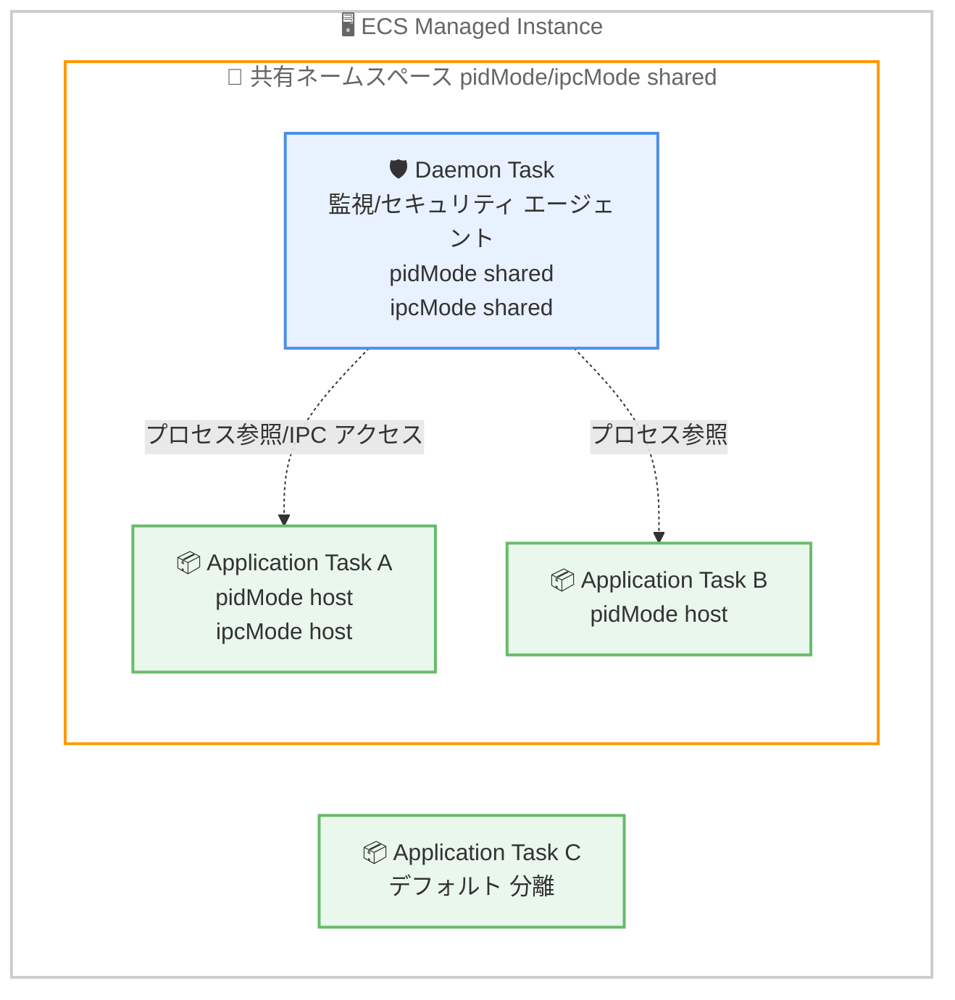

# Amazon ECS Managed Daemons - タスク間の可視性と通信のサポート

**リリース日**: 2026 年 6 月 10 日
**サービス**: Amazon Elastic Container Service (Amazon ECS)
**機能**: ECS Managed Daemons における PID / IPC ネームスペース共有 (pidMode / ipcMode)

📊 [このアップデートのインフォグラフィックを見る](https://takech9203.github.io/aws-news-summary/20260610-ecs-managed-daemons-pid-ipc-modes.html)
<!-- INFOGRAPHIC_BASE_URL は環境変数から取得 -->

## 概要

Amazon ECS Managed Daemons が、タスク間の可視性と通信をサポートするようになりました。これにより、ECS Managed Instances 上でアプリケーションのプロセスや共有 IPC リソースへのアクセスを必要とする、トレーシング、プロファイリング、セキュリティの各エージェントをデーモンとして展開できます。

今回のアップデートでは、デーモンのタスク定義に 2 つの新しい設定を追加できます。`pidMode` はデーモンがインスタンス上のすべてのプロセスを参照できるかどうかを制御し、`ipcMode` はデーモンがインスタンス上の他のコンテナと IPC ネームスペースを共有するかどうかを制御します。いずれかを `shared` に設定すると、デーモンに対応するネームスペースへのアクセスが付与されます。デフォルト値の `none` では、デーモンは他のコンテナやタスクから分離された状態を維持します。

これらの設定により、プロセス認識型および IPC 依存型のエージェントを、アプリケーションのタスク定義にサイドカーとして埋め込む代わりに、ECS デーモンとして実行できます。ECS は Managed Instance ごとに 1 つのデーモンタスクを正確に配置し、アプリケーションタスクよりも先にデーモンを起動します。プラットフォームチームは、エージェントをアプリケーションとは独立して展開およびアップデートでき、一貫したカバレッジを実現できます。

**アップデート前の課題**

今回のアップデート以前は、ECS 上でプロセスや IPC リソースへのアクセスを必要とするエージェントを動作させるには、複数の制約がありました。

- プロセス認識型や IPC 依存型のエージェントは、各アプリケーションタスク定義にサイドカーとして埋め込む必要があった
- サイドカーを採用すると、アプリケーションとエージェントのライフサイクルが密結合し、エージェントのアップデートのたびにアプリケーションタスクの再デプロイが必要だった
- デーモンとアプリケーションタスクのプロセスや IPC リソースが分離されており、ホストレベルの可視性を持つ監視やセキュリティエージェントの展開が困難だった

**アップデート後の改善**

今回のアップデートにより、エージェントの運用が大幅に簡素化されました。

- `pidMode` を `shared` に設定することで、デーモンがインスタンス上のすべてのプロセスを参照できるようになった
- `ipcMode` を `shared` に設定することで、デーモンが他のコンテナと IPC ネームスペース (共有メモリセグメントやメッセージキューなど) を共有できるようになった
- エージェントをデーモンとして一元的に展開でき、アプリケーションとは独立してアップデートできるようになった

## アーキテクチャ図



`pidMode` / `ipcMode` を `shared` に設定したデーモンは、`host` を指定したアプリケーションタスクのプロセスや IPC リソースにアクセスできます。デフォルト設定のタスク (Task C) は分離されたままです。

## サービスアップデートの詳細

### 主要機能

1. **pidMode による PID ネームスペース共有**
   - デーモンの PID ネームスペースモードを制御するタスク定義パラメータ
   - 有効値は `none` または `shared` で、デフォルトは `none`
   - `shared` を指定すると、デーモンはホストの PID ネームスペースに参加し、`pidMode: "host"` を指定した非デーモンタスクや `pidMode: "shared"` を指定した他のデーモンからアクセス可能になる
   - プロセスの監視やシグナル送信といったユースケースを実現する

2. **ipcMode による IPC ネームスペース共有**
   - デーモンの IPC ネームスペースモードを制御するタスク定義パラメータ
   - 有効値は `none` または `shared` で、デフォルトは `none`
   - `shared` を指定すると、デーモンはホストの IPC ネームスペースに参加し、`ipcMode: "host"` を指定した非デーモンタスクや `ipcMode: "shared"` を指定した他のデーモンからアクセス可能になる
   - 共有メモリセグメントやメッセージキューといった IPC リソースへのアクセスを実現する

3. **デーモンの配置と起動順序**
   - ECS は Managed Instance ごとに 1 つのデーモンタスクを正確に配置する
   - アプリケーションタスクよりも先にデーモンを起動するため、エージェントが一貫したカバレッジを提供する
   - エージェントをアプリケーションとは独立して展開およびアップデートできる

## 技術仕様

### タスク定義パラメータ

| 項目 | 詳細 |
|------|------|
| `pidMode` | PID ネームスペースモード。型は String、任意指定。有効値は `none` または `shared`、デフォルトは `none` |
| `ipcMode` | IPC ネームスペースモード。型は String、任意指定。有効値は `none` または `shared`、デフォルトは `none` |
| 対象 | ECS Managed Instances 上で動作するデーモンタスク定義 (専用の `register-daemon-task-definition` で登録) |
| 設定手段 | AWS マネジメントコンソール、AWS CLI、AWS CloudFormation、AWS SDK |

### ネームスペース共有の対応関係

非デーモンタスクがデーモンと同じネームスペースを共有するには、タスク側で `host` を指定する必要があります。

| デーモン側の設定 | アプリケーションタスク側の設定 | 実現できること |
|------|----------|----------|
| `pidMode: "shared"` | `pidMode: "host"` | デーモンがタスクのプロセスを参照し、プロセス監視やシグナル送信が可能 |
| `ipcMode: "shared"` | `ipcMode: "host"` | デーモンがタスクの共有メモリセグメントやメッセージキューにアクセス可能 |

### API変更履歴

| 日付 | サービス | 変更内容 |
|------|----------|----------|
| 2026/06/10 | [ecs](https://awsapichanges.com/) | デーモンタスク定義に `pidMode` および `ipcMode` パラメータを追加 |

### デーモンタスク定義の例

```json
{
    "family": "my-monitoring-daemon",
    "pidMode": "shared",
    "ipcMode": "shared",
    "containerDefinitions": [
        {
            "name": "monitoring-agent",
            "image": "public.ecr.aws/my-company/monitoring-agent:latest",
            "essential": true
        }
    ]
}
```

## 設定方法

### 前提条件

1. ECS Managed Instances のキャパシティプロバイダーが構成されていること
2. デーモンタスク定義を登録および管理する権限を持つ IAM ロールが用意されていること
3. プロセス認識型または IPC 依存型のエージェントコンテナイメージが Amazon ECR などのレジストリに用意されていること

### 手順

#### ステップ1: デーモンタスク定義の作成

```bash
aws ecs register-daemon-task-definition --cli-input-json file://daemon-taskdef.json
```

`pidMode` または `ipcMode` を `shared` に設定したデーモンタスク定義を登録します。上記コマンドは JSON ファイルで定義した内容をもとにデーモンタスク定義を登録します。

#### ステップ2: アプリケーションタスク側の設定

```json
{
    "family": "my-app-task",
    "pidMode": "host",
    "ipcMode": "host",
    "containerDefinitions": [
        { "name": "app", "image": "my-app:latest", "essential": true }
    ]
}
```

デーモンとネームスペースを共有させたいアプリケーションタスクには、`pidMode` および `ipcMode` に `host` を指定します。これによりデーモンがタスクのプロセスや IPC リソースにアクセスできます。

#### ステップ3: デーモンの展開

デーモンを ECS Managed Instances のキャパシティプロバイダーに関連付けて、新規作成またはアップデートします。ECS が Managed Instance ごとに 1 つのデーモンタスクを配置し、アプリケーションタスクよりも先に起動します。

## メリット

### ビジネス面

- **運用の簡素化**: エージェントをアプリケーションとは独立して一元的に展開およびアップデートでき、運用負荷を軽減できる
- **追加コストなし**: すべての AWS リージョンで追加料金なしに利用できる
- **一貫したカバレッジ**: Managed Instance ごとに 1 つのデーモンが配置され、アプリケーションタスクより先に起動するため、可視性に抜け漏れが生じにくい

### 技術面

- **疎結合化**: サイドカー方式をやめることで、アプリケーションとエージェントのライフサイクルを分離できる
- **きめ細かい制御**: `pidMode` と `ipcMode` を個別に `none` または `shared` で設定し、必要なネームスペースのみを共有できる
- **デフォルトでの分離**: デフォルト値が `none` であるため、明示的に共有を有効化しない限りデーモンは分離された状態を維持する

## デメリット・制約事項

### 制限事項

- ネームスペース共有を行うには、デーモン側 (`shared`) とアプリケーションタスク側 (`host`) の両方で設定が必要
- デーモンタスク定義は専用リソースであり、Amazon EBS、Amazon EFS、FSx for Windows File Server、Docker ボリューム、エフェメラルストレージはサポートされない (バインドマウントのみ対応)
- すべてのデーモンタスクは単一のネットワークネームスペースを共有するため、同一インスタンス上のデーモンは同じポートにバインドできない

### 考慮すべき点

- PID / IPC ネームスペースの共有は、デーモンに対してプロセスや IPC リソースへの広範なアクセスを付与するため、最小権限の原則に沿った設計が望ましい
- セキュリティエージェントなどがカーネルレベルのアクセスを必要とする場合は、`privileged` モードや `linuxParameters.capabilities` (例: `SYS_PTRACE`、`NET_ADMIN` など) と組み合わせて検討する

## ユースケース

### ユースケース1: ホスト全体のセキュリティ監視

**シナリオ**: ランタイムセキュリティエージェントを各 Managed Instance に展開し、インスタンス上で動作するすべてのアプリケーションプロセスを監視したい。

**実装例**:
```json
{
    "family": "security-daemon",
    "pidMode": "shared",
    "containerDefinitions": [
        { "name": "security-agent", "image": "my-security-agent:latest", "essential": true,
          "linuxParameters": { "capabilities": { "add": ["SYS_PTRACE"] } } }
    ]
}
```

**効果**: アプリケーションタスクにサイドカーを埋め込むことなく、インスタンス全体のプロセスを一元的に監視できる。

### ユースケース2: プロファイリングとトレーシング

**シナリオ**: パフォーマンスプロファイリングエージェントを使って、アプリケーションのプロセスを参照し、CPU やメモリの使用状況を継続的に収集したい。

**実装例**:
```json
{
    "family": "profiler-daemon",
    "pidMode": "shared",
    "containerDefinitions": [
        { "name": "profiler", "image": "my-profiler:latest", "essential": true }
    ]
}
```

**効果**: アプリケーション側は `pidMode: "host"` を指定するだけでプロファイリング対象となり、アプリケーションコードの変更が不要になる。

### ユースケース3: IPC 依存型エージェントの集約

**シナリオ**: 共有メモリやメッセージキューを介してアプリケーションと連携するオブザーバビリティエージェントを、インスタンスごとに 1 つだけ動作させたい。

**実装例**:
```json
{
    "family": "observability-daemon",
    "ipcMode": "shared",
    "containerDefinitions": [
        { "name": "obs-agent", "image": "my-obs-agent:latest", "essential": true }
    ]
}
```

**効果**: IPC リソースを共有するエージェントをデーモンとして集約し、アプリケーションタスクの肥大化を防げる。

## 料金

今回の機能は追加料金なしで利用できます。ECS Managed Instances 上で動作するコンピューティングリソースに対する通常の料金のみが発生します。

## 利用可能リージョン

すべての AWS リージョンで利用できます。

## 関連サービス・機能

- **ECS Managed Instances**: 本機能の動作基盤。Managed Instance ごとにデーモンが 1 つ配置される
- **AWS CloudFormation**: デーモンタスク定義を Infrastructure as Code として管理できる
- **Amazon ECR**: デーモンとして実行するエージェントコンテナイメージの保存先として利用できる

## 参考リンク

- 📊 [インフォグラフィック](https://takech9203.github.io/aws-news-summary/20260610-ecs-managed-daemons-pid-ipc-modes.html)
- [公式発表 (What's New)](https://aws.amazon.com/about-aws/whats-new/2026/06/ecs-managed-daemons-pid-ipc-modes/)
- [ドキュメント (Daemon task definitions)](https://docs.aws.amazon.com/AmazonECS/latest/developerguide/managed-daemons-task-definitions.html#managed-daemons-taskdef-parameters)

## まとめ

今回のアップデートにより、トレーシング、プロファイリング、セキュリティといったプロセス認識型・IPC 依存型のエージェントを、サイドカーではなく ECS デーモンとして展開できるようになりました。`pidMode` と `ipcMode` を `shared` に設定し、アプリケーション側で `host` を指定するだけで、インスタンス全体の一貫した可視性を実現できます。エージェントの運用を簡素化したいプラットフォームチームは、既存のサイドカー構成をデーモン方式へ移行できないか検討することをお勧めします。
