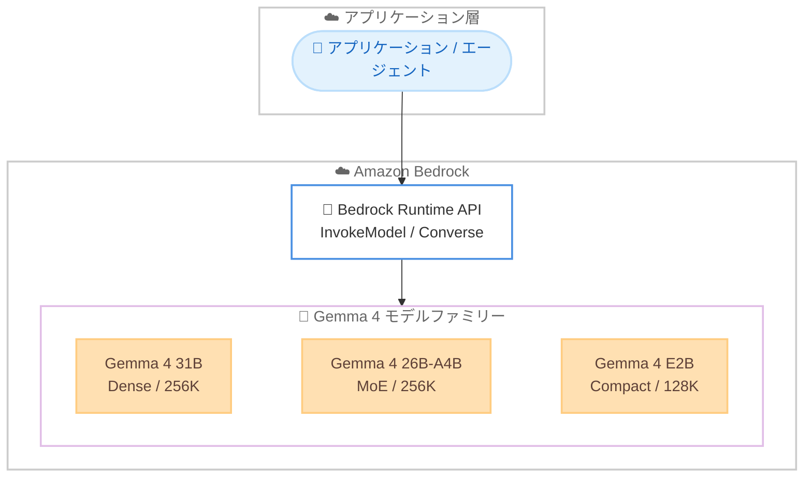

# Amazon Bedrock - Gemma 4 モデルの提供開始

**リリース日**: 2026 年 6 月 10 日
**サービス**: Amazon Bedrock
**機能**: Google DeepMind 製 Gemma 4 オープンウェイトモデルの提供

📊 [このアップデートのインフォグラフィックを見る](https://takech9203.github.io/aws-news-summary/20260610-gemma-4-amazon-bedrock.html)
<!-- INFOGRAPHIC_BASE_URL は環境変数から取得 -->

## 概要

AWS は、Google DeepMind が開発するオープンウェイトモデルファミリー Gemma 4 を Amazon Bedrock で利用可能にしたことを発表しました。Gemma 4 を使用することで、推論、マルチモーダル理解、エージェント、ソフトウェアエンジニアリングといった幅広いワークフローにおいて生成 AI アプリケーションを構築できます。

Gemma 4 ファミリーには 3 つのバリアントが含まれます。すなわち Gemma 4 31B、Gemma 4 26B-A4B、Gemma 4 E2B です。これらは Dense アーキテクチャと Mixture-of-Experts (MoE) アーキテクチャの両方をカバーし、組み込みの推論機能、ネイティブな関数呼び出し (function calling)、35 以上の言語のサポート、テキストと画像にわたるマルチモーダル入力を備えています。

各バリアントは異なるワークロード特性に最適化されています。Gemma 4 31B は推論やコーディングが中心の負荷の高いワークロードに適しており、Gemma 4 26B-A4B はコストとレイテンシーに敏感なワークロードを対象とし、Gemma 4 E2B は低レイテンシーのインタラクティブなユースケース向けの最小バリアントです。Amazon Bedrock 上で、ツール呼び出し、構造化出力、推論、レスポンスストリーミングのサポートが強化されています。

**アップデート前の課題**

このアップデート以前は、Amazon Bedrock 上で利用できる Google 製のオープンモデルは Gemma 3 ファミリーが中心でした。

- 以前は Gemma 3 ファミリー (12B、27B、4B など) が中心で、より新しい世代のモデルを Bedrock 上で利用できなかった
- 以前は MoE アーキテクチャによるコスト効率の高い推論や、より大きな 256K トークンのコンテキストウィンドウを Gemma 系モデルで利用できなかった
- 以前はワークロードの特性 (推論重視、コスト重視、低レイテンシー重視) に応じて Gemma 系モデルを細かく選択する選択肢が限られていた

**アップデート後の改善**

今回のアップデートにより、最新世代の Gemma 4 を Amazon Bedrock のフルマネージド環境で利用できるようになりました。

- 今回のアップデートにより、推論、マルチモーダル理解、エージェント、ソフトウェアエンジニアリングのワークフローに最新の Gemma 4 を利用できるようになった
- 今回のアップデートにより、Dense と MoE の両アーキテクチャから、ワークロード特性に合わせて 3 つのバリアントを選択できるようになった
- 今回のアップデートにより、ネイティブな関数呼び出し、構造化出力、レスポンスストリーミングを組み合わせたエージェントワークフローを構築しやすくなった

## アーキテクチャ図



アプリケーションやエージェントは、Amazon Bedrock の Runtime API を通じて、ワークロード特性に応じた 3 つの Gemma 4 バリアントを呼び出します。

## サービスアップデートの詳細

### 主要機能

1. **Gemma 4 31B (Dense モデル)**
   - 307 億パラメータの Dense モデル
   - 256K トークンのコンテキストウィンドウをサポート
   - 推論やコーディングが中心の負荷の高いワークロードに最適
   - 組み込みの推論、ネイティブな関数呼び出し、テキストと画像のマルチモーダル入力に対応

2. **Gemma 4 26B-A4B (MoE モデル)**
   - Mixture-of-Experts アーキテクチャを採用し、総パラメータ数は 252 億、トークンあたりのアクティブパラメータは 38 億
   - 256K トークンのコンテキストウィンドウをサポート
   - コスト効率の高い推論を実現し、コストとレイテンシーに敏感なワークロードを対象
   - 組み込みの推論、ネイティブな関数呼び出し、テキストと画像のマルチモーダル入力に対応

3. **Gemma 4 E2B (コンパクトモデル)**
   - 総パラメータ数 51 億、実効パラメータ 23 億のコンパクトモデル
   - 128K トークンのコンテキストウィンドウをサポート
   - 低レイテンシーのインタラクティブなユースケース向けの最小バリアント
   - 組み込みの推論、ネイティブな関数呼び出し、テキストと画像のマルチモーダル入力に対応

4. **強化された機能サポート**
   - ツール呼び出し (tool calling) のサポート強化
   - 構造化出力 (structured output) のサポート強化
   - 推論 (reasoning) のサポート強化
   - レスポンスストリーミング (response streaming) のサポート強化
   - 35 以上の言語に対応

## 技術仕様

### モデルバリアント比較

| バリアント | アーキテクチャ | パラメータ | コンテキストウィンドウ | 主な用途 |
|------|------|------|------|------|
| Gemma 4 31B | Dense | 307 億 | 256K トークン | 推論・コーディング中心の高負荷ワークロード |
| Gemma 4 26B-A4B | MoE | 総数 252 億 / アクティブ 38 億 | 256K トークン | コスト・レイテンシーに敏感なワークロード |
| Gemma 4 E2B | コンパクト | 総数 51 億 / 実効 23 億 | 128K トークン | 低レイテンシーのインタラクティブ用途 |

### 共通機能

| 項目 | 詳細 |
|------|------|
| 入力モダリティ | テキスト、画像 |
| 言語サポート | 35 以上の言語 |
| 推論 | 組み込みの推論機能 |
| 関数呼び出し | ネイティブな function calling に対応 |
| 出力 | 構造化出力、レスポンスストリーミング |

<!-- What's New ページの説明では text, image, video, audio が記載されていますが、Amazon Bedrock のモデルカードではテキストと画像が明記されています。本レポートではモデルカードの記載に基づいて整理しています -->

### API 呼び出し例

```python
import boto3
import json

# Amazon Bedrock Runtime クライアントを作成する
client = boto3.client("bedrock-runtime", region_name="us-east-1")

# Converse API を使用して Gemma 4 31B を呼び出す
response = client.converse(
    modelId="google.gemma-4-31b",  # 実際のモデル ID はモデルカードで確認する
    messages=[
        {
            "role": "user",
            "content": [{"text": "Amazon Bedrock の特徴を 3 点で説明してください。"}],
        }
    ],
    inferenceConfig={"maxTokens": 1024, "temperature": 0.7},
)

print(response["output"]["message"]["content"][0]["text"])
```

上記は Amazon Bedrock の Converse API を使用して Gemma 4 31B にプロンプトを送信し、レスポンスを取得する例です。モデル ID は AWS のモデルカードページで正確な値を確認してください。

## 設定方法

### 前提条件

1. Gemma 4 が利用可能なリージョン (米国東部 (バージニア北部) など) で Amazon Bedrock を有効化していること
2. 対象モデルへのアクセスを Amazon Bedrock コンソールのモデルアクセスからリクエストして有効化していること
3. Bedrock の InvokeModel / Converse を呼び出すための IAM 権限を持つこと

### 手順

#### ステップ1: モデルアクセスの有効化

Amazon Bedrock コンソールの「モデルアクセス」画面で Gemma 4 の各バリアントへのアクセスを有効化します。これにより、API からモデルを呼び出せるようになります。

#### ステップ2: バリアントの選択

```text
推論・コーディング中心の高負荷ワークロード  -> Gemma 4 31B
コスト・レイテンシーに敏感なワークロード      -> Gemma 4 26B-A4B
低レイテンシーのインタラクティブ用途          -> Gemma 4 E2B
```

ワークロードの特性に応じて適切なバリアントを選択します。コストとレイテンシーを重視する場合は MoE モデルやコンパクトモデルを検討します。

#### ステップ3: アプリケーションへの組み込み

InvokeModel または Converse API を通じてアプリケーションにモデルを組み込みます。エージェントワークフローでは、ネイティブな関数呼び出しと構造化出力を活用してツール連携を実装します。

## メリット

### ビジネス面

- **モデル選択肢の拡大**: Amazon Bedrock 上で最新の Gemma 4 ファミリーを利用でき、ユースケースに応じた最適なモデルを選択できる
- **コスト最適化**: MoE モデルやコンパクトモデルを選択することで、コストとレイテンシーに敏感なワークロードのコストを抑えられる
- **マルチリンガル対応**: 35 以上の言語に対応し、グローバルなアプリケーション開発に活用できる

### 技術面

- **長いコンテキスト**: 31B と 26B-A4B は 256K トークンのコンテキストウィンドウをサポートし、大量のドキュメントや長い会話を扱える
- **エージェント構築**: ネイティブな関数呼び出しと構造化出力により、エージェントワークフローを構築しやすい
- **フルマネージド運用**: Amazon Bedrock のフルマネージド環境で、インフラ管理なしにオープンウェイトモデルを利用できる

## デメリット・制約事項

### 制限事項

- 提供リージョンは米国東部 (バージニア北部)、米国東部 (オハイオ)、米国西部 (オレゴン)、欧州 (フランクフルト) に限定される
- 入力モダリティはモデルカード上でテキストと画像が明記されており、利用前に最新のモデルカードでサポート範囲を確認する必要がある
- Gemma 4 E2B のコンテキストウィンドウは 128K トークンであり、31B / 26B-A4B の 256K より小さい

### 考慮すべき点

- モデル ID や正確なパラメータ、料金は AWS のモデルカードおよび料金ページで確認すること
- 推論重視・コスト重視・低レイテンシー重視のいずれを優先するかでバリアントを選定すること

## ユースケース

### ユースケース1: 大規模ドキュメントに対する推論

**シナリオ**: 長文の技術仕様書や契約書を読み込み、要約や質問応答を行う社内アプリケーションを構築したい。

**実装例**:
```text
Gemma 4 31B を使用し、256K トークンのコンテキストに複数ドキュメントを投入して推論させる
```

**効果**: 大量のコンテキストを一度に処理でき、複雑な推論を要する質問にも対応できる。

### ユースケース2: コスト効率の高いチャットアプリケーション

**シナリオ**: 高トラフィックなカスタマーサポートチャットを、コストとレイテンシーを抑えつつ運用したい。

**実装例**:
```text
Gemma 4 26B-A4B (MoE) を使用し、アクティブパラメータを抑えたコスト効率の高い推論を行う
```

**効果**: MoE アーキテクチャによりコスト効率を高めつつ、品質を維持した応答を提供できる。

### ユースケース3: 低レイテンシーのエージェントワークフロー

**シナリオ**: ツールを呼び出しながら短い応答を高速に返すインタラクティブなエージェントを構築したい。

**実装例**:
```text
Gemma 4 E2B を使用し、ネイティブな関数呼び出しと構造化出力でツール連携を実装する
```

**効果**: コンパクトモデルによる低レイテンシー応答と、構造化されたツール呼び出しを両立できる。

## 料金

Gemma 4 は価格性能を重視して設計されています。具体的な料金は使用するモデルバリアントおよびリージョン、入力・出力トークン数に基づきます。正確な料金は Amazon Bedrock の料金ページで確認してください。

## 利用可能リージョン

以下の AWS リージョンで利用可能です。

- 米国東部 (バージニア北部) / US East (N. Virginia)
- 米国東部 (オハイオ) / US East (Ohio)
- 米国西部 (オレゴン) / US West (Oregon)
- 欧州 (フランクフルト) / Europe (Frankfurt)

## 関連サービス・機能

- **Amazon Bedrock**: Gemma 4 を含む各種基盤モデルをフルマネージドで提供する基盤
- **Amazon Bedrock Agents**: ネイティブな関数呼び出しを活用したエージェントワークフローの構築に関連
- **Gemma 3 ファミリー**: Amazon Bedrock で引き続き利用可能な前世代の Google オープンモデル

## 参考リンク

- 📊 [インフォグラフィック](https://takech9203.github.io/aws-news-summary/20260610-gemma-4-amazon-bedrock.html)
- [公式発表 (What's New)](https://aws.amazon.com/about-aws/whats-new/2026/06/gemma-4-amazon-bedrock/)
- [モデルカード (Google)](https://docs.aws.amazon.com/bedrock/latest/userguide/model-cards-google.html)
- [Amazon Bedrock 料金ページ](https://aws.amazon.com/bedrock/pricing/)

## まとめ

今回のアップデートにより、Google DeepMind の最新オープンウェイトモデル Gemma 4 が Amazon Bedrock で利用可能になり、推論重視・コスト重視・低レイテンシー重視という異なるワークロード特性に合わせて 3 つのバリアントから選択できるようになりました。エージェントやソフトウェアエンジニアリングのワークフローを Bedrock 上で構築している場合は、ネイティブな関数呼び出しと構造化出力のサポートを活かして Gemma 4 の評価を進めることを推奨します。まずは対象リージョンでモデルアクセスを有効化し、自社のユースケースに合うバリアントを検証してください。
