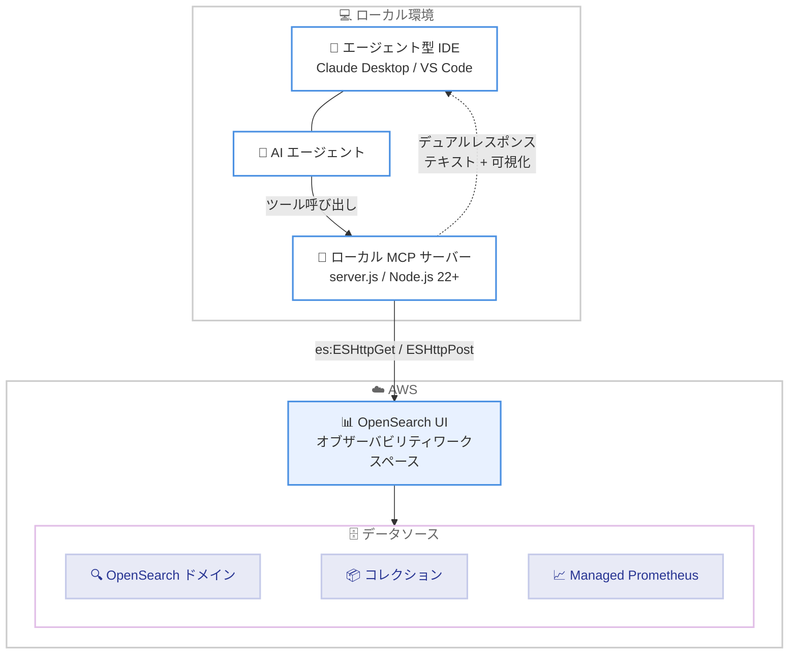

# Amazon OpenSearch Service - エージェント型オブザーバビリティ向け MCP Apps

**リリース日**: 2026 年 6 月 10 日
**サービス**: Amazon OpenSearch Service
**機能**: MCP Apps for agentic observability

📊 [このアップデートのインフォグラフィックを見る](https://takech9203.github.io/aws-news-summary/20260610-opensearch-agentic-observability-mcp-app.html)
<!-- INFOGRAPHIC_BASE_URL は環境変数から取得 -->

## 概要

Amazon OpenSearch Service が MCP Apps に対応し、オブザーバビリティのワークフローを Claude Desktop や VS Code などのエージェント型 IDE に直接統合できるようになりました。ローカル環境で動作する AI エージェントが、OpenSearch ドメイン、コレクション、Amazon Managed Service for Prometheus に保存されたログ、トレース、メトリクス、アラートを使ってインシデントを調査できます。

この機能の最大の特徴は「デュアルレスポンス」です。各 MCP App ツール呼び出しは、エージェントが推論するための簡潔なテキストサマリーと、ユーザーが同じ会話スレッド内で確認できるインタラクティブな可視化の 2 つを同時に返します。これにより、アラートの発報から根本原因分析、分散トレースの調査、サービスマップ、PromQL メトリクスチャート、クロスシグナル相関の確認まで、すべてを 1 つの会話内で完結できます。ローカル環境を離れることなく、オブザーバビリティエージェントと並走しながら調査結果をレビュー、検証できる点が大きな価値です。

対象ユーザーは、SRE、運用エンジニア、オブザーバビリティ担当者など、インシデント調査や根本原因分析を日常的に行うチームです。本機能は、Amazon OpenSearch UI が提供されているすべての AWS リージョンで利用できます。

**アップデート前の課題**

- 従来は、ログ、トレース、メトリクスを調査するために OpenSearch UI のウェブダッシュボードと開発作業環境 (IDE) を行き来する必要があった
- AI エージェントが返すテキストベースの調査結果は、可視化を伴わないため人間による検証が難しかった
- アラート発報から根本原因分析、トレース探索までの一連の作業が、複数のツールやコンテキストに分断されていた

**アップデート後の改善**

- 今回のアップデートにより、オブザーバビリティのワークフローをエージェント型 IDE 内に直接持ち込めるようになった
- 各ツール呼び出しがテキストサマリーとインタラクティブな可視化を同時に返すため、エージェントの推論結果を人間がその場で検証できるようになった
- アラート、ログ、トレース、メトリクス、サービスマップ、相関分析までを単一の会話スレッド内で完結できるようになった

## アーキテクチャ図



ローカルの MCP サーバーがエージェント型 IDE と OpenSearch UI の間の安全な双方向ブリッジとして動作し、ツール呼び出しの結果をテキストサマリーとインタラクティブな可視化のデュアルレスポンスとして IDE に返します。

## サービスアップデートの詳細

### 主要機能

1. **デュアルレスポンス**
   - 1 回のツール呼び出しで、エージェントが推論するための簡潔なテキストサマリーと、人間が検証するためのインタラクティブな可視化を同時に返す
   - 可視化は同じ会話スレッド内にレンダリングされるため、エージェントの判断をその場で確認できる
   - 可視化は OpenSearch UI アプリケーションから生成される

2. **複数シグナルにまたがる調査**
   - ログ、トレース、メトリクス、アラートを横断して調査できる
   - OpenSearch ドメイン、コレクション、Amazon Managed Service for Prometheus をデータソースとして利用できる
   - クロスシグナル相関により、シグナル間をまたいだ分析が可能

3. **ローカル MCP サーバーによる連携**
   - ローカルマシン上で動作する MCP サーバーが、IDE と OpenSearch UI を仲介する
   - Claude Desktop、VS Code GitHub Copilot、Goose、ChatGPT、Cursor など MCP Apps 対応の IDE で利用できる
   - mcpb ファイルによる設定フロー、または server.js を参照した手動設定に対応

### 主要な MCP App ツール

| カテゴリ | 提供する機能 |
|------|------|
| トリアージとレスポンス | アラート相関、インシデントタイムライン |
| ログ調査 | パターン検索、ログクラスタリング |
| トレース調査 | トレースファインダー、スパン詳細、レイテンシー分解 |
| メトリクス調査 | PromQL 探索、しきい値分析 |
| サービスパフォーマンス | RED メトリクス、サービスレベルビュー |
| トポロジー | サービスマップ、依存関係グラフ |
| 可視化 | 動的な可視化 |
| データセットと相関 | クロスシグナル結合、データサマリー |
| AI とエージェントのオブザーバビリティ | LLM 呼び出しトレース、エージェントトレースマップとサマリー |
| スタックヘルス | クラスターステータス、シャード割り当て |
| インストルメンテーションスコア | テレメトリを用いた計装上の問題検出 |

## 技術仕様

### 主要コンポーネント

| 項目 | 詳細 |
|------|------|
| OpenSearch UI | Amazon OpenSearch Service 向けのマネージドなクラウドダッシュボード。MCP Apps の可視化はここから生成される |
| ローカル MCP サーバー | ローカルマシン上で動作し、IDE と OpenSearch UI を仲介するプログラム |
| MCP App | MCP ホスト内でレンダリングされるインタラクティブな UI アプリケーション。単一のオブザーバビリティジョブを担う構成単位 |
| デュアルレスポンス | テキストサマリーとインタラクティブ可視化を同時に返す応答方式 |

### 必要な IAM 権限

MCP サーバーが OpenSearch UI アプリケーションへアクセスするため、以下のアクションを許可する AWS 認証情報が必要です。

```json
{
  "Version": "2012-10-17",
  "Statement": [
    {
      "Effect": "Allow",
      "Action": [
        "es:ESHttpGet",
        "es:ESHttpPost"
      ],
      "Resource": "arn:aws:es:<region>:<account-id>:domain/<application>/*"
    }
  ]
}
```

### MCP サーバー設定例

```json
{
  "mcpServers": {
    "opensearch-observability-stack-mcp": {
      "command": "node",
      "args": ["/path/to/opensearch-observability-stack-mcp/server/server.js"],
      "env": {
        "OS_UI_ENDPOINT": "application-foo-bar.us-west-2.opensearch.amazonaws.com",
        "AWS_REGION": "us-west-2",
        "AWS_PROFILE": "my-profile"
      }
    }
  }
}
```

## 設定方法

### 前提条件

1. オブザーバビリティワークスペースを作成し、少なくとも 1 つのデータソース (OpenSearch ドメイン、コレクション、または Amazon Managed Prometheus) に接続した OpenSearch UI アプリケーション
2. MCP Apps に対応したエージェント型 IDE (Claude Desktop、VS Code GitHub Copilot、Goose、ChatGPT、Cursor)
3. ローカルマシンに Node.js 22 以降がインストールされていること
4. `es:ESHttpGet` および `es:ESHttpPost` アクションを許可する AWS 認証情報
5. オブザーバビリティの基本概念 (ログ、トレース、メトリクス) と IDE 操作の基礎知識

### 手順

#### ステップ1: MCP サーバーファイルのダウンロードと検証

```bash
# 公開署名鍵をインポート (初回のみ)
curl -s https://d373kuglijqwic.cloudfront.net/opensearch-mcp-signing-public.asc | gpg --import

# アーティファクトと署名ファイルをダウンロード
curl -O https://d373kuglijqwic.cloudfront.net/opensearch-observability-stack-mcp.zip
curl -O https://d373kuglijqwic.cloudfront.net/opensearch-observability-stack-mcp.zip.asc

# 署名を検証
gpg --verify opensearch-observability-stack-mcp.zip.asc opensearch-observability-stack-mcp.zip
```

OpenSearch observability MCP サーバーファイルをダウンロードし、任意で署名を検証します。検証に成功すると `Good signature from "OpenSearch MCP <aos-observability-mcp-releases@amazon.com>"` が出力されます。

#### ステップ2: MCP サーバーの設定

ダウンロードした zip を展開し、mcpb ファイルを開くと対応 IDE で設定フローが開始されます。mcpb ファイルでの設定が機能しない場合は、server.js を参照して IDE の拡張機能セクションから手動で設定します。手動設定では `OS_UI_ENDPOINT` を OpenSearch UI アプリケーションの URL に、`AWS_REGION` を対象リージョンに、`args` を実際の server.js のパスに置き換えます。

#### ステップ3: 接続の確認

設定後、IDE で「List available observability data sources」のような質問を入力して接続を確認します。エラーメッセージが返る場合は、設定の修正手順に従います。接続が確立されると、AI エージェントがオブザーバビリティデータを使った調査を実行できるようになります。

## メリット

### ビジネス面

- **インシデント対応の迅速化**: アラート発報から根本原因分析までを単一の会話内で完結でき、平均復旧時間 (MTTR) の短縮が期待できる
- **コンテキストスイッチの削減**: ダッシュボードと IDE を行き来する必要がなくなり、運用チームの生産性が向上する
- **既存資産の活用**: すでに OpenSearch に蓄積されているログ、トレース、メトリクスをそのまま AI エージェントによる調査に活用できる

### 技術面

- **検証可能な AI 調査**: テキストサマリーに加えてインタラクティブな可視化が返るため、エージェントの推論結果を人間が検証できる
- **マルチシグナル相関**: ログ、トレース、メトリクス、アラートを横断したクロスシグナル分析が可能
- **標準プロトコルへの準拠**: MCP (Model Context Protocol) に基づくため、対応する複数のエージェント型 IDE で利用できる

## デメリット・制約事項

### 制限事項

- 利用には Amazon OpenSearch UI が提供されているリージョンであることが必要
- ローカルマシンに Node.js 22 以降が必要
- MCP Apps に対応した IDE が必要 (対応状況は MCP クライアントマトリクスを参照)
- OpenSearch UI アプリケーションにオブザーバビリティワークスペースとデータソースの事前設定が必要

### 考慮すべき点

- ローカル MCP サーバーは AWS 認証情報を使用するため、認証情報の管理とアクセス権限の最小化に注意する
- ダウンロードしたアーティファクトは GPG 署名による検証を行うことが推奨される
- 本番データを使わずにテストする場合は、サンプルデータを含む OpenTelemetry Demo アプリケーションの利用が選択肢となる

## ユースケース

### ユースケース1: アラート発報からの根本原因分析

**シナリオ**: あるサービスでレイテンシー悪化のアラートが発報した。SRE は Claude Desktop 上で MCP App を使い、発報中のアラートをトリアージしてから調査を開始する。

**実装例**:
```
発報中のアラートを表示して、最も重大なものから根本原因を調査して
```

**効果**: アラートビューで重大度別の発報状況を確認し、その場で根本原因分析へ移行できるため、調査の起点を素早く特定できる。

### ユースケース2: 分散トレースによる障害箇所の特定

**シナリオ**: マイクロサービス構成のアプリケーションでエラー率が上昇している。トレース調査ツールでスパン階層を可視化し、障害の発生源を特定する。

**実装例**:
```
エラーが多いトレースを見つけて、どのスパンで失敗が起きているか分析して
```

**効果**: スパン階層とタイムラインを可視化し、AI 分析とあわせて障害の発生源を特定できる。サービスマップで影響範囲 (ブラストラディウス) も把握できる。

### ユースケース3: PromQL メトリクスのインタラクティブ調査

**シナリオ**: Amazon Managed Service for Prometheus に保存されたメトリクスを使い、リソース使用率の傾向を調査する。

**実装例**:
```
直近1時間のサービスごとのエラー数を PromQL で集計してチャートで見せて
```

**効果**: PromQL クエリ結果が折れ線、棒、エリア、メトリクスチャートとしてレンダリングされ、メトリクスの挙動分析とあわせて傾向を把握できる。

## 料金

公式発表では本機能自体に対する追加料金についての記載はありません。MCP Apps はローカルの MCP サーバーを通じて既存の OpenSearch UI、OpenSearch ドメイン、コレクション、Amazon Managed Service for Prometheus にアクセスするため、これらの基盤サービスの利用に応じた通常料金が発生します。最新かつ正確な料金は公式の料金ページで確認してください。

## 利用可能リージョン

Amazon OpenSearch UI が提供されているすべての AWS リージョンで利用できます。

## 関連サービス・機能

- **Amazon OpenSearch Service (OpenSearch UI)**: MCP Apps の可視化はオブザーバビリティワークスペースを持つ OpenSearch UI アプリケーションから生成される
- **Amazon Managed Service for Prometheus**: メトリクスのデータソースとして利用でき、PromQL によるメトリクス調査に対応する
- **Model Context Protocol (MCP)**: 本機能の基盤となるプロトコル。対応するエージェント型 IDE で MCP Apps を利用できる

## 参考リンク

- 📊 [インフォグラフィック](https://takech9203.github.io/aws-news-summary/20260610-opensearch-agentic-observability-mcp-app.html)
- [公式発表 (What's New)](https://aws.amazon.com/about-aws/whats-new/2026/06/opensearch-agentic-observability-mcp-app)
- [ドキュメント (Agentic Observability with MCP Apps)](https://docs.aws.amazon.com/opensearch-service/latest/developerguide/opensearch-observability-mcp-app.html)
- [Amazon OpenSearch Service 料金ページ](https://aws.amazon.com/opensearch-service/pricing/)

## まとめ

本アップデートは、AI エージェントによるオブザーバビリティ調査を、検証可能な可視化とともにローカルの IDE 内へ統合する重要な機能です。アラート対応から根本原因分析までを単一の会話で完結できるため、運用チームのインシデント対応を大幅に効率化できます。まずは OpenSearch UI のオブザーバビリティワークスペースを準備し、対応 IDE に MCP サーバーを設定して、サンプルデータでの調査フローを試すことを推奨します。
