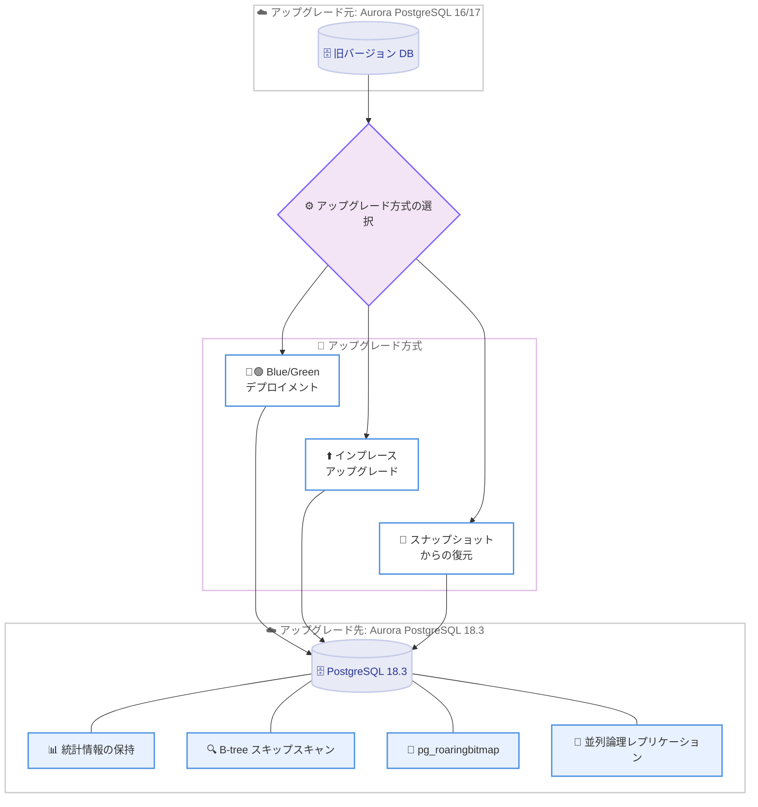

# Amazon Aurora PostgreSQL - メジャーバージョン 18 サポート

**リリース日**: 2026年6月11日
**サービス**: Amazon Aurora PostgreSQL-Compatible Edition
**機能**: PostgreSQL メジャーバージョン 18 (18.3) のサポート

📊 [このアップデートのインフォグラフィックを見る](https://takech9203.github.io/aws-news-summary/20260611-amazon-aurora-postgresql-major-version-18.html)
<!-- INFOGRAPHIC_BASE_URL は環境変数から取得 -->

## 概要

Amazon Aurora PostgreSQL-Compatible Edition が、PostgreSQL メジャーバージョン 18 (バージョン 18.3 から) をサポートしました。これにより、お客様は PostgreSQL コミュニティが提供する最新のクエリパフォーマンス改善とデータベース管理機能を Aurora の運用性とスケーラビリティとともに利用できます。

このリリースには、大規模な整数集合に対して高速かつメモリ効率の高い集合演算を実行する新しい拡張機能 pg_roaringbitmap のサポートが含まれます。この拡張機能は、オーディエンスセグメンテーション、タグベースのフィルタリング、権限チェックといったユースケースをデータベース内で直接処理することを可能にします。また、PostgreSQL 18 では B-tree スキップスキャン、メジャーバージョンアップグレード時のオプティマイザ統計情報の保持、論理レプリケーションの大規模トランザクション並列ストリーミングなど、運用面で重要な改善が導入されています。

Aurora PostgreSQL 18.3 は、すべての商用 AWS リージョンおよび AWS GovCloud (US) リージョンで利用可能です。データベース管理者、アプリケーション開発者、データエンジニアが主な対象ユーザーです。

**アップデート前の課題**

- 従来のメジャーバージョンアップグレードでは、アップグレード後にオプティマイザ統計情報が失われ、ANALYZE を再実行して統計情報が再生成されるまでクエリパフォーマンスが不安定になる可能性があった
- 複合 B-tree インデックスは、先頭の列に検索条件が指定されていない場合に利用しづらく、追加のインデックスを作成する必要があった
- 大規模なオーディエンスセグメンテーションやタグベースのフィルタリングを、アプリケーション層で処理する必要があり、効率が低下していた
- 論理レプリケーションで大規模トランザクションを処理する際にレプリケーション遅延が発生しやすかった

**アップデート後の改善**

- 今回のアップデートにより、メジャーバージョンアップグレード後もオプティマイザ統計情報が保持され、アップグレード直後から一貫したクエリパフォーマンスを得られるようになった
- B-tree スキップスキャンにより、先頭列に条件がない場合でも複合インデックスを活用でき、インデックスのストレージと保守オーバーヘッドを削減できるようになった
- pg_roaringbitmap 拡張機能により、大規模な整数集合の集合演算をデータベース内で高速かつメモリ効率良く実行できるようになった
- 論理レプリケーションで大規模トランザクションを並列ストリーミングできるようになり、レプリケーション遅延が削減された

## アーキテクチャ図



3 つのアップグレード方式 (Blue/Green デプロイメント、インプレースアップグレード、スナップショットからの復元) のいずれかを使用して Aurora PostgreSQL 18.3 に移行でき、移行後は統計情報の保持や B-tree スキップスキャンなどの新機能を利用できます。

## サービスアップデートの詳細

### 主要機能

1. **B-tree スキップスキャン**
   - 複合 B-tree インデックスにおいて、先頭の列に等価条件が指定されていない場合や、後続の列にのみ有用な条件がある場合でもインデックスを活用できるようになった
   - これまでは各検索パターンごとに追加のインデックスを作成する必要があったが、その必要性が減少する
   - インデックスのストレージ消費量と保守オーバーヘッドを削減しつつ、クエリパフォーマンスを向上できる

2. **メジャーバージョンアップグレード時のオプティマイザ統計情報の保持**
   - PostgreSQL 18 では pg_upgrade がオプティマイザ統計情報を保持するように改善された
   - アップグレード直後に ANALYZE を実行して統計情報を再生成する必要がなくなり、一貫したクエリパフォーマンスをすぐに得られる
   - なお、PostgreSQL コミュニティの仕様上、拡張統計情報 (extended statistics) は保持されない点に注意が必要

3. **論理レプリケーションの大規模トランザクション並列ストリーミング**
   - 大規模なトランザクションを並列に適用できるようになり、レプリケーション遅延を削減する
   - ダウンストリームシステムをより最新の状態に保てる
   - PostgreSQL 18 では CREATE SUBSCRIPTION のストリーミングのデフォルトが parallel に変更されている

4. **pg_roaringbitmap 拡張機能のサポート**
   - 大規模な整数集合に対して高速かつメモリ効率の高い集合演算 (積集合、和集合、差集合など) を実行する新しい拡張機能
   - オーディエンスセグメンテーション、タグベースのフィルタリング、権限チェックといったユースケースをデータベース内で直接処理できる
   - アプリケーション層での処理を回避し、効率を高められる

## 技術仕様

### バージョンと対応概要

| 項目 | 詳細 |
|------|------|
| メジャーバージョン | PostgreSQL 18 |
| 初回サポートバージョン | 18.3 |
| 新規拡張機能 | pg_roaringbitmap |
| アップグレード方式 | Blue/Green デプロイメント、インプレースアップグレード、スナップショットからの復元 |
| 対応リージョン | すべての商用 AWS リージョンおよび AWS GovCloud (US) リージョン |

### PostgreSQL 18 のその他の主な改善

| 改善項目 | 内容 |
|------|------|
| 非同期 I/O (AIO) | バックエンドが複数の読み取りリクエストをキューイングし、シーケンシャルスキャンや VACUUM などを高速化 |
| RETURNING の old/new エイリアス | INSERT/UPDATE/DELETE/MERGE で変更前後の値を明示的に返却可能 |
| 仮想生成列 | 生成列がデフォルトで仮想 (読み取り時に計算) になり、ストレージを節約 |
| uuidv7() | タイムスタンプ順にソート可能な UUID を生成 |
| EXPLAIN の BUFFERS 自動表示 | EXPLAIN ANALYZE に BUFFERS 情報が自動的に含まれる |

### pg_roaringbitmap の使用例

```sql
-- 拡張機能の有効化
CREATE EXTENSION roaringbitmap;

-- roaringbitmap 型の列を持つテーブルの作成
CREATE TABLE audience_segments (
    segment_id   integer PRIMARY KEY,
    user_bitmap  roaringbitmap
);

-- 2 つのセグメントの積集合 (両方に属するユーザー数) を計算
SELECT rb_cardinality(
    rb_and(
        (SELECT user_bitmap FROM audience_segments WHERE segment_id = 1),
        (SELECT user_bitmap FROM audience_segments WHERE segment_id = 2)
    )
);
```

上記は pg_roaringbitmap を有効化し、2 つのオーディエンスセグメントの積集合に含まれるユーザー数を集合演算で算出する例です。

## 設定方法

### 前提条件

1. アップグレード対象の Aurora PostgreSQL DB クラスターが稼働していること
2. アップグレード前にスナップショットを取得し、バックアップを確保していること
3. アプリケーションが PostgreSQL 18 の非互換変更 (仮想生成列のデフォルト化、MD5 パスワードの非推奨化など) に対応していることを確認していること

### 手順

#### ステップ1: アップグレード前の互換性確認

```bash
# 現在の DB クラスターのエンジンバージョンを確認
aws rds describe-db-clusters \
    --db-cluster-identifier my-aurora-cluster \
    --query 'DBClusters[0].EngineVersion'
```

現在稼働している Aurora PostgreSQL のエンジンバージョンを確認し、18.3 へのアップグレードパスを把握します。

#### ステップ2: Blue/Green デプロイメントの作成

```bash
# Blue/Green デプロイメントを作成し、Green 環境を 18.3 で構成
aws rds create-blue-green-deployment \
    --blue-green-deployment-name aurora-pg18-upgrade \
    --source arn:aws:rds:ap-northeast-1:123456789012:cluster:my-aurora-cluster \
    --target-engine-version 18.3
```

Blue/Green デプロイメントを作成し、本番環境 (Blue) に影響を与えずに PostgreSQL 18.3 の Green 環境を準備します。Green 環境で十分に検証してから切り替えることで、ダウンタイムとリスクを最小化できます。

#### ステップ3: 切り替えの実行

```bash
# 検証完了後、Green 環境へ切り替え
aws rds switchover-blue-green-deployment \
    --blue-green-deployment-identifier bgd-xxxxxxxxxxxx
```

検証が完了したら切り替えを実行し、Green 環境 (PostgreSQL 18.3) を本番として昇格させます。インプレースアップグレードやスナップショットからの復元を選択する場合は、それぞれ `modify-db-cluster` や `restore-db-cluster-from-snapshot` を使用します。

## メリット

### ビジネス面

- **アップグレード後のパフォーマンス安定化**: オプティマイザ統計情報が保持されるため、アップグレード直後からパフォーマンスが安定し、移行に伴うサービス影響リスクを低減できる
- **運用コストの削減**: B-tree スキップスキャンにより冗長なインデックスを削減でき、ストレージコストと保守工数を抑えられる
- **開発生産性の向上**: pg_roaringbitmap により集合演算をデータベース内で完結でき、アプリケーション側の実装負荷を軽減できる

### 技術面

- **クエリパフォーマンスの向上**: B-tree スキップスキャンや非同期 I/O などの最新の最適化を活用できる
- **レプリケーション遅延の削減**: 大規模トランザクションの並列ストリーミングにより、ダウンストリームシステムの鮮度を保てる
- **柔軟なアップグレード手段**: Blue/Green デプロイメント、インプレースアップグレード、スナップショット復元の 3 方式から最適なものを選択できる

## デメリット・制約事項

### 制限事項

- 拡張統計情報 (extended statistics) はメジャーバージョンアップグレード時に保持されない
- PostgreSQL 18 には非互換変更が含まれる (生成列のデフォルトが仮想化、MD5 パスワードの非推奨化、initdb のデータチェックサムデフォルト有効化など) ため、事前の検証が必要
- pg_roaringbitmap は新しい拡張機能のため、既存アプリケーションへの組み込みには設計と検証が必要

### 考慮すべき点

- メジャーバージョンアップグレードは非互換変更を伴うため、テスト環境で十分に検証してから本番に適用することが推奨される
- 仮想生成列がデフォルトになるため、書き込み時に値を保存する従来の挙動が必要な場合は STORED キーワードを明示的に指定する必要がある

## ユースケース

### ユースケース1: 大規模オーディエンスセグメンテーション

**シナリオ**: マーケティングプラットフォームで、数百万人のユーザー ID を複数のセグメントに分類し、複数セグメントの積集合や和集合をリアルタイムに算出したい。

**実装例**:
```sql
-- 複数セグメントの和集合に含まれるユニークユーザー数を算出
SELECT rb_cardinality(
    rb_or_cardinality_agg(user_bitmap)
)
FROM audience_segments
WHERE segment_id IN (10, 11, 12);
```

**効果**: 集合演算をデータベース内で完結させ、アプリケーション層への大量データ転送を回避することで、応答時間とメモリ使用量を削減できます。

### ユースケース2: メジャーバージョンアップグレードの安定化

**シナリオ**: ミッションクリティカルなアプリケーションを支える Aurora PostgreSQL を、パフォーマンスを劣化させずに最新メジャーバージョンへ移行したい。

**実装例**:
```bash
# Blue/Green デプロイメントで 18.3 へ移行
aws rds create-blue-green-deployment \
    --blue-green-deployment-name prod-pg18 \
    --source arn:aws:rds:ap-northeast-1:123456789012:cluster:prod-cluster \
    --target-engine-version 18.3
```

**効果**: 統計情報が保持されるため、切り替え直後から安定したクエリパフォーマンスを維持でき、ANALYZE 完了を待つ必要がなくなります。

### ユースケース3: インデックス効率化によるコスト削減

**シナリオ**: 多様な検索パターンに対応するために多数の複合インデックスを作成しており、ストレージと保守コストが増大している。

**実装例**:
```sql
-- 先頭列 region に条件がないクエリでも、複合インデックスを活用可能
-- CREATE INDEX idx_orders ON orders (region, order_date);
EXPLAIN ANALYZE
SELECT * FROM orders WHERE order_date >= '2026-06-01';
```

**効果**: B-tree スキップスキャンにより既存の複合インデックスを再利用でき、追加インデックスを削減してストレージコストと保守オーバーヘッドを低減できます。

## 料金

本アップデートに対する追加料金はありません。Aurora PostgreSQL の通常の料金体系 (インスタンス、ストレージ、I/O、バックアップなど) が適用されます。実際の料金は利用するインスタンスクラス、ストレージ容量、リージョンによって異なります。

詳細は [Amazon Aurora 料金ページ](https://aws.amazon.com/jp/rds/aurora/pricing/) を参照してください。

## 利用可能リージョン

Aurora PostgreSQL 18.3 は、すべての商用 AWS リージョン (東京リージョンを含む) および AWS GovCloud (US) リージョンで利用可能です。

## 関連サービス・機能

- **Amazon RDS Blue/Green Deployments**: 本番環境への影響を最小化しながらメジャーバージョンアップグレードを実施するための仕組み
- **Amazon RDS for PostgreSQL**: Aurora と同様に PostgreSQL 互換のマネージドデータベースサービス
- **Amazon Aurora Global Database**: 複数リージョンにまたがる低レイテンシのグローバル展開を実現する機能

## 参考リンク

- 📊 [インフォグラフィック](https://takech9203.github.io/aws-news-summary/20260611-amazon-aurora-postgresql-major-version-18.html)
- [公式発表 (What's New)](https://aws.amazon.com/about-aws/whats-new/2026/06/amazon-aurora-postgresql-major-version-18/)
- [Aurora PostgreSQL リリースノート](https://docs.aws.amazon.com/AmazonRDS/latest/AuroraPostgreSQLReleaseNotes/AuroraPostgreSQL.Updates.html)
- [PostgreSQL 18 リリースノート (PostgreSQL 公式)](https://www.postgresql.org/docs/18/release-18.html)
- [Amazon Aurora 料金ページ](https://aws.amazon.com/jp/rds/aurora/pricing/)

## まとめ

Aurora PostgreSQL 18.3 のサポートにより、B-tree スキップスキャンや統計情報の保持といった最新のパフォーマンス・運用改善と、pg_roaringbitmap による高度な集合演算をマネージド環境で活用できるようになりました。メジャーバージョンアップグレードは非互換変更を伴うため、まずはテスト環境で互換性を検証し、Blue/Green デプロイメントを活用して安全に移行することを推奨します。
