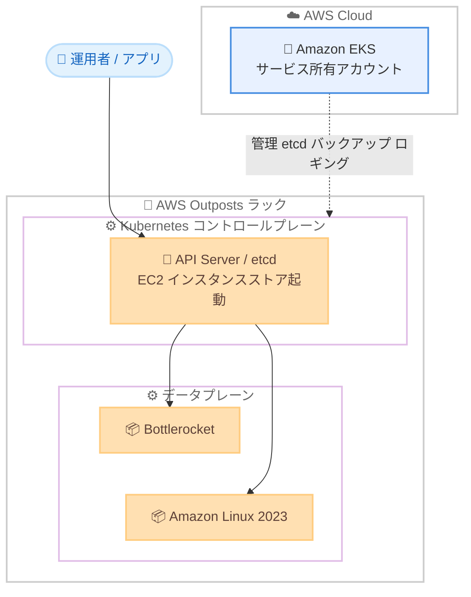

# Amazon EKS - AWS Outposts での EC2 インスタンスストアを利用したローカルクラスターのサポート

**リリース日**: 2026 年 6 月 11 日
**サービス**: Amazon Elastic Kubernetes Service (EKS)
**機能**: Amazon EC2 インスタンスストアを利用した AWS Outposts ローカルクラスター

📊 [このアップデートのインフォグラフィックを見る](https://takech9203.github.io/aws-news-summary/20260611-amazon-eks-aws-outposts-ec2-instance-store.html)
<!-- INFOGRAPHIC_BASE_URL は環境変数から取得 -->

## 概要

AWS は、Amazon Elastic Kubernetes Service (EKS) のローカルクラスターのサポートを、Amazon EC2 インスタンスストアからブートする EC2 インスタンスを実行する第 1 世代および第 2 世代の AWS Outposts ラックに拡張しました。AWS Outposts は、EC2 インスタンスストアを利用する EC2 インスタンスに対して静的安定性 (static stability) を提供しており、今回このメリットが Amazon EKS ローカルクラスターの利用者にも拡大されます。

ローカルクラスターでは、Kubernetes コントロールプレーン全体が AWS Outposts 上で稼働します。これにより、高度なデータレジデンシー要件への対応が可能になり、クラウドへの一時的なネットワーク切断による影響リスクを軽減できます。ファイバーの切断や気象イベントなどによってクラウドとの接続が切れた場合でも、アプリケーションは引き続き利用可能であり、クラスター操作も継続できます。

EC2 インスタンスストアを基盤とする Amazon EKS ローカルクラスターは、クラウド上の Amazon EKS クラスターとの運用面および機能面での同等性 (parity) を高める、更新されたアーキテクチャを採用しています。対象ユーザーは、規制やデータレジデンシーの要件によってオンプレミス環境で Kubernetes ワークロードを実行する必要がある組織です。

**アップデート前の課題**

- 従来は、EC2 インスタンスストアからブートする Outposts ラック上でローカルクラスターを利用できなかった
- 従来のアーキテクチャでは、コントロールプレーンインスタンス上で etcd のバックアップやロギングエージェントを利用者自身が管理する必要があった
- クラウド上の Amazon EKS と比べて、サポートされる機能や運用面での同等性に差があった

**アップデート後の改善**

- 今回のアップデートにより、EC2 インスタンスストアからブートする第 1 世代および第 2 世代の Outposts ラックでローカルクラスターが利用可能になった
- コントロールプレーンが Amazon EKS のサービス所有アカウントで管理されるようになり、etcd バックアップやロギングエージェントの管理が不要になった
- EKS アドオン、IAM Roles for Service Accounts、EKS Pod Identity、OIDC 認証、アクセスエントリ、Bottlerocket ワーカーノードなど、クラウド版に近い機能がサポートされるようになった

## アーキテクチャ図



Kubernetes コントロールプレーン全体が Outposts 上で稼働しつつ、その管理は AWS のサービス所有アカウントによって行われるため、利用者は etcd のバックアップやロギングエージェントの管理から解放されます。

## サービスアップデートの詳細

### 主要機能

1. **EC2 インスタンスストアによる静的安定性**
   - 第 1 世代および第 2 世代の AWS Outposts ラックで、EC2 インスタンスストアからブートするインスタンス上のローカルクラスターをサポート
   - EC2 インスタンスストアを利用する EC2 インスタンス向けの静的安定性のメリットを、EKS ローカルクラスターにも拡張
   - クラウドへの一時的なネットワーク切断時もアプリケーションとクラスター操作を継続可能

2. **マネージドコントロールプレーンによる運用負荷の軽減**
   - Outpost 上の Kubernetes コントロールプレーンが Amazon EKS のサービス所有アカウントで管理される
   - コントロールプレーンインスタンス上での etcd バックアップやロギングエージェントの管理が不要
   - 新しい Kubernetes バージョンおよび Amazon EKS プラットフォームバージョンが、クラウド版のリリースに合わせて提供される

3. **クラウド版 EKS との機能同等性の向上**
   - Amazon EKS アドオンをサポート
   - IAM Roles for Service Accounts (IRSA)、EKS Pod Identity、OIDC 認証、アクセスエントリをサポート
   - ワーカーノードとして Bottlerocket をサポート (従来からの Amazon Linux 2023 に加えて)

## 技術仕様

### アーキテクチャの比較

| 項目 | 更新後のアーキテクチャ (インスタンスストア) | 従来のアーキテクチャ (EBS) |
|------|------|------|
| ブート元 | EC2 インスタンスストア | Amazon EBS |
| コントロールプレーン管理 | EKS サービス所有アカウントが管理 | 利用者がコントロールプレーンインスタンス上で管理 |
| etcd バックアップ / ロギングエージェント | 管理不要 | 利用者管理が必要 |
| バージョン提供 | クラウド版 EKS のリリースに追従 | 個別 |
| 対象 Outposts 世代 | 第 1 世代・第 2 世代ラック | ラック |

### サポートされる主な機能

| 機能 | 内容 |
|------|------|
| Amazon EKS アドオン | クラスターへのアドオン導入をサポート |
| IAM Roles for Service Accounts | Kubernetes サービスアカウントへの IAM 権限付与 |
| EKS Pod Identity | Pod への IAM 認証情報の提供 |
| OIDC 認証 | OIDC アイデンティティプロバイダーによる認証 |
| アクセスエントリ | クラスターアクセス管理 |
| ワーカーノード OS | Bottlerocket、Amazon Linux 2023 |

## 設定方法

### 前提条件

1. AWS Outposts ラック (第 1 世代または第 2 世代) が、EC2 インスタンスストアからブートする構成でプロビジョニングされていること
2. Outposts がサポートされる商用 AWS リージョンに接続されていること
3. Amazon EKS ローカルクラスターを作成するための IAM 権限を保有していること

### 手順

#### ステップ1: ローカルクラスターの作成

```bash
# eksctl を使用してローカルクラスターを作成する例
eksctl create cluster -f local-cluster-config.yaml
```

Outposts 上にローカルクラスターを作成します。構成ファイルで Outpost ARN やサブネットなどを指定します。詳細は Amazon EKS ユーザーガイドを参照してください。

#### ステップ2: ワーカーノードの追加

```bash
# Bottlerocket または Amazon Linux 2023 のノードグループを追加
eksctl create nodegroup --cluster <cluster-name> --node-ami-family Bottlerocket
```

ワーカーノードを追加します。更新されたアーキテクチャでは Bottlerocket と Amazon Linux 2023 の両方をワーカーノード OS として選択できます。

#### ステップ3: アドオンと認証の構成

EKS アドオン、IAM Roles for Service Accounts、EKS Pod Identity、OIDC 認証、アクセスエントリなどを必要に応じて設定し、クラウド版 EKS と同様の運用を実現します。

## メリット

### ビジネス面

- **データレジデンシー要件への対応**: コントロールプレーン全体を Outposts 上で稼働させることで、高度なデータレジデンシー要件を満たせる
- **可用性の向上**: クラウドへのネットワーク切断時もアプリケーションとクラスター操作を継続でき、ダウンタイムリスクを軽減できる
- **運用コストの削減**: コントロールプレーンの管理が不要になり、運用負荷とそれに伴うコストを削減できる

### 技術面

- **静的安定性**: EC2 インスタンスストアを基盤とした静的安定性のメリットを EKS ローカルクラスターでも享受できる
- **マネージドコントロールプレーン**: etcd バックアップやロギングエージェントの管理から解放される
- **機能同等性**: クラウド版 EKS の新しい Kubernetes / プラットフォームバージョンや主要機能を利用できる

## デメリット・制約事項

### 制限事項

- EC2 インスタンスストアを基盤とする更新後のアーキテクチャが対象であり、Amazon EBS からブートする Outposts は従来のローカルクラスターアーキテクチャを引き続き使用する
- AWS Outposts ラックをサポートする商用 AWS リージョンでのみ利用可能
- 対象は第 1 世代および第 2 世代の Outposts ラック

### 考慮すべき点

- 既存の EBS ベースのローカルクラスターから更新後のアーキテクチャへ移行する際は、ブート構成 (インスタンスストア) を含めた設計の見直しが必要
- インスタンスストアは揮発性ストレージであるため、データの永続化要件はワークロード設計で別途考慮する

## ユースケース

### ユースケース1: 規制対応が必要なオンプレミス Kubernetes 基盤

**シナリオ**: 金融や公共分野などで、データを特定の拠点内に留める必要がある組織が、オンプレミスで Kubernetes ワークロードを実行する。

**効果**: コントロールプレーンを含む EKS クラスター全体を Outposts 上で稼働させることで、データレジデンシー要件を満たしながらマネージド運用のメリットを得られる。

### ユースケース2: 不安定なネットワーク環境での継続稼働

**シナリオ**: 通信障害や気象イベントによりクラウドへの接続が断続的に切れる可能性がある拠点で、ミッションクリティカルなアプリケーションを稼働させる。

**効果**: ネットワーク切断時にもアプリケーションとクラスター操作を継続でき、静的安定性によりサービス継続性を確保できる。

### ユースケース3: クラウドとオンプレミスで統一した運用

**シナリオ**: クラウド上の EKS とオンプレミスの EKS を併用し、共通の運用手順とツールチェーンを利用したい。

**効果**: EKS アドオン、IRSA、Pod Identity、OIDC、Bottlerocket などクラウド版と同等の機能を利用でき、運用の標準化を図れる。

## 料金

Amazon EKS ローカルクラスターおよび AWS Outposts の利用料金が適用されます。具体的な料金は、AWS Outposts の構成および Amazon EKS の料金体系に依存します。最新の料金は公式の料金ページを参照してください。

## 利用可能リージョン

AWS Outposts ラックをサポートするすべての商用 AWS リージョンで、EC2 インスタンスストアを基盤とする更新後のアーキテクチャが一般提供 (GA) されています。ローカルクラスター自体は、米国東部 (バージニア北部、オハイオ)、米国西部 (北カリフォルニア、オレゴン)、アジアパシフィック (ソウル、シンガポール、シドニー、東京)、カナダ (中部)、欧州 (フランクフルト、アイルランド、ロンドン)、中東 (バーレーン)、南米 (サンパウロ) などのリージョンで利用可能です。

## 関連サービス・機能

- **AWS Outposts**: ローカルクラスターを稼働させるオンプレミス向けインフラ基盤
- **Amazon EC2 インスタンスストア**: 静的安定性を提供するインスタンス基盤のブート元
- **Bottlerocket**: コンテナ向けに最適化された Linux ベースのワーカーノード OS
- **EKS Pod Identity / IAM Roles for Service Accounts**: Pod への IAM 権限付与を行う認証機構

## 参考リンク

- 📊 [インフォグラフィック](https://takech9203.github.io/aws-news-summary/20260611-amazon-eks-aws-outposts-ec2-instance-store.html)
- [公式発表 (What's New)](https://aws.amazon.com/about-aws/whats-new/2026/06/amazon-eks-aws-outposts-ec2-instance-store/)
- [ドキュメント (Amazon EKS ローカルクラスター)](https://docs.aws.amazon.com/eks/latest/userguide/eks-outposts-local-cluster-overview.html)
- [AWS Outposts の静的安定性に関する発表](https://aws.amazon.com/about-aws/whats-new/2024/11/static-stability-amazon-ec2-instances-store-aws-outposts/)

## まとめ

今回のアップデートにより、EC2 インスタンスストアからブートする AWS Outposts ラックでも Amazon EKS ローカルクラスターを利用できるようになり、静的安定性とマネージドコントロールプレーンによる運用負荷軽減を両立できます。データレジデンシー要件や不安定なネットワーク環境で Kubernetes を運用する組織は、更新後のアーキテクチャへの移行や新規導入を検討することを推奨します。クラウド版 EKS との機能同等性も向上しているため、ハイブリッド環境での運用標準化が進めやすくなります。
