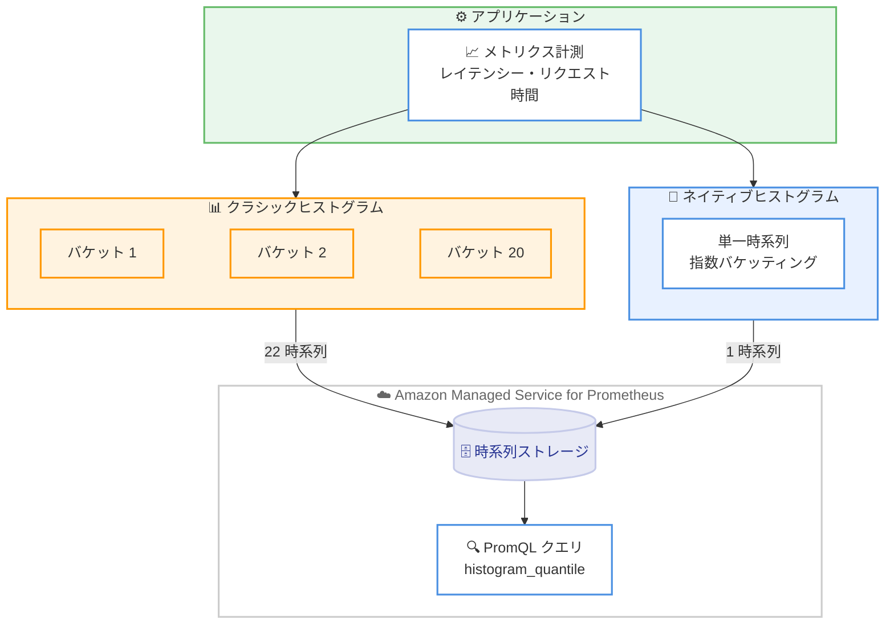

# Amazon Managed Service for Prometheus - ネイティブヒストグラムのサポート

**リリース日**: 2026 年 6 月 11 日
**サービス**: Amazon Managed Service for Prometheus
**機能**: Native Histograms (ネイティブヒストグラム) のサポート

📊 [このアップデートのインフォグラフィックを見る](https://takech9203.github.io/aws-news-summary/20260611-amazon-managed-service-prometheus-native-histograms.html)
<!-- INFOGRAPHIC_BASE_URL は環境変数から取得 -->

## 概要

Amazon Managed Service for Prometheus が、Prometheus のネイティブヒストグラム (Native Histograms) の取り込み、保存、クエリに対応しました。これにより、従来のクラシックヒストグラムよりも高い精度と低いカーディナリティで、メトリクスの分布を高解像度で取得できるようになります。

ネイティブヒストグラムは指数バケッティング (exponential bucketing) を採用しており、データに応じて解像度を自動的に調整します。クラシックヒストグラムがバケット境界ごとに 1 つの時系列を必要としていたのに対し、ネイティブヒストグラムは分布全体を単一の時系列に格納します。これにより、アクティブな時系列の数が削減され、`histogram_quantile()` などの関数からより正確なテールレイテンシーの分析結果を得られます。

このアップデートは、レイテンシー、リクエスト時間、その他の分布を監視する DevOps エンジニア、サイトリライアビリティエンジニア (SRE)、プラットフォームチームを対象としています。既存のクラシックヒストグラムと並行して段階的に導入できるため、現在の監視を中断することなく、独自のペースでワークロードを移行できます。

**アップデート前の課題**

- クラシックヒストグラムでは、バケットの境界をあらかじめ定義する必要があり、定義したバケット解像度を超える精度のパーセンタイル計算ができなかった
- バケット境界ごとに個別の時系列が必要となり、高カーディナリティの時系列を管理する必要があった (例: 20 バケットのクラシックヒストグラムでは 22 の時系列が必要)
- アクティブな時系列が増加することで、コストやリソース管理の負担が大きくなっていた

**アップデート後の改善**

- バケット境界を事前に定義することなく、より正確なパーセンタイル計算が可能になった
- 分布全体を単一の時系列に格納できるため、アクティブな時系列数が大幅に削減された (例: 22 の時系列が 1 つに)
- 実際の観測値を含む利用されたバケットのみが課金対象となり、疎な分布における空のバケットには課金されないため、コスト効率が改善された

## アーキテクチャ図



クラシックヒストグラムがバケット境界ごとに複数の時系列を必要とするのに対し、ネイティブヒストグラムは分布全体を単一の時系列に格納し、同一のストレージとクエリエンジンで処理されることを示しています。

## サービスアップデートの詳細

### 主要機能

1. **指数バケッティングによる自動解像度調整**
   - データに応じてバケットの解像度を自動的に調整する
   - バケット境界を事前に定義する必要がない
   - 高解像度の分布をより正確にキャプチャできる

2. **単一時系列への分布格納**
   - 分布全体を 1 つの時系列に格納する
   - バケット境界ごとに時系列を作成する必要がなくなる
   - アクティブな時系列数とカーディナリティを大幅に削減する

3. **段階的な導入とマイグレーション**
   - 既存のクラシックヒストグラムと並行してネイティブヒストグラムを利用できる
   - 現在の監視を中断することなく、独自のペースでワークロードを移行できる
   - クラシックヒストグラムからの移行をワークロード単位で実施できる

4. **より正確なテールレイテンシー分析**
   - `histogram_quantile()` などの関数でより精度の高いパーセンタイル計算が可能
   - p99 などのテールレイテンシーの分析精度が向上する

## 技術仕様

### クラシックヒストグラムとネイティブヒストグラムの比較

| 項目 | クラシックヒストグラム | ネイティブヒストグラム |
|------|------------------------|------------------------|
| バケット境界 | 事前定義が必要 | 指数バケッティングで自動調整 |
| 時系列の数 | バケット数 + 2 (例: 20 バケットで 22 時系列) | 単一時系列 (1 時系列) |
| カーディナリティ | 高い | 低い |
| パーセンタイル精度 | 定義したバケット解像度に依存 | より高精度 |
| 課金対象 | 各時系列 | 観測値を含む利用されたバケットのみ |

### PromQL クエリ例

```promql
# ネイティブヒストグラムから 99 パーセンタイルのレイテンシーを計算
histogram_quantile(0.99, sum(rate(http_request_duration_seconds[5m])))
```

`histogram_quantile()` 関数を使用してパーセンタイル値を計算します。ネイティブヒストグラムでは、事前定義したバケット境界に依存せず、指数バケッティングによってより正確な計算結果が得られます。

## 設定方法

### 前提条件

1. Amazon Managed Service for Prometheus のワークスペースが作成済みであること
2. メトリクスを送信するアプリケーションがネイティブヒストグラムに対応した Prometheus クライアントライブラリを使用していること
3. メトリクスを取り込む Prometheus またはエージェント (例: ADOT Collector) がネイティブヒストグラムの送信に対応していること

### 手順

#### ステップ 1: アプリケーション側でネイティブヒストグラムを有効化

アプリケーションで使用している Prometheus クライアントライブラリでネイティブヒストグラムを有効化します。クライアントライブラリのバージョンと設定がネイティブヒストグラムに対応していることを確認します。

#### ステップ 2: メトリクスの取り込み

ネイティブヒストグラム形式のメトリクスを Amazon Managed Service for Prometheus のワークスペースに送信します。クラシックヒストグラムと並行して運用できるため、既存の監視を維持したまま段階的に導入できます。

#### ステップ 3: クエリと可視化

PromQL の `histogram_quantile()` などの関数を使用して、ネイティブヒストグラムからパーセンタイルやテールレイテンシーを計算します。Amazon Managed Grafana などのツールで可視化することで、分布の傾向を分析できます。

## メリット

### ビジネス面

- **コスト効率の向上**: 観測値を含む利用されたバケットのみが課金対象となり、空のバケットには課金されないため、疎な分布でのコストを抑えられる
- **運用負荷の軽減**: 時系列数とカーディナリティが削減され、ワークスペースの管理がシンプルになる
- **段階的な導入**: 既存の監視を中断せずに移行できるため、移行リスクとダウンタイムを最小化できる

### 技術面

- **高精度なパーセンタイル計算**: バケット境界の事前定義が不要で、テールレイテンシーをより正確に分析できる
- **低カーディナリティ**: 分布全体を単一時系列に格納することで、アクティブな時系列数を大幅に削減できる
- **自動解像度調整**: 指数バケッティングによりデータに応じて解像度が自動調整され、設計の手間が減る

## デメリット・制約事項

### 制限事項

- アプリケーション側およびメトリクス取り込みパイプラインがネイティブヒストグラムに対応している必要がある
- 既存の可視化やアラート定義をネイティブヒストグラムに合わせて見直す必要がある場合がある

### 考慮すべき点

- クラシックヒストグラムとネイティブヒストグラムを併用する場合、メトリクスの管理方針を明確にする必要がある
- 課金は観測値を含む利用されたバケット数に基づくため、分布の特性に応じてコストを見積もる必要がある

## ユースケース

### ユースケース 1: API レイテンシーの高精度監視

**シナリオ**: マイクロサービスアーキテクチャで、API のレイテンシー分布を高い精度で監視し、p99 などのテールレイテンシーを正確に把握したい。

**実装例**:
```promql
histogram_quantile(0.99, sum(rate(api_request_duration_seconds[5m])) by (le, service))
```

**効果**: 事前定義したバケット境界に依存せず、より正確なテールレイテンシーを取得でき、SLO の達成状況を精度高く評価できます。

### ユースケース 2: 高カーディナリティ環境のコスト最適化

**シナリオ**: 多数のサービスやエンドポイントを監視しており、クラシックヒストグラムによる時系列数の増大がコストとリソースの負担になっている。

**実装例**:
```
クラシックヒストグラム (20 バケット): 22 時系列
↓ ネイティブヒストグラムへ移行
ネイティブヒストグラム: 1 時系列
```

**効果**: アクティブな時系列数とカーディナリティが削減され、ワークスペースのコストと管理負荷を低減できます。

### ユースケース 3: 段階的なヒストグラム移行

**シナリオ**: 既存のクラシックヒストグラムによる監視を運用中で、監視を中断せずにネイティブヒストグラムへ移行したい。

**実装例**:
```
ワークロード A: ネイティブヒストグラムを先行導入
ワークロード B: クラシックヒストグラムを継続
→ 検証後にワークロード B も順次移行
```

**効果**: 現在の監視を維持しながら、ワークロード単位で独自のペースで移行でき、移行リスクを抑えられます。

## 料金

Amazon Managed Service for Prometheus では、ネイティブヒストグラムについて、実際の観測値を含む利用されたバケットのみに基づいて計測および課金されます。疎な分布における空のバケットには課金されません。

詳細な料金については、Amazon Managed Service for Prometheus の料金ページを参照してください。

## 利用可能リージョン

Amazon Managed Service for Prometheus が提供されているすべての AWS リージョンで利用可能です。

## 関連サービス・機能

- **Amazon Managed Grafana**: Amazon Managed Service for Prometheus のメトリクスを可視化し、ネイティブヒストグラムの分布を分析するために利用できる
- **AWS Distro for OpenTelemetry (ADOT)**: メトリクスの収集と Amazon Managed Service for Prometheus への送信に利用できる
- **Amazon EKS / Amazon ECS**: コンテナワークロードのメトリクスを収集し、Amazon Managed Service for Prometheus で監視する際の主要な対象環境

## 参考リンク

- 📊 [インフォグラフィック](https://takech9203.github.io/aws-news-summary/20260611-amazon-managed-service-prometheus-native-histograms.html)
- [公式発表 (What's New)](https://aws.amazon.com/about-aws/whats-new/2026/06/amazon-managed-service-prometheus-native-histograms/)
- [ドキュメント](https://docs.aws.amazon.com/prometheus/latest/userguide/what-is-Amazon-Managed-Service-Prometheus.html)
- [料金ページ](https://aws.amazon.com/prometheus/pricing/)

## まとめ

ネイティブヒストグラムのサポートにより、Amazon Managed Service for Prometheus は、より高精度なパーセンタイル計算と低カーディナリティでのメトリクス監視を実現します。レイテンシーやリクエスト時間の監視を行う DevOps チームや SRE は、既存のクラシックヒストグラムと並行して段階的に導入できるため、監視を中断することなくコスト効率と分析精度の両方を向上できます。まずは検証環境でネイティブヒストグラムを有効化し、既存の監視との比較を行うことを推奨します。
