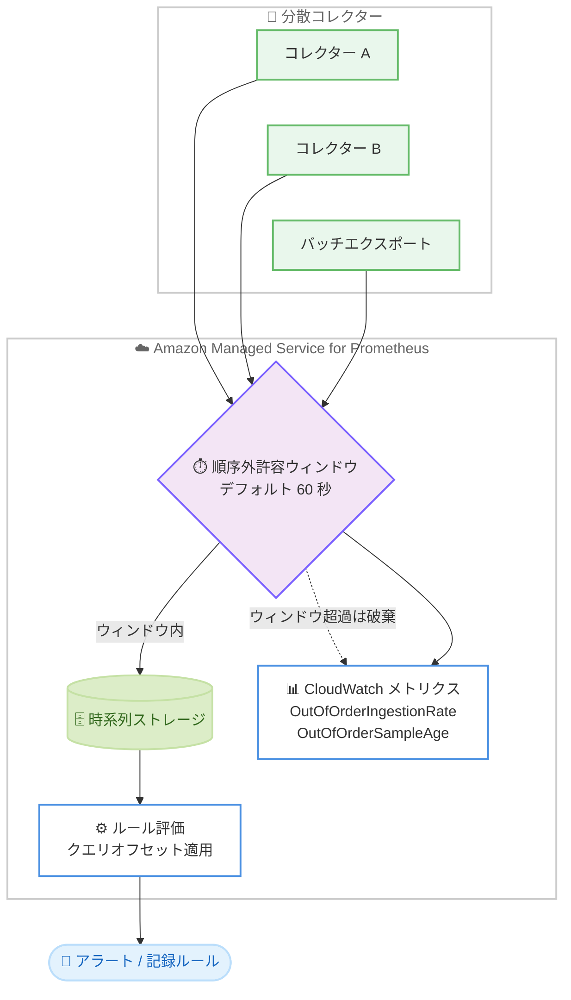

# Amazon Managed Service for Prometheus - 順序外サンプルの取り込みサポート

**リリース日**: 2026 年 6 月 11 日
**サービス**: Amazon Managed Service for Prometheus
**機能**: 順序外サンプル取り込み (out-of-order sample ingestion) およびワークスペースレベルのルールクエリオフセット

📊 [このアップデートのインフォグラフィックを見る](https://takech9203.github.io/aws-news-summary/20260611-amazon-managed-service-prometheus-outoforder-ingestion.html)
<!-- INFOGRAPHIC_BASE_URL は環境変数から取得 -->

## 概要

Amazon Managed Service for Prometheus が、順序外サンプルの取り込み (out-of-order sample ingestion) と、ワークスペースレベルのルールクエリオフセット (rule query offset) をサポートしました。これまで Prometheus は厳密な時系列順でサンプルを取り込むことを前提としており、タイムスタンプが直前のサンプルより過去になるサンプルは破棄されていました。今回のアップデートにより、すべてのワークスペースにデフォルトで 60 秒 (1 分) の順序外許容ウィンドウが設定され、厳密な時系列順から外れて到着したメトリクスサンプルも受け入れられるようになります。

順序外サンプルが発生する典型的な原因は、分散配置されたコレクター、バッチ化されたエクスポート、ネットワークレイテンシーのばらつきです。これらの環境では、複数の収集元からのデータが時間的に前後して到着するため、従来は遅れて到着したサンプルが欠損し、メトリクスの欠落やアラートの精度低下を招いていました。

加えて、ルールの評価クエリが実行される前に遅延を挿入するグローバルなルールクエリオフセットを設定できるようになりました。これにより、遅れて到着したサンプルが取り込まれるための猶予時間を確保してからルールを実行できます。これらの機能を組み合わせることで、分散コレクター、バッチエクスポート、可変ネットワークレイテンシーを持つワークロードにおけるデータ欠損を削減し、アラートの精度を向上できます。

**アップデート前の課題**

- 厳密な時系列順から外れて到着したサンプルは破棄され、データ欠損が発生していた
- 分散コレクターやバッチエクスポートを利用する環境では、メトリクスの取り込みタイミングがばらつき、アラートが誤発報または欠落しやすかった
- ルール評価時に遅延サンプルが取り込まれていないと、ルールが不完全なデータセットに対して評価されていた

**アップデート後の改善**

- デフォルトで 60 秒の順序外許容ウィンドウが設定され、順序外サンプルを取り込めるようになった
- ワークスペースレベルのルールクエリオフセットにより、遅延サンプルの取り込みを待ってからルールを評価できるようになった
- 新しい 2 つの CloudWatch ベンドメトリクス (OutOfOrderIngestionRate、OutOfOrderSampleAge) により、取り込みパターンを可視化できるようになった

## アーキテクチャ図



分散コレクターから前後して到着したサンプルを順序外許容ウィンドウで受け入れ、ルールクエリオフセットで遅延サンプルの取り込みを待ってからルールを評価する流れを示しています。

## サービスアップデートの詳細

### 主要機能

1. **順序外許容ウィンドウ (out-of-order time window)**
   - 厳密な時系列順から外れて到着したサンプルを受け入れる時間ウィンドウを指定する
   - すべてのワークスペースにデフォルトで 60 秒のウィンドウが設定される
   - 値を 0 に設定すると機能が無効になり、順序外サンプルは破棄される
   - 最小値は 0 秒、最大値は 600 秒 (より大きな上限が必要な場合はサービスクォータの引き上げを申請)

2. **ルールクエリオフセット (rule query offset)**
   - ルール評価クエリの実行前にグローバルな遅延を挿入する設定
   - 遅れて到着したサンプルが取り込まれるための猶予時間を確保し、より完全なデータセットに対してルールを評価できる
   - 新規ワークスペースのデフォルトは 60 秒、既存ワークスペースのデフォルトは 0 秒
   - 最小値は 0 秒、最大値は 86,400 秒 (24 時間)
   - ルールグループレベルで設定したクエリオフセットは、このワークスペースレベルの設定より優先される

3. **新しい CloudWatch ベンドメトリクス**
   - OutOfOrderIngestionRate: 順序外サンプルの取り込みレートを可視化する
   - OutOfOrderSampleAge: 順序外サンプルがどれだけ過去のタイムスタンプを持つかを可視化する
   - これらのメトリクスにより、取り込みパターンを把握し、適切なウィンドウやオフセットの値を判断できる

## 技術仕様

### 設定項目と値の範囲

| 項目 | デフォルト | 最小値 | 最大値 |
|------|------------|--------|--------|
| 順序外許容ウィンドウ | 60 秒 (全ワークスペース) | 0 秒 (無効化) | 600 秒 |
| ルールクエリオフセット (新規ワークスペース) | 60 秒 | 0 秒 | 86,400 秒 (24 時間) |
| ルールクエリオフセット (既存ワークスペース) | 0 秒 | 0 秒 | 86,400 秒 (24 時間) |

### 設定の優先順位

- ルールグループレベルで設定したクエリオフセットは、ワークスペースレベルのルールクエリオフセットより優先されます。
- 順序外許容ウィンドウを設定している場合は、ルールクエリオフセットをウィンドウ以上の値に設定することが推奨されます。これにより、順序外サンプルがルール評価に含まれるようになります。

## 設定方法

### 前提条件

1. Amazon Managed Service for Prometheus のワークスペースが作成済みであること
2. ワークスペースの設定を変更する IAM 権限を保有していること
3. 取り込みパターンを把握するため、必要に応じて CloudWatch でメトリクスを確認できること

### 手順

#### ステップ1: 順序外許容ウィンドウの設定

1. Amazon Managed Service for Prometheus コンソールを開きます。
2. 左上のメニューアイコンから [All workspaces] を選択します。
3. 対象ワークスペースの [Workspace ID] を選択します。
4. [Workspace configurations] タブを選択します。
5. [Out of order time window] セクションで [Edit] を選択し、ウィンドウを秒単位で指定します。

順序外サンプルを受け入れる時間ウィンドウを設定する手順です。0 を指定すると機能が無効になり、順序外サンプルは破棄されます。

#### ステップ2: ルールクエリオフセットの設定

1. 同じ [Workspace configurations] タブを開きます。
2. [Rule query offset] セクションで [Edit] を選択し、オフセットを秒単位で指定します。

ルール評価の前に挿入する遅延を設定する手順です。遅れて到着したサンプルが取り込まれてからルールを評価できます。順序外許容ウィンドウを設定している場合は、オフセットをウィンドウ以上の値に設定してください。

#### ステップ3: CloudWatch メトリクスの確認

CloudWatch コンソールで OutOfOrderIngestionRate と OutOfOrderSampleAge を確認し、順序外サンプルの取り込みレートとサンプルの遅延量を把握します。これらの値をもとに、許容ウィンドウとクエリオフセットを調整します。

## メリット

### ビジネス面

- **データ欠損の削減**: 順序外サンプルを破棄せず取り込むことで、メトリクスの欠落を減らし、監視データの完全性を高めます。
- **アラート精度の向上**: ルールクエリオフセットにより、より完全なデータセットに対してルールを評価でき、誤発報や欠落を抑えられます。
- **運用の信頼性向上**: 分散環境やバッチ処理を伴うワークロードでも、信頼できる監視とアラートを実現します。

### 技術面

- **既存環境への影響が小さい**: すべてのワークスペースにデフォルト 60 秒のウィンドウが適用され、追加設定なしで効果を得られます。
- **柔軟な調整**: ウィンドウとオフセットを秒単位で調整でき、ワークロードの特性に合わせて最適化できます。
- **可視化**: 新しい 2 つの CloudWatch メトリクスにより、取り込みパターンをデータに基づいて分析できます。

## デメリット・制約事項

### 制限事項

- 順序外許容ウィンドウの最大値は 600 秒です。これを超える上限が必要な場合はサービスクォータの引き上げを申請する必要があります。
- ルールクエリオフセットの最大値は 86,400 秒 (24 時間) です。
- ウィンドウを超えて到着した順序外サンプルは引き続き破棄されます。

### 考慮すべき点

- ルールクエリオフセットを設定すると、ルール評価とそれに伴うアラートがオフセット分だけ遅延します。アラートの即時性とデータ完全性のバランスを考慮してください。
- 既存ワークスペースのルールクエリオフセットのデフォルトは 0 秒のため、効果を得るにはコンソールから明示的に値を更新する必要があります。

## ユースケース

### ユースケース1: 分散コレクターからのメトリクス収集

**シナリオ**: 複数リージョンやエッジロケーションに配置したコレクターからメトリクスを収集する環境で、ネットワークレイテンシーの差により一部のサンプルが時系列順から外れて到着している。

**実装例**:
```
順序外許容ウィンドウ: 120 秒
ルールクエリオフセット: 120 秒
```

**効果**: 遅延して到着するサンプルを取り込み、ルール評価時にも含めることで、データ欠損とアラートの誤検知を削減できます。

### ユースケース2: バッチ化されたメトリクスエクスポート

**シナリオ**: アプリケーションがメトリクスをバッチでまとめてエクスポートしており、バッチ内のサンプルのタイムスタンプが直近の取り込み時刻より過去になる。

**実装例**:
```
順序外許容ウィンドウ: 300 秒
```

**効果**: バッチ送信される過去のタイムスタンプを持つサンプルが破棄されなくなり、メトリクスの完全性が向上します。

### ユースケース3: 可変ネットワークレイテンシー環境でのアラート精度向上

**シナリオ**: ネットワークレイテンシーが変動する環境で、ルールが不完全なデータに対して評価され、アラートが誤発報している。

**実装例**:
```
順序外許容ウィンドウ: 60 秒
ルールクエリオフセット: 90 秒 (ウィンドウ以上の値)
```

**効果**: ルール評価をオフセット分だけ遅延させることで、遅延サンプルを取り込んでから評価でき、アラートの精度が向上します。

## 料金

本機能の利用に追加料金は記載されていません。Amazon Managed Service for Prometheus の標準的な取り込み、ストレージ、クエリの料金が適用されます。CloudWatch ベンドメトリクスについては CloudWatch の料金が適用される場合があります。最新の料金は公式の料金ページを確認してください。

## 利用可能リージョン

Amazon Managed Service for Prometheus が一般提供されているすべての AWS リージョンで利用できます。

## 関連サービス・機能

- **Amazon CloudWatch**: 新しいベンドメトリクス (OutOfOrderIngestionRate、OutOfOrderSampleAge) と、ルール評価関連のメトリクス (RuleGroupLastEvaluationDuration、RuleGroupIterationsMissed) を確認できます。
- **Amazon SNS**: Alertmanager からのアラート通知の送信先として利用されます。
- **PromQL offset 修飾子**: 個別のルール式に対してオフセットを適用する従来の方法で、ワークスペースレベルのオフセット設定の代替として利用できます。

## 参考リンク

- 📊 [インフォグラフィック](https://takech9203.github.io/aws-news-summary/20260611-amazon-managed-service-prometheus-outoforder-ingestion.html)
- [公式発表 (What's New)](https://aws.amazon.com/about-aws/whats-new/2026/06/amazon-managed-service-prometheus-outoforder-ingestion/)
- [ドキュメント: ワークスペースの設定](https://docs.aws.amazon.com/prometheus/latest/userguide/AMP-workspace-configuration.html)
- [ドキュメント: ルール評価のトラブルシューティング](https://docs.aws.amazon.com/prometheus/latest/userguide/troubleshoot-rule-evaluations.html)
- [料金ページ](https://aws.amazon.com/prometheus/pricing/)

## まとめ

今回のアップデートは、分散コレクター、バッチエクスポート、可変ネットワークレイテンシーを持つワークロードにおけるデータ欠損とアラートの誤検知を削減する重要な機能強化です。すべてのワークスペースにデフォルト 60 秒の順序外許容ウィンドウが適用されるため、既存ワークスペースでもルールクエリオフセットの設定を見直し、新しい CloudWatch メトリクスで取り込みパターンを確認したうえで、ワークロードに合わせてウィンドウとオフセットを最適化することを推奨します。
