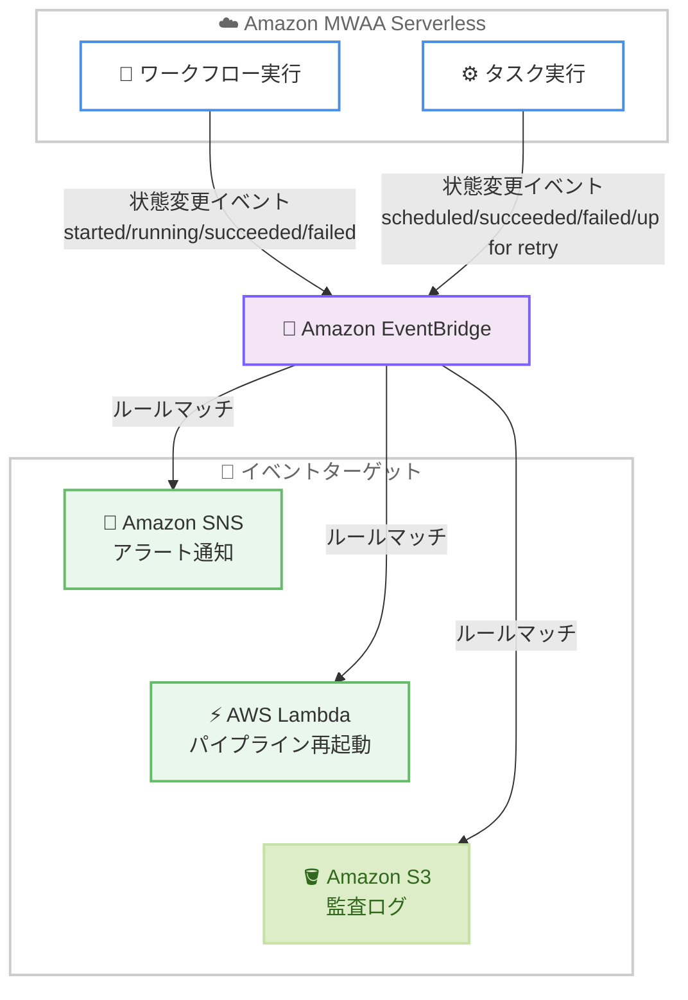

# Amazon MWAA Serverless - Amazon EventBridge 通知のサポート

**リリース日**: 2026年6月11日
**サービス**: Amazon Managed Workflows for Apache Airflow (MWAA) Serverless
**機能**: Amazon EventBridge 通知

📊 [このアップデートのインフォグラフィックを見る](https://takech9203.github.io/aws-news-summary/20260611-amazon-mwaa-serverless-eventbridge.html)
<!-- INFOGRAPHIC_BASE_URL は環境変数から取得 -->

## 概要

Amazon Managed Workflows for Apache Airflow (MWAA) Serverless が、ワークフローおよびタスクの状態変更イベントを Amazon EventBridge に送信できるようになりました。これにより、データエンジニアリングチームやプラットフォームチームは、Apache Airflow ワークフローに対してイベント駆動型の自動化を構築できます。

これまで、ワークフローの実行状況を監視するには、独自のポーリングロジックを実装するか、手動で状態を確認する必要がありました。今回のアップデートにより、MWAA Serverless はワークフローが状態間を遷移したとき (開始、実行中、成功、失敗など) や、個々のタスクの状態が変化したとき (スケジュール済み、成功、失敗、リトライ待ちなど) にイベントを発行します。

これらの EventBridge 通知を利用することで、本番ワークフローが失敗した際のアラート発報、上流ワークフローの成功時に依存パイプラインを自動的に再起動する処理、コンプライアンスや監査を目的とした状態遷移の Amazon S3 へのロギングなどを実現できます。

**アップデート前の課題**

- 以前はワークフローの実行状況を監視するために、独自のポーリングロジックを実装する必要があった
- 以前は状態変化を検知するために手動での観察が必要だった
- 以前はワークフローやタスクの失敗を、リアルタイムに近い形で他システムへ通知する仕組みがなかった

**アップデート後の改善**

- 今回のアップデートにより、ワークフローとタスクの状態変更を EventBridge イベントとして自動的に受け取れるようになった
- 今回のアップデートにより、独自のポーリングロジックや手動確認が不要になった
- 今回のアップデートにより、状態変化をトリガーとしたイベント駆動型の自動化を構築できるようになった

## アーキテクチャ図



MWAA Serverless がワークフローおよびタスクの状態変更イベントを EventBridge に発行し、EventBridge ルールにマッチしたイベントが SNS、Lambda、S3 などのターゲットへ配信される流れを示しています。

## サービスアップデートの詳細

### 主要機能

1. **ワークフロー状態変更イベント**
   - ワークフロー実行が状態間を遷移するたびにイベントが発行される
   - 開始 (Started)、キュー投入 (Queued)、実行中 (Running)、成功 (Succeeded)、失敗 (Failed)、停止 (Stopped)、タイムアウト (Timeout) の状態をカバーする
   - 本番ワークフローの失敗検知や、後続処理のトリガーに活用できる

2. **タスク状態変更イベント**
   - 個々のタスクの状態が変化するたびにイベントが発行される
   - キュー投入 (Queued)、スケジュール済み (Scheduled)、上流失敗 (Upstream Failed)、実行中 (Running)、成功 (Succeeded)、失敗 (Failed)、リトライ待ち (Up For Retry)、タイムアウト (Timeout) の状態をカバーする
   - タスク単位での詳細な監視と自動化を可能にする

3. **EventBridge への直接配信**
   - イベントは `aws.airflow-serverless` をソースとして EventBridge に直接送信される
   - 配信タイプは Durable (耐久性のある配信) であり、信頼性の高いイベント連携を実現する
   - EventBridge のイベントパターンを利用して、特定のイベントのみをフィルタリングできる

## 技術仕様

### イベントのソースと種類

| 項目 | 詳細 |
|------|------|
| イベントソース | `aws.airflow-serverless` |
| 配信タイプ | Durable (耐久性のある配信) |
| ワークフローイベント | Workflow Run Started / Queued / Running / Succeeded / Failed / Stopped / Timeout |
| タスクイベント | Task Queued / Scheduled / Upstream Failed / Running / Succeeded / Failed / Up For Retry / Timeout |

### イベントパターン例

サービスからのすべてのイベントにマッチさせる場合は、以下のイベントパターンを使用します。

```json
{
  "source": ["aws.airflow-serverless"]
}
```

特定のイベントにマッチさせる場合は、`detail-type` 属性でイベント名の配列を指定します。

```json
{
  "source": ["aws.airflow-serverless"],
  "detail-type": ["MWAA Serverless Workflow Run Failed"]
}
```

このイベントパターンは、ワークフロー実行が失敗したイベントのみを抽出します。アラート通知などに利用できます。

## 設定方法

### 前提条件

1. Amazon MWAA Serverless のワークフローが作成済みであること
2. EventBridge ルールを作成する権限 (`events:PutRule`、`events:PutTargets`) を持つ IAM ロールまたはユーザー
3. イベントのターゲットとなるサービス (Amazon SNS、AWS Lambda、Amazon S3 など) が利用可能であること

### 手順

#### ステップ1: EventBridge ルールの作成

```bash
aws events put-rule \
  --name "mwaa-serverless-workflow-failed" \
  --event-pattern '{"source":["aws.airflow-serverless"],"detail-type":["MWAA Serverless Workflow Run Failed"]}'
```

このコマンドは、MWAA Serverless のワークフロー実行が失敗したイベントにマッチする EventBridge ルールを作成します。

#### ステップ2: ターゲットの設定

```bash
aws events put-targets \
  --rule "mwaa-serverless-workflow-failed" \
  --targets "Id"="1","Arn"="arn:aws:sns:ap-northeast-1:123456789012:mwaa-alerts"
```

このコマンドは、作成したルールにマッチしたイベントを Amazon SNS トピックへ送信するターゲットを設定します。ワークフロー失敗時に SNS 経由でアラートを発報できます。

#### ステップ3: 動作確認

ワークフローを実行し、状態が遷移した際に EventBridge ルールが発火し、ターゲット (SNS トピックなど) に通知が届くことを確認します。CloudWatch のメトリクスや S3 のログ出力でイベント配信状況を検証することを推奨します。

## メリット

### ビジネス面

- **運用負荷の削減**: 独自のポーリング監視や手動確認が不要になり、運用チームの負担を軽減できる
- **障害対応の迅速化**: ワークフロー失敗時にリアルタイムに近い形でアラートを発報でき、ダウンタイムを最小化できる
- **コンプライアンス強化**: 状態遷移を S3 に記録することで、監査要件への対応が容易になる

### 技術面

- **イベント駆動型アーキテクチャ**: EventBridge を中核としたイベント駆動型の自動化を構築できる
- **疎結合な連携**: ポーリングに依存せず、MWAA Serverless と他システムを疎結合に連携できる
- **耐久性のある配信**: Durable 配信により、イベントの取りこぼしを抑えた信頼性の高い連携が可能

## デメリット・制約事項

### 制限事項

- 本機能は Amazon MWAA Serverless が利用可能なリージョンでのみ提供される
- イベントの配信先での処理 (Lambda、SNS など) には別途それぞれのサービス料金が発生する

### 考慮すべき点

- EventBridge ルールのイベントパターンを適切に設計しないと、不要なイベントまで処理してしまう可能性がある
- 大量のタスクを持つワークフローでは、タスク状態変更イベントが多数発行されるため、ターゲット側のスケーラビリティを考慮する必要がある

## ユースケース

### ユースケース1: 本番ワークフロー失敗時のアラート発報

**シナリオ**: 本番環境のデータパイプラインが失敗した場合に、運用チームへ即座に通知したい。

**実装例**:
```json
{
  "source": ["aws.airflow-serverless"],
  "detail-type": ["MWAA Serverless Workflow Run Failed"]
}
```

**効果**: ワークフロー失敗イベントを SNS トピックへ連携し、メールや Slack へ通知することで、障害検知から対応までの時間を短縮できます。

### ユースケース2: 上流ワークフロー成功時の依存パイプライン自動起動

**シナリオ**: 上流のデータ取り込みワークフローが成功したら、それに依存する下流の集計パイプラインを自動的に起動したい。

**実装例**:
```json
{
  "source": ["aws.airflow-serverless"],
  "detail-type": ["MWAA Serverless Workflow Run Succeeded"]
}
```

**効果**: 成功イベントを Lambda 関数へ連携し、下流パイプラインを起動することで、ワークフロー間の依存関係を自動化し、手動オペレーションを排除できます。

### ユースケース3: 状態遷移の監査ログ記録

**シナリオ**: コンプライアンス要件として、すべてのワークフローとタスクの状態遷移を記録し、長期保管したい。

**実装例**:
```json
{
  "source": ["aws.airflow-serverless"]
}
```

**効果**: すべての状態変更イベントを Amazon S3 (Firehose 経由など) へ記録することで、監査証跡として活用でき、コンプライアンス対応を強化できます。

## 料金

Amazon EventBridge へのイベント送信に関する追加料金についての詳細は、各サービスの料金ページを参照してください。EventBridge のルールマッチおよびイベント配信、ならびに配信先となる SNS、Lambda、S3 などのサービス利用には、それぞれのサービス料金が適用されます。

## 利用可能リージョン

Amazon MWAA Serverless が利用可能なすべての AWS リージョンで利用できます。

## 関連サービス・機能

- **Amazon EventBridge**: ワークフローおよびタスクの状態変更イベントを受信し、ルールに基づいてターゲットへ配信する中核サービス
- **AWS Lambda**: 状態変更イベントをトリガーとして、依存パイプラインの起動などのカスタム処理を実行
- **Amazon SNS**: ワークフロー失敗時のアラート通知などに利用
- **Amazon S3**: 状態遷移を監査ログとして記録・保管
- **Amazon CloudWatch**: メトリクスやログと組み合わせて、ワークフローの健全性を監視

## 参考リンク

- 📊 [インフォグラフィック](https://takech9203.github.io/aws-news-summary/20260611-amazon-mwaa-serverless-eventbridge.html)
- [公式発表 (What's New)](https://aws.amazon.com/about-aws/whats-new/2026/06/amazon-mwaa-serverless-eventbridge/)
- [ドキュメント (MWAA Serverless のモニタリング)](https://docs.aws.amazon.com/mwaa/latest/mwaa-serverless-userguide/monitoring.html)
- [EventBridge イベントリファレンス (MWAA Serverless)](https://docs.aws.amazon.com/eventbridge/latest/ref/events-ref-airflow-serverless.html)

## まとめ

Amazon MWAA Serverless の EventBridge 通知サポートにより、ポーリングや手動確認に頼らず、ワークフローとタスクの状態変更をイベント駆動で扱えるようになりました。失敗時のアラート、依存パイプラインの自動起動、監査ログ記録といった自動化を容易に構築できます。MWAA Serverless を運用しているチームは、まず重要なワークフローの失敗イベントを EventBridge ルールで捕捉し、アラート通知から段階的に導入することを推奨します。
