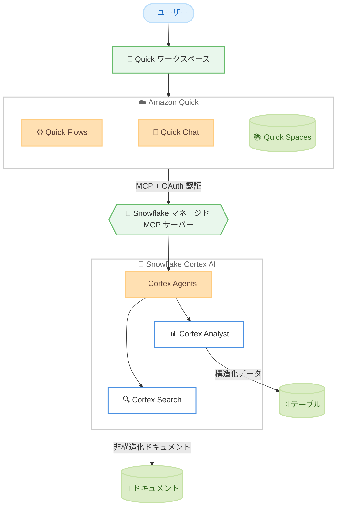

# Amazon Quick - Snowflake Cortex AI 連携

**リリース日**: 2026 年 6 月 11 日
**サービス**: Amazon Quick
**機能**: Snowflake Cortex AI との連携 (Model Context Protocol 経由)

📊 [このアップデートのインフォグラフィックを見る](https://takech9203.github.io/aws-news-summary/20260611-amazon-quick-snowflake-cortex-ai.html)
<!-- INFOGRAPHIC_BASE_URL は環境変数から取得 -->

## 概要

Amazon Quick が Model Context Protocol (MCP) を通じて Snowflake Cortex AI と連携できるようになりました。これにより、チームは自然言語で Snowflake のデータやドキュメントに対して問い合わせを行い、複数ステップのワークフローを Quick ワークスペース内で直接自動化できます。

接続のセットアップには、Snowflake のマネージド MCP サーバーと OAuth 認証を使用します。接続後は、Cortex Analyst を通じて構造化データに対して質問したり、Cortex Search を通じて非構造化ドキュメントからインサイトを取得したりできます。さらに、Quick の Flows 機能で Snowflake Cortex Agents をオーケストレーションし、一貫した構造化出力を持つ反復可能でガバナンスの効いたワークフローを構築できます。

同じ MCP 接続は Quick Chat やその他の Quick 機能からも利用できます。ユーザーはアドホックなフォローアップ質問を行ったり、Snowflake データを会話形式で探索したりできます。Quick は関連するプロンプトを Snowflake Cortex AI に自動的にルーティングし、Quick Spaces に保存された企業ナレッジとあわせて文脈に沿った回答を返します。この連携により、構造化されたプロセスの厳密さと会話型インターフェイスの柔軟性の両方を実現できます。

**アップデート前の課題**

- 以前は Snowflake のデータを Quick から自然言語で問い合わせるには、カスタムコネクタの開発が必要でした
- 以前は構造化データと非構造化ドキュメントの両方にまたがる多段階の業務プロセスを、一貫した出力で自動化することが困難でした
- 以前は Snowflake Cortex AI の分析能力を Quick の会話型インターフェイスやワークフローと組み合わせて活用する手段がありませんでした

**アップデート後の改善**

- 今回のアップデートにより、Snowflake のマネージド MCP サーバーと OAuth 認証を使うだけで、カスタムコネクタなしに連携が可能になりました
- 今回のアップデートにより、Quick Flows で Cortex Agents をオーケストレーションし、監査に耐えうる一貫した構造化出力を生成できるようになりました
- 今回のアップデートにより、Quick Chat や Quick Spaces のナレッジと Snowflake のデータを統合した、文脈に沿った回答が得られるようになりました

## アーキテクチャ図



Amazon Quick は MCP と OAuth 認証を通じて Snowflake のマネージド MCP サーバーに接続し、Cortex Agents をオーケストレーションして構造化データ (Cortex Analyst) と非構造化ドキュメント (Cortex Search) の両方を活用します。

## サービスアップデートの詳細

### 主要機能

1. **MCP による Snowflake Cortex AI 連携**
   - Model Context Protocol (MCP) を介して Amazon Quick と Snowflake Cortex AI を接続します
   - Snowflake のマネージド MCP サーバーと OAuth 認証を使用して接続をセットアップします
   - カスタムコネクタを開発する必要がなく、OAuth 認証により企業レベルのセキュリティを維持します

2. **Cortex Analyst による構造化データの問い合わせ**
   - Snowflake 内の構造化データに対して自然言語で質問できます
   - セマンティックビューを通じてテーブルやトランザクションデータを参照します

3. **Cortex Search による非構造化ドキュメントの検索**
   - 非構造化ドキュメントからインサイトを取得します
   - コンプライアンスマニュアルや過去のノートなどのドキュメントを対象に検索できます

4. **Quick Flows による Cortex Agents のオーケストレーション**
   - 反復可能でガバナンスの効いたワークフローを構築できます
   - 一貫した構造化出力を生成し、実行者が誰であっても同じ手順を強制できます
   - 条件分岐により、特定の条件に応じた処理のルーティングが可能です

5. **Quick Chat および Quick Spaces との統合**
   - 同じ MCP 接続を Quick Chat やその他の Quick 機能から利用できます
   - Quick が関連プロンプトを Snowflake Cortex AI に自動ルーティングします
   - Quick Spaces に保存された企業ナレッジとあわせて文脈に沿った回答を返します

## 技術仕様

### 連携の構成要素

| 項目 | 詳細 |
|------|------|
| プロトコル | Model Context Protocol (MCP) |
| 認証方式 | OAuth (Snowflake 側で SECURITY INTEGRATION を作成) |
| MCP サーバー | Snowflake マネージド MCP サーバー |
| 構造化データ分析 | Snowflake Cortex Analyst |
| 非構造化ドキュメント検索 | Snowflake Cortex Search |
| オーケストレーション | Snowflake Cortex Agents + Amazon Quick Flows |
| 会話型インターフェイス | Quick Chat |
| ナレッジ統合 | Quick Spaces |

### 認証に関する注意点

ブログによると、Snowflake の MCP サーバーは OAuth 2.0 をサポートしていますが、Dynamic Client Registration はサポートしていません。そのため、Amazon Quick 側で OAuth の設定を手動で構成する必要があります。

## 設定方法

ブログ記事「Automate AML alert triage with Amazon Quick and Snowflake Cortex AI」で紹介されている、AML (マネーロンダリング対策) アラートトリアージの自動化を例とした設定手順は次のとおりです。

### 前提条件

1. Amazon Quick が利用可能なアカウントとワークスペース
2. Cortex Analyst、Cortex Search、Cortex Agents が利用可能な Snowflake 環境
3. Snowflake 側で OAuth 用の SECURITY INTEGRATION を作成する権限

### 手順

#### ステップ1: Snowflake 側でデータと Cortex を準備

- Cortex Analyst 向けに、アラート、トランザクション、顧客、口座などのデータをモデル化したセマンティックビューを準備します
- Cortex Search サービスを構築し、コンプライアンスドキュメントをインデックス化します
- 上記 2 つのツールをオーケストレーションする Cortex Agent を作成します

これにより、構造化データと非構造化ドキュメントの両方を扱う Cortex Agent が用意されます。

#### ステップ2: Snowflake マネージド MCP サーバーと OAuth を設定

- Cortex Agent とツールを外部の MCP クライアントに公開するマネージド MCP サーバーを作成します
- Snowflake OAuth (SECURITY INTEGRATION) を作成し、Amazon Quick のリダイレクト URL を登録します
- クライアント ID、シークレット、エンドポイントを取得します
- 専用ロールに最小権限 (USAGE / SELECT) を付与します

これにより、最小権限の原則に基づいて Amazon Quick から Cortex Agent へ安全にアクセスできるようになります。

#### ステップ3: Amazon Quick で MCP サーバーを登録し Flow を構築

- Amazon Quick にエンドポイントを入力し、OAuth を手動で構成してツールを検出します
- 入力ステップ、条件分岐を含む推論グループ、出力ステップ、フォローアップ用チャットで構成される Quick Flow を構築します
- Flow を公開してチームと共有し、サンプルデータでテストして調整します

Flows は実行ごとに同一の手順を強制するため、決定論的で監査に耐えうる結果を生成できます。

## メリット

### ビジネス面

- **業務時間の短縮**: ブログの検証環境では、AML アラートの調査時間が 30 - 90 分から 5 分未満に短縮されました (結果は環境により異なります)
- **一貫性とガバナンス**: Flows により、誰が実行しても同一の手順で監査可能な結果を得られます
- **既存ナレッジの活用**: Quick Spaces の企業ナレッジと Snowflake のデータを組み合わせた回答が得られます

### 技術面

- **カスタムコネクタ不要**: MCP の標準化された呼び出しにより、独自コネクタの開発が不要になります
- **エンタープライズセキュリティ**: OAuth 認証と最小権限ロールにより、データは Snowflake のセキュリティ境界内に保持されます
- **構造化データと非構造化データの統合**: Cortex Analyst と Cortex Search を 1 つのエージェント経由で活用できます

## デメリット・制約事項

### 制限事項

- Snowflake の MCP サーバーは OAuth 2.0 の Dynamic Client Registration をサポートしていないため、Amazon Quick 側で OAuth を手動構成する必要があります
- Cortex Analyst、Cortex Search、Cortex Agents が利用可能な Snowflake 環境が前提となります

### 考慮すべき点

- ブログでは、本ソリューションは「調査の加速ツールであり、自動的な意思決定者ではない」と強調されています。SAR (疑わしい取引の届出) の提出やケースのクローズは、必ず人間のアナリストがレビューする必要があります
- セマンティックビューや Cortex Search のインデックス、システムインストラクションの設計品質が、出力品質に大きく影響します

## ユースケース

### ユースケース1: AML アラートトリアージの自動化

**シナリオ**: 金融機関のコンプライアンスチームが、大量の AML アラート (その 90 - 95% は誤検知) を手作業で調査している状況です。

**実装例**:
```
Quick Flow:
  入力ステップ: アラート ID を受け取る
  推論グループ: Snowflake Cortex Agent を呼び出し
    - Cortex Analyst: トランザクション・顧客データを分析
    - Cortex Search: コンプライアンスドキュメントを参照
    条件分岐: CRITICAL アラートはレビュー用にルーティング
  出力ステップ: 8 セクションの調査ブリーフを生成
  フォローアップ: Quick Chat で追加質問
```

**効果**: アラートサマリー、取引パターン、顧客プロファイル、リスク評価、ドラフトナラティブなどを含む構造化された調査ブリーフを自動生成し、調査時間を大幅に短縮します。

### ユースケース2: 構造化データの会話型分析

**シナリオ**: ビジネスアナリストが、Snowflake に格納された売上データを Quick Chat からアドホックに探索したい状況です。

**実装例**:
```
Quick Chat:
  「今四半期の地域別売上トップ 5 を教えて」
  → Quick が Cortex Analyst にルーティング
  → 構造化データの集計結果を返す
```

**効果**: SQL を書くことなく自然言語で Snowflake データを探索でき、Quick Spaces のナレッジとあわせた文脈ある回答が得られます。

### ユースケース3: 構造化・非構造化データを横断する定型業務

**シナリオ**: 複数ステップで、構造化データと社内ドキュメントの両方を参照する定型レポート作成業務がある状況です。

**実装例**:
```
Quick Flow:
  Cortex Agent をアクションステップとして呼び出し
  → Cortex Analyst で数値を集計
  → Cortex Search で関連ポリシーを参照
  → 一貫した構造化フォーマットで出力
```

**効果**: 反復可能でガバナンスの効いたワークフローにより、品質を一定に保ったレポートを生成できます。

## 料金

What's New ページおよびブログには、本連携機能に固有の追加料金に関する記載はありません。Amazon Quick の無料トライアルが提供されています。Amazon Quick の利用料金、および Snowflake Cortex AI (Cortex Analyst、Cortex Search、Cortex Agents) の利用に伴う Snowflake 側のコンピューティング料金については、それぞれの料金ページをご確認ください。

## 利用可能リージョン

Snowflake Cortex AI と Amazon Quick の連携は、Amazon Quick が利用可能なすべての AWS リージョンで利用できます。利用可能なリージョンの一覧は、[Amazon Quick のリージョンドキュメント](https://docs.aws.amazon.com/quick/latest/userguide/regions.html)を参照してください。

## 関連サービス・機能

- **Snowflake Cortex AI**: Cortex Analyst、Cortex Search、Cortex Agents を通じて構造化・非構造化データの分析を提供する Snowflake の AI 機能
- **Model Context Protocol (MCP)**: Amazon Quick と Snowflake を標準化された方法で接続するためのプロトコル
- **Amazon Quick Flows**: 反復可能でガバナンスの効いたワークフローを構築するオーケストレーション機能
- **Amazon Quick Spaces**: 企業ナレッジを保存し、回答に文脈を付与するためのナレッジストア

## 参考リンク

- 📊 [インフォグラフィック](https://takech9203.github.io/aws-news-summary/20260611-amazon-quick-snowflake-cortex-ai.html)
- [公式発表 (What's New)](https://aws.amazon.com/about-aws/whats-new/2026/06/amazon-quick-snowflake-cortex-ai/)
- [AWS Blog: Automate AML alert triage with Amazon Quick and Snowflake Cortex AI](https://aws.amazon.com/blogs/machine-learning/automate-aml-alert-triage-with-amazon-quick-and-snowflake-cortex-ai/)
- [Amazon Quick Integrations ページ](https://aws.amazon.com/quick/integrations/)
- [Amazon Quick 公式サイト](https://aws.amazon.com/quick/)
- [Amazon Quick 利用可能リージョン](https://docs.aws.amazon.com/quick/latest/userguide/regions.html)

## まとめ

本アップデートにより、Amazon Quick は MCP と OAuth を介して Snowflake Cortex AI と連携し、カスタムコネクタなしで構造化・非構造化データを横断する自動ワークフローと会話型分析を実現できるようになりました。AML アラートトリアージのように定型的かつ監査が求められる業務では、Quick Flows による一貫した構造化出力が特に有効です。まずは Amazon Quick の無料トライアルと統合ページを確認し、自社の Snowflake データを用いた連携を試すことを推奨します。
