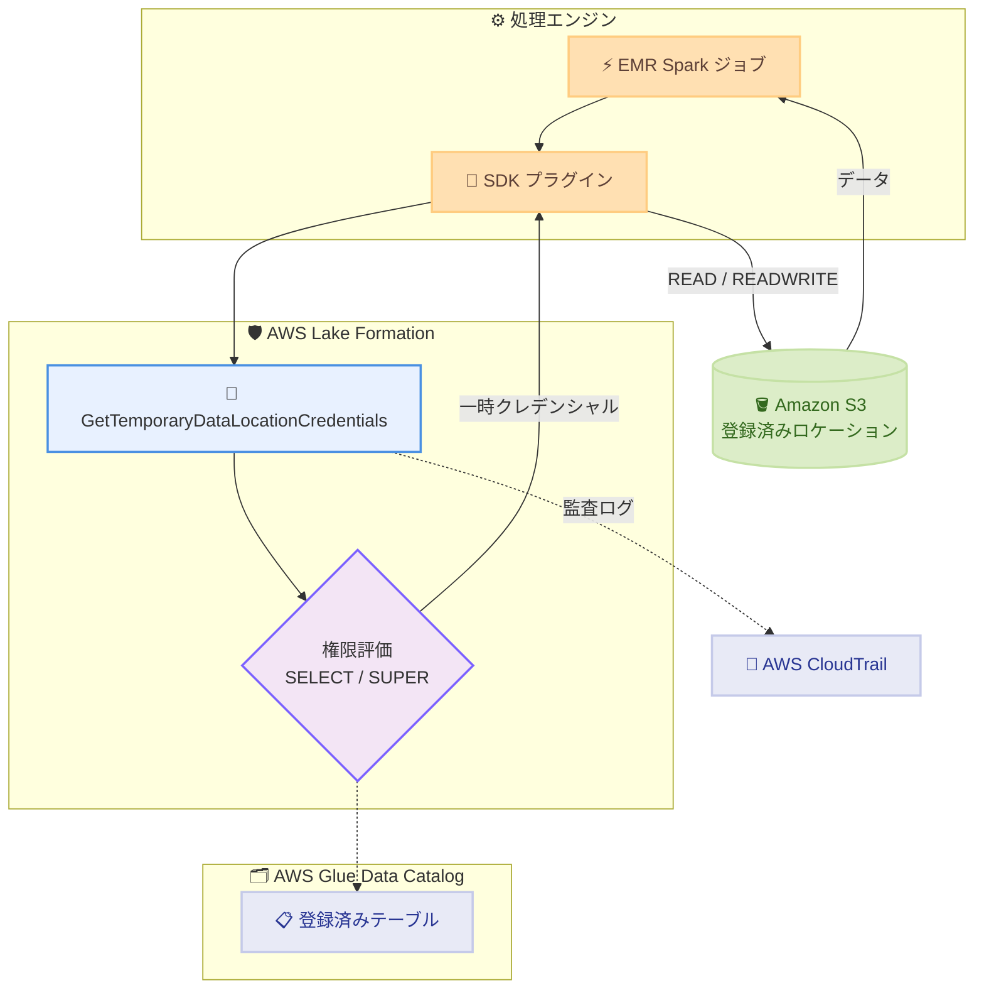

# AWS Lake Formation - Amazon S3 上の基礎データへのアクセス拡張

**リリース日**: 2026 年 6 月 11 日
**サービス**: AWS Lake Formation
**機能**: テーブル権限による Amazon S3 基礎データファイルへの直接アクセス

📊 [このアップデートのインフォグラフィックを見る](https://takech9203.github.io/aws-news-summary/20260611-aws-lake-formation-access-data-amazon-s3.html)
<!-- INFOGRAPHIC_BASE_URL は環境変数から取得 -->

## 概要

AWS Lake Formation は、AWS Glue Data Catalog に登録されたテーブルについて、その基礎となる Amazon S3 上のデータファイルを直接読み書きできる機能を追加しました。これにより、SQL クエリと直接的なファイルアクセスの両方に対して、既存の Lake Formation テーブル権限という単一の権限セットを利用できます。

この機能では、Lake Formation がテーブル権限に基づいて、登録済みの S3 ロケーションに対する一時的でスコープ制限されたクレデンシャルを発行します。SELECT 権限は読み取りアクセスを、SUPER 権限は読み取りと書き込みの両方のアクセスを付与します。この機能は Amazon EMR 7.13 以降に組み込まれており、モデルトレーニング、特徴量エンジニアリング、データ品質問題のデバッグといったファイルレベルのアクセスを必要とするタスクで、Spark ジョブから直接データファイルにアクセスできます。

データサイエンティストやデータエンジニアが対象ユーザーです。Apache Spark や Trino アプリケーションを API または AWS が提供するオープンソースプラグインを通じて統合することもできます。すべてのアクセスは AWS CloudTrail に記録されるため、テーブルに対する SQL 操作とファイルベース操作にまたがる統合された監査証跡が得られます。

**アップデート前の課題**

- 以前は、Lake Formation のテーブル権限は SQL クエリ (Athena、EMR、Redshift など) を通じたアクセスにのみ適用され、基礎となる S3 ファイルへの直接アクセスには別の仕組みが必要でした。
- 以前は、Spark ジョブなどからファイルレベルでデータにアクセスする場合、S3 バケットポリシーや IAM ロールを個別に設定し、Lake Formation の権限とは別に管理する必要がありました。
- 以前は、SQL 操作とファイルベース操作の監査証跡が分散しており、誰がどのデータにアクセスしたかを一元的に把握しにくい状況でした。

**アップデート後の改善**

- 今回のアップデートにより、既存の Lake Formation テーブル権限を使ってファイルレベルのアクセスが可能になり、SQL とファイルアクセスで単一の権限セットを利用できるようになりました。
- 今回のアップデートにより、別途 S3 バケットポリシーやクロスアカウント IAM ロールを設定することなく、一時的でスコープ制限されたクレデンシャルによる安全なアクセスが可能になりました。
- 今回のアップデートにより、すべてのクレデンシャル発行が CloudTrail に記録され、SQL とファイルベースの操作にまたがる統合監査証跡が実現しました。

## アーキテクチャ図



EMR の Spark ジョブが S3 リクエストを発行すると、SDK プラグインがそれを傍受し、Lake Formation の API を呼び出してテーブル権限を評価し、スコープ制限された一時クレデンシャルを取得して S3 にアクセスする流れを示しています。

## サービスアップデートの詳細

### 主要機能

1. **テーブル権限に基づくクレデンシャル発行**
   - アプリケーションが Data Catalog テーブルの基礎となる S3 ファイルへのアクセスを要求すると、Lake Formation が呼び出し元の既存のテーブルレベル権限を評価します。
   - 認可された場合、そのテーブルの登録済みロケーションに対して、短命でスコープ制限された S3 クレデンシャルを返します。
   - SELECT 権限は READ クレデンシャルを、SUPER 権限は READWRITE クレデンシャルを発行します。

2. **Amazon EMR への組み込みサポート**
   - Amazon EMR 7.13 以降 (EMR on EC2、EMR on EKS、EMR Serverless) にこの機能が組み込まれています。
   - 機能フラグ `fs.s3a.lakeformation.access.grants.enabled` を有効にすると、標準のファイルベース API で即座に読み書きが可能になります。
   - モデルトレーニング、特徴量エンジニアリング、データ品質のデバッグなどのタスクで Spark から直接データにアクセスできます。

3. **オープンソースプラグインによる統合**
   - Apache Spark や Trino アプリケーションを API または AWS 提供のオープンソースプラグインを通じて統合できます。
   - プラグインは GitHub の `aws-lakeformation-accessgrants-plugin-java-v2` で公開されています。

4. **統合された監査証跡**
   - すべてのクレデンシャル発行操作が CloudTrail に記録されます。
   - 記録内容にはプリンシパル (ユーザーまたはロール)、タイムスタンプ、S3 ロケーション、関連する Glue テーブルが含まれます。
   - 発行されたクレデンシャルを使った後続の S3 API 呼び出しも S3 データイベントとして記録され、Lake Formation の権限付与に紐づけられます。

## 技術仕様

### 権限とクレデンシャルの対応

| Lake Formation 権限 | 発行されるクレデンシャル | アクセス内容 |
|------|------|------|
| SELECT | READ | S3 データファイルの読み取り |
| SUPER | READWRITE | S3 データファイルの読み取りと書き込み |

### 対応エンジン

| エンジン | 必要バージョン |
|------|------|
| Amazon EMR on Amazon EC2 | EMR 7.13 以降 |
| Amazon EMR on EKS | EMR 7.13 以降 |
| Amazon EMR Serverless | EMR 7.13 以降 |
| Apache Spark / Trino | API またはオープンソースプラグイン経由 |

### ネストされた S3 ロケーションの挙動

| アクセス対象 | 適用される権限 |
|------|------|
| `s3://bucket` | バケットレベルで登録されたテーブルの権限 |
| `s3://bucket/folder1` | そのパスに登録されたテーブルの権限 |
| 登録テーブルのないフォルダ | 最も近い親の登録済みロケーションの権限 |
| 同一ロケーションに複数テーブル登録 | 権限の競合によりエラー |

### API 変更履歴

| 日付 | サービス | 変更内容 |
|------|----------|----------|
| 2026/06/11 | AWS Lake Formation | `GetTemporaryDataLocationCredentials` API による S3 ロケーション向け一時クレデンシャル発行 |

## 設定方法

### 前提条件

1. Data Catalog にテーブルをカタログ化し、S3 ロケーションを Lake Formation に登録する (S3 バケットオーナーアカウントを指定)。
2. データサイエンティストやアプリケーションに対し、テーブルへの SELECT または SUPER 権限を付与する。Athena や EMR で Lake Formation を既に利用している場合は設定済みです。
3. Full Table Access を伴うアプリケーション統合 (Application Integration with Full Table Access) を有効化し、登録済みテーブルロケーションへのクレデンシャル発行を許可する。

### 手順

#### ステップ1: 機能フラグの有効化

```
fs.s3a.lakeformation.access.grants.enabled = true
```

対応エンジン (EMR 7.13 以降) でこのフラグを有効にすることで、Lake Formation ベースの S3 ロケーションアクセスが有効になります。

#### ステップ2: Spark ジョブからのデータアクセス

```python
# 生データの読み取り (Lake Formation ベースの S3 ロケーションアクセス)
raw_df = spark.read.json("s3://finance-datalake/raw/transactions/dt=2024-03-21/")

# ガバナンス対象データの読み取り
transactions_df = spark.read.parquet("s3://data-lake/transactions/year=2026/")

# 処理済みデータの書き込み
processed_df.write \
    .mode("append") \
    .partitionBy("transaction_date") \
    .parquet("s3://finance-datalake/processed/transactions/")
```

標準のファイルベース API をそのまま使用します。プラグインが S3 リクエストを傍受し、Lake Formation の権限に基づいてクレデンシャルを取得するため、追加のコード変更は不要です。

## メリット

### ビジネス面

- **権限管理の一元化**: SQL アクセスとファイルアクセスで同じ Lake Formation 権限を利用でき、管理対象の権限が統合されます。
- **コンプライアンス強化**: すべてのアクセスが CloudTrail に記録され、統合された監査証跡が得られます。
- **追加コストなし**: 追加料金なしで利用できます。

### 技術面

- **設定の簡素化**: 別途 S3 バケットポリシーやクロスアカウント IAM ロールを設定する必要がありません。
- **最小権限の実現**: 一時的でスコープ制限されたクレデンシャルにより、安全なアクセスを実現します。
- **既存ワークフローとの親和性**: 標準のファイルベース API をそのまま利用でき、コード変更が不要です。

## デメリット・制約事項

### 制限事項

- クレデンシャル発行は、呼び出し元がフルテーブルアクセス (行・列フィルタなしの全列に対する SELECT) を持つ場合のみ行われます。行レベルや列レベルのフィルタが適用されているテーブルでは、引き続き Athena、EMR、AWS Glue、Amazon Redshift などの信頼されたエンジンを使用する必要があります。
- S3 ロケーション向けのクレデンシャル発行はクロスリージョンではサポートされません。
- クレデンシャル発行は、テーブルのプライマリロケーションとして含まれる S3 ロケーションに対してサポートされます。

### 考慮すべき点

- 同一ロケーションに複数のテーブルが登録されている場合、権限の競合によりエラーとなるため、ロケーション設計に注意が必要です。
- フルテーブルアクセスを前提とするため、きめ細かいアクセス制御 (行・列レベル) が必要なシナリオでは従来のクエリエンジン経由のアクセスを併用する必要があります。

## ユースケース

### ユースケース1: 機械学習のモデルトレーニング

**シナリオ**: データサイエンティストが EMR 上の Spark ジョブで、データレイクの大量の Parquet ファイルを直接読み込んでモデルをトレーニングしたい。

**実装例**:
```python
training_df = spark.read.parquet("s3://data-lake/features/year=2026/")
model = train_model(training_df)
```

**効果**: 既存のテーブル SELECT 権限のみでファイルへ直接アクセスでき、別途 IAM ロール設定が不要になります。

### ユースケース2: ETL パイプラインでの読み書き

**シナリオ**: データエンジニアが生データを読み込んで変換し、処理済みデータを別の S3 ロケーションに書き戻す ETL パイプラインを構築したい。

**実装例**:
```python
raw_df = spark.read.json("s3://finance-datalake/raw/transactions/")
processed_df.write.mode("append").parquet("s3://finance-datalake/processed/transactions/")
```

**効果**: SUPER 権限による READWRITE クレデンシャルで、読み取りと書き込みを統一された権限で実行できます。

### ユースケース3: クロスアカウントでのデータ共有アクセス

**シナリオ**: データを別の AWS アカウントと Lake Formation で共有し、受信側アカウントが基礎となる S3 データファイルに直接アクセスしたい。

**実装例**:
```python
# 共有テーブルのリソースリンク経由でアクセス
shared_df = spark.read.parquet("s3://producer-data-lake/shared/dataset/")
```

**効果**: 個別の S3 バケットポリシーやクロスアカウント IAM ロールなしで、Lake Formation 権限に基づくシームレスなクロスアカウントアクセスを実現します。

## 料金

この機能は、AWS Lake Formation が利用可能なすべての AWS リージョンで追加料金なしで利用できます。EMR や S3 など、利用する基盤サービスの通常料金は別途発生します。

## 利用可能リージョン

AWS Lake Formation が利用可能なすべての AWS リージョンで利用できます。ただし、S3 ロケーション向けのクレデンシャル発行はクロスリージョンではサポートされません。

## 関連サービス・機能

- **AWS Glue Data Catalog**: テーブルのメタデータを管理し、登録済み S3 ロケーションとの紐付けを提供します。
- **Amazon EMR**: 7.13 以降でこの機能が組み込まれ、Spark ジョブから直接データファイルにアクセスできます。
- **Amazon S3**: 基礎となるデータファイルの保存先で、Lake Formation に登録されたロケーションが対象です。
- **AWS CloudTrail**: すべてのクレデンシャル発行操作と後続の S3 データイベントを記録し、統合監査証跡を提供します。

## 参考リンク

- 📊 [インフォグラフィック](https://takech9203.github.io/aws-news-summary/20260611-aws-lake-formation-access-data-amazon-s3.html)
- [公式発表 (What's New)](https://aws.amazon.com/about-aws/whats-new/2026/06/aws-lake-formation-access-data-amazon-s3)
- [Lake Formation ドキュメント](https://docs.aws.amazon.com/lake-formation/latest/dg/accessing-s3-locations.html)
- [EMR ドキュメント](https://docs.aws.amazon.com/emr/latest/ManagementGuide/lake-formation-path-based-credential-vending.html)
- [API リファレンス](https://docs.aws.amazon.com/boto3/latest/reference/services/lakeformation/client/get_temporary_data_location_credentials.html)
- [オープンソースプラグイン](https://github.com/aws/aws-lakeformation-accessgrants-plugin-java-v2)

## まとめ

このアップデートにより、Lake Formation のテーブル権限が SQL クエリだけでなく基礎となる S3 ファイルへの直接アクセスにも適用され、権限管理と監査が一元化されました。機械学習や ETL でファイルレベルのアクセスを行うデータチームは、EMR 7.13 以降への更新と機能フラグの有効化を検討し、既存の IAM ベースのアクセス設定を Lake Formation 権限に統合することを推奨します。
