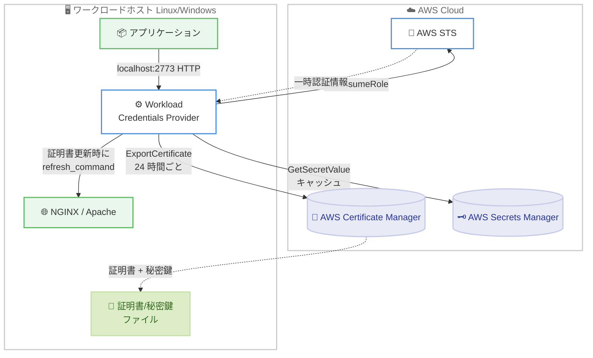

# AWS Workload Credentials Provider - 証明書とシークレットの自動配布

**リリース日**: 2026 年 6 月 11 日
**サービス**: AWS Certificate Manager (ACM) / AWS Secrets Manager
**機能**: AWS Workload Credentials Provider

📊 [このアップデートのインフォグラフィックを見る](https://takech9203.github.io/aws-news-summary/20260611-aws-workload-credentials-provider.html)
<!-- INFOGRAPHIC_BASE_URL は環境変数から取得 -->

## 概要

AWS は、AWS Workload Credentials Provider を発表しました。これは軽量なクライアントサイドのプロバイダーで、AWS Certificate Manager (ACM) からエクスポートした証明書のデプロイと、AWS Secrets Manager のシークレットのローカルキャッシュを、AWS および非 AWS のワークロード全体で自動化します。

このプロバイダーは、証明書 ARN を指定し、ファイルパスやサーバーのリロード動作などのオプションを設定するだけで、証明書のエクスポートとデプロイを自動的に処理します。Windows と Linux 上でシステムサービスとして動作し、Apache および NGINX の Web サーバーに対応します。シークレットのキャッシュ機能については、既存の AWS Secrets Manager Agent との完全な後方互換性を維持しており、Secrets Manager Agent はこのプロバイダーへと発展した位置づけになります。

このプロバイダーはオープンソースとして GitHub で公開されており、すべての AWS リージョンで利用できます。証明書とシークレットの両方を単一のプロバイダーで配布、自動化できるため、TLS 証明書のローテーション運用を抱える幅広いワークロードが対象ユーザーとなります。

**アップデート前の課題**

公開証明書の有効期間が CA/Browser Forum (CA/B) の規定に従って短縮されつつあるなか、証明書の更新と再配布を継続的に行う必要が高まっていました。

- 以前は、ACM から公開証明書またはプライベート証明書をエクスポートする際に、Amazon EventBridge を使って更新を検知し、更新後の証明書をデプロイするカスタム自動化を独自に構築する必要がありました
- 公開証明書の有効期間が短縮されるなか、こうしたカスタム自動化は大規模環境で保守が難しくなる傾向がありました
- 証明書とシークレットを配布する仕組みが個別に存在し、運用が分散していました

**アップデート後の改善**

- 今回のアップデートにより、証明書 ARN とファイルパス、リロードコマンドを設定するだけで、証明書のエクスポートとデプロイが自動化され、カスタム自動化の構築が不要になりました
- 証明書とシークレットの両方を単一のプロバイダーで配布、自動化できるようになりました
- 24 時間ごとの定期的なリフレッシュにより、有効期間が短い証明書の更新運用が大規模環境でも継続的に行えるようになりました

## アーキテクチャ図



ワークロードホスト上のプロバイダーが IAM ロールを引き受けて ACM から証明書をエクスポートし、ローカルにファイルとして書き込んだうえで Web サーバーをリロードします。同時に、アプリケーションは localhost 経由で Secrets Manager のシークレットをキャッシュ付きで取得できます。

## サービスアップデートの詳細

### 主要機能

1. **証明書の自動エクスポートとデプロイ (ACM capability)**
   - スケジューラーが各証明書を 24 時間ごとにリフレッシュし、ACM から証明書と秘密鍵をエクスポートします
   - ディスク上のファイルと内容を比較し、変更があった場合のみ新しいファイルを書き込みます
   - ファイルが更新されたときのみ `refresh_command` を実行するため、不要なリロードを回避します
   - システム起動時とサービス開始直後に初回リフレッシュを実行し、フリート全体で同時起動した際の API 呼び出し集中を避けるためにランダムなジッターを加えます

2. **シークレットのローカルキャッシュ (Secrets Manager capability)**
   - localhost の HTTP インターフェイス (デフォルトポート 2773) を提供し、アプリケーションは Secrets Manager を直接呼び出す代わりにローカルからシークレットを取得できます
   - シークレットをメモリ内にキャッシュします (デフォルト TTL 300 秒、キャッシュサイズ 1000)
   - 既存の AWS Secrets Manager Agent と完全な後方互換性を維持しており、従来のフラットな設定キーもそのまま利用できます
   - SSRF 保護のためのトークン検証を備えています

3. **動的な設定リロードと安全な実行環境**
   - `acm reload` コマンドにより、再インストールなしで証明書の追加、削除、変更が可能です
   - 各証明書は独立したタスクとして実行されるため、1 つの証明書の失敗が他に影響しません
   - 専用の低権限ユーザーでシステムサービスとして動作し、証明書ファイルは制限された権限 (デフォルト 0600) で書き込まれます

## 技術仕様

### 動作環境とサポート対象

| 項目 | 詳細 |
|------|------|
| 対応 OS (証明書) | systemd の Linux (Amazon Linux 2023、Ubuntu 20.04 以降、RHEL 8 以降)、Windows Server 2016 以降 (PowerShell 5.1 以降) |
| 対応 Web サーバー | NGINX、Apache |
| 対応コンピューティング | Amazon EC2、AWS 認証情報を持つオンプレミスサーバー |
| シークレット capability のサポート | Lambda、ECS、EKS、EC2 |
| リフレッシュ間隔 | 24 時間 (証明書) |
| 証明書の最大数 | 50 (それぞれ独立して管理) |
| 設定ファイル形式 | TOML |
| ライセンス | オープンソース (GitHub: aws/aws-workload-credentials-provider) |

### 設定ファイル例 (NGINX, Linux)

```toml
[logging]
log_level = "info"
log_to_file = true

[capabilities.acm]
enabled = true

[[capabilities.acm.certificates]]
certificate_arn = "arn:aws:acm:us-west-2:123456789012:certificate/abcd1234-5678-90ab-cdef-EXAMPLE11111"
role_arn = "arn:aws:iam::123456789012:role/ACMExportRole"
certificate_path = "/etc/pki/tls/certs/example.com.crt"
private_key_path = "/etc/pki/tls/private/example.com.key"
chain_path = "/etc/pki/tls/certs/example.com-chain.pem"
refresh_command = "/usr/sbin/nginx -s reload"
```

`chain_path` を省略した場合、証明書チェーンは `certificate_path` のファイルに追記され、単一のファイルにフルチェーンを期待する Web サーバーと互換性のある形式になります。

### 設定リファレンス (主な項目)

| フィールド | 必須 | デフォルト | 説明 |
|------|------|------|------|
| capabilities.acm.enabled | いいえ | false | ACM capability の有効化 |
| certificates[].certificate_arn | はい | — | エクスポートする ACM 証明書の ARN |
| certificates[].role_arn | はい | — | ExportCertificate 呼び出しで引き受ける IAM ロール ARN |
| certificates[].certificate_path | はい | — | 証明書ファイルを書き込む絶対パス |
| certificates[].private_key_path | はい | — | 秘密鍵ファイルを書き込む絶対パス |
| certificates[].chain_path | いいえ | — | チェーンを書き込む絶対パス。省略時は certificate_path に追記 |
| certificates[].refresh_command | いいえ | — | 証明書更新後に実行するコマンド (絶対パス) |
| certificates[].key_permission | いいえ | 0600 | 秘密鍵ファイルの権限 |

### 必要な権限

プロバイダーのベース認証情報には、各証明書の `role_arn` を引き受ける権限が必要です。

```json
{
    "Effect": "Allow",
    "Action": "sts:AssumeRole",
    "Resource": "arn:aws:iam::123456789012:role/ACMExportRole"
}
```

引き受ける側のロールには、証明書をエクスポートする権限が必要です。

```json
{
    "Version": "2012-10-17",
    "Statement": [
        {
            "Effect": "Allow",
            "Action": "acm:ExportCertificate",
            "Resource": "arn:aws:acm:us-west-2:123456789012:certificate/*"
        }
    ]
}
```

## 設定方法

### 前提条件

1. systemd を備えた Linux インスタンス、または Windows Server 2016 以降のインスタンス
2. ACM のエクスポート可能な証明書 (公開またはプライベート)
3. ACM のエクスポート権限を持つ IAM ロールと、インスタンス上で利用可能な AWS 認証情報

### 手順

#### ステップ1: プロバイダーのビルド

```bash
cargo build --release
```

Rust ツールチェーンを使ってソースからプロバイダーのバイナリをビルドします。生成された実行ファイルは `target/release/aws-workload-credentials-provider` に配置されます。事前ビルド済みのバイナリを利用することもできます。

#### ステップ2: 設定ファイルの作成とインストール

```bash
cd aws_workload_credentials_provider_common/configuration
sudo ./install --config /path/to/your/config.toml
```

証明書の詳細を記述した TOML 設定ファイルを作成し、インストールスクリプトを root で実行します。`--config` を指定すると、設定ファイルが `/etc/aws-workload-credentials-provider/config.toml` に自動的にコピーされます。

#### ステップ3: 動作確認と動的リロード

```bash
sudo systemctl status aws-workload-credentials-provider-acm
aws-workload-credentials-provider acm reload --config /path/to/new-config.toml
```

サービスの稼働状態を確認します。設定を変更する場合は `acm reload` を実行すると、新しい設定の検証、権限の更新、サービスの再起動が行われ、再インストールは不要です。

## メリット

### ビジネス面

- **運用負荷の削減**: EventBridge を使ったカスタム自動化の構築と保守が不要になり、証明書更新の運用コストを削減できます
- **コンプライアンス対応**: CA/B の規定による証明書有効期間の短縮に追従し、大規模環境でも継続的な証明書更新を維持できます
- **AWS 内外での統一運用**: AWS と非 AWS のワークロードを単一のプロバイダーで扱えるため、運用を標準化できます

### 技術面

- **自動化された証明書ライフサイクル**: 24 時間ごとのリフレッシュと、内容変更時のみのリロードにより、無駄のない更新が実現します
- **セキュアな実行**: 低権限ユーザーでの動作、制限されたファイル権限、シークレット取得時の SSRF 保護を備えています
- **後方互換性**: 既存の AWS Secrets Manager Agent からの移行が容易で、従来の設定をそのまま利用できます

## デメリット・制約事項

### 制限事項

- 証明書機能は ACM のエクスポート可能な証明書のみが対象です
- 証明書機能はコンテナや Lambda ではサポートされず、EC2 とオンプレミスホストが対象です
- 管理できる証明書は最大 50 個までです
- シークレットのキャッシュはメモリ内のため、再起動でリセットされ、TTL 内にローテーションされた場合は古い値が返る可能性があります (`refreshNow=true` で回避可能)

### 考慮すべき点

- Linux では `refresh_command` が `sudo` 経由で実行されるため、インストーラーが生成する sudoers エントリと `/etc/sudoers` の include 設定を確認する必要があります
- バイナリのビルドには Rust ツールチェーンが必要です (事前ビルド済みバイナリの利用も可能)
- ExportCertificate の呼び出しは CloudTrail に記録され、ユーザーエージェントに `aws-workload-credentials-provider` が含まれます

## ユースケース

### ユースケース1: 短命な公開証明書の自動更新

**シナリオ**: CA/B の規定により有効期間が短縮された公開 TLS 証明書を、複数の EC2 上の NGINX に継続的に配布したい。

**実装例**:
```toml
[[capabilities.acm.certificates]]
certificate_arn = "arn:aws:acm:us-west-2:123456789012:certificate/EXAMPLE"
role_arn = "arn:aws:iam::123456789012:role/ACMExportRole"
certificate_path = "/etc/pki/tls/certs/example.com.crt"
private_key_path = "/etc/pki/tls/private/example.com.key"
refresh_command = "/usr/sbin/nginx -s reload"
```

**効果**: EventBridge ベースのカスタム自動化を構築せずに、証明書の更新検知から配布、NGINX のリロードまでが自動化されます。

### ユースケース2: オンプレミスサーバーへの証明書配布

**シナリオ**: AWS 認証情報を持つオンプレミスの Apache サーバーで、ACM のプライベート証明書を利用したい。

**実装例**:
```toml
[[capabilities.acm.certificates]]
certificate_arn = "arn:aws:acm:us-west-2:123456789012:certificate/EXAMPLE"
role_arn = "arn:aws:iam::123456789012:role/ACMExportRole"
certificate_path = "/etc/ssl/certs/example.com.crt"
private_key_path = "/etc/ssl/private/example.com.key"
refresh_command = "/bin/systemctl reload httpd"
```

**効果**: AWS 外のワークロードでも、ACM 管理の証明書を自動的に取得、配布できます。

### ユースケース3: シークレット取得の集約

**シナリオ**: EC2 上のアプリケーションが Secrets Manager のシークレットを頻繁に取得しており、API 呼び出しとレイテンシを抑えたい。

**実装例**:
```bash
curl -H "X-Aws-Parameters-Secrets-Token: $(</var/run/awssmatoken)" \
  'http://localhost:2773/secretsmanager/get?secretId=<YOUR_SECRET_ID>'
```

**効果**: localhost のキャッシュ経由でシークレットを取得することで、Secrets Manager への直接呼び出しを削減し、レイテンシを低減します。

## 料金

AWS Workload Credentials Provider 自体はオープンソースで提供され、追加料金は発生しません。証明書のエクスポートやシークレットの取得に伴う ACM および AWS Secrets Manager の標準料金が適用されます。詳細は各サービスの料金ページを参照してください。

## 利用可能リージョン

すべての AWS リージョンで利用できます。

## 関連サービス・機能

- **AWS Certificate Manager (ACM)**: 証明書のエクスポート元。エクスポート可能な公開証明書とプライベート証明書に対応します
- **AWS Secrets Manager**: シークレットの取得元。本プロバイダーは Secrets Manager Agent の後継として後方互換を維持します
- **Amazon EventBridge**: 従来は証明書更新の検知に利用していたが、本プロバイダーにより不要になります
- **AWS IAM / AWS STS**: 証明書エクスポートのための IAM ロール引き受けに利用します

## 参考リンク

- 📊 [インフォグラフィック](https://takech9203.github.io/aws-news-summary/20260611-aws-workload-credentials-provider.html)
- [公式発表 (What's New)](https://aws.amazon.com/about-aws/whats-new/2026/06/aws-workload-credentials-provider/)
- [GitHub リポジトリ](https://github.com/aws/aws-workload-credentials-provider)
- [ドキュメント (ACM 証明書の自動化)](https://docs.aws.amazon.com/acm/latest/userguide/acm-certificate-automation.html)
- [ドキュメント (AWS Secrets Manager)](https://docs.aws.amazon.com/secretsmanager/)

## まとめ

AWS Workload Credentials Provider は、ACM 証明書のエクスポートとデプロイ、および Secrets Manager のシークレットキャッシュを単一の軽量プロバイダーで自動化します。CA/B の規定により証明書の有効期間が短縮されるなか、EventBridge ベースのカスタム自動化を置き換える運用負荷の低い選択肢となります。証明書のローテーション運用を抱える AWS 内外のワークロードでは、まず開発環境で TOML 設定と `refresh_command` の動作を検証することを推奨します。
