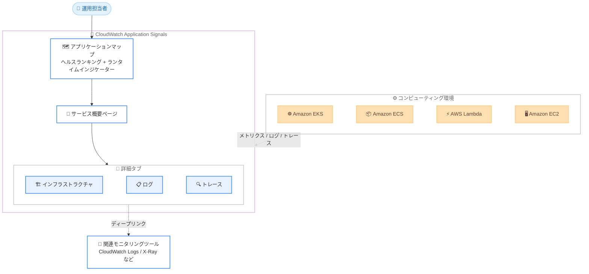

# Amazon CloudWatch Application Signals - インフラストラクチャ、ログ、トレースのコンテキスト対応

**リリース日**: 2026 年 6 月 11 日
**サービス**: Amazon CloudWatch Application Signals
**機能**: サービスヘルスランキングとインフラストラクチャ、ログ、トレースタブによる迅速なトラブルシューティング

📊 [このアップデートのインフォグラフィックを見る](https://takech9203.github.io/aws-news-summary/20260611-cloudwatch-application-signals-supports-infrastructure-logs-traces-context-for-faster-troubleshooting.html)
<!-- INFOGRAPHIC_BASE_URL は環境変数から取得 -->

## 概要

Amazon CloudWatch Application Signals は、アプリケーションマップ上での「サービスヘルスランキング」と、サービス概要ページ上の新しい「インフラストラクチャ」「ログ」「トレース」タブを導入しました。これらの機能により、運用担当者は不健全なサービスをトリアージし、基盤となるコンピューティング環境、ログスニペット、トレースの詳細を 1 か所で確認できます。複数のツールを切り替えることなく、根本原因を特定しやすくなります。

アプリケーションマップは、サービスをヘルス状態でランク付けし、Amazon EKS、Amazon ECS、AWS Lambda、Amazon EC2 のサービスノード上にランタイムインジケーターを表示するようになりました。あわせて、コンピューティングおよびランタイム環境、その構成要素、関連するモニタリングツールへのディープリンクを含むキュレートされたデフォルトメトリクスを表示する新しいインフラストラクチャタブが追加されました。

これらの機能は、Amazon CloudWatch Application Signals がサポートされているすべての AWS リージョンで利用可能です。可観測性 (オブザーバビリティ) の主要シグナルであるメトリクス、ログ、トレースを統合的に扱うことで、平均修復時間 (MTTR) の短縮を目指す運用チームやアプリケーション開発者が主な対象となります。

**アップデート前の課題**

- サービスのヘルス状態を確認した後、根本原因を調べるために X-Ray や CloudWatch Logs などの別ツールに切り替える必要があった
- 不健全なサービスがどれかを直感的に把握しづらく、トリアージに時間がかかった
- 基盤となるコンピューティング環境 (EKS、ECS、Lambda、EC2) の状態とアプリケーションのシグナルを関連付けて確認する手段が限られていた

**アップデート後の改善**

- アプリケーションマップ上でサービスがヘルス状態順にランク付けされ、問題のあるサービスを素早く特定できるようになった
- サービス概要ページのインフラストラクチャ、ログ、トレースタブにより、1 か所で根本原因の調査が可能になった
- サービスノード上のランタイムインジケーターと、関連モニタリングツールへのディープリンクにより、ツール間の移動が削減された

## アーキテクチャ図

コンピューティング環境から収集されたメトリクス、ログ、トレースが Application Signals に集約され、アプリケーションマップのヘルスランキングと、サービス概要ページの 3 つのタブを通じて運用担当者が単一の画面でトラブルシューティングを行えることを示しています。

## サービスアップデートの詳細

### 主要機能

1. **アプリケーションマップのサービスヘルスランキング**
   - アプリケーションマップ上のサービスをヘルス状態に基づいてランク付けする
   - 不健全なサービスを視覚的に素早く特定し、トリアージを効率化する
   - Amazon EKS、Amazon ECS、AWS Lambda、Amazon EC2 のサービスノードにランタイムインジケーターを表示する

2. **インフラストラクチャタブ**
   - サービスを支えるコンピューティングおよびランタイム環境とその構成要素を表示する
   - キュレートされたデフォルトメトリクスを表示し、環境の状態を一目で確認できる
   - 関連するモニタリングツールへのディープリンクを提供し、詳細な調査へ素早く遷移できる

3. **ログタブ**
   - サービスに関連するログスニペットをサービス概要ページ上で直接確認できる
   - 別ツールへ切り替えることなくログの内容を確認し、根本原因の手がかりを得られる

4. **トレースタブ**
   - サービスに関連するトレースの詳細をサービス概要ページ上で確認できる
   - メトリクス、ログと組み合わせて、リクエストの経路や遅延、エラーの発生箇所を特定できる

## 技術仕様

### サポート対象のコンピューティングプラットフォーム

| プラットフォーム | ランタイムインジケーター | 備考 |
|------|------|------|
| Amazon EKS | 対応 | サービス名とクラスター名を自動検出 |
| Amazon ECS | 対応 | サービスと環境の指定が必要な場合あり |
| AWS Lambda | 対応 | 関数単位でのシグナル収集 |
| Amazon EC2 | 対応 | CloudWatch エージェントと ADOT に対応 |

### 統合される可観測性シグナル

| シグナル | 表示場所 | 連携先 |
|------|------|------|
| インフラストラクチャメトリクス | インフラストラクチャタブ | CloudWatch メトリクス |
| ログ | ログタブ | Amazon CloudWatch Logs |
| トレース | トレースタブ | AWS X-Ray |

## 設定方法

### 前提条件

1. 対象のアプリケーションで CloudWatch Application Signals が有効化されていること
2. アプリケーションが Application Signals でサポートされる言語 (Java、Python、Node.js、.NET) で実装されていること
3. Amazon EKS、Amazon ECS、AWS Lambda、Amazon EC2 のいずれかでアプリケーションが稼働していること

### 手順

#### ステップ1: Application Signals を有効化する

CloudWatch コンソールから Application Signals を有効化するか、`StartDiscovery` API を使用してサービスディスカバリーを開始します。これにより、アプリケーションのトポロジーが自動的に検出されます。

#### ステップ2: アプリケーションマップでヘルス状態を確認する

CloudWatch コンソールでアプリケーションマップを開きます。サービスがヘルス状態順にランク付けされ、各サービスノードにはコンピューティングプラットフォームに応じたランタイムインジケーターが表示されます。不健全なサービスを選択すると、サービス概要ページに遷移します。

#### ステップ3: インフラストラクチャ、ログ、トレースタブで根本原因を調査する

サービス概要ページのインフラストラクチャタブでコンピューティング環境とデフォルトメトリクスを確認し、ログタブでログスニペットを、トレースタブでトレースの詳細を確認します。必要に応じてディープリンクから関連モニタリングツールへ遷移し、詳細な分析を行います。

## メリット

### ビジネス面

- **MTTR の短縮**: 不健全なサービスのトリアージと根本原因の調査を 1 か所で行えるため、障害の解決時間を短縮できる
- **運用負荷の軽減**: 複数のツールを切り替える必要がなくなり、運用担当者の作業効率が向上する
- **追加コストの抑制**: 既存の Application Signals 機能の拡張として提供され、新しいツールの導入が不要

### 技術面

- **コンテキストの一元化**: インフラストラクチャ、ログ、トレースを単一画面に集約し、相関分析がしやすい
- **マルチプラットフォーム対応**: EKS、ECS、Lambda、EC2 にわたって統一されたヘルス可視化を提供
- **ディープリンク連携**: CloudWatch Logs や X-Ray などの詳細ツールへ素早く遷移できる

## デメリット・制約事項

### 制限事項

- Application Signals の利用には CloudWatch の課金が発生する
- ランタイムインジケーターは Amazon EKS、Amazon ECS、AWS Lambda、Amazon EC2 でサポートされる
- Application Signals は Canada West (Calgary) を除くすべての商用リージョンでサポートされる

### 考慮すべき点

- サポート対象外のアーキテクチャでは、サービス名や環境名を手動で指定する必要がある場合がある
- ログやトレースの収集量に応じて CloudWatch Logs および X-Ray の料金が発生する

## ユースケース

### ユースケース1: マイクロサービス障害の迅速なトリアージ

**シナリオ**: 複数のマイクロサービスで構成された Amazon EKS 上のアプリケーションで、レイテンシーの上昇が報告された。

**効果**: アプリケーションマップでヘルス状態順にサービスを確認し、最も不健全なサービスを即座に特定。インフラストラクチャタブで該当ノードのリソース状況を確認し、原因を素早く絞り込める。

### ユースケース2: ログとトレースを併用した根本原因分析

**シナリオ**: AWS Lambda 関数でエラー率が上昇しているが、原因が不明。

**効果**: サービス概要ページのトレースタブで失敗したリクエストの経路を確認し、ログタブで対応するエラーログスニペットを参照。ツールを切り替えることなく根本原因を特定できる。

### ユースケース3: コンピューティング環境の健全性確認

**シナリオ**: Amazon ECS 上のサービスでパフォーマンス低下が発生している。

**効果**: インフラストラクチャタブでコンテナのコンピューティング環境とキュレートされたデフォルトメトリクスを確認し、ディープリンクから関連モニタリングツールへ遷移して詳細を分析できる。

## 料金

本機能は CloudWatch Application Signals の一部として提供されます。Application Signals の利用には CloudWatch の料金が適用され、収集されるシグナル (メトリクス、ログ、トレース) の量に応じて課金されます。詳細な料金は [Amazon CloudWatch 料金ページ](https://aws.amazon.com/cloudwatch/pricing/) を参照してください。

## 利用可能リージョン

Amazon CloudWatch Application Signals がサポートされているすべての AWS リージョンで利用可能です。Application Signals は Canada West (Calgary) を除くすべての商用リージョンでサポートされています。

## 関連サービス・機能

- **Amazon CloudWatch Logs**: ログタブで表示されるログスニペットの基盤となるログ管理サービス
- **AWS X-Ray**: トレースタブで表示されるトレースデータの収集・分析サービス
- **Amazon EKS / Amazon ECS / AWS Lambda / Amazon EC2**: ランタイムインジケーターとインフラストラクチャタブが対応するコンピューティングプラットフォーム

## 参考リンク

- 📊 [インフォグラフィック](https://takech9203.github.io/aws-news-summary/20260611-cloudwatch-application-signals-supports-infrastructure-logs-traces-context-for-faster-troubleshooting.html)
- [公式発表 (What's New)](https://aws.amazon.com/about-aws/whats-new/2026/06/cloudwatch-application-signals-supports%20infrastructure-logs-traces-context-for-faster%20troubleshooting/)
- [ドキュメント](https://docs.aws.amazon.com/AmazonCloudWatch/latest/monitoring/CloudWatch-Application-Monitoring-Sections.html)
- [料金ページ](https://aws.amazon.com/cloudwatch/pricing/)

## まとめ

このアップデートにより、CloudWatch Application Signals は不健全なサービスのトリアージから根本原因の特定までを単一の画面で完結できるようになり、運用チームの MTTR 短縮に貢献します。EKS、ECS、Lambda、EC2 を運用しているチームは、アプリケーションマップのヘルスランキングと新しいインフラストラクチャ、ログ、トレースタブを活用し、トラブルシューティングのワークフローを見直すことを推奨します。
