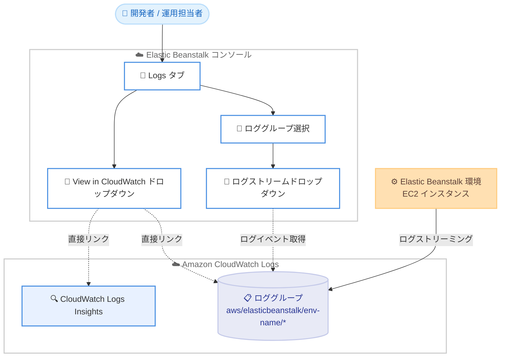

# AWS Elastic Beanstalk - コンソールの Logs タブで CloudWatch Logs を統合表示

**リリース日**: 2026年6月11日
**サービス**: AWS Elastic Beanstalk
**機能**: Elastic Beanstalk コンソールの Logs タブにおける CloudWatch Logs 統合

📊 [このアップデートのインフォグラフィックを見る](https://takech9203.github.io/aws-news-summary/20260611-elastic-beanstalk-cloudwatch-logs.html)
<!-- INFOGRAPHIC_BASE_URL は環境変数から取得 -->

## 概要

AWS Elastic Beanstalk は、Elastic Beanstalk コンソールの環境ごとの Logs タブに、Amazon CloudWatch Logs との統合機能を追加しました。これにより、お客様は Elastic Beanstalk コンソールを離れることなく、環境がストリーミングしている CloudWatch のログイベントを直接確認できるようになりました。

これまでお客様は、環境に関連するロググループやログストリームを参照するために CloudWatch コンソールへ移動する必要がありました。今回のアップデートにより、Logs タブ内でロググループの選択、ログストリームの切り替え、結果のフィルタリング、そして必要に応じた CloudWatch コンソールへの遷移までを一貫して行えます。

この機能は、運用中の Elastic Beanstalk 環境のトラブルシューティングやログ監視を日常的に行う開発者、運用担当者、ソリューションアーキテクトを対象としています。コンテキストスイッチを削減し、ログ調査の効率を高めることを目的としています。

**アップデート前の課題**

- 環境のログイベントを確認するには、Elastic Beanstalk コンソールから CloudWatch コンソールへ移動する必要があった
- 対象となるロググループやログストリームを CloudWatch コンソール上で自分で探し出す必要があった
- コンソール間の移動によりコンテキストスイッチが発生し、調査効率が低下していた

**アップデート後の改善**

- Elastic Beanstalk コンソールの Logs タブで CloudWatch のログイベントを直接閲覧できるようになった
- 環境がストリーミングしているロググループと、`aws/elasticbeanstalk/<env-name>/*` プレフィックスに一致するロググループが自動的に表示されるようになった
- ログストリームの切り替えやフィルタリング、CloudWatch Logs Insights への直接リンクが Logs タブから利用できるようになった

## アーキテクチャ図



Elastic Beanstalk 環境がストリーミングしたログを、コンソールの Logs タブから CloudWatch Logs を経由して直接参照する流れを示しています。

## サービスアップデートの詳細

### 主要機能

1. **Logs タブでのロググループ表示**
   - 環境がログをストリーミングしているロググループを Logs タブに表示する
   - 加えて、`aws/elasticbeanstalk/<env-name>/*` プレフィックスに一致するロググループも表示する
   - お客様は CloudWatch コンソールへ移動することなく対象ロググループを把握できる

2. **ログストリームの選択と切り替え**
   - ロググループを選択すると、そのロググループに属するログストリームを閲覧できる
   - 既定では、最も直近にアクティブだったストリームが選択される
   - ログストリームドロップダウンを使用して、ストリーム間の切り替えと結果のフィルタリングが可能

3. **View in CloudWatch ドロップダウン**
   - ロググループ、ログストリーム、または CloudWatch Logs Insights への直接リンクを提供する
   - より詳細な分析が必要な場合に、CloudWatch コンソールへスムーズに遷移できる

## 技術仕様

### ロググループの命名規則

Linux プラットフォームでは、インスタンス上のログファイルのパスにプレフィックスを付与してロググループ名が決まります。

| 項目 | 詳細 |
|------|------|
| ロググループプレフィックス | `aws/elasticbeanstalk/<env-name>/*` |
| Linux のロググループ名 | `/aws/elasticbeanstalk/{environment_name}` + オンインスタンスのログファイルパス |
| 既定で選択されるストリーム | 最も直近にアクティブなログストリーム |
| 切り替え操作 | ログストリームドロップダウンによる選択とフィルタリング |
| 外部遷移 | View in CloudWatch ドロップダウン (ロググループ / ログストリーム / Logs Insights) |

例として、Linux 環境で `/var/log/nginx/error.log` を取得する場合、ロググループ名は `/aws/elasticbeanstalk/{environment_name}/var/log/nginx/error.log` となります。

### IAM 権限

Logs タブで CloudWatch のログを表示するには、ログのストリーミングが有効化されている必要があります。インスタンスログのストリーミングには、`AWSElasticBeanstalkWebTier` または `AWSElasticBeanstalkWorkerTier` の管理ポリシーがインスタンスプロファイルに付与されているか、以下の権限が必要です。

```json
{
  "Version": "2012-10-17",
  "Statement": [
    {
      "Effect": "Allow",
      "Action": [
        "logs:CreateLogStream",
        "logs:PutLogEvents",
        "logs:DescribeLogGroups",
        "logs:DescribeLogStreams"
      ],
      "Resource": [
        "*"
      ]
    }
  ]
}
```

## 設定方法

### 前提条件

1. Elastic Beanstalk 環境が作成済みであること
2. インスタンスログの CloudWatch Logs へのストリーミングが有効化されていること
3. インスタンスプロファイルに CloudWatch Logs への書き込み権限が付与されていること

### 手順

#### ステップ1: インスタンスログのストリーミングを有効化する

```bash
eb logs --cloudwatch-logs enable
```

EB CLI を使用して、環境のインスタンスログを CloudWatch Logs へストリーミングする設定を有効化します。コンソールから設定する場合は、環境の [Configuration] にある [Updates, monitoring, and logging] カテゴリで [Log streaming] を有効にします。

#### ステップ2: Logs タブでログを確認する

Elastic Beanstalk コンソールで対象環境を開き、[Logs] タブを選択します。表示されたロググループの一覧から確認したいロググループを選択すると、ログストリームとログイベントが表示されます。既定では最も直近にアクティブなストリームが選択されます。

#### ステップ3: 必要に応じて CloudWatch へ遷移する

詳細な分析が必要な場合は、[View in CloudWatch] ドロップダウンからロググループ、ログストリーム、または CloudWatch Logs Insights への直接リンクを選択し、CloudWatch コンソールへ遷移します。

## メリット

### ビジネス面

- **運用効率の向上**: コンソール間の移動が不要になり、ログ調査にかかる時間を短縮できる
- **トラブルシューティングの迅速化**: 環境の Logs タブから即座にログイベントを確認でき、障害対応を加速できる
- **学習コストの低減**: CloudWatch コンソールの操作に不慣れな担当者でも、Elastic Beanstalk コンソール内でログを参照できる

### 技術面

- **コンテキストスイッチの削減**: 環境単位でロググループが整理されて表示されるため、対象ログを探す手間が省ける
- **柔軟なログ参照**: ログストリームの切り替えやフィルタリングを Logs タブから直接実行できる
- **詳細分析への導線**: CloudWatch Logs Insights への直接リンクにより、高度なクエリ分析へスムーズに移行できる

## デメリット・制約事項

### 制限事項

- Logs タブで CloudWatch のログを表示するには、事前にインスタンスログのストリーミングを有効化しておく必要がある
- ストリーミングされるログはプラットフォームごとに異なり、既定の対象ファイルに限定される
- アプリケーションが生成するカスタムログは、Elastic Beanstalk の CloudWatch Logs 統合では直接サポートされない (CloudWatch エージェントの個別設定が必要)

### 考慮すべき点

- 多数のインスタンスを同時に起動する操作では、CloudWatch API への呼び出しがスロットリングされる可能性がある
- rsyslog や journald の既定のレート制限により、アプリケーションログが欠落または断続的になる場合がある
- CloudWatch Logs の保持期間とライフサイクル設定によってログの保存挙動が変わるため、運用要件に合わせた設定が必要

## ユースケース

### ユースケース1: 本番環境の障害調査

**シナリオ**: 本番の Elastic Beanstalk 環境でアプリケーションエラーが発生し、原因を素早く特定したい。

**実装例**:
```
1. Elastic Beanstalk コンソールで対象環境を開く
2. Logs タブを選択し、該当ロググループを選ぶ
3. 直近のログストリームでエラーメッセージを確認する
```

**効果**: CloudWatch コンソールへ移動せずにエラーログを確認でき、初動対応を迅速化できる。

### ユースケース2: 複数ストリームの横断確認

**シナリオ**: 複数のインスタンスにまたがる環境で、特定の時間帯のログを横断的に確認したい。

**実装例**:
```
1. Logs タブでロググループを選択する
2. ログストリームドロップダウンでストリームを切り替える
3. キーワードでフィルタリングして対象イベントを抽出する
```

**効果**: インスタンスごとのログストリームを Logs タブ内で切り替えながら確認でき、調査効率が向上する。

### ユースケース3: 高度なログ分析への移行

**シナリオ**: ログの傾向を集計し、特定パターンの発生頻度を分析したい。

**実装例**:
```
1. Logs タブで対象ロググループを選択する
2. View in CloudWatch ドロップダウンから CloudWatch Logs Insights を選ぶ
3. Logs Insights のクエリで集計・分析を実行する
```

**効果**: Logs タブから直接 Logs Insights へ遷移でき、クエリベースの詳細分析へスムーズに移行できる。

## 料金

本機能自体に追加料金はありません。Elastic Beanstalk の利用に追加費用はかからず、ログのストリーミングと保存に対しては Amazon CloudWatch Logs の標準料金が適用されます。取り込むログのデータ量、保存量、および Logs Insights でスキャンするデータ量に応じて課金されます。詳細は CloudWatch の料金ページを参照してください。

## 利用可能リージョン

Elastic Beanstalk が利用可能なすべての AWS 商用リージョンおよび AWS GovCloud (US) リージョンで、すべての Elastic Beanstalk プラットフォームブランチにおいて利用できます。

## 関連サービス・機能

- **Amazon CloudWatch Logs**: Elastic Beanstalk 環境のログを保存・参照するためのバックエンドサービス
- **Amazon CloudWatch Logs Insights**: ロググループに対してクエリベースの分析を実行する機能
- **AWS Elastic Beanstalk Enhanced Health**: 拡張ヘルスを有効化すると、環境のヘルス情報も CloudWatch Logs へストリーミングできる

## 参考リンク

- 📊 [インフォグラフィック](https://takech9203.github.io/aws-news-summary/20260611-elastic-beanstalk-cloudwatch-logs.html)
- [公式発表 (What's New)](https://aws.amazon.com/about-aws/whats-new/2026/06/elastic-beanstalk-cloudwatch-logs/)
- [ドキュメント (Using Elastic Beanstalk with Amazon CloudWatch Logs)](https://docs.aws.amazon.com/elasticbeanstalk/latest/dg/AWSHowTo.cloudwatchlogs.html)
- [料金ページ (Amazon CloudWatch)](https://aws.amazon.com/cloudwatch/pricing/)

## まとめ

今回のアップデートにより、Elastic Beanstalk コンソールの Logs タブから CloudWatch のログイベントを直接確認できるようになり、ログ調査時のコンテキストスイッチが大幅に削減されます。すべての商用リージョンと GovCloud (US) リージョンで追加料金なく利用できるため、運用中の Elastic Beanstalk 環境ではインスタンスログのストリーミングを有効化し、Logs タブを活用したトラブルシューティングフローへの移行を検討することをおすすめします。
