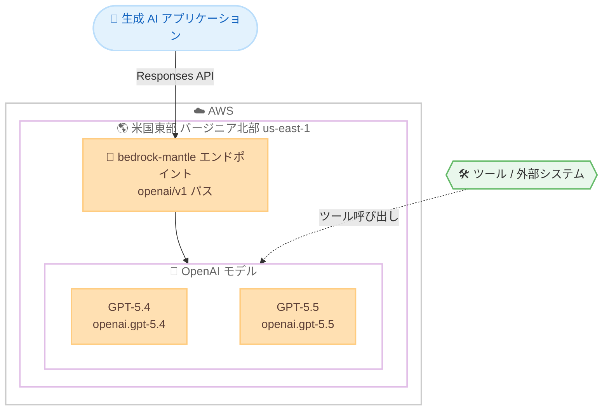

# Amazon Bedrock - OpenAI GPT-5.4 / GPT-5.5 が米国東部 (バージニア北部) で利用可能に

**リリース日**: 2026 年 6 月 11 日
**サービス**: Amazon Bedrock
**機能**: OpenAI GPT-5.4 および GPT-5.5 モデルの提供リージョン拡大

📊 [このアップデートのインフォグラフィックを見る](https://takech9203.github.io/aws-news-summary/20260611-openai-gpt-us-east-virginia-amazon.html)
<!-- INFOGRAPHIC_BASE_URL は環境変数から取得 -->

## 概要

AWS は、OpenAI の GPT-5.4 および GPT-5.5 モデルを Amazon Bedrock の米国東部 (バージニア北部) リージョン (us-east-1) で利用できるようになったことを発表しました。これにより、推論、コーディング、コンピューター操作、ドキュメントワークフロー、長時間実行されるエージェントタスクなど、幅広い生成 AI アプリケーションを構築できます。

GPT-5.5 は OpenAI の最も高性能なモデルで、高度なコーディング、リサーチ、分析、ソフトウェア操作、ドキュメントワークフロー、長時間実行されるエージェントタスク向けに設計されています。オープンエンドな目標を理解し、ツールを使用し、より長いワークフローにわたって推論し、曖昧さに対処しながら、少ないオーケストレーションで複雑なタスクを完了まで遂行できます。一方、GPT-5.4 は、フロンティアレベルの推論、コーディング、コンピューター操作、長コンテキストワークフロー、ツール利用を本番アプリケーションにもたらします。

両モデルとも 272K トークンのコンテキストウィンドウをサポートし、テキストと画像の入力を受け付けます。Responses API を通じて利用でき、サーバーサイドおよびクライアントサイドのツール呼び出し、プロジェクト、レスポンスストリーミングに対応しています。

**アップデート前の課題**

- これまで GPT-5.4 / GPT-5.5 は限られたリージョンでしか利用できず、米国東部 (バージニア北部) を中心としたワークロードでは、別リージョンへのクロスリージョンアクセスを検討する必要があった
- 最新の OpenAI フロンティアモデルを使った高度なエージェントワークフローを、特定のリージョン要件のもとで構築することが難しかった

**アップデート後の改善**

- 今回のアップデートにより、米国東部 (バージニア北部) リージョンで GPT-5.4 / GPT-5.5 を In-Region 推論として利用できるようになった
- 同リージョンに構築済みの既存ワークロードから、低レイテンシーかつデータレジデンシー要件を満たした形で最新の OpenAI モデルを呼び出せるようになった
- 推論、コーディング、コンピューター操作、長時間エージェントタスクといった用途に応じて、GPT-5.4 と GPT-5.5 を使い分けて構築できるようになった

## アーキテクチャ図



アプリケーションは Responses API を通じて bedrock-mantle エンドポイントにリクエストを送信し、GPT-5.4 または GPT-5.5 を呼び出します。モデルはツールや外部システムと連携してエージェントタスクを実行します。

## サービスアップデートの詳細

### 主要機能

1. **GPT-5.5: OpenAI の最も高性能なモデル**
   - 高度なコーディング、リサーチ、分析、ソフトウェア操作、ドキュメントワークフロー、長時間実行されるエージェントタスク向けに設計
   - オープンエンドな目標を理解し、ツールを使用し、より長いワークフローにわたって推論できる
   - 曖昧さに対処しながら、少ないオーケストレーションで複雑なタスクを完了まで遂行する
   - モデルローンチ日: 2026 年 6 月 1 日

2. **GPT-5.4: フロンティアレベルの推論とツール利用**
   - フロンティアレベルの推論、コーディング、コンピューター操作、長コンテキストワークフロー、ツール利用を本番アプリケーションに提供
   - コンテキストの解釈、ツールとの対話、ソフトウェア環境の操作、複数ステップにわたる出力の検証が可能
   - 複雑なビジネスシステム全体で信頼性の高い推論とアクションを必要とするプロフェッショナルワークフローに適する
   - モデルローンチ日: 2026 年 6 月 1 日

3. **共通の技術特性**
   - 272K トークンのコンテキストウィンドウをサポート
   - 入力としてテキストと画像を受け付け、出力はテキスト
   - Responses API を通じて利用可能
   - サーバーサイドおよびクライアントサイドのツール呼び出し、プロジェクト、レスポンスストリーミングに対応

## 技術仕様

### モデル仕様の比較

| 項目 | GPT-5.4 | GPT-5.5 |
|------|---------|---------|
| モデル ID | `openai.gpt-5.4` | `openai.gpt-5.5` |
| コンテキストウィンドウ | 272K トークン | 272K トークン |
| 入力モダリティ | テキスト、画像 | テキスト、画像 |
| 出力モダリティ | テキスト | テキスト |
| 対応 API | Responses | Responses |
| 対応エンドポイント | bedrock-mantle | bedrock-mantle |
| サービスティア | Standard | Standard |
| ローンチ日 | 2026 年 6 月 1 日 | 2026 年 6 月 1 日 |

### エンドポイントとアクセスパス

両モデルとも `bedrock-mantle` エンドポイントの `openai/v1/responses` パスで利用できます。これは Responses エンドポイント上で他のモデルが使用する `v1/responses` パスとは異なる点に注意が必要です。

| 項目 | 詳細 |
|------|------|
| エンドポイント | bedrock-mantle |
| In-Region エンドポイント URL | `https://bedrock-mantle.{region}.api.aws/openai/v1` |
| アクセスパス | `openai/v1/responses` |
| Geo 推論 | 非対応 |
| Global 推論 | 非対応 |

### API 変更履歴

今回のアップデートは既存モデルの提供リージョン拡大であり、新規 API メソッドの追加はありません。Responses API を通じてモデルにアクセスします。

## 設定方法

### 前提条件

1. AWS アカウントを保有していること
2. 米国東部 (バージニア北部) リージョンで Amazon Bedrock のモデルアクセスが有効化されていること
3. Python がインストールされていること (Responses API を SDK 経由で利用する場合)

### 手順

#### ステップ1: Amazon Bedrock の API キーを生成

Amazon Bedrock コンソールで長期 API キーを生成します。コンソールの API キー作成画面から長期キーを発行してください。

#### ステップ2: SDK のインストール

```bash
pip install openai
```

Responses API を利用するため、OpenAI Python SDK をインストールします。

#### ステップ3: 環境変数の設定

```bash
OPENAI_API_KEY="<Bedrock の API キーを指定>"
OPENAI_BASE_URL="https://bedrock-mantle.us-east-1.api.aws/openai/v1"
```

Bedrock の API キーで認証するための環境変数を設定します。米国東部 (バージニア北部) を利用する場合は、ベース URL のリージョン部分を `us-east-1` に設定します。

#### ステップ4: 推論リクエストの実行

```python
from openai import OpenAI

client = OpenAI()

response = client.responses.create(
    model="openai.gpt-5.5",
    input="Can you explain the features of Amazon Bedrock?"
)
print(response)
```

`bedrock-first-request.py` として保存し実行すると、GPT-5.5 への最初の推論リクエストが送信されます。`model` パラメータを `openai.gpt-5.4` に変更すると GPT-5.4 を呼び出せます。

## メリット

### ビジネス面

- **最新モデルへの即時アクセス**: 米国東部 (バージニア北部) で稼働するアプリケーションから、OpenAI の最新フロンティアモデルをすぐに活用できる
- **用途に応じたモデル選択**: 最高性能を求める用途には GPT-5.5、信頼性の高い推論とツール利用を本番で求める用途には GPT-5.4 と、要件に合わせて使い分けられる
- **エージェント開発の加速**: 長時間実行されるエージェントタスクを少ないオーケストレーションで実装でき、開発・運用コストの削減につながる

### 技術面

- **長コンテキスト対応**: 272K トークンのコンテキストウィンドウにより、長文ドキュメントや大規模なコードベースを扱うワークフローに対応
- **マルチモーダル入力**: テキストに加えて画像入力を受け付け、ドキュメントワークフローや視覚情報を含むタスクに活用できる
- **柔軟なツール呼び出し**: サーバーサイドおよびクライアントサイドのツール呼び出し、レスポンスストリーミングに対応し、応答性の高いエージェントアプリケーションを構築できる

## デメリット・制約事項

### 制限事項

- 両モデルとも In-Region 推論のみに対応し、Geo Cross-Region 推論および Global Cross-Region 推論は非対応
- サービスティアは Standard のみ対応で、Priority、Flex、Reserved は非対応
- 対応 API は Responses のみで、Converse API、Chat Completions API、Invoke API は非対応
- 出力モダリティはテキストのみ (画像・音声・動画の出力は非対応)

### 考慮すべき点

- `bedrock-mantle` エンドポイントの `openai/v1/responses` パスを使用する点が、他のモデルの `v1/responses` パスと異なるため、実装時にアクセスパスを正しく指定する必要がある
- GPT-5.4 は米国東部 (バージニア北部)、米国東部 (オハイオ)、米国西部 (オレゴン)、AWS GovCloud (米国西部) で利用できるが、GPT-5.5 は米国東部 (バージニア北部)、米国東部 (オハイオ) での提供であり、モデルごとに利用可能リージョンが異なる
- 料金は使用するトークン量に応じて発生するため、長コンテキスト利用時のコストを事前に見積もる必要がある

## ユースケース

### ユースケース1: 長時間実行されるエージェントタスクの自動化

**シナリオ**: 複数のシステムを横断する業務プロセスを自動化したい。タスクは複数のステップにわたり、途中でツールや外部 API を呼び出して結果を検証する必要がある。

**実装例**:
```python
response = client.responses.create(
    model="openai.gpt-5.5",
    input="調達依頼を承認フローに沿って処理し、各ステップの結果を検証してください。"
)
```

**効果**: GPT-5.5 がオープンエンドな目標を理解し、少ないオーケストレーションで複雑なタスクを完了まで遂行する。開発者は細かい手順制御の実装負荷を軽減できる。

### ユースケース2: 大規模ドキュメントワークフロー

**シナリオ**: 数百ページに及ぶ契約書や技術文書を読み込み、要約・分析・抽出を行いたい。

**実装例**:
```python
response = client.responses.create(
    model="openai.gpt-5.4",
    input="添付の契約書群からリスク条項を抽出し、要約してください。"
)
```

**効果**: 272K トークンのコンテキストウィンドウにより長文ドキュメントをまとめて処理でき、画像入力にも対応するため図表を含む文書も扱える。

### ユースケース3: コーディング支援とソフトウェア操作

**シナリオ**: 既存の大規模コードベースに対する機能追加やリファクタリングを、ツール連携を通じて自動化したい。

**実装例**:
```python
response = client.responses.create(
    model="openai.gpt-5.5",
    input="このリポジトリに新しい認証機能を追加し、テストを実行して結果を確認してください。"
)
```

**効果**: 高度なコーディングとソフトウェア操作に対応する GPT-5.5 が、ツール呼び出しを通じてコード生成からテスト実行までの一連の作業を支援する。

## 料金

料金は使用するトークン量に応じた従量課金です。サービスティアは Standard (コミットメントなしのトークン単位の従量課金) に対応します。具体的な単価は Amazon Bedrock の料金ページを参照してください。

### 料金例

| 使用量 | 月額料金（概算） |
|--------|------------------|
| - | 最新の単価は Amazon Bedrock 料金ページを参照 |

## 利用可能リージョン

GPT-5.5 と GPT-5.4 で利用可能リージョンが異なります。いずれも In-Region 推論のみに対応します。

| リージョン | GPT-5.4 | GPT-5.5 |
|------------|---------|---------|
| 米国東部 (バージニア北部) us-east-1 | 対応 | 対応 |
| 米国東部 (オハイオ) us-east-2 | 対応 | 対応 |
| 米国西部 (オレゴン) us-west-2 | 対応 | 非対応 |
| AWS GovCloud (米国西部) us-gov-west-1 | 対応 | 非対応 |

今回のアップデートで米国東部 (バージニア北部) が新たに追加されました。

## 関連サービス・機能

- **Amazon Bedrock**: 各種基盤モデルを単一の API で利用できるフルマネージドサービス。今回のモデルもこの基盤上で提供される
- **Amazon Bedrock サービスティア**: Standard、Priority、Flex、Reserved の各ティアからワークロード要件に応じて選択できる仕組み (本モデルは Standard のみ対応)
- **Amazon Bedrock Agents**: エージェントワークフローの構築・運用を支援する機能であり、GPT-5.4 / GPT-5.5 の長時間エージェントタスク機能と組み合わせて活用できる

## 参考リンク

- 📊 [インフォグラフィック](https://takech9203.github.io/aws-news-summary/20260611-openai-gpt-us-east-virginia-amazon.html)
- [公式発表 (What's New)](https://aws.amazon.com/about-aws/whats-new/2026/06/openai-gpt-us-east-virginia-amazon/)
- [OpenAI モデルカード一覧 (ドキュメント)](https://docs.aws.amazon.com/bedrock/latest/userguide/model-cards-openai.html)
- [GPT-5.5 モデルカード](https://docs.aws.amazon.com/bedrock/latest/userguide/model-card-openai-gpt-55.html)
- [GPT-5.4 モデルカード](https://docs.aws.amazon.com/bedrock/latest/userguide/model-card-openai-gpt-54.html)
- [Amazon Bedrock 料金ページ](https://aws.amazon.com/bedrock/pricing/)

## まとめ

今回のアップデートにより、OpenAI の GPT-5.4 および GPT-5.5 が Amazon Bedrock の米国東部 (バージニア北部) リージョンで利用可能になり、同リージョンに構築されたワークロードから最新のフロンティアモデルを In-Region で活用できるようになりました。推論、コーディング、長時間エージェントタスクなど用途に応じて 2 つのモデルを使い分けられる点が魅力です。Responses API と bedrock-mantle エンドポイントの利用方法、およびモデルごとの利用可能リージョンの違いを確認したうえで、自社のユースケースに合わせた検証を進めることをおすすめします。
