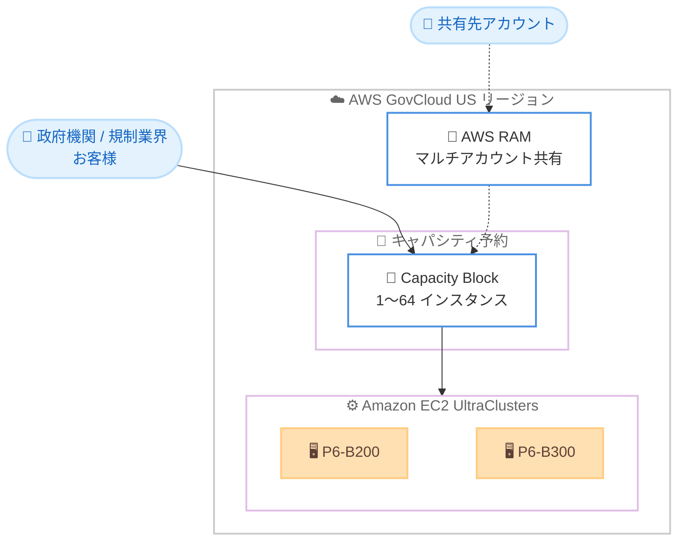

# Amazon EC2 - Capacity Blocks for ML (AWS GovCloud (US) リージョン対応)

**リリース日**: 2026 年 6 月 12 日
**サービス**: Amazon EC2
**機能**: Amazon EC2 Capacity Blocks for ML

📊 [このアップデートのインフォグラフィックを見る](https://takech9203.github.io/aws-news-summary/20260612-amazon-ec2-capacity-blocks-ml-govcloud.html)
<!-- INFOGRAPHIC_BASE_URL は環境変数から取得 -->

## 概要

Amazon EC2 Capacity Blocks for ML が、AWS GovCloud (US-West) および AWS GovCloud (US-East) リージョンで利用可能になりました。これにより、政府機関や規制業界のお客様が、機械学習 (ML) ワークロード向けに GPU キャパシティを事前に予約できるようになります。

Capacity Blocks for ML を利用すると、定義された期間について GPU インスタンスを事前に予約し、アクセラレーテッドコンピューティングへの確実なアクセスを確保できます。短期間の事前トレーニング、ファインチューニング、迅速なプロトタイピング、推論需要の急増といったワークロードに対応します。Capacity Blocks は Amazon EC2 UltraClusters 内へのコロケーションにより、低レイテンシかつ高スループットの接続を提供します。

予約は最大 8 週間前から実施でき、最大 6 か月間の期間で、1 から 64 インスタンスのクラスターサイズで確保できます。さらに AWS Resource Access Manager (RAM) を使用して複数のアカウント間で共有できるため、組織は ML インフラストラクチャへの投資を調整し、予約済みキャパシティを継続的に活用できます。

**アップデート前の課題**

- これまで AWS GovCloud (US) リージョンでは Capacity Blocks for ML が利用できず、政府機関や規制業界のお客様は ML 向け GPU キャパシティを事前に確保できなかった
- GPU インスタンスの需要が高い時期に、必要なタイミングで十分なアクセラレーテッドコンピューティングを確保することが困難だった
- 大規模分散トレーニングに必要な低レイテンシ接続を備えたインスタンス群を確実に確保する手段が限られていた

**アップデート後の改善**

- AWS GovCloud (US-West) および AWS GovCloud (US-East) で Capacity Blocks for ML を利用し、GPU キャパシティを事前予約できるようになった
- 最大 8 週間前から予約でき、需要急増時にも確実に GPU インスタンスを確保できるようになった
- UltraClusters へのコロケーションにより、低レイテンシ・高スループットの接続を備えた GPU クラスターを確保できるようになった

## アーキテクチャ図



お客様が Capacity Block で GPU インスタンス群を予約すると、UltraClusters 内にコロケーションされた低レイテンシ接続のクラスターが確保され、AWS RAM を通じて複数アカウント間で共有できます。

## サービスアップデートの詳細

### 主要機能

1. **GPU キャパシティの事前予約**
   - 定義された期間について GPU インスタンスを事前に予約し、アクセラレーテッドコンピューティングへの確実なアクセスを確保
   - 短期間の事前トレーニング、ファインチューニング、迅速なプロトタイピングに対応
   - 推論需要の急増にも柔軟に対応

2. **Amazon EC2 UltraClusters によるコロケーション**
   - Capacity Blocks 内のインスタンスは UltraClusters にコロケーションされる
   - 低レイテンシかつ高スループットのネットワーク接続を提供
   - 大規模分散トレーニングに適したネットワーク性能を実現

3. **AWS Resource Access Manager (RAM) によるマルチアカウント共有**
   - Capacity Blocks を複数のアカウント間で共有可能
   - 組織全体で ML インフラストラクチャへの投資を調整
   - 予約済みキャパシティの継続的な活用を支援

## 技術仕様

### 予約条件

| 項目 | 詳細 |
|------|------|
| 事前予約期間 | 最大 8 週間前から予約可能 |
| 予約期間 | 最大 6 か月間 |
| クラスターサイズ | 1 から 64 インスタンス |
| マルチアカウント共有 | AWS Resource Access Manager (RAM) に対応 |
| ネットワーク | Amazon EC2 UltraClusters へのコロケーション |

### 対応インスタンスタイプ (AWS GovCloud (US))

| リージョン | 対応インスタンスタイプ |
|------------|------------------------|
| AWS GovCloud (US-West) | P6-B200 |
| AWS GovCloud (US-East) | P6-B200、P6-B300 |

## 設定方法

### 前提条件

1. AWS GovCloud (US-West) または AWS GovCloud (US-East) リージョンで有効化された AWS アカウント
2. EC2 Capacity Blocks for ML を利用するための適切な IAM 権限
3. 対象リージョンで利用可能な GPU インスタンスタイプ (P6-B200、P6-B300) の要件確認

### 手順

#### ステップ1: 利用可能な Capacity Block の検索

AWS Management Console の Amazon EC2 コンソール、または AWS CLI を使用して、希望する期間とインスタンス数に対応する Capacity Block を検索します。

```bash
aws ec2 describe-capacity-block-offerings \
  --instance-type p6-b200.48xlarge \
  --instance-count 16 \
  --start-date-range-start 2026-06-20T00:00:00Z \
  --start-date-range-end 2026-07-01T00:00:00Z \
  --capacity-duration-hours 168 \
  --region us-gov-west-1
```

このコマンドは、指定したインスタンスタイプ、インスタンス数、期間に対して提供可能な Capacity Block のオファリングを一覧表示します。

#### ステップ2: Capacity Block の購入

検索結果から目的のオファリング ID を指定して Capacity Block を購入します。

```bash
aws ec2 purchase-capacity-block \
  --capacity-block-offering-id cbr-0123456789abcdef0 \
  --instance-platform Linux/UNIX \
  --region us-gov-west-1
```

このコマンドにより、選択した Capacity Block が予約され、予約期間中に GPU インスタンスを起動できるようになります。

#### ステップ3: インスタンスの起動と RAM 共有 (任意)

予約期間が開始したら、Capacity Reservation を指定してインスタンスを起動します。必要に応じて AWS RAM で複数アカウントへ共有します。組織内の他アカウントが同じ予約済みキャパシティを利用できるため、投資効率を高められます。

## メリット

### ビジネス面

- **規制環境での ML 推進**: 政府機関や規制業界のお客様が、コンプライアンス要件の厳しい GovCloud 環境で GPU キャパシティを確保できる
- **投資の最適化**: AWS RAM による共有で、組織全体の ML インフラ投資を調整し、予約済みキャパシティを無駄なく活用できる
- **計画的なキャパシティ確保**: 最大 8 週間前からの予約により、重要なプロジェクトに必要な GPU を計画的に確保できる

### 技術面

- **確実なアクセラレーテッドコンピューティング**: 定義された期間について GPU インスタンスへの確実なアクセスを保証
- **高性能ネットワーク**: UltraClusters へのコロケーションにより、低レイテンシ・高スループットの接続を実現
- **最新世代 GPU の利用**: P6-B200 および P6-B300 インスタンスを利用可能

## デメリット・制約事項

### 制限事項

- 予約期間は最大 6 か月間、事前予約は最大 8 週間前までという上限がある
- クラスターサイズは 1 から 64 インスタンスの範囲に限定される
- 対応インスタンスタイプはリージョンごとに異なる (US-West は P6-B200 のみ、US-East は P6-B200 と P6-B300)

### 考慮すべき点

- Capacity Block は予約した期間に対して課金が発生するため、利用計画を明確にする必要がある
- 予約期間外は GPU インスタンスへのアクセスが保証されないため、長期的なワークロードには別の購入オプションの検討も必要

## ユースケース

### ユースケース1: 大規模言語モデルのファインチューニング

**シナリオ**: 政府系研究機関が、規制要件を満たす GovCloud 環境で基盤モデルのファインチューニングを実施する。数週間にわたる集中的な GPU リソースが必要。

**効果**: 必要な期間だけ GPU クラスターを予約し、UltraClusters の高速ネットワークで効率的に分散トレーニングを実行できる。

### ユースケース2: 推論需要の急増への対応

**シナリオ**: 規制業界の組織が、特定イベント時に発生する推論リクエストの急増に備え、一時的に GPU キャパシティを増強する。

**効果**: 需要が見込まれる期間に合わせて Capacity Block を予約し、必要なときに確実に GPU インスタンスを確保できる。

### ユースケース3: 複数部門での GPU リソース共有

**シナリオ**: 大規模な政府組織が、複数の部門 (アカウント) で ML プロジェクトを進めており、GPU 投資を一元的に管理したい。

**効果**: AWS RAM を使って予約済みの Capacity Block を各アカウントへ共有し、予約済みキャパシティを部門横断で継続的に活用できる。

## 料金

EC2 Capacity Blocks for ML は、予約したインスタンス数と予約期間に基づいて課金されます。料金は予約時に確定し、予約期間全体に対して前払いで支払います。詳細な料金は対象リージョンおよびインスタンスタイプによって異なります。最新の料金は AWS の公式料金ページでご確認ください。

## 利用可能リージョン

- AWS GovCloud (US-West): P6-B200 インスタンス
- AWS GovCloud (US-East): P6-B200 インスタンス、P6-B300 インスタンス

## 関連サービス・機能

- **Amazon EC2 UltraClusters**: Capacity Blocks 内のインスタンスをコロケーションし、低レイテンシ・高スループット接続を提供する基盤
- **AWS Resource Access Manager (RAM)**: Capacity Blocks を複数アカウント間で共有するためのサービス
- **Amazon SageMaker**: 予約した GPU キャパシティを ML トレーニングや推論に活用できるマネージド ML サービス

## 参考リンク

- 📊 [インフォグラフィック](https://takech9203.github.io/aws-news-summary/20260612-amazon-ec2-capacity-blocks-ml-govcloud.html)
- [公式発表 (What's New)](https://aws.amazon.com/about-aws/whats-new/2026/06/amazon-ec2-capacity-blocks-ml-govcloud/)
- [ドキュメント](https://docs.aws.amazon.com/AWSEC2/latest/UserGuide/ec2-capacity-blocks.html)

## まとめ

Amazon EC2 Capacity Blocks for ML の AWS GovCloud (US) リージョン対応により、政府機関や規制業界のお客様も ML ワークロード向けの GPU キャパシティを計画的に確保できるようになりました。短期間のトレーニングや推論需要の急増に対応する組織は、対象リージョンの対応インスタンスタイプと予約条件を確認し、Capacity Blocks の活用を検討することをお勧めします。
