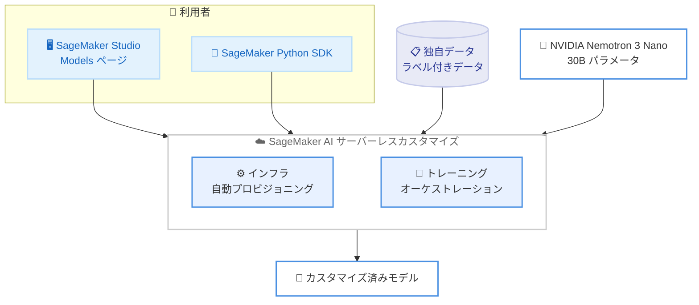

# Amazon SageMaker AI - NVIDIA Nemotron モデルのサーバーレスファインチューニング対応

**リリース日**: 2026 年 6 月 12 日
**サービス**: Amazon SageMaker AI
**機能**: NVIDIA Nemotron 3 Nano モデルのサーバーレスモデルカスタマイズ (SFT / RFT)

📊 [このアップデートのインフォグラフィックを見る](https://takech9203.github.io/aws-news-summary/20260612-amazon-sagemaker-ft-nemotron-3.html)
<!-- INFOGRAPHIC_BASE_URL は環境変数から取得 -->

## 概要

Amazon SageMaker AI が、NVIDIA Nemotron 3 Nano モデルのサーバーレスモデルカスタマイズに対応しました。カスタマイズ手法として、教師ありファインチューニング (SFT: Supervised Fine-Tuning) と強化ファインチューニング (RFT: Reinforcement Fine-Tuning) の 2 種類が利用できます。NVIDIA Nemotron 3 Nano は、合計 30B のパラメータを持つ NVIDIA の人気のオープンウェイトモデルです。これまで SageMaker AI 上でこのモデルをデプロイすることは可能でしたが、今回のアップデートにより、独自のドメインやワークフローに合わせてモデルを適応させられるようになりました。

モデルカスタマイズを利用すると、お客様独自のデータを使って基盤モデルを調整できます。ドメイン固有のタスクにおける精度向上、組織のトーンに合わせた出力の調整、ラベル付きデータを用いた新しいタスクの性能強化などが可能です。サーバーレスカスタマイズでは、SageMaker AI がインフラのプロビジョニングとトレーニングのオーケストレーションをすべて処理するため、お客様はクラスター管理ではなくデータと評価に集中できます。また、利用した分だけの従量課金となります。

このアップデートは、生成 AI を活用したいデータサイエンティストや機械学習エンジニア、ドメイン固有のタスクに最適化した大規模言語モデルを求める企業にとって有用です。

**アップデート前の課題**

- 従来、Nemotron 3 Nano は SageMaker AI 上でデプロイ可能でしたが、独自データによるカスタマイズには対応していませんでした。
- 大規模モデルのファインチューニングには、トレーニング用クラスターのプロビジョニングや管理が必要で、運用負荷が高くなっていました。
- インフラ管理に手間がかかり、データ準備やモデル評価といった本質的な作業にリソースを割きにくい状況がありました。

**アップデート後の改善**

- 今回のアップデートにより、NVIDIA Nemotron 3 Nano を SFT および RFT で独自データにカスタマイズできるようになりました。
- サーバーレス方式により、インフラのプロビジョニングとトレーニングのオーケストレーションが不要になりました。
- 利用した分だけの従量課金となり、クラスター管理コストを意識する必要がなくなりました。

## アーキテクチャ図



SageMaker Studio または Python SDK からカスタマイズジョブを起動すると、SageMaker AI がインフラのプロビジョニングとトレーニングを自動で行い、独自データで適応させたモデルを生成します。

## サービスアップデートの詳細

### 主要機能

1. **NVIDIA Nemotron 3 Nano のサーバーレスカスタマイズ**
   - 合計 30B パラメータを持つ NVIDIA のオープンウェイトモデルをカスタマイズ対象とします。
   - デプロイだけでなく、独自のドメインやワークフローへの適応が可能になりました。
   - インフラ管理を SageMaker AI に任せ、データと評価に集中できます。

2. **教師ありファインチューニング (SFT)**
   - ラベル付きデータを用いて、ドメイン固有タスクの精度を向上させます。
   - 組織のトーンやスタイルに合わせた出力の調整に活用できます。

3. **強化ファインチューニング (RFT)**
   - 報酬に基づく学習により、新しいタスクへの性能を強化します。
   - SFT と組み合わせることで、より高度なモデル適応が可能です。

## 技術仕様

### モデルとカスタマイズ手法

| 項目 | 詳細 |
|------|------|
| 対象モデル | NVIDIA Nemotron 3 Nano (オープンウェイト) |
| パラメータ数 | 合計 30B |
| カスタマイズ手法 | 教師ありファインチューニング (SFT)、強化ファインチューニング (RFT) |
| インフラ管理 | サーバーレス (プロビジョニング・オーケストレーションは SageMaker AI が実施) |
| 課金方式 | 従量課金 (利用した分のみ) |
| 起動方法 | SageMaker Studio の Models ページ、または SageMaker Python SDK |

## 設定方法

### 前提条件

1. Amazon SageMaker AI を利用可能な AWS アカウント
2. カスタマイズに使用するラベル付きの独自データ (SFT / RFT 向け)
3. 対応リージョンでの SageMaker Studio または SageMaker Python SDK の利用環境

### 手順

#### ステップ 1: SageMaker Studio からカスタマイズジョブを起動

Amazon SageMaker Studio の Models ページに移動し、NVIDIA Nemotron 3 Nano を選択してカスタマイズジョブを起動します。データセットとカスタマイズ手法 (SFT / RFT) を指定すると、SageMaker AI が自動でトレーニングを実行します。

#### ステップ 2: SageMaker Python SDK でプログラムから実行

```bash
# SageMaker Python SDK のインストール
pip install --upgrade sagemaker
```

SageMaker Python SDK をインストールまたは更新します。SDK を使うことで、ノートブックやスクリプトからプログラム的にカスタマイズジョブを定義・起動できます。詳細はモデルカスタマイズのドキュメントを参照してください。

#### ステップ 3: カスタマイズ済みモデルの評価とデプロイ

トレーニング完了後、カスタマイズ済みモデルを評価し、SageMaker AI 上にデプロイして推論エンドポイントとして利用します。

## メリット

### ビジネス面

- **運用負荷の軽減**: クラスター管理が不要になり、データ準備やモデル評価といった本質的な作業に集中できます。
- **コスト最適化**: 利用した分だけの従量課金のため、アイドル状態のインフラコストを抑えられます。
- **市場投入の迅速化**: インフラ構築の手間が省け、ドメイン特化モデルを素早く構築・展開できます。

### 技術面

- **柔軟なカスタマイズ**: SFT と RFT の 2 種類の手法に対応し、用途に応じた最適化が可能です。
- **オープンウェイトモデルの活用**: 30B パラメータの Nemotron 3 Nano を独自データで適応できます。
- **スケーラビリティ**: SageMaker AI がトレーニングのオーケストレーションを自動で行い、規模に応じたリソースを確保します。

## デメリット・制約事項

### 制限事項

- 対応モデルは現時点で NVIDIA Nemotron 3 Nano に限定されます。
- 利用可能リージョンは 4 リージョンに限られます (後述)。
- 高品質なカスタマイズには、適切に準備されたラベル付きデータが必要です。

### 考慮すべき点

- SFT と RFT で必要なデータ形式や評価方法が異なるため、目的に応じた手法選択が重要です。
- 従量課金のため、トレーニングデータ量やジョブ実行回数に応じたコスト見積もりが必要です。

## ユースケース

### ユースケース 1: ドメイン固有の精度向上

**シナリオ**: 医療や金融など専門用語が多い分野で、汎用モデルでは精度が不足する場合に、業界固有のラベル付きデータで SFT を実施します。

**効果**: ドメイン固有タスクにおける回答精度が向上し、専門領域での実用性が高まります。

### ユースケース 2: 組織のトーンへの出力調整

**シナリオ**: カスタマーサポートのチャットボットで、自社のブランドガイドラインに沿った応答トーンを実現したい場合に、過去の対応データで SFT を行います。

**効果**: ブランドに一貫した応答が可能になり、顧客体験の質が向上します。

### ユースケース 3: 新しいタスクへの性能強化

**シナリオ**: 既存モデルが対応していない独自のタスクに対し、RFT を用いて報酬ベースの学習を行い、性能を高めます。

**効果**: 新規タスクでのモデル性能が強化され、業務固有の要件に対応できます。

## 料金

サーバーレスモデルカスタマイズは従量課金制で、利用したリソース分のみが課金されます。クラスターのプロビジョニングや管理に伴う固定コストは発生しません。具体的な料金は使用量やリージョンによって異なるため、最新の料金は Amazon SageMaker AI の料金ページを参照してください。

## 利用可能リージョン

NVIDIA Nemotron 3 Nano のサーバーレスモデルカスタマイズは、以下のリージョンで利用可能です。

- 米国東部 (バージニア北部)
- 米国西部 (オレゴン)
- アジアパシフィック (東京)
- 欧州 (アイルランド)

## 関連サービス・機能

- **Amazon SageMaker Studio**: Models ページからカスタマイズジョブを起動する統合開発環境です。
- **SageMaker Python SDK**: プログラムからカスタマイズジョブを定義・実行するための SDK です。
- **NVIDIA Nemotron 3 Nano**: カスタマイズ対象となる 30B パラメータのオープンウェイトモデルです。

## 参考リンク

- 📊 [インフォグラフィック](https://takech9203.github.io/aws-news-summary/20260612-amazon-sagemaker-ft-nemotron-3.html)
- [公式発表 (What's New)](https://aws.amazon.com/about-aws/whats-new/2026/05/amazon-sagemaker-ft-nemotron-3/)
- [ドキュメント (モデルカスタマイズ)](https://docs.aws.amazon.com/sagemaker/latest/dg/customize-model.html)
- [SageMaker Python SDK (モデルカスタマイズ)](https://sagemaker.readthedocs.io/en/stable/model_customization/index.html)

## まとめ

今回のアップデートにより、NVIDIA Nemotron 3 Nano をサーバーレスで SFT / RFT カスタマイズできるようになり、インフラ管理の負担なくドメイン特化モデルを構築できます。東京リージョンでも利用可能なため、独自データを活用した生成 AI の精度向上を検討している場合は、SageMaker Studio の Models ページまたは Python SDK からカスタマイズジョブを試してみることをお勧めします。
